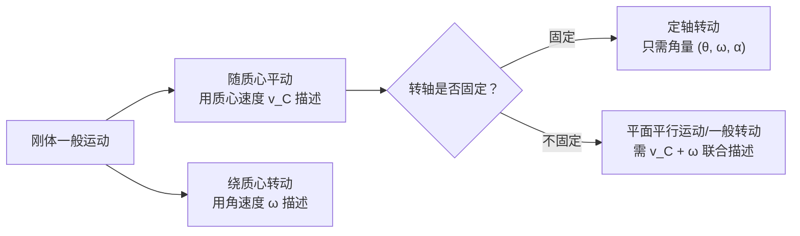

# 4.1 刚体运动、转动惯量

> [!info] 本节定位
> 本节解决两个问题：
> 1. **如何描述刚体的运动**——刚体是一种特殊的质点系（任意两质点距离不变），其运动可分解为平动和转动，定轴转动只需一组角量描述；
> 2. **如何度量刚体"转动惯性"的大小**——引入转动惯量 $J$（moment of inertia），它是质量在转动中的对应物，决定刚体抵抗角加速度变化的能力。
>
> 本节是整章基础：[[4.2 力矩、转动定律]] 的 $M=J\alpha$、[[4.3 角动量、角动量守恒]] 的 $L=J\omega$、[[4.4 刚体转动动能]] 的 $E_k=\tfrac12 J\omega^2$ 都依赖 $J$ 的正确计算。

## 一、刚体模型

> [!definition] 刚体
> **刚体（rigid body）** 是一种理想化的质点系：在运动过程中，**任意两质点之间的距离保持不变**。即对刚体内任意两质点 $i,j$，恒有
> $$|r_{i}-r_{j}|=\text{const}$$
> 这是一个理想模型。实际物体受力总会发生形变，但当形变对所研究问题的影响可忽略时即可视作刚体。

> [!note] 模型适用条件
> - 物体形变远小于其特征尺寸；
> - 内应力引起的弹性波传播时间远小于所研究过程时间；
> - 不涉及碰撞接触面的局部变形（碰撞问题中刚体模型仍可用于整体运动）。

## 二、刚体的平动与转动

刚体任意运动可分解为两种基本形式：

> [!definition] 平动与转动
> - **平动（translation）**：刚体上任意一条直线在运动中方向不变。各质点位移、速度、加速度相同，可用质心运动描述。运动学完全等价于质点，参见 [[MOC - 第1章]]。
> - **转动（rotation）**：刚体上各质点绕某一直线（转轴）做圆周运动。
>
> 一般运动 = 随质心平动 + 绕质心转动（柯尼希分解，见 [[4.4 刚体转动动能]]）。

### 定轴转动

> [!definition] 定轴转动
> 刚体上所有质点绕一条**固定不动的直线**做圆周运动，该直线称为**转轴**。各质点角位移、角速度、角加速度相同，这是本章主要讨论的情形。

## 三、定轴转动的描述

取转轴为 $z$ 轴，参考系为惯性系（地面实验室系），规定绕 $z$ 轴正方向（右手螺旋）转动的 $\theta$ 为正。

> [!definition] 角位置、角速度、角加速度
> | 量 | 符号 | 定义 | SI 单位 |
> | -- | ---- | ---- | ---- |
> | 角位置 | $\theta$ | 转动参考方向到刚体上某标志线的夹角 | rad（弧度，无量纲） |
> | 角速度 | $\omega$ | $\omega=\dfrac{d\theta}{dt}$，矢量沿转轴方向（右手定则） | rad/s |
> | 角加速度 | $\alpha$ | $\alpha=\dfrac{d\omega}{dt}=\dfrac{d^{2}\theta}{dt^{2}}$ | rad/s² |
>
> 角速度矢量 $\vec\omega$ 方向由**右手螺旋定则**确定：四指沿转动方向弯曲，拇指所指即 $\vec\omega$ 方向。

### 角量与线量的关系

刚体上距轴 $r$ 处质点做圆周运动：

| 线量 | 与角量关系 | 方向 |
| ---- | ---- | ---- |
| 切向速度 $v$ | $v=r\omega$ | 沿圆周切线，与 $\vec\omega$ 满足右手关系 $\vec v=\vec\omega\times\vec r$ |
| 切向加速度 $a_{t}$ | $a_{t}=r\alpha$ | 沿圆周切线 |
| 法向加速度 $a_{n}$ | $a_{n}=r\omega^{2}=\dfrac{v^{2}}{r}$ | 指向转轴 |

> [!warning] 注意
> 总加速度 $\vec a=\vec a_{t}+\vec a_{n}$，大小 $a=\sqrt{a_{t}^{2}+a_{n}^{2}}=r\sqrt{\alpha^{2}+\omega^{4}}$。当匀速转动时 $\alpha=0$，$a_{t}=0$ 但 $a_{n}\ne0$。

### 匀变速转动公式（$\alpha$ 为常数）

与匀变速直线运动公式形式完全对应：

$$\omega=\omega_{0}+\alpha t,\quad \theta=\theta_{0}+\omega_{0}t+\tfrac12\alpha t^{2},\quad \omega^{2}=\omega_{0}^{2}+2\alpha(\theta-\theta_{0})$$

## 四、转动惯量

> [!definition] 转动惯量
> 刚体对某轴的**转动惯量（moment of inertia）** $J$ 定义为各质点质量与其到该轴垂直距离平方之积的总和：
> $$J=\sum_{i}m_{i}r_{i}^{2}\xrightarrow{\text{连续}}J=\int r^{2}\,dm\quad(\text{kg·m}^{2})$$
> 其中 $r$ 是质量微元 $dm$ 到转轴的**垂直距离**。

### 物理意义

$J$ 是刚体绕该轴转动惯性的度量，类比平动中的质量 $m$：
- $m$ 越大，越难改变平动速度（$F=ma$）；
- $J$ 越大，越难改变转动角速度（$M=J\alpha$）。

> [!note] 关键性质
> 1. $J$ **与转轴位置有关**：同一刚体对不同轴 $J$ 不同。计算时必须先指定轴。
> 2. $J$ **与质量分布有关**：质量越远离轴，$J$ 越大。这也是飞轮边缘厚重的原因。
> 3. $J$ 是可加的：组合刚体的 $J$ 等于各部分 $J$ 之和（对同一轴）。

### 计算方法

对连续分布刚体，关键在写出 $dm$：

| 形状 | 取微元 | $dm$ 表达 |
| ---- | ---- | ---- |
| 细杆 | 长度元 $dx$ | $dm=\lambda\,dx$，$\lambda=m/L$（线密度） |
| 薄板 | 面积元 $dA$ | $dm=\sigma\,dA$，$\sigma=m/A$（面密度） |
| 立体 | 体积元 $dV$ | $dm=\rho\,dV$，$\rho=m/V$（体密度） |

## 五、常见刚体的转动惯量

下表给出常见均质刚体对其几何对称轴（或质心轴）的转动惯量。**记忆方法**：均记 $mR^{2}$ 或 $mL^{2}$ 形式，再记系数。

> [!summary] 常见转动惯量（$m$ 为总质量，几何量已标）
>
> | 刚体 | 转轴位置 | 转动惯量 |
> | ---- | ---- | ---- |
> | 质点 $m$ | 距质点 $r$ | $mr^{2}$ |
> | 细杆长 $L$ | 过中点 ⊥ 杆 | $\dfrac{1}{12}mL^{2}$ |
> | 细杆长 $L$ | 过一端 ⊥ 杆 | $\dfrac{1}{3}mL^{2}$ |
> | 细圆环（半径 $R$，全质量在环上） | 过圆心 ⊥ 环面 | $mR^{2}$ |
> | 细圆环（半径 $R$） | 沿直径 | $\dfrac{1}{2}mR^{2}$ |
> | 均质圆盘/圆柱（半径 $R$） | 过中心 ⊥ 盘面（对称轴） | $\dfrac{1}{2}mR^{2}$ |
> | 均质圆盘（半径 $R$） | 沿直径 | $\dfrac{1}{4}mR^{2}$ |
> | 均质球体（半径 $R$） | 过球心任一直径 | $\dfrac{2}{5}mR^{2}$ |
> | 均质球壳（半径 $R$） | 过球心任一直径 | $\dfrac{2}{3}mR^{2}$ |
> | 薄圆筒（半径 $R$） | 对称轴 | $mR^{2}$ |
> | 厚壁圆筒（内 $R_1$，外 $R_2$） | 对称轴 | $\dfrac{1}{2}m(R_1^{2}+R_2^{2})$ |

### 推导示例：均质圆盘

> [!proof] 圆盘转动惯量 $J=\dfrac12 mR^{2}$
> 设圆盘质量 $m$、半径 $R$，面密度 $\sigma=\dfrac{m}{\pi R^{2}}$。取半径 $r$、宽 $dr$ 的薄圆环为微元，$dA=2\pi r\,dr$：
> $$dm=\sigma\cdot 2\pi r\,dr=\dfrac{2m}{R^{2}}r\,dr$$
> 薄圆环上各点到轴距离均为 $r$，故
> $$J=\int_{0}^{R}r^{2}\,dm=\int_{0}^{R}r^{2}\cdot\dfrac{2m}{R^{2}}r\,dr=\dfrac{2m}{R^{2}}\int_{0}^{R}r^{3}\,dr=\dfrac{2m}{R^{2}}\cdot\dfrac{R^{4}}{4}=\dfrac{1}{2}mR^{2}$$
> 单位：$\text{kg·m}^{2}$。

### 推导示例：均质细杆（过中点）

> [!proof] 细杆中点转动惯量 $J_{C}=\dfrac{1}{12}mL^{2}$
> 取杆中点为原点，杆沿 $x$ 轴，$x\in[-L/2,L/2]$。线密度 $\lambda=m/L$：
> $$J_{C}=\int_{-L/2}^{L/2}x^{2}\,\lambda\,dx=\dfrac{m}{L}\cdot\dfrac{x^{3}}{3}\bigg|_{-L/2}^{L/2}=\dfrac{m}{L}\cdot\dfrac{L^{3}}{12}=\dfrac{1}{12}mL^{2}$$

## 六、平行轴定理

> [!theorem] 平行轴定理（parallel axis theorem）
> 设刚体质量为 $m$，对过质心 $C$ 的某轴 $z_{C}$ 的转动惯量为 $J_{C}$，则对**与 $z_{C}$ 平行**、间距为 $d$ 的另一轴 $z$ 的转动惯量为
> $$\boxed{\,J=J_{C}+md^{2}\,}\quad(\text{kg·m}^{2})$$
> 适用条件：两轴**平行**，且其中一轴过质心。

> [!proof] 证明
> 设质心为坐标原点，$z_{C}$ 轴沿 $z$ 方向，平行轴 $z$ 过点 $(d,0,0)$。质量微元 $dm$ 位置 $(x,y,z)$。
> - 对 $z_{C}$ 轴：$r_{C}^{2}=x^{2}+y^{2}$，$J_{C}=\int(x^{2}+y^{2})\,dm$；
> - 对 $z$ 轴：$r^{2}=(x-d)^{2}+y^{2}=x^{2}+y^{2}-2xd+d^{2}$，故
> $$J=\int[(x^{2}+y^{2})-2xd+d^{2}]\,dm=J_{C}-2d\int x\,dm+md^{2}$$
> 由于原点在质心，$\int x\,dm=m\bar x=0$（质心坐标定义），所以 $J=J_{C}+md^{2}$。$\square$

> [!example] 应用：从细杆中点求端点
> 已知 $J_{C}=\dfrac{1}{12}mL^{2}$，$d=L/2$：
> $$J=\dfrac{1}{12}mL^{2}+m\left(\dfrac{L}{2}\right)^{2}=\dfrac{1}{12}mL^{2}+\dfrac{1}{4}mL^{2}=\dfrac{1}{3}mL^{2}$$

## 七、正交轴定理（薄板）

> [!theorem] 正交轴定理（perpendicular axis theorem）
> 对**薄板状刚体**（厚度可忽略，质量分布在 $Oxy$ 平面内），设 $z$ 轴垂直板面，$x$、$y$ 轴在板面内且过同一点 $O$，则
> $$\boxed{\,J_{z}=J_{x}+J_{y}\,}$$
> 适用条件：**仅适用于薄板**（二维质量分布）。

> [!proof] 证明
> 质量微元 $dm$ 在板内位置 $(x,y)$。则
> $$J_{z}=\int(x^{2}+y^{2})\,dm,\quad J_{x}=\int y^{2}\,dm,\quad J_{y}=\int x^{2}\,dm$$
> 显然 $J_{z}=J_{x}+J_{y}$。$\square$

> [!example] 应用：求圆盘沿直径的转动惯量
> 由对称性 $J_{x}=J_{y}$，又 $J_{z}=\tfrac12 mR^{2}$，故
> $$J_{x}=J_{y}=\dfrac{1}{2}J_{z}=\dfrac{1}{4}mR^{2}$$

## 八、典型例题

### 例题 1：组合刚体的转动惯量

> [!example] 题目
> 由一根长 $L=1.0\,\text{m}$、质量 $m_{1}=3.0\,\text{kg}$ 的均匀细杆，与一个质量 $m_{2}=2.0\,\text{kg}$、半径 $R=0.20\,\text{m}$ 的均质圆盘构成一刚体，圆盘中心固定在杆的一端，盘面与杆垂直。求该刚体对过杆另一端且与盘面平行的轴的转动惯量。

**分析**：组合刚体转动惯量可加。需对**同一轴**分别求杆和盘的 $J$，再相加。

**计算**：
1. 杆对过端点 ⊥ 杆的轴：$J_{\text{杆}}=\dfrac{1}{3}m_{1}L^{2}=\dfrac{1}{3}\times3.0\times1.0^{2}=1.0\,\text{kg·m}^{2}$
2. 盘对过质心 ⊥ 盘面（即平行于所求轴）的轴：$J_{C,\text{盘}}=\dfrac12 m_{2}R^{2}=\dfrac12\times2.0\times0.20^{2}=0.040\,\text{kg·m}^{2}$
   盘中心到所求轴距离 $d=L=1.0\,\text{m}$，由平行轴定理：
   $$J_{\text{盘}}=J_{C,\text{盘}}+m_{2}d^{2}=0.040+2.0\times1.0^{2}=2.04\,\text{kg·m}^{2}$$
3. 总转动惯量：
   $$J=J_{\text{杆}}+J_{\text{盘}}=1.0+2.04=3.04\,\text{kg·m}^{2}$$

**单位检验**：$\text{kg}\cdot\text{m}^{2}$，符合。

### 例题 2：用积分求矩形薄板的 $J$

> [!example] 题目
> 质量为 $m$、长 $a$、宽 $b$ 的均质矩形薄板，求过中心且垂直板面轴的转动惯量。

**分析**：薄板可用正交轴定理，或直接积分。

**解法一（积分）**：取板中心为原点，$x\in[-a/2,a/2]$，$y\in[-b/2,b/2]$，面密度 $\sigma=\dfrac{m}{ab}$。质量微元 $dm=\sigma\,dx\,dy$，到中心距离 $r=\sqrt{x^{2}+y^{2}}$：
$$J=\int(x^{2}+y^{2})\,dm=\sigma\int_{-b/2}^{b/2}\int_{-a/2}^{a/2}(x^{2}+y^{2})\,dx\,dy$$
由对称性：
$$J=\sigma\left[b\int_{-a/2}^{a/2}x^{2}\,dx+a\int_{-b/2}^{b/2}y^{2}\,dy\right]=\sigma\left[b\cdot\dfrac{a^{3}}{12}+a\cdot\dfrac{b^{3}}{12}\right]=\dfrac{m}{ab}\cdot\dfrac{ab(a^{2}+b^{2})}{12}$$
$$\boxed{J=\dfrac{1}{12}m(a^{2}+b^{2})}$$

**解法二（正交轴定理）**：$J_{z}=J_{x}+J_{y}$，其中 $J_{x}$（沿 $x$ 方向轴）只需对 $y$ 积分：$J_{x}=\dfrac{1}{12}mb^{2}$；$J_{y}=\dfrac{1}{12}ma^{2}$，故 $J_{z}=\dfrac{1}{12}m(a^{2}+b^{2})$。

### 例题 3：厚壁圆筒的 $J$

> [!example] 题目
> 均质厚壁圆筒，质量 $m$、内半径 $R_{1}$、外半径 $R_{2}$，求对对称轴的转动惯量。

**分析**：体密度 $\rho=\dfrac{m}{\pi(R_{2}^{2}-R_{1}^{2})L}$（$L$ 为筒长）。取半径 $r$、厚 $dr$ 的薄筒壳作微元，$dV=2\pi r L\,dr$：
$$dm=\rho\cdot 2\pi r L\,dr=\dfrac{2m}{R_{2}^{2}-R_{1}^{2}}r\,dr$$
$$J=\int_{R_{1}}^{R_{2}}r^{2}\,dm=\dfrac{2m}{R_{2}^{2}-R_{1}^{2}}\int_{R_{1}}^{R_{2}}r^{3}\,dr=\dfrac{2m}{R_{2}^{2}-R_{1}^{2}}\cdot\dfrac{R_{2}^{4}-R_{1}^{4}}{4}$$
利用 $R_{2}^{4}-R_{1}^{4}=(R_{2}^{2}-R_{1}^{2})(R_{2}^{2}+R_{1}^{2})$：
$$\boxed{J=\dfrac{1}{2}m(R_{1}^{2}+R_{2}^{2})}$$
检验：令 $R_{1}=0$ 得 $J=\tfrac12 mR_{2}^{2}$（实心圆柱）；令 $R_{1}=R_{2}=R$ 得 $J=mR^{2}$（薄圆环）。两种极限均正确。

## 九、易错点

> [!warning] 易错点
> 1. **混淆"过质心轴"与"任意轴"**：表中查得的转动惯量一般是对质心轴或对称轴。换轴必须用 [[#平行轴定理]]，不能直接用。
> 2. **正交轴定理仅适用于薄板**：对三维刚体（如球体）不能用 $J_{z}=J_{x}+J_{y}$。
> 3. **$r$ 是到轴的垂直距离**：不是到原点的距离。三维中 $r^{2}=x^{2}+y^{2}$（对 $z$ 轴），不是 $x^{2}+y^{2}+z^{2}$。
> 4. **平行轴定理中 $d$ 是两轴间距**，不是质心到任意点的距离；定理要求一轴过质心。
> 5. **质量分布要均匀假设**：表中公式仅对均质刚体成立；非均质必须用积分并写出 $\rho(\vec r)$。

## 十、与其他小节的联系

- $J$ 在 [[4.2 力矩、转动定律]] 中作为 $M=J\alpha$ 的"惯性系数"出现；
- $J$ 在 [[4.3 角动量、角动量守恒]] 中作为 $L=J\omega$ 的比例系数出现；
- $J$ 在 [[4.4 刚体转动动能]] 中作为 $E_{k}=\tfrac12 J\omega^{2}$ 的系数出现；
- 本章 MOC：[[MOC - 第4章]]。

## 章节导航

- 上一级：[[MOC - 第4章]]
- 上一节：[[MOC - 第3章]]（先修）
- 下一节：[[4.2 力矩、转动定律]]
- 习题：[[MOC - 第4章习题]]
