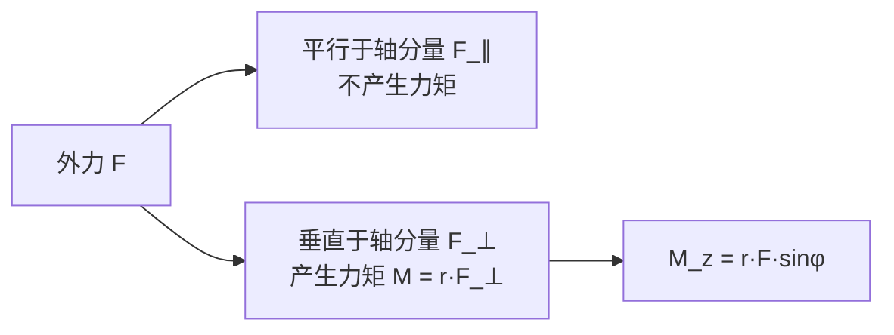
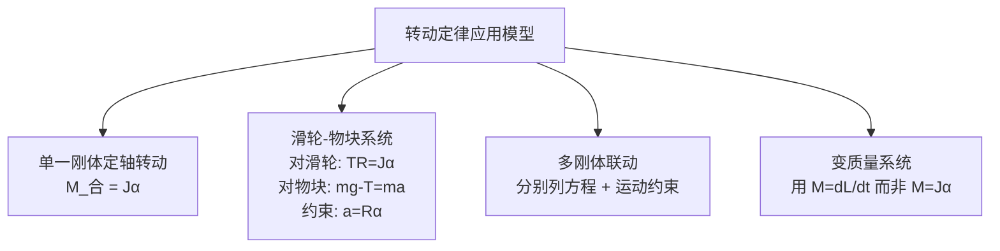

# 4.2 力矩、转动定律

> [!info] 本节定位
> 本节建立定轴转动的**动力学基本方程**——转动定律 $M=J\alpha$，它是牛顿第二定律 $F=ma$ 在转动中的对应物。要解决两个问题：
> 1. **力对转动的效应如何度量**——引入力矩 $M=r\times F$，它取决于力的大小、方向和作用线到转轴的距离；
> 2. **合外力矩如何决定刚体的角加速度**——转动定律给出 $M=J\alpha$，其中 $J$ 来自 [[4.1 刚体运动、转动惯量]]。
>
> 本节是整章核心：[[4.3 角动量、角动量守恒]] 对其积分得到角动量定理；[[4.4 刚体转动动能]] 对其乘 $\omega$ 积分得到转动动能定理。

## 一、力矩

### 1.1 力矩的定义（一般矢量形式）

> [!definition] 力矩
> 力 $\vec F$ 对参考点 $O$ 的**力矩（torque）** 定义为：
> $$\vec M=\vec r\times\vec F\quad(\text{N·m})$$
> 其中 $\vec r$ 是从 $O$ 指向力作用点的位置矢量。$\vec M$ 是矢量，方向由叉乘右手定则确定。
>
> 大小：$M=rF\sin\varphi$，其中 $\varphi$ 是 $\vec r$ 与 $\vec F$ 的夹角。
> 也可写作 $M=F\cdot d$，其中 $d=r\sin\varphi$ 称为**力臂**（力作用线到 $O$ 的垂直距离）。

> [!note] 单位与方向
> - 单位：$\text{N·m}$。注意 $\text{N·m}$ 在量纲上等于 $\text{J}$，但力矩不是功，**不用 J 表示**。
> - 方向：垂直于 $\vec r$ 与 $\vec F$ 所在平面，由右手定则判断（四指从 $\vec r$ 转向 $\vec F$，拇指方向即 $\vec M$）。
> - 当 $\vec F$ 沿 $\vec r$ 方向（$\varphi=0$ 或 $\pi$）时 $M=0$——力沿径向不产生转动效应。

### 1.2 定轴转动中的力矩

定轴转动只需考虑**力矩沿转轴方向的分量**（垂直于轴的分量会改变轴的方向，被轴承约束力抵消）。

> [!definition] 对定轴的力矩
> 设转轴为 $z$ 轴。力 $\vec F$ 作用点位置为 $\vec r$，作用点到轴的垂直距离为 $r_{\perp}$，力在垂直于轴平面内的分量为 $F_{\perp}$，则力对 $z$ 轴的力矩为
> $$M_{z}=r_{\perp}F_{\perp}\sin\varphi=(\vec r\times\vec F)_{z}$$
> 通常简记为 $M$（标量，带正负号表示方向）。
>
> 推论：**平行于转轴的力分量不产生力矩**（如沿 $z$ 方向的力对 $z$ 轴力矩为零）。

### 1.3 力偶与力偶矩

> [!definition] 力偶
> 两个大小相等、方向相反、不共线的平行力称为**力偶**。力偶对任意点的合力矩相同：
> $$M=F\cdot d$$
> 其中 $d$ 是两力作用线之间的垂直距离（力偶臂）。力偶的合力为零，但合力矩不为零——它**只产生纯转动效应**，不产生平动。

## 二、转动定律

> [!theorem] 转动定律（定轴转动定律）
> 刚体绕固定轴转动时，所受**合外力矩**等于刚体转动惯量与角加速度的乘积：
> $$\boxed{\,M_{\text{合}}=J\alpha\,}$$
> 其中 $M_{\text{合}}=\sum M_{i,\text{外}}$ 是所有外力对轴力矩之和（N·m），$J$ 是对同轴的转动惯量（kg·m²），$\alpha$ 是角加速度（rad/s²）。
>
> 这是 [[MOC - 第2章]] 牛顿第二定律 $F=ma$ 在定轴转动中的对应形式。

### 2.1 推导

> [!proof] 由牛顿第二定律推导转动定律
> 考虑刚体第 $i$ 个质点 $m_{i}$，距轴 $r_{i}$。其受外力 $\vec F_{i}$ 与内力 $\vec f_{i}$（其他质点对它的合力）。在垂直于轴平面内：
> - 切向运动方程：$F_{i,t}+f_{i,t}=m_{i}a_{i,t}=m_{i}r_{i}\alpha$（$\alpha$ 对所有质点相同）
> - 两边乘 $r_{i}$：$r_{i}F_{i,t}+r_{i}f_{i,t}=m_{i}r_{i}^{2}\alpha$
> - 对所有质点求和：$\sum r_{i}F_{i,t}+\sum r_{i}f_{i,t}=\left(\sum m_{i}r_{i}^{2}\right)\alpha=J\alpha$
>
> **关键一步**：内力成对出现，每对内力大小相等方向相反且沿两质点连线，对同一轴的力矩相互抵消（牛顿第三定律），故 $\sum r_{i}f_{i,t}=0$。
>
> 因此 $M_{\text{外}}=J\alpha$。$\square$
>
> 注：这里隐含**理想刚体**假设（内力沿连线，距离不变）。实际物体形变时此关系近似成立。

### 2.2 形式类比

| 牛顿第二定律（平动） | 转动定律（定轴） |
| ---- | ---- |
| $\vec F=m\vec a$ | $M=J\alpha$ |
| 质量 $m$ 是平动惯性 | $J$ 是转动惯性 |
| 力 $\vec F$ 改变 $\vec v$ | 力矩 $M$ 改变 $\omega$ |
| $m$ 与速度无关（低速） | $J$ 与轴有关，与 $\omega$ 无关 |

> [!warning] 注意
> 转动定律中的 $M$ 是**外力矩之和**，内力矩相互抵消不贡献。这一结论依赖牛顿第三定律（作用力反作用力等大反向共线），对非惯性力或电磁场力需谨慎处理。

## 三、力矩与角动量的关系

刚体角动量 $L=J\omega$（详见 [[4.3 角动量、角动量守恒]]），对时间求导：

$$\frac{dL}{dt}=\frac{d(J\omega)}{dt}=J\frac{d\omega}{dt}=J\alpha=M_{\text{合}}$$

> [!theorem] 力矩-角动量微分关系
> $$\boxed{\,M_{\text{合}}=\dfrac{dL}{dt}\,}$$
> 合外力矩等于角动量的时间变化率。这是转动定律的更普遍形式——当 $J$ 随时间变化（如人收缩手臂）时，转动定律 $M=J\alpha$ 不再直接适用，但 $M=dL/dt$ 仍成立。

## 四、转动惯量与转动定律的结合应用

### 常见模型

## 五、典型例题

### 例题 1：定滑轮-物块系统（阿特伍德机带质量滑轮）

> [!example] 题目
> 半径 $R=0.20\,\text{m}$、转动惯量 $J=0.50\,\text{kg·m}^{2}$ 的定滑轮上绕轻绳（不打滑），绳两端分别挂 $m_{1}=3.0\,\text{kg}$、$m_{2}=2.0\,\text{kg}$ 的物块。求物块加速度 $a$、绳子两端张力 $T_{1}$、$T_{2}$。$g=9.8\,\text{m/s}^{2}$。

**分析**：滑轮有质量，绳子两侧张力不等；绳不打滑，故 $a=R\alpha$。

**受力与力矩分析**：
- $m_{1}$（向下）：$m_{1}g-T_{1}=m_{1}a$
- $m_{2}$（向上）：$T_{2}-m_{2}g=m_{2}a$
- 滑轮：$(T_{1}-T_{2})R=J\alpha=J\cdot\dfrac{a}{R}$

**联立求解**：
$$a=\dfrac{(m_{1}-m_{2})gR^{2}}{J+(m_{1}+m_{2})R^{2}}=\dfrac{1.0\times9.8\times0.04}{0.50+5.0\times0.04}=\dfrac{0.392}{0.70}\approx0.560\,\text{m/s}^{2}$$
$$T_{1}=m_{1}(g-a)=3.0\times(9.8-0.560)\approx27.7\,\text{N}$$
$$T_{2}=m_{2}(g+a)=2.0\times(9.8+0.560)\approx20.7\,\text{N}$$

**检验**：
- 力矩：$(T_{1}-T_{2})R=(27.7-20.7)\times0.20=1.40\,\text{N·m}$
- $J\alpha=0.50\times\dfrac{0.560}{0.20}=1.40\,\text{N·m}$ ✓
- 若 $J=0$（轻滑轮），则 $T_{1}=T_{2}$，回到经典阿特伍德机：$a=\dfrac{m_{1}-m_{2}}{m_{1}+m_{2}}g=\dfrac{1}{5}\times9.8=1.96\,\text{m/s}^{2}$，与上式 $J=0$ 代入一致 ✓

### 例题 2：杆绕端点在竖直平面内摆下

> [!example] 题目
> 长为 $L=1.0\,\text{m}$、质量 $m=2.0\,\text{kg}$ 的均匀细杆，可绕过一端的水平轴在竖直平面内自由转动。杆从水平位置由静止释放，求杆转到竖直位置时的角速度。

**分析**：可用转动定律求 $\alpha(\theta)$ 再积分，但更简便的是用 [[4.4 刚体转动动能]] 的动能定理。这里用转动定律示范。

**力矩**：杆在任意角 $\theta$（从水平计）时，重力 $mg$ 作用在质心（距轴 $L/2$），力矩沿转动方向：
$$M(\theta)=mg\cdot\dfrac{L}{2}\cos\theta$$
（水平位置 $\theta=0$ 时力矩最大；竖直位置 $\theta=\pi/2$ 时力矩为零）。

**转动惯量**：$J=\dfrac13 mL^{2}$（端点轴，见 [[4.1 刚体运动、转动惯量#常见刚体的转动惯量]]）。

**角加速度**：
$$\alpha(\theta)=\dfrac{M(\theta)}{J}=\dfrac{mgL\cos\theta/2}{mL^{2}/3}=\dfrac{3g\cos\theta}{2L}$$

**积分求角速度**：利用 $\alpha=\omega\dfrac{d\omega}{d\theta}$：
$$\int_{0}^{\omega}\omega\,d\omega=\int_{0}^{\pi/2}\alpha(\theta)\,d\theta=\dfrac{3g}{2L}\int_{0}^{\pi/2}\cos\theta\,d\theta=\dfrac{3g}{2L}$$
$$\dfrac12\omega^{2}=\dfrac{3g}{2L}\Rightarrow\omega=\sqrt{\dfrac{3g}{L}}=\sqrt{\dfrac{3\times9.8}{1.0}}\approx5.42\,\text{rad/s}$$

**检验**：用动能定理 $mg\cdot\dfrac{L}{2}=\dfrac12 J\omega^{2}=\dfrac12\cdot\dfrac13 mL^{2}\omega^{2}$，得 $\omega^{2}=\dfrac{3g}{L}$，结果一致 ✓

### 例题 3：变力矩下的转动

> [!example] 题目
> 转动惯量 $J=0.20\,\text{kg·m}^{2}$ 的飞轮绕定轴转动，初始 $\omega_{0}=10\,\text{rad/s}$。制动器施加力矩 $M=-k\omega$（$k=0.040\,\text{N·m·s}$），求飞轮角速度降到 $5\,\text{rad/s}$ 所需时间。

**分析**：力矩与 $\omega$ 相关，必须用微分方程求解。

**方程**：
$$J\alpha=J\dfrac{d\omega}{dt}=-k\omega$$
分离变量：
$$\dfrac{d\omega}{\omega}=-\dfrac{k}{J}\,dt$$
积分：
$$\ln\dfrac{\omega}{\omega_{0}}=-\dfrac{k}{J}t\Rightarrow\omega(t)=\omega_{0}e^{-kt/J}$$
代入数据：
$$t=\dfrac{J}{k}\ln\dfrac{\omega_{0}}{\omega}=\dfrac{0.20}{0.040}\ln\dfrac{10}{5}=5.0\times\ln2\approx3.47\,\text{s}$$

**检验**：$k/J=0.20\,\text{s}^{-1}$，时间常数 $\tau=J/k=5\,\text{s}$，半衰期 $t_{1/2}=\tau\ln2\approx3.47\,\text{s}$ ✓

## 六、易错点

> [!warning] 易错点
> 1. **混淆力矩大小与功**：$M=rF\sin\varphi$（N·m）是力矩；$W=\int F\,dr$（J）是功。量纲相同但物理含义不同，单位名称不同。
> 2. **忘记内力矩相互抵消**：列出某个外力时不需考虑刚体内力；但若分析绳-滑轮间摩擦，须判断是否为外力。
> 3. **力矩正负号**：必须先规定转动正方向（如逆时针为正），所有力矩按此正负号代入。
> 4. **滑轮有质量时绳子两侧张力不等**：仅当 $J\to0$（轻滑轮）才有 $T_{1}=T_{2}$。
> 5. **使用 $M=J\alpha$ 要求 $J$ 不变**：若质量分布变化（如旋转人收缩手臂、绳从滑轮上滑落带质量变化），应使用更普遍的 $M=dL/dt$（见 [[4.3 角动量、角动量守恒]]）。
> 6. **平行于转轴的力不产生力矩**：但会作用在轴承上，影响轴承约束力。

## 七、与其他小节的联系

- $J$ 的计算依赖 [[4.1 刚体运动、转动惯量]]；
- $M=J\alpha$ 积分（对 $t$）得 [[4.3 角动量、角动量守恒]] 的角动量定理 $\int M\,dt=\Delta L$；
- $M=J\alpha$ 积分（对 $\theta$）得 [[4.4 刚体转动动能]] 的转动动能定理 $W=\Delta(\tfrac12 J\omega^{2})$；
- 本章 MOC：[[MOC - 第4章]]。

## 章节导航

- 上一级：[[MOC - 第4章]]
- 上一节：[[4.1 刚体运动、转动惯量]]
- 下一节：[[4.3 角动量、角动量守恒]]
- 习题：[[MOC - 第4章习题]]
