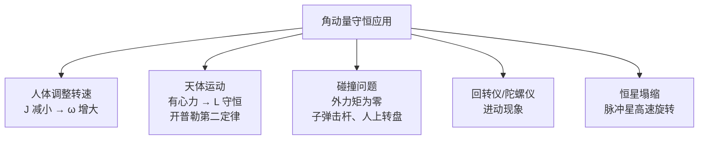

# 4.3 角动量、角动量守恒

> [!info] 本节定位
> 本节是整章的**理论高峰**：把 [[4.2 力矩、转动定律]] 的瞬时关系 $M=J\alpha$ 对时间积分，得到**角动量定理** $\int M\,dt=\Delta L$；进一步在合外力矩为零时得到**角动量守恒定律**——三大守恒律之一（与动量守恒、能量守恒并列），对应空间旋转对称性。
>
> 角动量守恒是分析"无外力矩或外力矩可忽略"系统（花样滑冰、跳水、天体运动、粒子碰撞）的核心工具，也是处理 [[4.4 刚体转动动能]] 中碰撞问题的必要补充。

## 一、质点的角动量

> [!definition] 质点角动量
> 质点 $m$ 对参考点 $O$ 的**角动量（angular momentum）** 定义为：
> $$\vec L=\vec r\times\vec p=\vec r\times(m\vec v)\quad(\text{kg·m}^{2}\text{/s})$$
> 其中 $\vec r$ 是从 $O$ 指向质点的位置矢量，$\vec p=m\vec v$ 是质点动量。
>
> 大小：$L=rp\sin\varphi=mv\,r\sin\varphi$，$\varphi$ 是 $\vec r$ 与 $\vec p$ 的夹角。
> 方向：垂直于 $\vec r$ 与 $\vec p$ 所在平面，由右手定则确定。

> [!note] 几何意义
> $L=mvr_{\perp}$，其中 $r_{\perp}=r\sin\varphi$ 是动量作用线到 $O$ 的垂直距离（动量臂）。
> - 直线运动质点也有角动量（只要 $O$ 不在该直线上）；
> - 圆周运动质点：$\vec r\perp\vec v$，$L=mvr=m(r\omega)r=mr^{2}\omega$。

### 单位

角动量 SI 单位：$\text{kg·m}^{2}\text{/s}$，量纲 $[M L^{2} T^{-1}]$，与作用量、约化普朗克常数 $\hbar$ 同量纲——这是量子力学中角动量量子化的根源。

## 二、刚体的角动量

### 2.1 定轴转动刚体的角动量

> [!definition] 刚体定轴转动的角动量
> 刚体绕固定 $z$ 轴以角速度 $\omega$ 转动时，对轴的角动量为
> $$\boxed{\,L_{z}=J\omega\,}\quad(\text{kg·m}^{2}\text{/s})$$
> 其中 $J$ 是对同一轴的转动惯量。

> [!proof] 推导
> 刚体第 $i$ 个质点 $m_{i}$ 距轴 $r_{i}$，做圆周运动，$v_{i}=r_{i}\omega$，其对轴角动量 $L_{i,z}=m_{i}v_{i}r_{i}=m_{i}r_{i}^{2}\omega$。
> 总角动量（沿 $z$ 分量）：
> $$L_{z}=\sum L_{i,z}=\sum m_{i}r_{i}^{2}\omega=\left(\sum m_{i}r_{i}^{2}\right)\omega=J\omega$$
> 由于所有质点 $\omega$ 相同，可提出求和之外。$\square$

### 2.2 一般情形（$J$ 可变）

> [!warning] 当 $J$ 随时间变化
> 当系统质量分布变化（如人收缩手臂、绳长改变）时，$J$ 是时间的函数，此时
> $$L=J(t)\omega(t)$$
> 仍成立，但 $M=J\alpha$ 不再适用（因 $d(J\omega)/dt=J\alpha+\dot J\omega$）。须用更普遍的 $M=dL/dt$。

## 三、角动量定理

### 3.1 微分形式

由 [[4.2 力矩、转动定律#三、力矩与角动量的关系]]：

> [!theorem] 角动量定理（微分形式）
> 质点或刚体所受合外力矩等于其角动量的时间变化率：
> $$\boxed{\,\vec M_{\text{合}}=\dfrac{d\vec L}{dt}\,}$$
> 对定轴刚体：$M_{\text{合}}=\dfrac{d(J\omega)}{dt}$。若 $J$ 不变，回到 $M=J\alpha$。

### 3.2 积分形式

> [!theorem] 角动量定理（积分形式，角冲量定理）
> 在 $t_{1}\to t_{2}$ 时间内，合外力矩的冲量（**角冲量**）等于角动量的增量：
> $$\boxed{\,\int_{t_{1}}^{t_{2}}\vec M_{\text{合}}\,dt=\vec L_{2}-\vec L_{1}\,}$$
> 左边 $\int M\,dt$ 称为**角冲量**（impulse of torque），单位 $\text{N·m·s}=\text{kg·m}^{2}\text{/s}$，与角动量同量纲。

> [!note] 与动量定理的对应
> | 平动 | 转动 |
> | ---- | ---- |
> | $\vec F=\dfrac{d\vec p}{dt}$ | $\vec M=\dfrac{d\vec L}{dt}$ |
> | $\int\vec F\,dt=\Delta\vec p$ | $\int\vec M\,dt=\Delta\vec L$ |
> | 冲量 $\int F\,dt$（N·s） | 角冲量 $\int M\,dt$（N·m·s） |

## 四、角动量守恒定律

> [!theorem] 角动量守恒定律
> 当系统所受**合外力矩为零**时，系统总角动量保持不变：
> $$\text{若}\ \sum\vec M_{\text{外}}=0\,,\quad\text{则}\ \vec L=\text{常矢量}$$
> 对定轴转动：若合外力矩沿轴分量为零，则 $L_{z}=J\omega=\text{const}$。
>
> **守恒条件**：合外力矩为零（不是合外力为零！）。内力矩相互抵消不改变总角动量。

### 4.1 守恒条件的判定

| 条件 | 例 |
| ---- | ---- |
| 合外力为零（必然合外力矩为零） | 孤立系统、无外力 |
| 合外力不为零但力矩为零 | 有心力（万有引力、库仑力、向轴心力）：力沿径向，$M=rF\sin0=0$ |
| 外力作用线过参考点 | 力臂为零 |
| 短暂碰撞中外力有限 | 碰撞瞬间外力矩的冲量 $\int M\,dt\to0$，碰撞前后角动量近似守恒 |

### 4.2 $J$ 可变时的守恒

> [!important] 角动量守恒的"收缩效应"
> 当 $\sum M_{\text{外}}=0$ 时，$J\omega=\text{const}$，故
> - $J$ 减小（收缩）$\Rightarrow$ $\omega$ 增大（转得更快）；
> - $J$ 增大（展开）$\Rightarrow$ $\omega$ 减小（转得更慢）。
>
> 这是花样滑冰、跳水运动员调整转速的物理基础。

## 五、典型应用

### 5.1 花样滑冰旋转

运动员直立旋转时双臂展开（$J$ 大，$\omega$ 小）；收缩双臂（$J$ 减小，$\omega$ 增大）。冰面摩擦力矩可忽略，$J\omega$ 守恒。

> [!example] 数值估算
> 设运动员质量 $m=60\,\text{kg}$，展开双臂时 $J_{1}=3.0\,\text{kg·m}^{2}$，$\omega_{1}=2.0\,\text{rad/s}$；收缩双臂时 $J_{2}=1.0\,\text{kg·m}^{2}$。
> $$J_{1}\omega_{1}=J_{2}\omega_{2}\Rightarrow\omega_{2}=\dfrac{J_{1}\omega_{1}}{J_{2}}=\dfrac{3.0\times2.0}{1.0}=6.0\,\text{rad/s}$$
> 转速增加为原来 3 倍。这是 $J$ 减小导致 $\omega$ 增大的直观例子。

### 5.2 跳水

跳水运动员在空中翻腾：起跳时通过蹬板获得初始角动量；空中通过抱膝（$J$ 小）加快翻腾；入水前展开身体（$J$ 大）减速以便垂直入水。整个过程重力作用于质心，力矩为零，角动量守恒。

### 5.3 天体运动（开普勒第二定律）

行星受太阳引力（有心力），力矩 $\vec M=\vec r\times\vec F=0$（$\vec F\parallel\vec r$），故角动量守恒。由此可推出**开普勒第二定律**：行星与太阳连线在相等时间内扫过相等面积。

> [!proof] 由角动量守恒推开普勒第二定律
> 行星角动量大小 $L=mvr\sin\varphi$。在 $dt$ 时间内扫过面积 $dA=\tfrac12 r\cdot v\,dt\sin\varphi$，故
> $$\dfrac{dA}{dt}=\dfrac12 rv\sin\varphi=\dfrac{L}{2m}=\text{const}$$
> $L$ 守恒 $\Rightarrow$ 面积速度 $dA/dt$ 守恒。$\square$

### 5.4 碰撞中的角动量守恒

> [!example] 子弹击中杆
> 长为 $L$、质量为 $M$ 的均匀杆可绕过一端水平轴自由转动，静止悬挂。质量 $m$、速度 $v_{0}$ 的子弹水平射入杆下端并嵌其中。求碰撞后系统角速度。

**分析**：
- 碰撞瞬间，轴处约束冲力很大但力臂为零，对轴力矩为零；
- 重力力矩在短暂碰撞中冲量 $\int M\,dt\to0$ 可忽略；
- **故碰撞前后对轴角动量守恒**。

**碰撞前**：杆静止，子弹角动量 $L_{1}=mv_{0}\cdot L$（动量臂为 $L$）。

**碰撞后**：杆-子弹一体以 $\omega$ 转动，$J_{\text{总}}=\dfrac13 ML^{2}+mL^{2}$，角动量 $L_{2}=J_{\text{总}}\omega$。

**守恒方程**：
$$mv_{0}L=\left(\dfrac{1}{3}ML^{2}+mL^{2}\right)\omega$$
$$\omega=\dfrac{mv_{0}}{\left(\dfrac{M}{3}+m\right)L}\quad(\text{rad/s})$$

> [!warning] 注意
> 此过程中**动能不守恒**（完全非弹性碰撞，动能损失转化为内能）；**动量也不守恒**（轴处冲力为外力）；只有对轴的**角动量守恒**。

## 六、典型例题

### 例题 1：人走上转盘

> [!example] 题目
> 转盘半径 $R=2.0\,\text{m}$、转动惯量 $J_{\text{盘}}=200\,\text{kg·m}^{2}$，可绕中心铅直轴自由转动（摩擦力矩可忽略）。质量 $m=60\,\text{kg}$ 的人站在盘边缘。初始系统静止。人相对盘以速度 $v_{r}=1.0\,\text{m/s}$ 沿盘边缘走动，求盘相对地面角速度。

**分析**：人-盘系统对轴无外力矩，角动量守恒（初始为零）。设盘相对地面角速度 $\omega_{\text{盘}}$（正方向），人相对地面速度 $v_{\text{人}}=v_{r}+R\omega_{\text{盘}}$（注意符号：人相对盘前进，盘反向转）。

**约定**：取人前进方向为正。盘相对地角速度 $\omega_{\text{盘}}$ 为负。人相对盘速度 $v_{r}=1.0\,\text{m/s}$，则人相对地速度 $v_{\text{人}}=v_{r}+R\omega_{\text{盘}}$。

**角动量守恒**（初始为零）：
$$J_{\text{盘}}\omega_{\text{盘}}+mR\cdot v_{\text{人}}=0$$
代入 $v_{\text{人}}=v_{r}+R\omega_{\text{盘}}$：
$$J_{\text{盘}}\omega_{\text{盘}}+mR(v_{r}+R\omega_{\text{盘}})=0$$
$$(J_{\text{盘}}+mR^{2})\omega_{\text{盘}}=-mRv_{r}$$
$$\omega_{\text{盘}}=\dfrac{-mRv_{r}}{J_{\text{盘}}+mR^{2}}=\dfrac{-60\times2.0\times1.0}{200+60\times4.0}=\dfrac{-120}{440}\approx-0.273\,\text{rad/s}$$

负号表示盘转向与人前进方向相反。人相对地速度 $v_{\text{人}}=1.0+2.0\times(-0.273)=0.455\,\text{m/s}$。

**检验**：$J_{\text{盘}}\omega_{\text{盘}}+mR v_{\text{人}}=200\times(-0.273)+60\times2.0\times0.455=-54.5+54.6\approx0$ ✓

### 例题 2：质点与转盘碰撞

> [!example] 题目
> 一转盘 $J=2.0\,\text{kg·m}^{2}$ 绕铅直轴以 $\omega_{0}=3.0\,\text{rad/s}$ 转动。一质量 $m=0.50\,\text{kg}$ 的油灰以速度 $v=4.0\,\text{m/s}$（在盘平面内，沿盘缘切线方向）粘到盘边缘 $r=1.0\,\text{m}$ 处。求碰撞后系统角速度。

**分析**：碰撞瞬间，转轴对盘的约束冲力力矩为零；油灰与盘的相互作用为内力。对（盘+油灰）系统，**对轴角动量守恒**。

**初始角动量**：
- 盘：$L_{\text{盘}}=J\omega_{0}=2.0\times3.0=6.0\,\text{kg·m}^{2}\text{/s}$
- 油灰：$L_{\text{油}}=mvr=0.50\times4.0\times1.0=2.0\,\text{kg·m}^{2}\text{/s}$（沿盘转动方向）
- 总：$L_{1}=8.0\,\text{kg·m}^{2}\text{/s}$

**末态**：油灰粘在盘上成为刚体一部分，$J_{\text{总}}=J+mr^{2}=2.0+0.50=2.5\,\text{kg·m}^{2}$，角动量 $L_{2}=J_{\text{总}}\omega$。

**守恒**：
$$L_{1}=L_{2}\Rightarrow\omega=\dfrac{L_{1}}{J_{\text{总}}}=\dfrac{8.0}{2.5}=3.2\,\text{rad/s}$$

**动能损失**（验证非弹性）：
- 初动能：$\tfrac12 J\omega_{0}^{2}+\tfrac12 mv^{2}=9.0+4.0=13.0\,\text{J}$
- 末动能：$\tfrac12 J_{\text{总}}\omega^{2}=\tfrac12\times2.5\times3.2^{2}=12.8\,\text{J}$
- 损失 $0.2\,\text{J}$ 转化为内能 ✓

### 例题 3：圆盘落到转盘上

> [!example] 题目
> 半径 $R=0.30\,\text{m}$、质量 $M=2.0\,\text{kg}$ 的均质圆盘以 $\omega_{0}=10\,\text{rad/s}$ 自由转动。另一同质量同半径的圆盘（初始静止）从上方落到其上并与之同步转动（同轴）。求共同角速度。

**分析**：两盘同轴，无外力矩（重力沿轴方向无力矩），角动量守恒。

每个圆盘 $J=\tfrac12 MR^{2}=\tfrac12\times2.0\times0.09=0.090\,\text{kg·m}^{2}$。

初始角动量 $L_{1}=J\omega_{0}+0=0.090\times10=0.90\,\text{kg·m}^{2}\text{/s}$。
末态 $J_{\text{总}}=2J=0.180\,\text{kg·m}^{2}$，角动量 $L_{2}=J_{\text{总}}\omega$。

$$\omega=\dfrac{L_{1}}{J_{\text{总}}}=\dfrac{0.90}{0.180}=5.0\,\text{rad/s}$$

**讨论**：转速减半，因为 $J$ 加倍而 $L$ 不变。这一结果与具体形状无关，只要两盘 $J$ 相同。

## 七、易错点

> [!warning] 易错点
> 1. **角动量守恒条件是合外力矩为零**，不是合外力为零。有心力是合力不为零但力矩为零的典型例子。
> 2. **必须对同一参考点（或同一轴）计算**角动量和力矩。混用不同参考点会出错。
> 3. **碰撞问题中角动量守恒 ≠ 动能守恒**：完全非弹性碰撞角动量守恒但动能损失；弹性碰撞两者都守恒。
> 4. **轴处约束力可能有外力矩**：若轴不在所取参考点，约束力的力矩可能不为零。要选合适的参考点（如取轴上点）使约束力矩为零。
> 5. **变质量系统的 $J$ 与 $\omega$ 同时变化**：必须用 $L=J\omega$ 守恒，不能用 $M=J\alpha$。
> 6. **方向必须一致**：$L$ 与 $M$ 都是矢量（定轴问题中是带符号标量），守恒方程中正负号要统一。

## 八、与其他小节的联系

- 角动量定义依赖 [[4.1 刚体运动、转动惯量]] 的转动惯量 $J$；
- 角动量定理是 [[4.2 力矩、转动定律]] 对时间的积分；
- 角动量守恒与 [[4.4 刚体转动动能]] 的能量守恒联合可解碰撞、滚动问题；
- 与 [[MOC - 第3章]] 动量守恒并列为三大守恒律，对应空间旋转对称性（诺特定理）；
- 本章 MOC：[[MOC - 第4章]]。

## 章节导航

- 上一级：[[MOC - 第4章]]
- 上一节：[[4.2 力矩、转动定律]]
- 下一节：[[4.4 刚体转动动能]]
- 习题：[[MOC - 第4章习题]]
