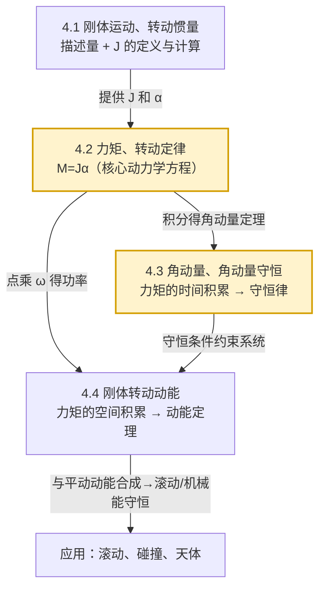

# MOC - 第4章 刚体的转动

> [!info] 本章定位
> 第4章把前 3 章建立的质点力学（运动学、牛顿定律、动量与能量守恒）**推广到不能简化为质点的 extended body——刚体**。刚体是一种理想化模型：任意两质点间距离恒定不变。本章只解决两类问题：
> 1. 如何描述刚体整体绕固定轴的转动状态（角位置、角速度、角加速度）；
> 2. 在外力作用下，刚体转动状态如何变化（转动定律 $M=J\alpha$、角动量定理与守恒、转动动能定理）。
>
> 全章有一条主线：**与质点平动一一类比**——质量 $m\leftrightarrow$ 转动惯量 $J$，力 $F\leftrightarrow$ 力矩 $M$，动量 $p=mv\leftrightarrow$ 角动量 $L=J\omega$，平动动能 $\tfrac12 mv^{2}\leftrightarrow$ 转动动能 $\tfrac12 J\omega^{2}$。掌握这条类比即可把质点力学整套工具迁移到刚体。

## 学习路线图

- 入口：[[4.1 刚体运动、转动惯量]]（先建立描述语言和惯性度量）
- 主干：[[4.2 力矩、转动定律]] $\to$ [[4.3 角动量、角动量守恒]] $\to$ [[4.4 刚体转动动能]]
- 先修：[[MOC - 第3章]]（动量、能量守恒的思路是本章类比的模板）

## 知识点导航

| 小节 | 主题 | 核心公式 | 核心考点 | 链接 |
| ---- | ---- | -------- | -------- | ---- |
| 4.1 | 刚体运动、转动惯量 | $J=\int r^{2}\,dm$ ；$J=J_{C}+md^{2}$ | 常见刚体 $J$ 计算、平行轴定理、正交轴定理 | [[4.1 刚体运动、转动惯量]] |
| 4.2 | 力矩、转动定律 | $M=r\times F$ ；$M=J\alpha$ | 力矩矢量性、转动定律与牛顿第二定律类比 | [[4.2 力矩、转动定律]] |
| 4.3 | 角动量、角动量守恒 | $L=r\times p$ ；$L=J\omega$ ；$\int M\,dt=\Delta L$ | 角动量定理、守恒条件与应用 | [[4.3 角动量、角动量守恒]] |
| 4.4 | 刚体转动动能 | $E_{k}=\tfrac12 J\omega^{2}$ ；$W=\int M\,d\theta$ | 转动动能定理、滚动动能、含转动的机械能守恒 | [[4.4 刚体转动动能]] |

## 平动与转动物理量对照表

> [!summary] 质点平动 ↔ 刚体定轴转动
>
> | 平动（质点） | 转动（刚体定轴） | 关系/类比 |
> | ---- | ---- | ---- |
> | 位移 $s$ (m) | 角位移 $\theta$ (rad) | $s=r\theta$ |
> | 速度 $v=\dfrac{ds}{dt}$ (m/s) | 角速度 $\omega=\dfrac{d\theta}{dt}$ (rad/s) | $v=r\omega$ |
> | 加速度 $a=\dfrac{dv}{dt}$ (m/s²) | 角加速度 $\alpha=\dfrac{d\omega}{dt}$ (rad/s²) | $a_{t}=r\alpha$（切向） |
> | 质量 $m$ (kg) | 转动惯量 $J$ (kg·m²) | $J$ 与质量分布和轴位置有关 |
> | 力 $F$ (N) | 力矩 $M=rF\sin\theta$ (N·m) | $M=r\times F$ |
> | 牛顿第二定律 $F=ma$ | 转动定律 $M=J\alpha$ | 形式完全对应 |
> | 动量 $p=mv$ (kg·m/s) | 角动量 $L=J\omega$ (kg·m²/s) | $L=r\times p$ |
> | 动能 $E_{k}=\tfrac12 mv^{2}$ (J) | 转动动能 $E_{k}=\tfrac12 J\omega^{2}$ (J) | 形式对应 |
> | 功 $W=\int F\,ds$ (J) | 力矩做功 $W=\int M\,d\theta$ (J) | 形式对应 |
> | 动量定理 $\int F\,dt=\Delta p$ | 角动量定理 $\int M\,dt=\Delta L$ | 时间积累 |
> | 动能定理 $W=\Delta E_{k}$ | 转动动能定理 $W=\Delta(\tfrac12 J\omega^{2})$ | 空间积累 |
> | 动量守恒（$\sum F=0$） | 角动量守恒（$\sum M=0$） | 守恒条件对应 |

## 核心考点

1. **转动惯量计算**：细杆（中点 $\tfrac{1}{12}mL^{2}$、端点 $\tfrac{1}{3}mL^{2}$）、圆盘/圆柱 $\tfrac12 mR^{2}$、圆环 $mR^{2}$、球体 $\tfrac25 mR^{2}$、球壳 $\tfrac23 mR^{2}$；用 [[4.1 刚体运动、转动惯量#平行轴定理]] 和 [[4.1 刚体运动、转动惯量#正交轴定理]] 求任意轴。
2. **转动定律 $M=J\alpha$ 的应用**：滑轮-物块系统（绳子张力提供力矩）、阿特伍德机带质量滑轮、定轴转动求角加速度。
3. **角动量守恒**：合外力矩为零（$\sum M_{\text{外}}=0$）时 $J\omega$ 不变；花样滑冰收缩、跳水、人走上转盘、杆-子弹碰撞。
4. **转动动能与机械能守恒**：含转动的系统 $E=\tfrac12 mv_{C}^{2}+\tfrac12 J_{C}\omega^{2}+mgh$ 守恒；纯滚动 $v_{C}=R\omega$。
5. **碰撞中的角动量**：质点与定轴刚体碰撞（如子弹击中杆端），由于轴处冲力外力矩为零，对轴角动量守恒但动能一般不守恒（完全非弹性）。
6. **滚动问题**：纯滚动条件 $v_{C}=R\omega$，摩擦力做功为零（瞬时接触点静止），平动+转动动能合成。
7. **力矩矢量方向**：用右手定则判断 $M=r\times F$ 沿轴方向；定轴问题中只取沿轴分量。

## 自测题

> [!question]- 自测 1（转动惯量）
> 长为 $L$、质量为 $m$ 的均匀细杆，求通过杆端且与杆垂直的轴的转动惯量。
>
> > [!check]- 答案
> > $J=\dfrac{1}{3}mL^{2}$。取杆端为原点，$dm=\dfrac{m}{L}dx$，则
> > $$J=\int_{0}^{L}x^{2}\,\dfrac{m}{L}dx=\dfrac{m}{L}\cdot\dfrac{L^{3}}{3}=\dfrac{1}{3}mL^{2}\quad(\text{kg·m}^{2})$$
> > 也可由 [[4.1 刚体运动、转动惯量#平行轴定理]] 从中点 $J_{C}=\tfrac{1}{12}mL^{2}$ 平移 $d=L/2$ 得 $J=\tfrac{1}{12}mL^{2}+m\left(\tfrac{L}{2}\right)^{2}=\tfrac{1}{3}mL^{2}$。

> [!question]- 自测 2（转动定律）
> 半径 $R=0.20\,\text{m}$、转动惯量 $J=0.40\,\text{kg·m}^{2}$ 的定滑轮上绕轻绳，绳端挂质量 $m=2.0\,\text{kg}$ 的物块。求物块加速度和绳子张力（绳不打滑，$g=9.8\,\text{m/s}^{2}$）。
>
> > [!check]- 答案
> > 对物块：$mg-T=ma$；对滑轮：$TR=J\alpha$，且 $a=R\alpha$。联立：
> > $$a=\dfrac{mgR^{2}}{J+mR^{2}}=\dfrac{2.0\times9.8\times0.04}{0.40+2.0\times0.04}=\dfrac{0.784}{0.48}\approx1.63\,\text{m/s}^{2}$$
> > $$T=m(g-a)=2.0\times(9.8-1.63)\approx16.3\,\text{N}$$
> > 检验：$TR=16.3\times0.20=3.27\,\text{N·m}$，$J\alpha=J\cdot\dfrac{a}{R}=0.40\times\dfrac{1.63}{0.20}=3.26\,\text{N·m}$，一致。

> [!question]- 自测 3（角动量守恒）
> 质量为 $M$、长为 $L$ 的均匀杆可绕过一端水平轴在竖直平面内自由转动，静止时杆竖直悬挂。一质量为 $m$、速度为 $v_{0}$ 的子弹水平射入杆的下端并嵌在其中。求碰撞后杆-子弹系统的角速度。
>
> > [!check]- 答案
> > 碰撞瞬间轴处冲力对轴力矩为零，重力力矩在碰撞瞬间可忽略，**对轴角动量守恒**：
> > $$mL^{2}\cdot\dfrac{v_{0}}{L}=\left(\dfrac{1}{3}ML^{2}+mL^{2}\right)\omega$$
> > 解得
> > $$\omega=\dfrac{mv_{0}}{\left(\dfrac{M}{3}+m\right)L}\quad(\text{rad/s})$$
> > 注意此处动能不守恒（完全非弹性碰撞），机械能仅碰撞后摆起过程中守恒。

> [!question]- 自测 4（滚动与机械能守恒）
> 质量为 $m$、半径为 $R$ 的均匀实心圆柱体从高 $h$ 的斜面顶端由静止纯滚动滑下（无滑动）。求到达底部时质心速度。
>
> > [!check]- 答案
> > 实心圆柱 $J_{C}=\tfrac12 mR^{2}$。纯滚动条件 $v_{C}=R\omega$。机械能守恒（静摩擦力不做功，接触点瞬时静止）：
> > $$mgh=\dfrac12 mv_{C}^{2}+\dfrac12 J_{C}\omega^{2}=\dfrac12 mv_{C}^{2}+\dfrac12\cdot\dfrac12 mR^{2}\cdot\dfrac{v_{C}^{2}}{R^{2}}=\dfrac34 mv_{C}^{2}$$
> > $$v_{C}=\sqrt{\dfrac{4}{3}gh}\quad(\text{m/s})$$
> > 关键点：纯滚动时静摩擦力做功为零；若改为空心圆环（$J_{C}=mR^{2}$），结果为 $v_{C}=\sqrt{gh}$，速度更小——转动惯量越大，动能中分给转动的份额越多。

## 易错点与注意事项

> [!warning] 常见错误
> 1. **混淆力矩与力**：转动定律中是 $M=J\alpha$，不是 $F=J\alpha$；力矩必须对**指定轴**计算。
> 2. **转动惯量与轴有关**：同一刚体对不同轴 $J$ 不同，必须先确定轴再用 [[4.1 刚体运动、转动惯量#平行轴定理]]。
> 3. **角动量守恒条件是合外力矩为零**，不是合外力为零。例如电子受有心力时合力不为零但力矩为零，故角动量守恒。
> 4. **滚动问题中摩擦力的功**：纯滚动时静摩擦力瞬时作用点速度为零，做功为零，机械能守恒；有滑动时摩擦力做负功，机械能不守恒。
> 5. **碰撞问题中动能一般不守恒**：子弹嵌入杆是完全非弹性碰撞，仅角动量守恒；动能损失转化为内能。
> 6. **单位**：$\omega$ 单位 rad/s（rad 无量纲但必须写），$J$ 单位 kg·m²，$L$ 单位 kg·m²/s，$M$ 单位 N·m。

## 章节导航

- 上一级：[[MOC - 大学物理B]]
- 先修章节：[[MOC - 第3章]]（动量守恒与能量守恒提供类比模板）
- 上一章：[[MOC - 第3章]]
- 下一章：[[MOC - 第5章]]
- 习题：[[MOC - 第4章习题]]

## 相关标签

#大学物理 #力学 #刚体 #转动惯量 #转动定律 #角动量守恒
