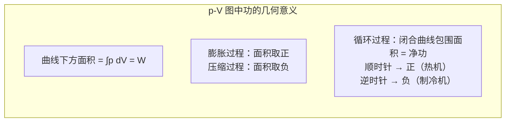

# 5.2 热力学第一定律

> [!info] 本节定位
> 第 3 章机械能守恒定律告诉我们：**做功和传热都能改变系统的能量**。但在机械能守恒框架下，热量并未作为独立的能量传递方式出现。本节将能量守恒推广到**包含热现象**的情形，给出热力学第一定律 $Q=\Delta U+W$，统一处理**热量 $Q$、功 $W$、内能 $U$** 三种能量形式。
>
> 本节核心要解决三个问题：
> 1. **如何描述热力学过程**——引入准静态过程，使每时刻系统都接近平衡态，从而可用 $p,V,T$ 描述；
> 2. **功与热量的定量表达**——体积功 $W=\int p\,dV$，热量 $Q$ 通过摩尔热容计算；
> 3. **能量守恒方程**——$Q=\Delta U+W$，并明确符号规定与适用范围。
>
> 本节是 [[5.3 等值过程、绝热过程]]、[[5.4 循环过程、卡诺循环]] 全部定量计算的统帅公式。

## 一、准静态过程

> [!definition] 准静态过程
> 系统在过程进行中，每一时刻都处于**平衡态**（或无限接近平衡态），这样的过程称为**准静态过程（quasi-static process）**。
>
> 实现条件：过程进行得**无限缓慢**，使系统偏离平衡态后能很快通过弛豫回到新的平衡态。

> [!note] 准静态过程的意义
> 准静态过程的每时刻系统都有确定的 $p,V,T$，因而：
> 1. 过程可在 $p\text{-}V$ 图上用一条连续曲线表示；
> 2. 功 $W=\int p\,dV$ 可用系统本身的压强 $p$ 计算；
> 3. 是热力学理论定量描述的基础。
>
> 准静态过程是理想化模型。实际过程只要进行得足够慢，即可近似为准静态过程。

> [!warning] 准静态 ≠ 可逆
> - **准静态**：每时刻接近平衡态，无耗散也可有耗散（如准静态但有摩擦的过程）；
> - **可逆过程**：准静态 + **无耗散**（无摩擦、无电阻发热等），过程可正向反向进行而不留痕迹。
>
> 详见 [[5.5 热力学第二定律#可逆与不可逆过程]]。准静态是可逆的必要条件，不是充分条件。

## 二、体积功

> [!definition] 体积功
> 设气缸内气体压强 $p$，活塞面积 $S$，气体推动活塞移动 $dx$。气体对活塞做功：
> $$dW=pS\,dx=p\,dV$$
> 其中 $dV=S\,dx$ 是气体体积的微元变化。系统从体积 $V_1$ 变到 $V_2$ 的有限过程中，总功为
> $$\boxed{\,W=\int_{V_1}^{V_2}p\,dV\,}\quad(\text{J})$$
> 这是**系统对外界所做的功**，称为体积功。
>
> 符号规定：
> - $dV>0$（膨胀）：$dW>0$，系统对外做正功；
> - $dV<0$（压缩）：$dW<0$，系统对外做负功（外界对系统做正功）。

### 功的几何意义

在 $p\text{-}V$ 图上，$W=\int p\,dV$ 等于过程曲线**下方与 $V$ 轴之间的面积**：

> [!warning] 功是过程量
> 功 $W$ 不仅与初末状态有关，还与**过程路径**有关。从状态 $A$ 到状态 $B$，沿不同路径（等温、等压、绝热等）所做的功不同。在 $p\text{-}V$ 图上表现为曲线下方面积随路径变化。
>
> 因此 $dW$ 不是某状态函数的全微分，写作 $đW$（带斜杠）以示区别。

## 三、热量

> [!definition] 热量
> 系统与外界之间由于**温度不同**而传递的能量称为**热量（heat）**，记作 $Q$，单位 $\text{J}$（焦耳）。
>
> 符号规定：
> - $Q>0$：系统吸热；
> - $Q<0$：系统放热。
>
> 热量与功一样是**过程量**，不是状态量，与具体过程路径有关。$dQ$ 也写作 $đQ$。

### 热量与热容

> [!theorem] 摩尔热容
> $1\,\text{mol}$ 理想气体在某一过程中温度升高 $1\,\text{K}$ 所吸收的热量，称为该过程的**摩尔热容** $C_m$（单位 $\text{J/(mol·K)}$）：
> $$đQ=nC_m\,dT$$
> 不同过程 $C_m$ 不同：
> - **定容摩尔热容** $C_V$：等体过程（$dV=0$，不做功，$đQ=dU=nC_V\,dT$）；
> - **定压摩尔热容** $C_p$：等压过程（$đQ=nC_p\,dT$，详见 [[5.3 等值过程、绝热过程]]）。
>
> 对理想气体，$C_V$ 仅与分子自由度 $i$ 有关：$C_V=\dfrac{i}{2}R$（如单原子 $C_V=\tfrac32 R$，刚性双原子 $C_V=\tfrac52 R$）。

## 四、内能

> [!definition] 内能
> 系统内所有分子的**动能与势能之和**（在宏观层次还包括化学能、核能等，但本章不涉及化学与核反应）称为**内能（internal energy）** $U$，单位 $\text{J}$。
>
> 内能是**状态函数**：只由系统所处状态决定，与达到该状态的过程无关。对理想气体，分子间无相互作用力，**内能仅是温度的函数** $U=U(T)$（[[5.1 平衡态、状态参量、理想气体物态方程#理想气体内能|焦耳定律]]），与体积无关。

> [!theorem] 内能是状态函数
> 内能 $U$ 是状态函数，意味着：
> 1. $dU$ 是全微分（写作 $dU$ 而非 $đU$）；
> 2. 循环过程 $\oint dU=0$（系统回到初态，内能不变）；
> 3. 任意过程 $\Delta U=U_2-U_1$ 只与初末状态有关，与路径无关。
>
> 对理想气体：$\Delta U=nC_V\Delta T$（不论过程如何，只要温度变化 $\Delta T$ 相同，内能变化相同）。

> [!note] 内能与机械能的区别
> - **机械能**：系统整体动能 + 系统整体势能（宏观运动的能量）；
> - **内能**：系统内部微观粒子热运动的能量。
>
> 静止于地面的物体机械能为零，但内能不为零（分子仍在运动）。本章讨论的系统一般取整体静止，故机械能为零，能量守恒只涉及内能、功、热量。

## 五、热力学第一定律

> [!theorem] 热力学第一定律
> 系统从外界吸收的热量 $Q$，一部分用于增加系统内能 $\Delta U$，另一部分用于系统对外做功 $W$：
> $$\boxed{\,Q=\Delta U+W\,}$$
> 或写成微分形式：$đQ=dU+đW=dU+p\,dV$（准静态过程）。
>
> 这就是**热力学第一定律**，本质是包含热现象的能量守恒定律。

### 符号规定

> [!summary] 符号规定（工程热力学通行约定）
>
> | 量 | 符号 | 正值含义 | 负值含义 |
> | ---- | ---- | ---- | ---- |
> | $Q$ | 系统吸热 | 系统吸收热量 | 系统放出热量 |
> | $W$ | 系统对外做功 | 系统膨胀对外做功 | 系统被压缩，外界对系统做功 |
> | $\Delta U$ | 内能增加 | $U_2>U_1$，温度升高（理想气体） | $U_2<U_1$，温度降低 |
>
> 在此约定下：$Q=\Delta U+W$ 自洽。例如等温膨胀（$\Delta U=0$），$Q=W>0$，吸热全部用于对外做功。

> [!warning] 注意不同教材的符号约定
> 部分教材（特别是化学热力学）采用"$W$ 表示外界对系统做功"的约定，此时第一定律写为 $Q=\Delta U-W$。解题时务必先看清题目所用约定。本库统一采用"**$W$ 为系统对外做功**"，与 [[MOC - 第5章]] 一致。

### 第一定律的物理意义

1. **能量守恒的推广**：第一定律将能量守恒从纯机械能推广到包含内能与热量的更普遍情形，是能量守恒定律在热学中的具体表达；
2. **第一类永动机不可能**：不消耗能量（$Q=0$）却持续对外做功（$W>0$）的机器（**第一类永动机**）违反第一定律，不可能实现；
3. **热量与功的等价性**：热量和功都是能量传递的形式，二者可相互转换，但都是过程量。

## 六、第一定律在典型情形的应用

> [!example] 几种特殊情形的第一定律
>
> | 过程 | 特征 | 第一定律形式 |
> | ---- | ---- | ---- |
> | 等容过程 | $dV=0$，$W=0$ | $Q=\Delta U=nC_V\Delta T$ |
> | 绝热过程 | $Q=0$ | $\Delta U+W=0\Rightarrow W=-\Delta U$ |
> | 等温过程（理想气体） | $\Delta U=0$ | $Q=W$ |
> | 循环过程 | $\Delta U=0$ | $Q_{\text{净}}=W_{\text{净}}$ |
> | 自由膨胀（理想气体） | $Q=0$，$W=0$ | $\Delta U=0\Rightarrow T$ 不变 |

## 七、典型例题

### 例题 1：等压膨胀计算

> [!example] 题目
> $2.0\,\text{mol}$ 理想气体（双原子分子，$C_V=\tfrac52 R$）在压强 $p=1.0\times10^{5}\,\text{Pa}$ 下从 $V_1=0.050\,\text{m}^{3}$ 等压膨胀到 $V_2=0.080\,\text{m}^{3}$。求：（1）系统对外做功 $W$；（2）内能变化 $\Delta U$；（3）吸收热量 $Q$。

**解**：
（1）等压过程：$W=p(V_2-V_1)=1.0\times10^{5}\times(0.080-0.050)=1.0\times10^{5}\times0.030=3000\,\text{J}$

（2）由 $pV=nRT$ 求温度变化：
$$T_1=\dfrac{pV_1}{nR}=\dfrac{1.0\times10^{5}\times0.050}{2.0\times8.31}=\dfrac{5000}{16.62}=301\,\text{K}$$
$$T_2=\dfrac{pV_2}{nR}=\dfrac{1.0\times10^{5}\times0.080}{2.0\times8.31}=\dfrac{8000}{16.62}=481\,\text{K}$$
$$\Delta T=T_2-T_1=180\,\text{K}$$
$$\Delta U=nC_V\Delta T=2.0\times\dfrac{5}{2}\times8.31\times180=5\times8.31\times180=7479\,\text{J}$$

（3）由热力学第一定律：
$$Q=\Delta U+W=7479+3000=10479\,\text{J}\approx1.05\times10^{4}\,\text{J}$$

**检验**：等压过程中 $Q=nC_p\Delta T$，$C_p=C_V+R=\tfrac{7}{2}R$：
$$Q=2.0\times\dfrac{7}{2}\times8.31\times180=7\times8.31\times180=10470\,\text{J}$$
两种算法结果一致（差异为舍入误差）✓。

### 例题 2：绝热压缩

> [!example] 题目
> $1.0\,\text{mol}$ 单原子理想气体（$C_V=\tfrac32 R$，$\gamma=\tfrac53$）从初态 $(p_1,V_1,T_1)$ 经准静态绝热压缩到 $V_2=\tfrac{V_1}{2}$。求：（1）末态压强 $p_2$；（2）系统内能变化；（3）外界对系统做的功。

**解**：
（1）绝热过程方程 $pV^{\gamma}=\text{const}$：
$$p_1V_1^{\gamma}=p_2V_2^{\gamma}\Rightarrow p_2=p_1\left(\dfrac{V_1}{V_2}\right)^{\gamma}=p_1\cdot2^{5/3}=2^{5/3}p_1\approx3.17\,p_1$$
（注：等温压缩时 $p_2=2p_1$，绝热压缩压强增加更剧烈，因压缩同时温度升高）

（2）由 $T_1V_1^{\gamma-1}=T_2V_2^{\gamma-1}$：
$$T_2=T_1\left(\dfrac{V_1}{V_2}\right)^{\gamma-1}=T_1\cdot2^{2/3}\approx1.59\,T_1$$
$$\Delta U=nC_V\Delta T=1.0\times\dfrac{3}{2}\times8.31\times T_1(2^{2/3}-1)=12.47\,T_1\times0.587=7.32\,T_1\,\text{J}$$

（3）绝热过程 $Q=0$，第一定律：$\Delta U+W=0$，故系统对外做功：
$$W=-\Delta U=-7.32\,T_1\,\text{J}$$
即外界对系统做正功 $7.32\,T_1\,\text{J}$。

**检验**：若取 $T_1=300\,\text{K}$，则 $\Delta U=2196\,\text{J}$，外界做功 $2196\,\text{J}$，温度升至 $T_2\approx477\,\text{K}$，符合绝热压缩升温的物理直觉。

### 例题 3：p-V 图上多过程循环

> [!example] 题目
> 一定量理想气体经如下准静态循环：$A(p_0,V_0)\xrightarrow{\text{等压膨胀}}B(p_0,2V_0)\xrightarrow{\text{等容降压}}C(p_0/2,2V_0)\xrightarrow{\text{等压压缩}}D(p_0/2,V_0)\xrightarrow{\text{等容升压}}A$。求该循环的净功与各过程吸放热。

**解**：在 $p\text{-}V$ 图上该循环为矩形，顺时针方向，净功等于矩形面积：
$$W_{\text{净}}=(p_0-p_0/2)\times(2V_0-V_0)=\dfrac{p_0V_0}{2}$$
（顺时针循环，$W_{\text{净}}>0$，系统对外做净功）

各过程：
- $A\to B$（等压膨胀，$T$ 升高，$\Delta U>0$，$W=p_0V_0>0$）：$Q_{AB}=\Delta U+W>0$，吸热；
- $B\to C$（等容降压，$T$ 降低，$\Delta U<0$，$W=0$）：$Q_{BC}=\Delta U<0$，放热；
- $C\to D$（等压压缩，$T$ 降低，$\Delta U<0$，$W=-p_0V_0/2<0$）：$Q_{CD}=\Delta U+W<0$，放热；
- $D\to A$（等容升压，$T$ 升高，$\Delta U>0$，$W=0$）：$Q_{DA}=\Delta U>0$，吸热。

循环中 $\Delta U=0$，故 $Q_{\text{净}}=W_{\text{净}}=\dfrac{p_0V_0}{2}>0$，系统净吸热对外做功（热机循环）。

## 八、易错点

> [!warning] 易错点
> 1. **功与热量是过程量**：$W,Q$ 与路径有关，不能用 $\Delta W,\Delta Q$ 表示。只能说"在某过程中系统做功 $W$"或"吸热 $Q$"，不能说"系统在某状态的功"。
> 2. **内能是状态函数**：$\Delta U$ 只与初末状态有关，与路径无关。理想气体 $\Delta U$ 只看温度变化。
> 3. **符号规定**：$W>0$ 表示系统对外做功（膨胀），不是外界对系统做功。混用会导致 $Q=\Delta U+W$ 与 $Q=\Delta U-W$ 混淆。
> 4. **第一定律的微分形式**：$đQ=dU+p\,dV$ 中 $p\,dV$ 必须用**系统本身压强**，这要求准静态过程；非准静态过程不能用 $p\,dV$ 算功（需用外界压强 $p_{\text{ext}}$）。
> 5. **自由膨胀不是准静态过程**：自由膨胀中系统内各处压强不等，不能用 $\int p\,dV$ 计算功；但 $W=0$（外界真空，对系统不做功），$Q=0$（绝热），故 $\Delta U=0$。
> 6. **理想气体 $\Delta U$ 公式与过程无关**：$\Delta U=nC_V\Delta T$ 虽含 $C_V$，但对**任何过程**都成立（只要理想气体），不是仅等容过程。这是因为理想气体内能仅依赖温度。

## 九、与其他小节的联系

- 第一定律是 [[5.3 等值过程、绝热过程]] 中四种过程（等体、等压、等温、绝热）能量分析的统帅公式；
- 循环过程 $\Delta U=0\Rightarrow Q_{\text{净}}=W_{\text{净}}$ 是 [[5.4 循环过程、卡诺循环]] 中效率公式的出发点；
- 第一定律是 [[5.6 熵初步概念]] 中 $dS=đQ/T$ 的基础（熵的定义依赖热量）；
- 与 [[5.1 平衡态、状态参量、理想气体物态方程]] 的联系：物态方程提供 $p\text{-}V\text{-}T$ 关系，使功 $W=\int p\,dV$ 可积；
- 本章 MOC：[[MOC - 第5章]]。

## 章节导航

- 上一级：[[MOC - 第5章]]
- 上一节：[[5.1 平衡态、状态参量、理想气体物态方程]]
- 下一节：[[5.3 等值过程、绝热过程]]
- 习题：[[MOC - 第5章习题]]
