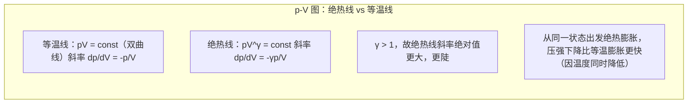

# 5.3 等值过程、绝热过程

> [!info] 本节定位
> [[5.2 热力学第一定律]] 给出了能量守恒方程 $Q=\Delta U+W$，但要具体计算 $W,Q,\Delta U$，必须知道过程所满足的 $p\text{-}V\text{-}T$ 关系。本节研究理想气体在四种典型准静态过程中的能量转换：
> 1. **等体过程**（$V=$ const）：体积不变，不做体积功；
> 2. **等压过程**（$p=$ const）：压强不变，功 $W=p\Delta V$；
> 3. **等温过程**（$T=$ const）：温度不变，理想气体 $\Delta U=0$；
> 4. **绝热过程**（$Q=0$）：与外界无热交换，$\Delta U+W=0$。
>
> 本节还给出**迈耶公式** $C_p=C_V+R$ 与**摩尔热容比** $\gamma=C_p/C_V$，是 [[5.4 循环过程、卡诺循环]] 中卡诺循环计算的基础。

## 一、热容与迈耶公式

> [!theorem] 定容摩尔热容与定压摩尔热容
> 对 $n\,\text{mol}$ 理想气体：
> - **定容摩尔热容** $C_V$：等体过程中 $1\,\text{mol}$ 气体温度升高 $1\,\text{K}$ 所吸热量：
>   $$C_V=\dfrac{1}{n}\left(\dfrac{đQ}{dT}\right)_V=\dfrac{1}{n}\dfrac{dU}{dT}$$
>   （等体过程 $đQ=dU$）
> - **定压摩尔热容** $C_p$：等压过程中 $1\,\text{mol}$ 气体温度升高 $1\,\text{K}$ 所吸热量：
>   $$C_p=\dfrac{1}{n}\left(\dfrac{đQ}{dT}\right)_p$$
>
> 由 [[5.1 平衡态、状态参量、理想气体物态方程#理想气体内能|理想气体内能]] $U=\tfrac{i}{2}nRT$，得
> $$\boxed{\,C_V=\dfrac{i}{2}R\,}$$
> 单原子 $i=3$，$C_V=\tfrac32 R$；刚性双原子 $i=5$，$C_V=\tfrac52 R$。

> [!theorem] 迈耶公式（Mayer's relation）
> 对理想气体：
> $$\boxed{\,C_p=C_V+R\,}$$
> 即定压摩尔热容比定容摩尔热容大一个 $R$。

> [!proof] 迈耶公式证明
> 等压过程第一定律：$đQ=dU+p\,dV=nC_V\,dT+nR\,dT$（用 $p\,dV=nR\,dT$，因 $p$ 恒定）。故
> $$C_p=\dfrac{1}{n}\dfrac{đQ}{dT}=C_V+R$$
> 物理意义：等压过程吸热除升高温度（$dU=nC_V\,dT$）外，还要对外做功 $p\,dV=nR\,dT$，故 $C_p>C_V$。$\square$

> [!definition] 摩尔热容比（绝热指数）
> $$\boxed{\,\gamma=\dfrac{C_p}{C_V}=\dfrac{i+2}{i}\,}$$
> 单原子 $\gamma=\tfrac53\approx1.67$；刚性双原子 $\gamma=\tfrac75\approx1.40$。

## 二、等体过程（isochoric）

> [!definition] 等体过程
> 系统体积保持不变（$V=\text{const}$，$dV=0$）的过程。
>
> 过程方程：$\dfrac{p}{T}=\text{const}$（由 $pV=nRT$，$V,n$ 不变）。
> p-V 图特征：一条**竖直线段**。

**能量关系**：
- 功：$W=\int p\,dV=0$（体积不变）
- 内能变化：$\Delta U=nC_V\Delta T=nC_V(T_2-T_1)$
- 热量：$Q=\Delta U+W=\Delta U=nC_V\Delta T$

> [!note] 等体过程的特点
> 等体过程中系统不做功，吸收的热量**全部转化为内能**（即温度升高）。这也是 $C_V$ 定义为 $dU/dT$ 的物理依据。

## 三、等压过程（isobaric）

> [!definition] 等压过程
> 系统压强保持不变（$p=\text{const}$，$dp=0$）的过程。
>
> 过程方程：$\dfrac{V}{T}=\text{const}$（由 $pV=nRT$，$p,n$ 不变）。
> p-V 图特征：一条**水平线段**。

**能量关系**：
- 功：$W=\int_{V_1}^{V_2}p\,dV=p(V_2-V_1)=nR\Delta T$
- 内能变化：$\Delta U=nC_V\Delta T$（理想气体，任何过程都成立）
- 热量：$Q=\Delta U+W=nC_V\Delta T+nR\Delta T=n(C_V+R)\Delta T=nC_p\Delta T$

> [!note] 等压过程的特点
> 等压膨胀（$V_2>V_1$，$T_2>T_1$）：$W>0$（对外做功），$Q>0$（吸热），$\Delta U>0$（内能增加）。吸热一部分用于升温，一部分用于对外做功，故同样温升下 $Q_p>Q_V$（即 $C_p>C_V$）。

## 四、等温过程（isothermal）

> [!definition] 等温过程
> 系统温度保持不变（$T=\text{const}$，$dT=0$）的过程。
>
> 过程方程：$pV=\text{const}$（由 $pV=nRT$，$T,n$ 不变），即玻意耳定律。
> p-V 图特征：一条**等轴双曲线**（第一象限）。

**能量关系**：
- 内能变化：$\Delta U=nC_V\Delta T=0$（理想气体，温度不变）
- 功：$W=\int_{V_1}^{V_2}p\,dV=\int_{V_1}^{V_2}\dfrac{nRT}{V}\,dV=nRT\ln\dfrac{V_2}{V_1}=nRT\ln\dfrac{p_1}{p_2}$
- 热量：$Q=\Delta U+W=W=nRT\ln\dfrac{V_2}{V_1}$

> [!warning] 等温过程功的符号
> - 等温膨胀（$V_2>V_1$）：$\ln(V_2/V_1)>0$，$W>0$，$Q>0$，系统吸热全部对外做功；
> - 等温压缩（$V_2<V_1$）：$\ln(V_2/V_1)<0$，$W<0$，$Q<0$，外界做功全部以热形式放出。

## 五、绝热过程（adiabatic）

> [!definition] 绝热过程
> 系统与外界**无热量交换**（$đQ=0$）的过程。可由绝热壁（绝热材料）隔绝热交换实现，或过程进行极快而来不及热交换（如声波传播中的气体压缩）。
>
> 准静态绝热过程方程（理想气体）：
> $$\boxed{\,pV^{\gamma}=\text{const}\,}$$
> 等价形式：$TV^{\gamma-1}=\text{const}$；$T^{\gamma}p^{1-\gamma}=\text{const}$。
> p-V 图特征：一条比等温线**更陡**的曲线。

### 绝热过程方程推导

> [!proof] 推导 $pV^{\gamma}=\text{const}$
> 准静态绝热过程 $đQ=0$，第一定律：$dU+p\,dV=0$，即 $nC_V\,dT+p\,dV=0$。
>
> 又由物态方程微分：$p\,dV+V\,dp=nR\,dT$，故 $dT=\dfrac{p\,dV+V\,dp}{nR}$。
>
> 代入第一定律：
> $$nC_V\cdot\dfrac{p\,dV+V\,dp}{nR}+p\,dV=0$$
> $$\dfrac{C_V}{R}(p\,dV+V\,dp)+p\,dV=0$$
> 用 $R=C_p-C_V$，$\gamma=C_p/C_V$：
> $$C_V(p\,dV+V\,dp)+(C_p-C_V)p\,dV=0$$
> $$C_V\,V\,dp+C_p\,p\,dV=0$$
> $$\dfrac{dp}{p}+\gamma\dfrac{dV}{V}=0$$
> 积分：$\ln p+\gamma\ln V=\text{const}$，即
> $$pV^{\gamma}=\text{const}$$
> $\square$

### 绝热过程能量关系

- 热量：$Q=0$
- 内能变化：$\Delta U=nC_V\Delta T$（理想气体）
- 功：$W=-\Delta U=-nC_V\Delta T=nC_V(T_1-T_2)$
- 也可由 $pV^{\gamma}=\text{const}$ 直接积分：
  $$W=\int_{V_1}^{V_2}p\,dV=\dfrac{p_1V_1-p_2V_2}{\gamma-1}=\dfrac{nR(T_1-T_2)}{\gamma-1}=\dfrac{nR(T_1-T_2)}{R/C_V}=nC_V(T_1-T_2)$$

> [!warning] 绝热过程温度变化
> - 绝热膨胀（$V_2>V_1$）：$W>0$（对外做功），$\Delta U<0$，**温度降低**（$T_2<T_1$）；
> - 绝热压缩（$V_2<V_1$）：$W<0$（外界做功），$\Delta U>0$，**温度升高**（$T_2>T_1$）。
>
> 例如自行车打气筒快速压缩气体时筒壁发热，即为绝热压缩升温现象。

### 绝热线与等温线比较

## 六、四种过程对照表

> [!summary] 理想气体四种典型准静态过程（$n$ mol，$C_V$ 为定容摩尔热容，$\gamma=C_p/C_V$）
>
> | 过程 | 特征 | 过程方程 | $W$（系统对外做功） | $Q$（吸热） | $\Delta U$ |
> | ---- | ---- | ---- | ---- | ---- | ---- |
> | 等体 | $V=$ const | $p/T=$ const | $0$ | $nC_V\Delta T$ | $nC_V\Delta T$ |
> | 等压 | $p=$ const | $V/T=$ const | $p\Delta V=nR\Delta T$ | $nC_p\Delta T$ | $nC_V\Delta T$ |
> | 等温 | $T=$ const | $pV=$ const | $nRT\ln\dfrac{V_2}{V_1}$ | $nRT\ln\dfrac{V_2}{V_1}$ | $0$ |
> | 绝热 | $Q=0$ | $pV^{\gamma}=$ const | $\dfrac{p_1V_1-p_2V_2}{\gamma-1}=-nC_V\Delta T$ | $0$ | $nC_V\Delta T$ |
>
> 符号约定详见 [[5.2 热力学第一定律#符号规定]]。

## 七、典型例题

### 例题 1：等温膨胀

> [!example] 题目
> $1.0\,\text{mol}$ 理想气体在 $T=300\,\text{K}$ 下等温膨胀，体积从 $V_1=2.0\,\text{L}$ 变为 $V_2=8.0\,\text{L}$。求系统对外做功、吸热与内能变化。

**解**：等温过程 $\Delta U=0$：
$$W=nRT\ln\dfrac{V_2}{V_1}=1.0\times8.31\times300\times\ln\dfrac{8.0}{2.0}=2493\times\ln4=2493\times1.386=3456\,\text{J}$$
$$Q=W=3456\,\text{J},\quad \Delta U=0$$

**检验**：单位 $\text{J}=\text{mol}\cdot\text{J/(mol·K)}\cdot\text{K}$ ✓；吸热全部用于对外做功，符合等温过程能量守恒。

### 例题 2：绝热膨胀

> [!example] 题目
> $2.0\,\text{mol}$ 双原子理想气体（$C_V=\tfrac52 R$，$\gamma=\tfrac75$）从初态 $p_1=2.0\,\text{atm}$、$V_1=10\,\text{L}$、$T_1=300\,\text{K}$ 准静态绝热膨胀到 $V_2=20\,\text{L}$。求：（1）末态 $p_2,T_2$；（2）系统对外做功；（3）内能变化。

**解**：
（1）由 $pV^{\gamma}=\text{const}$：
$$p_2=p_1\left(\dfrac{V_1}{V_2}\right)^{\gamma}=2.0\times\left(\dfrac{10}{20}\right)^{7/5}=2.0\times0.5^{1.4}=2.0\times0.379=0.758\,\text{atm}$$
（$0.5^{1.4}=e^{1.4\ln0.5}=e^{-0.970}=0.379$）

由 $T_1V_1^{\gamma-1}=T_2V_2^{\gamma-1}$（$\gamma-1=0.4$）：
$$T_2=T_1\left(\dfrac{V_1}{V_2}\right)^{\gamma-1}=300\times0.5^{0.4}=300\times0.758=227\,\text{K}$$

（2）绝热过程 $Q=0$，$W=-\Delta U$：
$$\Delta U=nC_V\Delta T=2.0\times\dfrac{5}{2}\times8.31\times(227-300)=5\times8.31\times(-73)=-3033\,\text{J}$$
$$W=-\Delta U=3033\,\text{J}$$

（3）$\Delta U=-3033\,\text{J}$（内能减少，温度降低）

**检验**：用功的公式 $W=\dfrac{p_1V_1-p_2V_2}{\gamma-1}$（注意 $p$ 用 $\text{Pa}$，$V$ 用 $\text{m}^3$）：
$$p_1V_1=2.0\times1.013\times10^{5}\times10\times10^{-3}=2026\,\text{J}$$
$$p_2V_2=0.758\times1.013\times10^{5}\times20\times10^{-3}=1536\,\text{J}$$
$$W=\dfrac{2026-1536}{0.4}=\dfrac{490}{0.4}=1225\,\text{J}?$$

差异来自 $p_2$ 的舍入误差累积。直接用 $W=nC_V(T_1-T_2)=2.0\times20.78\times73=3034\,\text{J}$ 更准确。

**结论**：绝热膨胀对外做功约 $3033\,\text{J}$，温度从 $300\,\text{K}$ 降至 $227\,\text{K}$，内能减少 $3033\,\text{J}$。

### 例题 3：多过程组合

> [!example] 题目
> $1.0\,\text{mol}$ 单原子理想气体（$C_V=\tfrac32 R$）经历如下过程：从初态 $(p_1,V_1,T_1)$ 等容加热使压强加倍（状态 2），再等压膨胀使体积加倍（状态 3）。已知 $p_1=1.0\,\text{atm}$、$V_1=10\,\text{L}$。求：（1）状态 2、3 的 $p,V,T$；（2）整个过程 $W,Q,\Delta U$。

**解**：
（1）状态 2（等容，$V_2=V_1$，$p_2=2p_1$）：
$$T_2=T_1\dfrac{p_2}{p_1}=2T_1$$
由 $p_1V_1=nRT_1$：$T_1=\dfrac{p_1V_1}{nR}=\dfrac{1.013\times10^{5}\times0.010}{1.0\times8.31}=\dfrac{1013}{8.31}=122\,\text{K}$（这值偏低，说明 $1\,\text{atm}\cdot10\,\text{L}$ 对应温度较低，物理上合理——读者可重新设 $T_1=300\,\text{K}$ 反推）

**重新设** $T_1=300\,\text{K}$，则 $p_1V_1=nRT_1=1\times8.31\times300=2493\,\text{J}$。

- 状态 2：$V_2=V_1$，$p_2=2p_1$，$T_2=2T_1=600\,\text{K}$
- 状态 3：$p_3=p_2=2p_1$，$V_3=2V_2=2V_1$，$T_3=\dfrac{p_3V_3}{nR}=\dfrac{2p_1\cdot2V_1}{nR}=4T_1=1200\,\text{K}$

（2）计算 $W,Q,\Delta U$：
- 过程 1→2（等容）：$W_{12}=0$；$\Delta U_{12}=nC_V(T_2-T_1)=1\times\tfrac32\times8.31\times300=3739\,\text{J}$；$Q_{12}=3739\,\text{J}$
- 过程 2→3（等压）：$W_{23}=p_2(V_3-V_2)=2p_1\cdot V_1=2\times nRT_1=2\times1\times8.31\times300=4986\,\text{J}$
  $\Delta U_{23}=nC_V(T_3-T_2)=1\times\tfrac32\times8.31\times600=7479\,\text{J}$
  $Q_{23}=nC_p(T_3-T_2)=1\times\tfrac52\times8.31\times600=12465\,\text{J}$
- 总计：
  $$W=W_{12}+W_{23}=0+4986=4986\,\text{J}$$
  $$\Delta U=\Delta U_{12}+\Delta U_{23}=3739+7479=11218\,\text{J}$$
  $$Q=Q_{12}+Q_{23}=3739+12465=16204\,\text{J}$$

**检验**：$Q=\Delta U+W=11218+4986=16204\,\text{J}$ ✓

## 八、易错点

> [!warning] 易错点
> 1. **$\Delta U=nC_V\Delta T$ 对任何过程都成立**（理想气体），不是仅等容过程。这是因为理想气体内能仅是温度的函数，与路径无关。$C_V$ 在此处只是"换算系数"，不代表过程必须是等容。
> 2. **等压过程 $Q=nC_p\Delta T$**（不是 $nC_V\Delta T$）：等压吸热除升温外还要做功，故用 $C_p$。
> 3. **绝热过程方程的三个形式**：
>    - $pV^{\gamma}=\text{const}$：已知 $p,V$ 时用；
>    - $TV^{\gamma-1}=\text{const}$：已知 $T,V$ 时用；
>    - $T^{\gamma}p^{1-\gamma}=\text{const}$（或 $p^{1-\gamma}T^{\gamma}=\text{const}$）：已知 $p,T$ 时用。
> 4. **绝热过程方程仅适用于理想气体准静态绝热过程**：非准静态绝热（如自由膨胀）不能用 $pV^{\gamma}=\text{const}$，但 $Q=0,\Delta U+W=0$ 仍成立。
> 5. **等温过程 $pV=\text{const}$** 与绝热 $pV^{\gamma}=\text{const}$ 形式相似但指数不同；$\gamma>1$ 决定绝热线更陡。
> 6. **功的符号**：膨胀 $W>0$，压缩 $W<0$。计算时注意 $V_2/V_1$ 在等温功 $\ln(V_2/V_1)$ 中的方向。
> 7. **迈耶公式 $C_p=C_V+R$ 仅对理想气体成立**：实际气体 $C_p-C_V\ne R$（一般大于 $R$）。

## 九、与其他小节的联系

- 等温与绝热过程是 [[5.4 循环过程、卡诺循环]] 中卡诺循环的两个组成过程；
- 绝热过程 $Q=0,\Delta S=0$（可逆绝热）是 [[5.6 熵初步概念]] 中等熵过程的例子；
- 与 [[5.2 热力学第一定律]] 的联系：本节是第一定律在四种典型过程的具体应用；
- 本章 MOC：[[MOC - 第5章]]。

## 章节导航

- 上一级：[[MOC - 第5章]]
- 上一节：[[5.2 热力学第一定律]]
- 下一节：[[5.4 循环过程、卡诺循环]]
- 习题：[[MOC - 第5章习题]]
