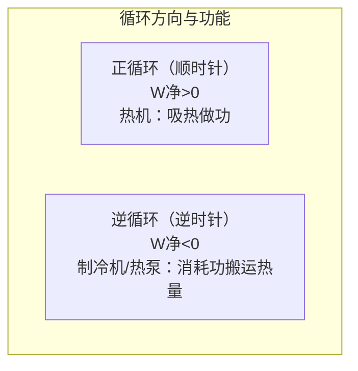
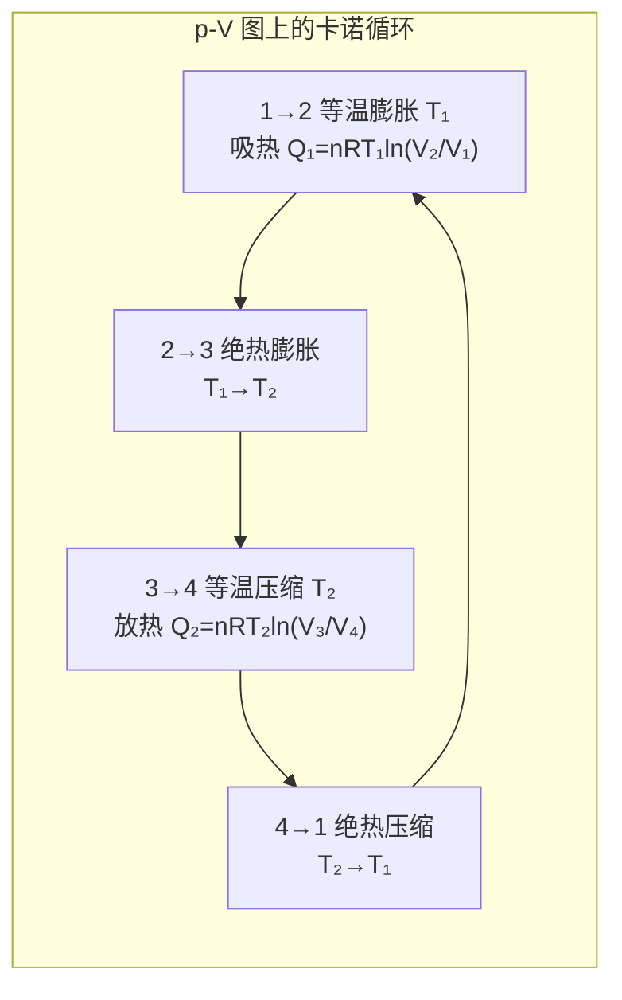

# 5.4 循环过程、卡诺循环

> [!info] 本节定位
> [[5.3 等值过程、绝热过程]] 研究的是单一过程的能量转换。但在工程实际中（蒸汽机、内燃机、空调、冰箱），工作物质要**反复循环工作**才能持续输出功或搬运热量。本节研究循环过程的能量转换效率，并给出**卡诺循环**这一理想可逆循环的效率上限 $\eta_C=1-\dfrac{T_2}{T_1}$，为 [[5.5 热力学第二定律]] 的卡诺定理做铺垫。
>
> 本节核心要解决三个问题：
> 1. **如何描述循环过程**——循环过程定义为系统经一系列状态变化回到初态，故 $\Delta U=0$；
> 2. **热机与制冷机的效率如何度量**——热机效率 $\eta=W/Q_1$，制冷系数 $\varepsilon=Q_2/W$；
> 3. **卡诺循环效率如何推导**——两个等温过程 + 两个绝热过程，导出 $\eta_C=1-T_2/T_1$。

## 一、循环过程

> [!definition] 循环过程
> 系统从某一初态出发，经历一系列中间状态后**又回到初态**的过程，称为**循环过程（cyclic process）**，简称循环。
>
> 性质：
> 1. **内能不变**：$\Delta U=0$（内能是状态函数，循环回到初态）；
> 2. 由 [[5.2 热力学第一定律]]：$Q_{\text{净}}=W_{\text{净}}$，即循环中系统吸收的净热量等于系统对外做的净功；
> 3. 在 $p\text{-}V$ 图上，准静态循环过程是一条**闭合曲线**。

### 正循环与逆循环

> [!definition] 正循环与逆循环
> - **正循环**：在 $p\text{-}V$ 图上沿**顺时针方向**进行的循环。系统在膨胀阶段（高压）做功大于压缩阶段（低压）被做功，**净功 $W_{\text{净}}>0$**，系统对外输出净功。正循环对应**热机**（heat engine）。
> - **逆循环**：在 $p\text{-}V$ 图上沿**逆时针方向**进行的循环。**净功 $W_{\text{净}}<0$**，外界对系统做净功。逆循环对应**制冷机**（refrigerator）或**热泵**（heat pump）。
>
> 净功的几何意义：$p\text{-}V$ 图上闭合曲线所包围的面积。顺时针为正，逆时针为负。

## 二、热机与制冷机

### 热机效率

> [!definition] 热机与热机效率
> **热机**：通过正循环持续把从高温热源吸收的热量的一部分转化为对外做功的装置。
>
> 设工作物质每次循环：
> - 从高温热源 $T_1$ 吸热 $Q_1>0$；
> - 向低温热源 $T_2$ 放热 $Q_2>0$（取绝对值，即系统放出 $-Q_2$）；
> - 对外做净功 $W=Q_1-Q_2>0$。
>
> **热机效率**：
> $$\boxed{\,\eta=\dfrac{W}{Q_1}=\dfrac{Q_1-Q_2}{Q_1}=1-\dfrac{Q_2}{Q_1}\,}$$
> $\eta$ 为无量纲数，常用百分比表示。

> [!note] 效率公式的关键点
> - $Q_1$ 是**总吸热**（多个吸热过程之和，正数）；
> - $Q_2$ 是**总放热的绝对值**（多个放热过程之和的绝对值，正数）；
> - $\eta<1$（除非 $Q_2=0$，但 [[5.5 热力学第二定律]] 告诉我们这不可能）。

### 制冷系数

> [!definition] 制冷机与制冷系数
> **制冷机**：通过逆循环消耗外界做功，把热量从低温热源搬到高温热源的装置。
>
> 设工作物质每次循环：
> - 从低温热源 $T_2$ 吸热 $Q_2>0$；
> - 向高温热源 $T_1$ 放热 $Q_1>0$（取绝对值）；
> - 外界对系统做净功 $W=Q_1-Q_2>0$（输入功）。
>
> **制冷系数**：
> $$\boxed{\,\varepsilon=\dfrac{Q_2}{W}=\dfrac{Q_2}{Q_1-Q_2}\,}$$
> $\varepsilon$ 可以大于 1（不像效率 $\eta\le 1$），因为目的是"用少量功搬运较多热量"。

> [!note] 热泵的性能系数
> 热泵与制冷机原理相同，但目的相反：把热量泵入高温热源（供暖）。性能系数 $COP=\dfrac{Q_1}{W}=\dfrac{Q_1}{Q_1-Q_2}=1+\varepsilon$。

## 三、卡诺循环

> [!definition] 卡诺循环
> **卡诺循环（Carnot cycle）** 是 1824 年法国工程师卡诺提出的理想循环，由两个**等温过程**和两个**绝热过程**交替组成，全部为准静态可逆过程。
>
> 四个过程（以正循环为例，工作物质为理想气体）：
>
> | 阶段 | 过程 | 状态变化 | 能量关系 |
> | ---- | ---- | ---- | ---- |
> | $1\to2$ | 等温膨胀 | $T_1$ 不变，$V_1\to V_2$（$V_2>V_1$） | 吸热 $Q_1=nRT_1\ln\dfrac{V_2}{V_1}$，做功 $W_{12}=Q_1$ |
> | $2\to3$ | 绝热膨胀 | $V_2\to V_3$，$T_1\to T_2$ | $Q=0$，$W_{23}=nC_V(T_1-T_2)$ |
> | $3\to4$ | 等温压缩 | $T_2$ 不变，$V_3\to V_4$（$V_4<V_3$） | 放热 $Q_2=nRT_2\ln\dfrac{V_3}{V_4}$，做负功 $W_{34}=-Q_2$ |
> | $4\to1$ | 绝热压缩 | $V_4\to V_1$，$T_2\to T_1$ | $Q=0$，$W_{41}=nC_V(T_2-T_1)$ |

### 卡诺循环效率推导

> [!proof] 卡诺效率 $\eta_C=1-\dfrac{T_2}{T_1}$
> 由 [[5.3 等值过程、绝热过程]]：
> - 等温膨胀吸热：$Q_1=nRT_1\ln\dfrac{V_2}{V_1}$
> - 等温压缩放热：$Q_2=nRT_2\ln\dfrac{V_3}{V_4}$
>
> 利用两个绝热过程方程：
> - 过程 2→3：$T_1V_2^{\gamma-1}=T_2V_3^{\gamma-1}$
> - 过程 4→1：$T_1V_1^{\gamma-1}=T_2V_4^{\gamma-1}$
>
> 两式相除：
> $$\dfrac{V_2^{\gamma-1}}{V_1^{\gamma-1}}=\dfrac{V_3^{\gamma-1}}{V_4^{\gamma-1}}\Rightarrow\dfrac{V_2}{V_1}=\dfrac{V_3}{V_4}$$
>
> 代入 $Q_1,Q_2$：
> $$\dfrac{Q_2}{Q_1}=\dfrac{nRT_2\ln(V_3/V_4)}{nRT_1\ln(V_2/V_1)}=\dfrac{T_2}{T_1}$$
>
> 故卡诺效率：
> $$\boxed{\,\eta_C=1-\dfrac{Q_2}{Q_1}=1-\dfrac{T_2}{T_1}\,}$$
> 其中 $T_1,T_2$ 必须用热力学温度 K。$\square$

### 卡诺逆循环（卡诺制冷机）

> [!theorem] 卡诺制冷系数
> 卡诺循环逆向运行（卡诺制冷机），制冷系数为：
> $$\boxed{\,\varepsilon_C=\dfrac{Q_2}{W}=\dfrac{T_2}{T_1-T_2}\,}$$
> $T_2$ 越低（与 $T_1$ 差越大），$\varepsilon_C$ 越小，制冷越难——这与生活经验一致（冷冻室温度越低，制冷耗电越多）。

## 四、卡诺定理

> [!theorem] 卡诺定理（Carnot's theorem）
> 工作于同样两个恒温热源 $T_1,T_2$ 之间的一切热机：
> 1. **可逆机效率最高**：所有可逆热机效率相等，都等于卡诺效率 $\eta_C=1-\dfrac{T_2}{T_1}$；
> 2. **不可逆机效率不超过可逆机**：$\eta\le\eta_C$，等号仅当可逆时成立。
>
> 卡诺定理的严格证明需借助 [[5.5 热力学第二定律]]（用克劳修斯表述或开尔文表述反证）。

> [!note] 卡诺定理的物理意义
> 1. 卡诺效率是工作于 $T_1,T_2$ 间任何热机效率的**上限**，提高效率的方向是提高 $T_1$、降低 $T_2$；
> 2. 实际热机由于摩擦、非准静态等因素为不可逆机，效率低于 $\eta_C$；
> 3. 卡诺循环指出了热机效率的理论极限，是热力学第二定律的先声。

## 五、典型例题

### 例题 1：卡诺热机效率

> [!example] 题目
> 一卡诺热机工作于 $T_1=500\,\text{K}$ 与 $T_2=300\,\text{K}$ 之间，每次循环吸热 $Q_1=2000\,\text{J}$。求：（1）热机效率；（2）每次循环对外做功；（3）放给低温热源的热量；（4）若将 $T_1$ 提高到 $600\,\text{K}$，效率提升多少？

**解**：
（1）$\eta_C=1-\dfrac{T_2}{T_1}=1-\dfrac{300}{500}=0.40=40\%$

（2）$W=\eta Q_1=0.40\times2000=800\,\text{J}$

（3）$Q_2=Q_1-W=2000-800=1200\,\text{J}$

（4）$\eta_C'=1-\dfrac{300}{600}=0.50=50\%$，效率提升 $10$ 个百分点（相对提升 $\dfrac{50-40}{40}=25\%$）。
说明提高高温热源温度是改善热机效率的有效途径。

**检验**：$\dfrac{Q_2}{Q_1}=\dfrac{T_2}{T_1}=\dfrac{300}{500}=0.6$，$1200/2000=0.6$ ✓

### 例题 2：奥托循环（汽油机近似）

> [!example] 题目
> 奥托循环是四冲程汽油机的理想化模型，由两个等容过程和两个绝热过程组成：$1\to2$ 绝热压缩，$2\to3$ 等容吸热（点火），$3\to4$ 绝热膨胀，$4\to1$ 等容放热（排气）。设工作物质为理想气体（$\gamma=1.40$），压缩比 $r=V_1/V_2=8$。求循环效率。

**解**：
- 过程 1→2（绝热压缩）：$Q=0$，$T_1V_1^{\gamma-1}=T_2V_2^{\gamma-1}\Rightarrow T_2=T_1 r^{\gamma-1}$
- 过程 2→3（等容吸热）：$Q_{23}=nC_V(T_3-T_2)>0$
- 过程 3→4（绝热膨胀）：$Q=0$，$T_3V_3^{\gamma-1}=T_4V_4^{\gamma-1}$，注意 $V_3=V_2$，$V_4=V_1$，故 $T_4=T_3(V_3/V_4)^{\gamma-1}=T_3/r^{\gamma-1}$
- 过程 4→1（等容放热）：$Q_{41}=nC_V(T_1-T_4)<0$，放热 $|Q_{41}|=nC_V(T_4-T_1)$

循环吸热 $Q_1=Q_{23}=nC_V(T_3-T_2)$，放热 $Q_2=|Q_{41}|=nC_V(T_4-T_1)$。

效率：
$$\eta=1-\dfrac{Q_2}{Q_1}=1-\dfrac{T_4-T_1}{T_3-T_2}$$

代入 $T_2=T_1 r^{\gamma-1}$，$T_4=T_3/r^{\gamma-1}$：
$$\dfrac{T_4-T_1}{T_3-T_2}=\dfrac{T_3/r^{\gamma-1}-T_1}{T_3-T_1 r^{\gamma-1}}=\dfrac{(T_3-T_1 r^{\gamma-1})/r^{\gamma-1}}{T_3-T_1 r^{\gamma-1}}=\dfrac{1}{r^{\gamma-1}}$$

故
$$\boxed{\,\eta=1-\dfrac{1}{r^{\gamma-1}}\,}$$

代入 $r=8$，$\gamma=1.40$，$\gamma-1=0.40$：
$$\eta=1-\dfrac{1}{8^{0.4}}=1-\dfrac{1}{2.297}=1-0.435=0.565=56.5\%$$

**注**：奥托循环效率仅取决于压缩比 $r$ 与 $\gamma$，与工作物质温度无关。提高压缩比可提升效率，但受汽油抗爆性限制（实际汽油机效率约 25%—30%，远低于此理论值）。

### 例题 3：卡诺制冷机

> [!example] 题目
> 一卡诺制冷机工作于冷冻室 $T_2=260\,\text{K}$ 与室温 $T_1=300\,\text{K}$ 之间。求：（1）制冷系数；（2）每消耗 $1\,\text{kJ}$ 电能可从冷冻室搬运多少热量到室温；（3）若将冷冻室降至 $T_2'=240\,\text{K}$，制冷系数变为多少？

**解**：
（1）$\varepsilon_C=\dfrac{T_2}{T_1-T_2}=\dfrac{260}{300-260}=\dfrac{260}{40}=6.5$

（2）$Q_2=\varepsilon_C W=6.5\times1000=6500\,\text{J}=6.5\,\text{kJ}$

（3）$\varepsilon_C'=\dfrac{240}{300-240}=\dfrac{240}{60}=4.0$

制冷系数从 $6.5$ 降至 $4.0$，下降约 $38\%$。说明冷冻室温度越低，搬运同等热量所需功越多——这就是低温实验耗能巨大的原因。

## 六、常见循环对照

> [!summary] 几种典型理想循环
>
> | 循环 | 组成 | 工作物质 | 效率公式 | 备注 |
> | ---- | ---- | ---- | ---- | ---- |
> | 卡诺循环 | 2 等温 + 2 绝热 | 理想气体 | $\eta_C=1-\dfrac{T_2}{T_1}$ | 可逆，效率最高 |
> | 奥托循环 | 2 等容 + 2 绝热 | 理想气体 | $\eta=1-\dfrac{1}{r^{\gamma-1}}$ | 汽油机近似 |
> | 狄塞尔循环 | 1 等容 + 1 等压 + 2 绝热 | 理想气体 | 介于奥托与卡诺之间 | 柴油机近似 |
> | 斯特林循环 | 2 等温 + 2 等容 | 理想气体 | 可逆时等于卡诺效率 | 带回热器 |

## 七、易错点

> [!warning] 易错点
> 1. **效率公式中 $Q_1,Q_2$ 是总吸热与总放热**：循环可能有多个吸热和放热过程，必须分别累加。$Q_1=\sum Q_{\text{吸}}>0$，$Q_2=\sum|Q_{\text{放}}|>0$。
> 2. **温度必须用 K**：$\eta_C=1-T_2/T_1$ 中 $T$ 为热力学温度，不能用摄氏度。
> 3. **卡诺效率仅取决于两热源温度**：与工作物质种类（理想气体与否）、循环形状无关（卡诺定理）。
> 4. **净功符号**：正循环 $W_{\text{净}}>0$（系统对外做功），逆循环 $W_{\text{净}}<0$（外界对系统做功）。在 $p\text{-}V$ 图上由循环方向（顺/逆时针）判定。
> 5. **制冷系数可大于 1**：$\varepsilon$ 不是效率，没有 $\le 1$ 限制。家用空调 $\varepsilon$ 可达 3—5。
> 6. **实际热机效率低于卡诺效率**：因摩擦、非准静态、散热等不可逆因素。卡诺效率是理论上限。
> 7. **奥托循环效率与温度无关**：$\eta=1-1/r^{\gamma-1}$ 仅依赖压缩比，这是奥托循环的特点，不要推广到其他循环。

## 八、与其他小节的联系

- 卡诺循环由 [[5.3 等值过程、绝热过程]] 中的等温与绝热过程组成；
- 卡诺定理的严格证明依赖 [[5.5 热力学第二定律]]；
- 卡诺效率 $\eta_C=1-T_2/T_1$ 给出热机效率上限，是 [[5.6 熵初步概念]] 中熵增原理的物理背景之一；
- 与 [[5.2 热力学第一定律]] 的联系：循环 $\Delta U=0\Rightarrow Q_{\text{净}}=W_{\text{净}}$ 是循环分析的基础；
- 本章 MOC：[[MOC - 第5章]]。

## 章节导航

- 上一级：[[MOC - 第5章]]
- 上一节：[[5.3 等值过程、绝热过程]]
- 下一节：[[5.5 热力学第二定律]]
- 习题：[[MOC - 第5章习题]]
