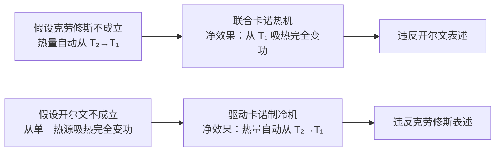

# 5.5 热力学第二定律

> [!info] 本节定位
> [[5.2 热力学第一定律]] 解决了"能量是否守恒"的问题，但仅满足能量守恒的过程**未必都能自发发生**。例如：热量不会自动从低温物体流向高温物体；气体不会自动收缩回容器一角；打碎的玻璃杯不会自动复原。这些过程都满足第一定律，但只能沿一个方向自发进行。
>
> 热力学第二定律正是刻画这种**过程的方向性**：它指出在自然界中，与热现象有关的自发过程都具有方向性、不可逆性。本节给出第二定律的两种经典表述（开尔文表述、克劳修斯表述），证明它们的等价性，并讨论可逆与不可逆过程，最后给出第二定律的统计意义。

## 一、第二类永动机

> [!definition] 第二类永动机
> **第二类永动机**：能从单一热源持续吸热，使之**完全变为功**而不产生其他效果的机器。
>
> 这类永动机**不违反**热力学第一定律（能量守恒），因为热量转化为等量功。例如设想从海水（单一热源）持续吸热做功而不需冷源——海水量巨大，能量近乎取之不尽。
>
> 但 [[5.4 循环过程、卡诺循环]] 的卡诺效率 $\eta_C=1-\dfrac{T_2}{T_1}<1$（$T_2\ne 0$），意味着热机必须向低温热源放热。第二类永动机要求 $\eta=1$（$Q_2=0$），实际不可能。这就是热力学第二定律要禁止的对象。

## 二、热力学第二定律的两种表述

### 开尔文表述

> [!theorem] 开尔文表述（Kelvin statement, 1851）
> **不可能从单一热源吸热，使之完全变为功而不产生其他效果**。
>
> 等价说法：**第二类永动机不可能造成**。
>
> 注解：
> - "单一热源"指温度均匀且恒定的热源；
> - "不产生其他效果"指除了吸热做功外没有其他变化（如工作物质回到初态、无热量传给其他物体）；
> - 若允许"产生其他效果"（如气体等温膨胀），从单一热源吸热完全变功是可能的——但工作物质状态变了（体积增大），不是循环过程。

> [!note] 开尔文表述的实质
> 开尔文表述指出：**热功转换具有方向性**。功可以自发地完全转化为热（如摩擦生热、电阻发热），但热不能自发地完全转化为功（除非留下其他变化）。这是热机效率必然小于 1 的根本原因。

### 克劳修斯表述

> [!theorem] 克劳修斯表述（Clausius statement, 1850）
> **热量不能自动地从低温物体传到高温物体**。
>
> 等价说法：**热量不可能自发地从低温传向高温而不引起其他变化**。
>
> 注解：
> - "自动地/自发地"指不需要外界做功或其他变化；
> - 制冷机确实能把热量从低温搬到高温，但需要消耗外界做功（[[5.4 循环过程、卡诺循环#制冷系数]]），不是"自动"的。

> [!note] 克劳修斯表述的实质
> 克劳修斯表述指出：**热传导具有方向性**。热量自动从高温流向低温，反过来需要付出代价（外界做功）。

## 三、两种表述的等价性

> [!theorem] 两种表述等价
> 开尔文表述与克劳修斯表述**逻辑等价**：若一种表述不成立，则另一种也不成立；反之亦然。

### 等价性证明（反证法）

> [!proof] 由克劳修斯不成立 $\Rightarrow$ 开尔文不成立
> 假设克劳修斯表述不成立，即热量 $Q_2$ 能自动从低温热源 $T_2$ 传到高温热源 $T_1$。设计如下循环：
> 1. 一卡诺热机工作于 $T_1,T_2$ 间，从 $T_1$ 吸热 $Q_1$，向 $T_2$ 放热 $Q_2$，对外做功 $W=Q_1-Q_2$；
> 2. 由假设，$Q_2$ 自动从 $T_2$ 回到 $T_1$。
>
> 净效果：从 $T_1$ 吸热 $Q_1-Q_2=W$，完全变为功 $W$，$T_2$ 无变化，$T_1$ 净失热 $Q_1-Q_2$。这违反开尔文表述（从单一热源 $T_1$ 吸热完全变功）。
>
> 故克劳修斯不成立 $\Rightarrow$ 开尔文不成立。$\square$

> [!proof] 由开尔文不成立 $\Rightarrow$ 克劳修斯不成立
> 假设开尔文表述不成立，即存在机器从单一热源 $T_1$ 吸热 $Q$ 完全变功 $W=Q$。用此功驱动卡诺制冷机工作于 $T_2,T_1$ 间：
> 1. 制冷机消耗功 $W=Q$，从 $T_2$ 吸热 $Q_2$，向 $T_1$ 放热 $Q_1=Q+Q_2$；
> 2. 同时原机器从 $T_1$ 吸热 $Q$。
>
> 净效果：从 $T_2$ 吸热 $Q_2$，向 $T_1$ 放热 $Q_2$（$Q$ 从 $T_1$ 出去又回到 $T_1$，抵消），即热量 $Q_2$ 自动从 $T_2$ 传到 $T_1$。这违反克劳修斯表述。
>
> 故开尔文不成立 $\Rightarrow$ 克劳修斯不成立。$\square$

两方向合起来，两表述等价。

## 四、可逆与不可逆过程

> [!definition] 可逆过程
> 系统从状态 $A$ 经某过程到达状态 $B$，若存在一过程使系统从 $B$ 回到 $A$ 且**消除原过程的一切影响**（系统与环境都恢复原状，无任何遗留变化），则原过程称为**可逆过程（reversible process）**。
>
> 可逆过程的条件：
> 1. **准静态**：过程中每时刻系统处于平衡态；
> 2. **无耗散**：无摩擦、无电阻、无磁滞等耗散因素。
>
> 理想气体无摩擦的准静态等温膨胀、卡诺循环等都是可逆过程。

> [!definition] 不可逆过程
> 不能用任何方法使系统与环境同时恢复原状的过程，称为**不可逆过程（irreversible process）**。
>
> 不可逆过程并非"不能反向进行"，而是反向进行时**必然留下其他变化**。

### 不可逆过程的典型例子

> [!summary] 不可逆过程举例
>
> | 不可逆过程 | 对应的第二定律表述 |
> | ---- | ---- |
> | 功变热（摩擦生热） | 开尔文表述 |
> | 热传导（高温→低温） | 克劳修斯表述 |
> | 气体自由膨胀 | 由开尔文或克劳修斯可证 |
> | 气体扩散（不同气体混合） | 由熵增原理（[[5.6 熵初步概念]]） |
> | 燃烧、化学反应 | 化学热力学不可逆 |
> | 生物生长、衰老 | 复杂不可逆过程 |
>
> 所有实际宏观过程都是不可逆过程。可逆过程是理想化模型。

> [!warning] 不可逆过程的"不可逆"含义
> 不可逆过程**不是**"时间不能倒流"的简单含义，而是指**系统与环境无法同时回到初态**。例如：气体自由膨胀后，可以用活塞将其压回原体积，但外界做了功、放出了热量，环境留下了变化。

## 五、热力学第二定律的统计意义

> [!theorem] 第二定律的统计表述
> 一个孤立系统内部发生的过程，总是从**热力学概率小的宏观态**向**热力学概率大的宏观态**进行。或者说：**孤立系统的自发过程总是沿着无序度增大的方向进行**。
>
> 这里"热力学概率"指某宏观态对应的微观状态数 $\Omega$（参见 [[5.6 熵初步概念#玻尔兹曼熵]]）。

### 气体自由膨胀的统计解释

> [!example] 气体自由膨胀的方向性
> 设容器被隔板分为两等分 $A,B$，初始时 $N$ 个气体分子全在 $A$ 中。抽去隔板后分子自由扩散。
>
> 每个分子独立地处于 $A$ 或 $B$，概率各 $1/2$。宏观态"全部分子在 $A$"对应微观态数 $\Omega_A=1$；"全部分子在 $B$"对应 $\Omega_B=1$；"均匀分布（$N/2$ 在 $A$，$N/2$ 在 $B$）"对应 $\Omega_{\text{均匀}}=\dbinom{N}{N/2}$，数量级约 $2^N/\sqrt{N}$。
>
> 对 $N\sim10^{23}$ 个分子，$\Omega_{\text{均匀}}/\Omega_A\sim2^{10^{23}}$，差距是天文数字。系统几乎必然从 $\Omega$ 小的态（集中在 $A$）演化到 $\Omega$ 大的态（均匀分布），反过来概率近乎零。
>
> 这就是自由膨胀不可逆的统计本质：**系统总是从概率极小的态向概率极大的态演化**。

### 玻尔兹曼熵的引入

> [!theorem] 玻尔兹曼熵公式
> 玻尔兹曼提出熵与微观状态数的对数关系：
> $$\boxed{\,S=k\ln\Omega\,}$$
> 其中 $k$ 为玻尔兹曼常数，$\Omega$ 为宏观态对应的微观状态数。
>
> 这把热力学第二定律定量化：孤立系统 $\Omega$ 增大 $\Rightarrow$ $S$ 增大 $\Rightarrow$ $\Delta S\ge0$（熵增原理，详见 [[5.6 熵初步概念]]）。

> [!note] 第二定律的层次
> 1. **宏观表述**：开尔文 / 克劳修斯表述——定性描述过程方向性；
> 2. **统计表述**：从 $\Omega$ 小到 $\Omega$ 大——微观本质；
> 3. **定量表述**：熵增原理 $\Delta S\ge0$——精确数学表达（[[5.6 熵初步概念]]）。
>
> 三者层层深入，构成完整的第二定律。

## 六、第二定律的实质与意义

> [!summary] 热力学第二定律的物理实质
> 1. **过程的方向性**：自然界中与热现象有关的过程都具有方向性，只能沿特定方向自发进行；
> 2. **能量的品质退化**：能量虽守恒，但其"可用性"不同。机械能可全部转化为热，但热不能全部转化为机械能——能量从高品质（有序）变为低品质（无序）是自发方向；
> 3. **不可逆性根源**：宏观不可逆性源于微观粒子运动的统计规律，是大数粒子系统的集体行为；
> 4. **时间箭头**：第二定律给出了"时间方向"——熵增方向就是时间流逝方向，这是物理学中少数显式出现时间箭头的定律。

## 七、典型例题

### 例题 1：判断过程是否违反第二定律

> [!example] 题目
> 判断下列设想是否违反热力学第一定律、第二定律：
> （1）一机器从海水吸热 $1000\,\text{J}$，对外做功 $1000\,\text{J}$，无其他变化；
> （2）一机器从海水吸热 $1000\,\text{J}$，对外做功 $800\,\text{J}$，向大气放热 $200\,\text{J}$；
> （3）热量自动从冰块传到周围温水使其更热。

**解**：
（1）能量守恒（$Q=W$）不违反第一定律；但"从单一热源（海水）吸热完全变功且无其他变化"违反**开尔文表述**，即违反第二定律。这是第二类永动机。

（2）能量守恒（$1000=800+200$）不违反第一定律；从海水（高温）吸热，部分做功，部分放给大气（低温），符合卡诺循环模式，不违反第二定律。这是正常热机。

（3）热量自动从冰块（低温）传到温水（高温），违反**克劳修斯表述**，即违反第二定律。第一定律对此无限制（仅要求能量守恒，热量传递量相等即可）。

### 例题 2：可逆与不可逆过程判别

> [!example] 题目
> 判断下列过程是否可逆，并说明理由：
> （1）无摩擦的准静态等温膨胀；
> （2）有摩擦的准静态等温膨胀；
> （3）气体向真空自由膨胀；
> （4）冰在 $0\,^{\circ}\text{C}$ 缓慢熔化为水（与 $0\,^{\circ}\text{C}$ 环境接触）。

**解**：
（1）**可逆**。准静态 + 无摩擦，满足可逆过程两条件。反向准静态等温压缩可使系统与环境同时恢复原状（吸热放热反向，做功反向）。

（2）**不可逆**。虽有准静态，但有摩擦耗散——摩擦做功转化为热散失，反向过程无法收回这部分热。耗散因素使过程不可逆。

（3）**不可逆**。自由膨胀非准静态（系统内各处压强不等），且即使压缩回去，外界需做功（产生热），环境留下变化。统计上是从 $\Omega$ 小到大，不可逆。

（4）**可逆**（理想情形）。$0\,^{\circ}\text{C}$ 是水的相变平衡温度，过程进行无限缓慢（准静态），无耗散，则可逆。冰缓慢吸热熔化为水，反向可缓慢放热凝固为冰，系统与环境恢复原状。实际相变若有温差或杂质则不可逆。

### 例题 3：从第二定律论证效率上限

> [!example] 题目
> 利用开尔文表述证明：工作于两恒温热源 $T_1>T_2$ 之间的任何热机效率 $\eta\le 1-\dfrac{T_2}{T_1}$。

**证明思路**（卡诺定理证明的核心）：

设有一可逆卡诺热机 $R$ 与一任意热机 $X$ 工作于相同 $T_1,T_2$ 之间，二者均从 $T_1$ 吸热 $Q_1$。设 $R$ 做功 $W_R$，$X$ 做功 $W_X$。

**反证**：假设 $X$ 效率高于 $R$，即 $\eta_X>\eta_R$，则 $W_X>W_R$，$X$ 放热 $Q_{2X}=Q_1-W_X<Q_{2R}=Q_1-W_R$。

将 $R$ 反向运行为制冷机（因 $R$ 可逆），用 $X$ 驱动 $R$：
- $X$ 从 $T_1$ 吸热 $Q_1$，做功 $W_X$，向 $T_2$ 放热 $Q_{2X}$；
- $R$ 消耗功 $W_R$（$<W_X$），从 $T_2$ 吸热 $Q_{2R}$，向 $T_1$ 放热 $Q_1$。

净效果：
- $T_1$：吸热 $Q_1$，放热 $Q_1$，无变化；
- $T_2$：放热 $Q_{2X}$，吸热 $Q_{2R}$，净吸热 $Q_{2R}-Q_{2X}>0$；
- 对外做净功 $W_X-W_R>0$。

即从单一热源 $T_2$ 吸热完全变功，违反开尔文表述。矛盾。

故 $\eta_X\le\eta_R=1-\dfrac{T_2}{T_1}$。$\square$

> [!note] 这就是卡诺定理的证明。它把热机效率上限归因于第二定律，是 [[5.4 循环过程、卡诺循环#卡诺定理]] 的理论依据。

## 八、易错点

> [!warning] 易错点
> 1. **第二定律不否定能量守恒**：违反第二定律的过程未必违反第一定律。第二类永动机满足第一定律但违反第二定律。
> 2. **"自动"二字很关键**：克劳修斯表述禁止"自动"传热，但制冷机用外界做功可以反向传热——这不违反第二定律。
> 3. **"不产生其他效果"**：开尔文表述允许从单一热源吸热完全变功，只要留下其他变化（如气体膨胀）。等温膨胀就是这样：$Q=W$，但气体体积变了。禁止的是"循环过程"中从单一热源吸热完全变功。
> 4. **可逆过程是理想化**：实际过程都有摩擦或非准静态因素，严格可逆过程不存在。但理论上研究可逆过程是建立效率上限的基础。
> 5. **不可逆过程不是"不能反向"**：可以用外界干预让过程反向（如压缩气体回原体积），但环境必然留下变化。
> 6. **两表述等价不意味着"同一句话"**：开尔文针对热功转换，克劳修斯针对热传导，但二者等价——任一不成立另一也不成立。
> 7. **统计意义下的"必然"是概率意义**：气体自动收缩回容器一角的概率极小但非零；对宏观系统（$N\sim10^{23}$）实际可视为零。

## 九、与其他小节的联系

- 第二定律的定量表达是 [[5.6 熵初步概念]] 的熵增原理 $\Delta S\ge0$；
- 卡诺定理（[[5.4 循环过程、卡诺循环#卡诺定理]]）的严格证明依赖第二定律；
- 与 [[5.2 热力学第一定律]] 形成对比：第一定律解决"能否"（能量守恒），第二定律解决"方向"（自发性）；
- 本章 MOC：[[MOC - 第5章]]。

## 章节导航

- 上一级：[[MOC - 第5章]]
- 上一节：[[5.4 循环过程、卡诺循环]]
- 下一节：[[5.6 熵初步概念]]
- 习题：[[MOC - 第5章习题]]
