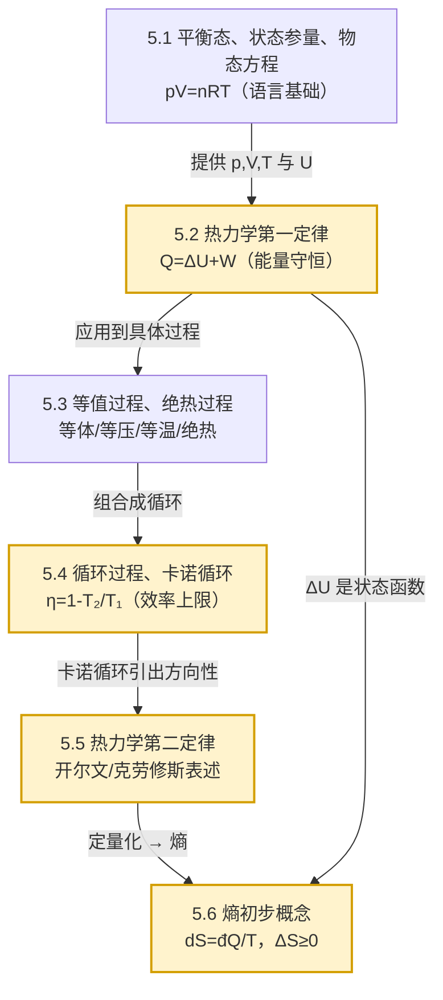

# MOC - 第5章 热力学基础

> [!info] 本章定位
> 第 1—4 章研究的是**个别或有限个质点（刚体）的机械运动**，所涉及的能量形式仅限机械能（动能与势能）。但当系统包含 $10^{23}$ 量级微观粒子、且关注温度、热量、相变等宏观现象时，牛顿力学不再适用，需要一套**基于宏观状态参量与统计思想的热力学理论**。
>
> 本章从**宏观唯象**角度建立热力学：以 [[5.1 平衡态、状态参量、理想气体物态方程]] 给出的平衡态和物态方程为出发点，用 [[5.2 热力学第一定律]] 把热量、功、内能纳入能量守恒框架；通过 [[5.3 等值过程、绝热过程]] 给出典型过程的能量转换关系；在 [[5.4 循环过程、卡诺循环]] 中研究热机效率并得到卡诺定理；最后 [[5.5 热力学第二定律]] 与 [[5.6 熵初步概念]] 指出**热现象的方向性**——并非所有能量守恒的过程都能自发发生，并用熵这一状态函数定量描述。
>
> 全章一条主线：**热力学第一定律解决"能否"（能量是否守恒），热力学第二定律解决"方向"（实际过程向哪边进行）**。前者是必要条件，后者才是判定过程自发性的核心。

## 学习路线图

- 入口：[[5.1 平衡态、状态参量、理想气体物态方程]]（先建立描述语言与理想气体模型）
- 主干：[[5.2 热力学第一定律]] $\to$ [[5.3 等值过程、绝热过程]] $\to$ [[5.4 循环过程、卡诺循环]]
- 进阶：[[5.5 热力学第二定律]] $\to$ [[5.6 熵初步概念]]
- 先修：[[MOC - 第3章]]（能量守恒思想是本章第一定律的力学背景）

## 知识点导航

| 小节 | 主题 | 核心公式 | 核心考点 | 链接 |
| ---- | ---- | -------- | -------- | ---- |
| 5.1 | 平衡态、状态参量、理想气体物态方程 | $pV=nRT$；$pV=NkT$ | 平衡态判据、状态参量选取、理想气体物态方程应用、微观模型三条假设 | [[5.1 平衡态、状态参量、理想气体物态方程]] |
| 5.2 | 热力学第一定律 | $Q=\Delta U+W$；$W=\int_{V_1}^{V_2}p\,dV$ | 准静态过程、功的几何意义（p-V 图面积）、内能是状态函数、符号规定 | [[5.2 热力学第一定律]] |
| 5.3 | 等值过程、绝热过程 | 等体 $Q=\Delta U=nC_V\Delta T$；等温 $Q=W=nRT\ln\dfrac{V_2}{V_1}$；绝热 $pV^{\gamma}=\text{const}$ | 四种过程 $W,Q,\Delta U$ 计算、迈耶公式 $C_p=C_V+R$、$\gamma=\dfrac{C_p}{C_V}$ | [[5.3 等值过程、绝热过程]] |
| 5.4 | 循环过程、卡诺循环 | $\eta=\dfrac{W}{Q_1}$；$\varepsilon=\dfrac{Q_2}{W}$；$\eta_C=1-\dfrac{T_2}{T_1}$ | 正逆循环判读、热机效率与制冷系数、卡诺循环四过程、卡诺效率推导 | [[5.4 循环过程、卡诺循环]] |
| 5.5 | 热力学第二定律 | 开尔文表述；克劳修斯表述 | 两表述等价性证明、可逆/不可逆过程判别、第二定律统计意义 | [[5.5 热力学第二定律]] |
| 5.6 | 熵初步概念 | $dS=\dfrac{đQ}{T}$；$\Delta S\ge 0$；$S=k\ln\Omega$ | 克劳修斯熵计算（沿可逆路径积分）、熵增原理、玻尔兹曼熵统计意义 | [[5.6 熵初步概念]] |

## 四种典型过程对照表

> [!summary] 理想气体等值与绝热过程（$n$ mol，定容摩尔热容 $C_V$）
>
> | 过程 | 特征 | $W$（系统对外做功） | $Q$（吸热） | $\Delta U$ | p-V 图特征 |
> | ---- | ---- | ---- | ---- | ---- | ---- |
> | 等体 | $V=\text{const}$，$dV=0$ | $0$ | $nC_V\Delta T$ | $nC_V\Delta T$ | 竖直线段 |
> | 等压 | $p=\text{const}$ | $p\Delta V=nR\Delta T$ | $nC_p\Delta T$ | $nC_V\Delta T$ | 水平线段 |
> | 等温 | $T=\text{const}$，$\Delta U=0$ | $nRT\ln\dfrac{V_2}{V_1}$ | $nRT\ln\dfrac{V_2}{V_1}$ | $0$ | 等轴双曲线 |
> | 绝热 | $Q=0$，$dQ=0$ | $-\Delta U=-nC_V\Delta T=\dfrac{p_1V_1-p_2V_2}{\gamma-1}$ | $0$ | $nC_V\Delta T$ | 比等温线更陡的曲线 $pV^{\gamma}=\text{const}$ |
>
> 符号约定：$W>0$ 表示系统对外做功（膨胀），$Q>0$ 表示系统吸热。详见 [[5.2 热力学第一定律#符号规定]]。

## 核心考点

1. **理想气体物态方程**：$pV=nRT$ 与 $pV=NkT$ 的相互换算，$R=8.31\,\text{J/(mol·K)}$、$k=1.38\times10^{-23}\,\text{J/K}$；不同状态下 $p,V,T$ 联立求解。见 [[5.1 平衡态、状态参量、理想气体物态方程]]。
2. **热力学第一定律应用**：识别 $Q,\Delta U,W$ 三者中何者已知、何者待求，正确代入符号；p-V 图上功的几何意义。见 [[5.2 热力学第一定律]]。
3. **四种过程计算**：等体、等压、等温、绝热过程的 $W,Q,\Delta U$ 公式必须熟记并能推导；迈耶公式 $C_p=C_V+R$ 与 $\gamma=\dfrac{C_p}{C_V}=\dfrac{i+2}{i}$（$i$ 为自由度）。见 [[5.3 等值过程、绝热过程]]。
4. **绝热过程方程**：$pV^{\gamma}=\text{const}$、$TV^{\gamma-1}=\text{const}$、$T^{\gamma}p^{1-\gamma}=\text{const}$ 三种形式灵活选用。
5. **循环效率与制冷系数**：$\eta=\dfrac{W}{Q_1}=1-\dfrac{Q_2}{Q_1}$（正循环）、$\varepsilon=\dfrac{Q_2}{W}=\dfrac{Q_2}{Q_1-Q_2}$（逆循环）；注意 $Q_1$ 为总吸热、$Q_2$ 为总放热（取绝对值）。见 [[5.4 循环过程、卡诺循环]]。
6. **卡诺循环**：由两个等温过程 + 两个绝热过程构成；卡诺效率 $\eta_C=1-\dfrac{T_2}{T_1}$（$T$ 必须用热力学温度 K）；卡诺定理指出工作于同样两个热源间的所有热机以可逆机效率最高。
7. **热力学第二定律两表述及等价性**：开尔文表述（第二类永动机不可能）、克劳修斯表述（热量不能自动从低温传到高温）；用反证法证明两表述等价。见 [[5.5 热力学第二定律]]。
8. **熵变计算**：对任意过程 $\Delta S=\int_{1}^{2}\dfrac{đQ}{T}$（沿**可逆路径**积分）；孤立系统 $\Delta S\ge 0$（熵增原理）；理想气体等温、等容、等压过程熵变公式；玻尔兹曼熵 $S=k\ln\Omega$ 的统计意义。见 [[5.6 熵初步概念]]。

## 自测题

> [!question]- 自测 1（物态方程）
> 一容器内装有氧气，温度 $t=27\,^{\circ}\text{C}$，压强 $p=1.0\times10^{5}\,\text{Pa}$，体积 $V=0.050\,\text{m}^{3}$。求氧气的物质的量与分子数（$R=8.31\,\text{J/(mol·K)}$，$N_A=6.02\times10^{23}\,\text{mol}^{-1}$）。
>
> > [!check]- 答案
> > $T=273+27=300\,\text{K}$。
> > $$n=\dfrac{pV}{RT}=\dfrac{1.0\times10^{5}\times0.050}{8.31\times300}=\dfrac{5000}{2493}\approx2.01\,\text{mol}$$
> > $$N=nN_A=2.01\times6.02\times10^{23}\approx1.21\times10^{24}$$
> > 单位检验：$\dfrac{\text{Pa·m}^{3}}{\text{J/(mol·K)·K}}=\dfrac{\text{J}}{\text{J/mol}}=\text{mol}$ ✓

> [!question]- 自测 2（热力学第一定律）
> 一定量理想气体从状态 $A(p_1,V_1)$ 经等压膨胀到 $B(p_1,V_2)$，再经等体降压到 $C(p_2,V_2)$，最后经等温压缩回到 $A$。已知 $p_1=2p_2$，$V_2=2V_1$，气体物质的量 $n=1\,\text{mol}$，$T_A=300\,\text{K}$，$C_V=\tfrac{5}{2}R$。求整个过程气体吸收的净热量。
>
> > [!check]- 答案
> > 由 $A$ 等压膨胀到 $B$：$T_B=\dfrac{p_1V_2}{nR}=\dfrac{p_1\cdot2V_1}{nR}=2T_A=600\,\text{K}$；
> > $B$ 等体降压到 $C$：$T_C=\dfrac{p_2V_2}{nR}=\dfrac{(p_1/2)\cdot2V_1}{nR}=T_A=300\,\text{K}$（即 $C$ 与 $A$ 等温）。
> > 整循环 $\Delta U=0$，故 $Q_{\text{净}}=W_{\text{净}}$（循环功等于 p-V 图包围面积）。
> > $W_{AB}=p_1(V_2-V_1)=2nRT_A\cdot\dfrac{V_2-V_1}{V_1}=nRT_A=1\times8.31\times300=2493\,\text{J}$
> > （由 $p_1V_1=nRT_A$，$p_1(V_2-V_1)=p_1V_1=nRT_A$）
> > $W_{BC}=0$（等体）；$W_{CA}=nRT_A\ln\dfrac{V_2}{V_1}=1\times8.31\times300\times\ln2=2493\times0.693=1728\,\text{J}$（等温压缩，系统对外做负功，取负号）：
> > $W_{CA}=-1728\,\text{J}$（系统被压缩，外界对系统做正功）
> > $$Q_{\text{净}}=W_{\text{净}}=W_{AB}+W_{CA}=2493-1728=765\,\text{J}$$
> > 系统净吸热 $765\,\text{J}$。

> [!question]- 自测 3（卡诺循环）
> 一卡诺热机工作于 $T_1=500\,\text{K}$ 高温热源与 $T_2=300\,\text{K}$ 低温热源之间，每次循环吸热 $Q_1=2000\,\text{J}$。求：（1）热机效率；（2）每次循环对外做功；（3）每次循环放给低温热源的热量。
>
> > [!check]- 答案
> > （1）$\eta_C=1-\dfrac{T_2}{T_1}=1-\dfrac{300}{500}=0.40=40\%$
> > （2）$W=\eta Q_1=0.40\times2000=800\,\text{J}$
> > （3）$Q_2=Q_1-W=2000-800=1200\,\text{J}$
> > 检验：$\dfrac{Q_2}{Q_1}=\dfrac{T_2}{T_1}=\dfrac{300}{500}=0.6$，$1200/2000=0.6$ ✓

> [!question]- 自测 4（熵变计算）
> $1\,\text{mol}$ 理想气体（$C_V=\tfrac{5}{2}R$）从初态 $(T_1=300\,\text{K},V_1=1.0\,\text{L})$ 自由膨胀到 $V_2=2.0\,\text{L}$。求气体熵变。若改经等温可逆膨胀达到同一末态，熵变又是多少？
>
> > [!check]- 答案
> > **自由膨胀**：理想气体自由膨胀 $T$ 不变（$\Delta U=0$，$W=0$，$Q=0$），过程不可逆，但熵是状态函数。设计一等温可逆路径连接同末态：
> > $$\Delta S=\int_{1}^{2}\dfrac{đQ}{T}=\dfrac{Q_{\text{可逆等温}}}{T}=nR\ln\dfrac{V_2}{V_1}=1\times8.31\times\ln2=8.31\times0.693=5.76\,\text{J/K}$$
> > **等温可逆膨胀**：连接相同初末态，熵变相同 $\Delta S=5.76\,\text{J/K}$。
> > 关键点：熵是状态函数，只与初末态有关；自由膨胀虽不可逆，但通过设计可逆路径仍可计算 $\Delta S$；对孤立系统，自由膨胀 $\Delta S>0$ 满足熵增原理。

## 易错点与注意事项

> [!warning] 常见错误
> 1. **温度必须用热力学温度 K**：物态方程、卡诺效率公式中 $T$ 一律为 K，不要混入摄氏度。$\Delta T$ 在 K 与 $^{\circ}\text{C}$ 下数值相同，但 $T$ 本身不同。
> 2. **符号规定一致性**：$W>0$ 表示系统对外做功（膨胀），$Q>0$ 表示系统吸热。若题目采用"外界对系统做功"约定，需相应反号。详见 [[5.2 热力学第一定律#符号规定]]。
> 3. **功的几何意义**：$W=\int p\,dV$ 在 p-V 图上等于过程曲线下方面积；循环过程净功等于闭合曲线包围面积（顺时针为正）。
> 4. **绝热过程方程的前提**：$pV^{\gamma}=\text{const}$ 仅适用于**理想气体准静态绝热过程**；非准静态或非理想气体不能用。
> 5. **循环效率公式中 $Q_1,Q_2$ 的含义**：$Q_1$ 是**总吸热**（多个吸热过程之和），$Q_2$ 是**总放热的绝对值**，不是单一过程的热量。
> 6. **熵变计算必须沿可逆路径**：对不可逆过程，必须设计连接同初末态的可逆路径来计算 $\Delta S$，不能直接用 $\int đQ/T$ 沿实际不可逆路径积分。
> 7. **热力学第二定律的统计意义**：孤立系统自发过程总是从热力学概率小的宏观态向热力学概率大的宏观态进行，并非"熵不能减小"对任何系统都成立——只对孤立系统成立。

## 章节导航

- 上一级：[[MOC - 大学物理B]]
- 先修章节：[[MOC - 第3章]]（能量守恒是热力学第一定律的推广基础）
- 上一章：[[MOC - 第4章]]
- 下一章：[[MOC - 第6章]]
- 习题：[[MOC - 第5章习题]]

## 相关标签

#大学物理 #热学 #理想气体 #热力学第一定律 #卡诺循环 #热力学第二定律 #熵
