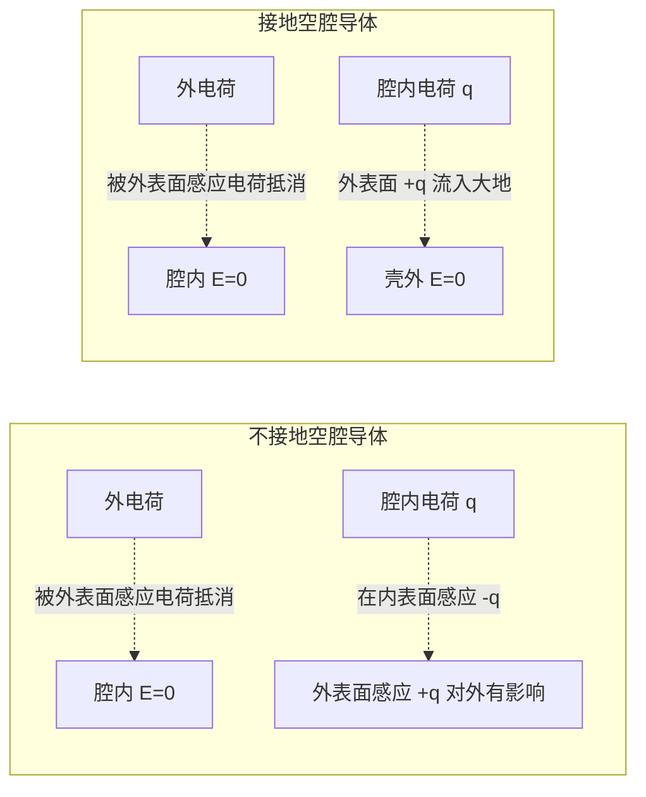

# 6.6 静电场中的导体与电介质

> [!info] 本节定位
> 本节是 [[MOC - 第6章]] 的应用与综合篇，把前五节建立的"真空静电场"理论推广到**物质与电场共存**的情形。物质按电导特性分为**导体**（含大量自由电荷）与**电介质**（束缚电荷），它们对外加电场的响应截然不同：导体通过自由电荷重新分布达到**静电平衡**（内部 $\vec E=0$），电介质通过束缚电荷微位移产生**极化**（内部 $\vec E$ 减弱但不为零）。由此引入**电位移** $\vec D$、**电容** $C$、**电场能量密度** $w$ 等工程上极其重要的概念，是后续电路课程（[[MOC - 电路与模拟电子技术]]）中电容器、储能元件的物理基础。本节解决的核心问题是：**导体与电介质如何改变外加电场分布**，以及**如何描述与计算电容和电场储能**。

## 一、静电场中的导体

### 1. 静电平衡条件

> [!definition] 导体的静电平衡
> 导体内部及表面没有电荷的**宏观定向运动**的状态称为静电平衡。
>
> **充要条件**：导体内部电场强度处处为零，即
> $$\vec E_{内}=\vec 0.$$
> - 包括外加电场与导体感应电荷产生的电场之矢量和；
> - 若 $\vec E_{内}\ne\vec 0$，自由电荷将受电场力继续运动，未达平衡。

> [!proof] 由导体特性推出
> 导体含大量自由电子（金属中约 $10^{29}\,\mathrm{m^{-3}}$）。若 $\vec E_{内}\ne\vec 0$，自由电子受力 $\vec F=-e\vec E$ 而定向漂移，破坏"静电"状态。故静电平衡时必有 $\vec E_{内}=\vec 0$。$\square$

### 2. 静电平衡导体的性质

> [!theorem] 静电平衡导体的性质
> 由 $\vec E_{内}=0$ 与 [[6.4 静电场环路定理、电势]] 的环路定理可推出：
>
> 1. **导体是等势体**：导体内任取两点 $A,B$，$V_A-V_B=\int_A^B\vec E\cdot d\vec l=0$，故 $V_A=V_B$。导体表面也是等势面。
> 2. **导体内净电荷为零，电荷只分布在表面**：在导体内任取闭合面（高斯面），由 [[6.3 高斯定理]] $\oint\vec E\cdot d\vec S=0=Q_{内}/\varepsilon_0$，故 $Q_{内}=0$。导体内任意区域净电荷为零，电荷只能分布在表面。
> 3. **导体表面电场垂直于表面**：若 $\vec E$ 有切向分量 $E_t$，沿表面取一微小环路 $L$，$\oint\vec E\cdot d\vec l\approx E_t\cdot\Delta l\ne 0$，与环路定理矛盾。故 $E_t=0$，$\vec E$ 沿外法线方向。
> 4. **导体表面电场大小与表面电荷密度成正比**：取穿过表面的"药盒"高斯面（一面在导体内 $E=0$，一面在外 $E$），由高斯定理：
>    $$E\cdot dS=\frac{\sigma\,dS}{\varepsilon_0}\Rightarrow \boxed{\;E=\frac{\sigma}{\varepsilon_0}\;}.$$
>    方向沿外法线（$\sigma>0$）或内法线（$\sigma<0$）。

> [!warning] 表面电场 $E=\sigma/\varepsilon_0$ 与无限大平面 $\sigma/(2\varepsilon_0)$ 的差别
> 无限大平面是"两侧均有电场 $\sigma/(2\varepsilon_0)$"，而导体表面是"外侧 $\sigma/\varepsilon_0$、内侧 $0$"。差别源于导体内部 $\vec E=0$ 这一条件——导体表面电荷产生的电场被外加电场（来自其他电荷或导体其他部分）在内部恰好抵消。两者并非矛盾，是不同几何条件下的不同结果。

### 3. 尖端放电

> [!info] 电荷在表面的分布
> 实验与理论均表明，孤立导体的电荷分布与曲率有关：**曲率越大（尖端）处 $\sigma$ 越大，曲率越小（平坦）处 $\sigma$ 越小**。由 $E=\sigma/\varepsilon_0$，尖端附近电场特别强，可击穿周围空气产生放电——即**尖端放电**。避雷针利用此原理将云中电荷导入大地；高压设备则避免尖锐边缘以防电晕损失。

### 4. 静电屏蔽

> [!theorem] 静电屏蔽
> **空腔导体**（不论接地与否）能屏蔽外电场对腔内的影响：
> - **导体壳外有电荷**：壳外电荷在壳外表面感应出电荷分布，外表面电荷 + 外电荷共同在腔内产生的电场为零。**腔内 $\vec E=0$**（与外电场无关）。
> - **腔内有电荷 $q$**：$q$ 在壳内表面感应出 $-q$，在壳外表面感应出 $+q$。若壳不接地，外表面的 $+q$ 会在壳外产生电场，**对外场有影响**；若壳**接地**，外表面电荷流入大地，**壳外 $\vec E=0$**（与腔内电荷无关）。
>
> 综上：
> - **未接地空腔导体**：屏蔽外场对腔内的影响（单向屏蔽）；
> - **接地空腔导体**：双向屏蔽（既屏蔽外场对腔内，也屏蔽腔内对外场）。

> [!example] 例1：球形导体壳的感应电荷
> 不带电的金属球壳（内半径 $R_1$，外半径 $R_2$）球心处放点电荷 $+q$。求球壳内、外表面感应电荷及各区域电场、球壳电势。
>
> **(1) 感应电荷**：在导体壳内取高斯面（$R_1<r<R_2$），$\vec E=0$ ⇒ $Q_{内}=0$ ⇒ 内表面感应 $-q$。球壳总电荷为零，故外表面 $+q$。
>
> **(2) 各区域电场**：
> - $r<R_1$（腔内）：$E=kq/r^2$（仅由 $+q$ 产生，内表面 $-q$ 在腔内不产生电场——球壳定理）；
> - $R_1<r<R_2$（导体内）：$E=0$；
> - $r>R_2$（壳外）：$E=kq/r^2$（等效球心点电荷 $q$）。
>
> **(3) 球壳电势**（取无穷远为零势，球壳是等势体，取 $r=R_2$）：
> $$V_{\text{壳}}=\int_{R_2}^{\infty}E\,dr=\int_{R_2}^{\infty}\frac{kq}{r^2}\,dr=\frac{kq}{R_2}.$$
> 也可分段叠加：球心 $+q$ 贡献 $kq/R_2$、内表面 $-q$ 贡献 $-kq/R_2$、外表面 $+q$ 贡献 $kq/R_2$，总和 $kq/R_2$ ✓。
>
> **(4) 若球壳接地**：外表面电荷流入大地，壳外 $E=0$，球壳电势 $V=0$（与大地同势）；腔内 $E$ 不变（仍是 $kq/r^2$），但腔内电势整体下降 $kq/R_2$。
>
> **检验**：接地后腔内电势 $V(r)=kq/r-kq/R_1$（取壳层为参考），$r=R_1$ 处 $V=0$ ✓。

## 二、静电场中的电介质

### 1. 电介质的极化

> [!definition] 电介质
> **电介质**（绝缘体）中无自由电荷，所有电荷被束缚在分子或原子范围内。在外加电场作用下，束缚电荷发生微小位移或转向，产生**极化电荷**（束缚电荷），从而在介质内部产生反向附加电场，削弱外加电场。
>
> 极化机制有两类：
> - **位移极化**（电子位移极化）：原子的电子云相对原子核位移，产生电偶极矩。所有电介质都有此机制，响应极快（$\sim 10^{-15}\,\mathrm s$）。
> - **取向极化**（偶极子取向极化）：极性分子（如 $\mathrm{H_2O, HCl, NH_3}$）有固有电偶极矩，外加电场使其转向沿场方向排列。响应较慢（$\sim 10^{-10}\,\mathrm s$），且受热运动干扰。

> [!info] 极化电荷与自由电荷的区别
> - **自由电荷**：可在导体中宏观移动的电荷（金属自由电子、电解液离子等）；
> - **极化电荷**（束缚电荷）：电介质中由于极化产生的、不能宏观移动的电荷。极化电荷只能附着在介质表面或内部不均匀处，不能脱离介质。

### 2. 极化强度

> [!definition] 极化强度
> 电介质中某点附近单位体积内分子电偶极矩的矢量和称为**极化强度** $\vec P$：
> $$\vec P=\lim_{\Delta V\to 0}\frac{\sum_i\vec p_i}{\Delta V}.$$
> - **单位**：$\mathrm{C/m^2}$（与面电荷密度同量纲）；
> - **方向**：矢量，指向电偶极矩平均方向（即外场方向）；
> - **物理意义**：描述介质极化的程度。

> [!theorem] 极化电荷与极化强度的关系
> 1. **极化电荷面密度**（介质表面）：
>    $$\sigma_p=\vec P\cdot\hat n$$
>    其中 $\hat n$ 为介质表面外法线单位矢量。
> 2. **极化电荷体密度**（介质内部不均匀处）：
>    $$\rho_p=-\nabla\cdot\vec P.$$
> 3. **穿过闭合面的 $\vec P$ 通量**等于面内极化电荷的负值：
>    $$\oint_S\vec P\cdot d\vec S=-Q_p.$$

### 3. 电位移与有电介质时的高斯定理

为避免极化电荷带来的复杂性，引入辅助矢量 $\vec D$：

> [!definition] 电位移
> $$\boxed{\;\vec D=\varepsilon_0\vec E+\vec P\;}$$
> - **单位**：$\mathrm{C/m^2}$；
> - **物理意义**：把"自由电荷产生的电场"与"极化电荷产生的电场"分开描述的辅助量；
> - 对**线性各向同性**电介质，实验表明 $\vec P=\varepsilon_0\chi_e\vec E$（$\chi_e$ 为电极化率，无量纲），故
>   $$\vec D=\varepsilon_0(1+\chi_e)\vec E=\varepsilon_0\varepsilon_r\vec E=\varepsilon\vec E,$$
>   其中 $\varepsilon_r=1+\chi_e$ 为**相对介电常数**（无量纲），$\varepsilon=\varepsilon_0\varepsilon_r$ 为**介电常数**（$\mathrm{F/m}$）。

> [!theorem] 有电介质时的高斯定理
> $$\boxed{\;\oint_S\vec D\cdot d\vec S=Q_{自由}=\sum_{i\in内,自由}q_i\;}$$
> 即穿过任意闭合曲面的 $\vec D$ 通量等于面内**自由电荷**代数和（不含极化电荷）。
> - 与 [[6.3 高斯定理]] $\oint\vec E\cdot d\vec S=Q_{总}/\varepsilon_0$（含所有电荷）等价，但工程上更便利（自由电荷已知，极化电荷未知）；
> - **微分形式**：$\nabla\cdot\vec D=\rho_{自由}$；
> - 适用条件：普遍成立；但用 $\vec D=\varepsilon\vec E$ 反求 $\vec E$ 时需介质是线性各向同性。

> [!proof] 由 $\vec E$ 的高斯定理导出
> [[6.3 高斯定理]] 普适形式 $\oint\vec E\cdot d\vec S=(Q_{自由}+Q_{极化})/\varepsilon_0$。又 $\oint\vec P\cdot d\vec S=-Q_{极化}$（极化电荷关系3）。两式相加：
> $$\oint(\varepsilon_0\vec E+\vec P)\cdot d\vec S=Q_{自由}\Rightarrow \oint\vec D\cdot d\vec S=Q_{自由}.\ \square$$

> [!example] 例2：电介质球壳中的电场
> 点电荷 $+q$ 被一同心电介质球壳（内半径 $R_1$、外半径 $R_2$、相对介电常数 $\varepsilon_r$）包围。求各区域 $\vec E$ 与 $\vec D$。
>
> **分析**：球对称，$\vec D,\vec E$ 均沿径向。取同心球面为高斯面，由 $\vec D$ 的高斯定理（面内自由电荷始终为 $q$）：
> - 任意 $r$：$D\cdot 4\pi r^2=q$ ⇒ $D=\dfrac{q}{4\pi r^2}=\dfrac{kq}{r^2}\varepsilon_0$。
>
> **由 $\vec D=\varepsilon\vec E$ 分段求 $\vec E$**：
> - 真空区 $r<R_1$ 或 $r>R_2$：$\varepsilon=\varepsilon_0$，$E=D/\varepsilon_0=kq/r^2$；
> - 介质区 $R_1<r<R_2$：$\varepsilon=\varepsilon_0\varepsilon_r$，$E=D/\varepsilon=\dfrac{kq}{\varepsilon_r r^2}$。
>
> 介质内电场减弱为真空值的 $1/\varepsilon_r$ 倍——这是极化电荷反向附加电场的结果。
>
> **检验**：$r=R_1$ 与 $r=R_2$ 处 $\vec D$ 连续（无自由面电荷），$\vec E$ 有突变（极化面电荷使切向连续、法向突变）✓。

## 三、电容与电容器

### 1. 孤立导体的电容

> [!definition] 孤立导体的电容
> 孤立导体所带电荷 $Q$ 与其电势 $V$（取无穷远为零势）之比称为**电容**：
> $$C=\frac{Q}{V}.$$
> - **单位**：法拉 $\mathrm F=\mathrm{C/V}$；
> - **物理意义**：使导体升高单位电势所需电荷；
> - **只依赖导体的几何形状与周围介质**，与电荷量、电势无关。

> [!example] 孤立球形导体的电容
> 半径 $R$ 的孤立导体球（真空），带电 $Q$ 时 $V=kQ/R$，故
> $$C=\frac{Q}{V}=\frac{R}{k}=4\pi\varepsilon_0 R.$$
> 地球（$R\approx 6.4\times10^6\,\mathrm m$）作为孤立导体球，$C\approx 7.1\times10^{-4}\,\mathrm F$，不足 $1\,\mathrm{mF}$——可见 $\mathrm F$ 是极大的单位，常用 $\mu\mathrm F=10^{-6}\mathrm F$、$\mathrm{pF}=10^{-12}\mathrm F$。

### 2. 电容器的电容

> [!definition] 电容器
> **电容器**由两个相互绝缘的导体（极板）组成。当两极板带等量异号电荷 $\pm Q$ 时，两板间电势差 $U=V_+-V_-$。电容器的电容定义为
> $$\boxed{\;C=\frac{Q}{U}\;}$$
> - 单位 $\mathrm F$；
> - 几何形状与介质决定；
> - 工程上常用平行板、圆柱形、球形电容器。

> [!example] 例3：三种典型电容器
> **(1) 平行板电容器**（极板面积 $S$，板间距 $d$，板间介质 $\varepsilon_r$）：
> 由 [[6.3 高斯定理]] 板间电场 $E=\sigma/(\varepsilon_0\varepsilon_r)=Q/(S\varepsilon)$，电压 $U=Ed=Qd/(S\varepsilon)$，
> $$\boxed{\;C=\frac{\varepsilon_0\varepsilon_r S}{d}\;}$$
> **(2) 圆柱形电容器**（内半径 $R_1$，外半径 $R_2$，长 $L\gg R_2$，介质 $\varepsilon_r$）：
> 由 [[6.3 高斯定理]] 轴对称电场 $E=\lambda/(2\pi\varepsilon r)=Q/(2\pi\varepsilon L r)$（$R_1<r<R_2$），
> $$U=\int_{R_1}^{R_2}E\,dr=\frac{Q}{2\pi\varepsilon L}\ln\frac{R_2}{R_1},$$
> $$\boxed{\;C=\frac{2\pi\varepsilon_0\varepsilon_r L}{\ln(R_2/R_1)}\;}$$
> **(3) 球形电容器**（内半径 $R_1$，外半径 $R_2$，介质 $\varepsilon_r$）：
> 球对称电场 $E=Q/(4\pi\varepsilon r^2)$，
> $$U=\int_{R_1}^{R_2}E\,dr=\frac{Q}{4\pi\varepsilon}\left(\frac{1}{R_1}-\frac{1}{R_2}\right),$$
> $$\boxed{\;C=\frac{4\pi\varepsilon_0\varepsilon_r R_1R_2}{R_2-R_1}\;}$$
> $R_2\to\infty$ 时退化为孤立球电容 $C=4\pi\varepsilon_0\varepsilon_r R_1$ ✓。

### 3. 电容器的串并联

> [!theorem] 电容器串联
> $n$ 个电容器串联（前一个负极接后一个正极），总电容 $C$ 满足：
> $$\boxed{\;\frac{1}{C}=\sum_{i=1}^n\frac{1}{C_i}\;}$$
> - 每个电容器带相同电荷 $Q$；
> - 总电压等于各电容器电压之和 $U=\sum U_i$；
> - 串联后总电容**小于**任一分电容（增大耐压能力）。

> [!theorem] 电容器并联
> $n$ 个电容器并联（所有正极相连、负极相连），总电容：
> $$\boxed{\;C=\sum_{i=1}^n C_i\;}$$
> - 每个电容器电压相同 $U$；
> - 总电荷等于各电容器电荷之和 $Q=\sum Q_i$；
> - 并联后总电容**大于**任一分电容（增大储能能力）。

## 四、电场能量

### 1. 电容器储能

> [!theorem] 电容器储能公式
> 电容器充电至电荷 $Q$、电压 $U$ 时储存的电能：
> $$\boxed{\;W=\frac{1}{2}\frac{Q^2}{C}=\frac{1}{2}CU^2=\frac{1}{2}QU\;}$$
> - **单位**：$\mathrm J$；
> - 推导：充电过程中电源克服已有电荷的排斥做功 $dW=U\,dQ=Q\,dQ/C$，积分 $W=\int_0^Q\dfrac{Q'\,dQ'}{C}=\dfrac{Q^2}{2C}$。

### 2. 电场能量密度

> [!theorem] 电场能量密度
> 电场能量**分布在整个电场中**，单位体积内的电能（能量密度）：
> $$\boxed{\;w=\frac{1}{2}\vec D\cdot\vec E=\frac{1}{2}\varepsilon E^2\;}$$
> - **单位**：$\mathrm{J/m^3}$；
> - 真空中 $\varepsilon=\varepsilon_0$，$w=\dfrac12\varepsilon_0 E^2$；
> - 总电能 $W=\int_V w\,dV$，在电场存在的整个区域积分。

> [!proof] 由平行板电容器验证
> 平行板电容器 $C=\varepsilon S/d$，电压 $U=Ed$。储能公式：
> $$W=\frac{1}{2}CU^2=\frac{1}{2}\cdot\frac{\varepsilon S}{d}\cdot E^2 d^2=\frac{1}{2}\varepsilon E^2\cdot Sd.$$
> 板间体积 $V=Sd$，故 $w=W/V=\dfrac12\varepsilon E^2$ ✓。这一论证虽用平行板特例，但能量密度公式**普适**（理论上可由麦克斯韦方程组 + 洛伦兹力做功导出）。

> [!info] 电场能量的物理图像
> 电场能量**存储在场中**而非电荷上——这一观点是[[MOC - 第6章]]场论思想的延续，也是 [[MOC - 第8章]] 电磁波能传播能量的物理基础（电磁波携带能量穿过空间）。在静电场中能量看似"集中在电荷附近"，但本质是电场能量的局部化分布。

> [!example] 例4：球形电容器储能
> 球形电容器（内 $R_1$、外 $R_2$，电荷 $\pm Q$，真空）。求：(1) 用储能公式；(2) 用能量密度积分——并比较。
>
> **(1) 储能公式**：$C=\dfrac{4\pi\varepsilon_0 R_1R_2}{R_2-R_1}$，$W=\dfrac{Q^2}{2C}=\dfrac{Q^2(R_2-R_1)}{8\pi\varepsilon_0 R_1R_2}$。
>
> **(2) 能量密度积分**：球间电场 $E=Q/(4\pi\varepsilon_0 r^2)$（$R_1<r<R_2$），$w=\dfrac12\varepsilon_0 E^2=\dfrac{Q^2}{32\pi^2\varepsilon_0 r^4}$。
> 取球壳体积元 $dV=4\pi r^2\,dr$：
> $$W=\int_{R_1}^{R_2}w\,dV=\int_{R_1}^{R_2}\frac{Q^2}{32\pi^2\varepsilon_0 r^4}\cdot 4\pi r^2\,dr=\frac{Q^2}{8\pi\varepsilon_0}\int_{R_1}^{R_2}\frac{dr}{r^2}.$$
> $$W=\frac{Q^2}{8\pi\varepsilon_0}\left[-\frac{1}{r}\right]_{R_1}^{R_2}=\frac{Q^2}{8\pi\varepsilon_0}\left(\frac{1}{R_1}-\frac{1}{R_2}\right)=\frac{Q^2(R_2-R_1)}{8\pi\varepsilon_0 R_1R_2}.$$
> 两种方法结果一致 ✓。
>
> **极限**：$R_2\to\infty$（孤立球），$W\to\dfrac{Q^2}{8\pi\varepsilon_0 R_1}=\dfrac{Q^2}{2C_{孤立}}$ ✓。能量密度积分在无穷远收敛（因 $w\propto 1/r^4$，$dV\propto r^2$，$w\,dV\propto 1/r^2$ 可积）。

## 五、典型例题综合

> [!example] 例5：插入介质板后的平行板电容器
> 平行板电容器（极板面积 $S$、间距 $d$、电压 $U$），将厚度 $t<d$、相对介电常数 $\varepsilon_r$ 的电介质板平行插入板间，紧贴一极板。求：(1) 电容；(2) 介质板内、外电场；(3) 储能。
>
> **(1) 电容**：板间电场分为两段——介质段（厚度 $t$，电场 $E_1$）与真空段（厚度 $d-t$，电场 $E_2$）。$\vec D$ 在两段连续（无自由面电荷），$D=\varepsilon_0\varepsilon_r E_1=\varepsilon_0 E_2$，故 $E_1=E_2/\varepsilon_r$。
> 电压 $U=E_1 t+E_2(d-t)=E_2\left(\dfrac{t}{\varepsilon_r}+d-t\right)=E_2\cdot\dfrac{d+(\varepsilon_r-1)(d-t)/\varepsilon_r}{1}$，简化：
> $$U=\frac{D}{\varepsilon_0}\left(\frac{t}{\varepsilon_r}+d-t\right).$$
> 极板电荷 $Q=\sigma S=D\cdot S$（$\sigma$ 为自由电荷面密度）。故
> $$C=\frac{Q}{U}=\frac{\varepsilon_0 S}{\dfrac{t}{\varepsilon_r}+d-t}=\frac{\varepsilon_0\varepsilon_r S}{\varepsilon_r d-(\varepsilon_r-1)t}.$$
> **(2) 电场**：$D=Q/S$，$E_1=Q/(\varepsilon_0\varepsilon_r S)$，$E_2=Q/(\varepsilon_0 S)$。介质内电场减弱为真空的 $1/\varepsilon_r$。
> **(3) 储能**：$W=\dfrac12 CU^2=\dfrac{\varepsilon_0\varepsilon_r S U^2}{2[\varepsilon_r d-(\varepsilon_r-1)t]}$。介质插入越深（$t$ 越大），$C$ 越大，储能越多（恒压下电源持续做功）。
>
> **检验**：$t=0$（无介质）$C=\varepsilon_0 S/d$ ✓；$t=d$（介质填满）$C=\varepsilon_0\varepsilon_r S/d$ ✓。

> [!example] 例6：介质对电容器储能的影响（恒电荷 vs 恒电压）
> 平行板电容器（$C_0=\varepsilon_0 S/d$）已充电至电荷 $Q_0$、电压 $U_0=Q_0/C_0$。在**断开电源**情况下插入 $\varepsilon_r$ 的介质填满板间，求电容、电压、储能变化。若不断开电源保持 $U_0$ 不变呢？
>
> **情形A（断开电源，恒电荷）**：$Q$ 不变，$C=\varepsilon_r C_0$，$U=Q/C=U_0/\varepsilon_r$（电压下降），$W=Q^2/(2C)=W_0/\varepsilon_r$（储能减少，差额用于介质极化做功）。
>
> **情形B（接电源，恒电压）**：$U$ 不变，$C=\varepsilon_r C_0$，$Q=CU=\varepsilon_r Q_0$（电荷增加），$W=\dfrac12 CU^2=\varepsilon_r W_0$（储能增加）。电源额外做功 $\Delta W_{电源}=U\Delta Q=U_0(\varepsilon_r-1)Q_0=2(\varepsilon_r-1)W_0$；其中 $(\varepsilon_r-1)W_0$ 用于介质极化，$(\varepsilon_r-1)W_0$ 增加电容器储能——能量守恒。
>
> **结论**：同一介质插入，恒电荷下储能减少，恒电压下储能增加——条件不同结论相反，是常见考点。

## 六、与其他章节的关联

- 上游：[[6.3 高斯定理]] 提供导体静电平衡与电介质中 $\vec D$ 高斯定理的基础；[[6.4 静电场环路定理、电势]] 提供等势体与电压概念；[[6.5 电场强度与电势梯度]] 提供 $\vec E=-\nabla V$ 在导体表面的应用。
- 同章：本节是 [[MOC - 第6章]] 的综合应用，整合前五节所有概念。
- 跨章：[[MOC - 第7章]] 中磁介质极化（磁化强度 $\vec M$、磁场强度 $\vec H$）与本节 $\vec P,\vec D$ 完全平行；[[MOC - 第8章]] 麦克斯韦方程组中 $\nabla\cdot\vec D=\rho_{自由}$ 是其推广形式。
- 工程应用：[[MOC - 电路与模拟电子技术]] 中电容器是基本电路元件，其 $C$ 值、储能、耐压均依赖本节；电介质击穿、铁电体、压电体等是材料科学的基础。

## 章节导航

- 返回：[[MOC - 第6章]]
- 上一节：[[6.5 电场强度与电势梯度]]
- 下一章：[[MOC - 第7章]]（恒定磁场，把"场 + 物质"框架推广到磁场，引入磁化强度与磁场强度）
- 习题：[[MOC - 第6章习题]]

#大学物理 #电磁学 #静电场 #导体 #电介质 #极化 #电容 #电场能量
