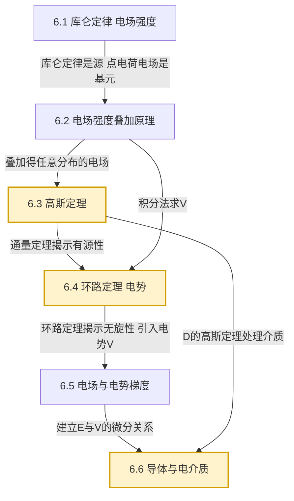

# MOC - 第6章 静电场

> [!info] 本章定位
> 第6章是**电磁学的开篇**，从[[MOC - 第3章]]力学中"超距作用力"的研究范式转向**场论**范式：引入一个填充空间的客观物理对象——**静电场** $\vec E$，用它来描述静止电荷之间的相互作用。本章以 [[6.1 库仑定律、电场强度]] 给出的库仑定律为实验基础，沿"**源—场—势—介质**"四条主线展开：先用 [[6.2 电场强度叠加原理]] 解决任意电荷分布产生的电场；再用 [[6.3 高斯定理]]（通量定理）与 [[6.4 静电场环路定理、电势]]（环路定理）共同刻画静电场的"有源无旋"本质，并引入标量势 $V$；进而由 [[6.5 电场强度与电势梯度]] 建立 $\vec E=-\nabla V$ 的微分关系；最后在 [[6.6 静电场中的导体与电介质]] 中研究物质与电场的相互作用，导出电容与电场能量。本章既是 [[MOC - 第7章]] 恒定磁场（B 场）与 [[MOC - 第8章]] 电磁感应的方法论模板，也是后续电路课程中电容、电场储能等概念的物理根基。核心问题：**给定电荷分布如何求 $\vec E$ 与 $V$**，以及**静电场与导体、电介质如何相互制约**。

## 学习路线图

## 知识点导航

| 小节 | 主题 | 核心内容 | 重点 |
| ---- | ---- | -------- | ---- |
| [[6.1 库仑定律、电场强度]] | 库仑定律、电场强度 | 点电荷模型、库仑定律 $\vec F=\dfrac{1}{4\pi\varepsilon_0}\dfrac{q_1q_2}{r^2}\hat r$（$k=9.0\times10^9\,\mathrm{N\cdot m^2/C^2}$，$\varepsilon_0=8.85\times10^{-12}\,\mathrm{C^2/(N\cdot m^2)}$）、电场强度 $\vec E=\vec F/q_0$（单位 $\mathrm{N/C}=\mathrm{V/m}$）、点电荷电场 $\vec E=kq\hat r/r^2$ | 概念根基 |
| [[6.2 电场强度叠加原理]] | 叠加原理、连续分布电场 | 矢量叠加 $\vec E=\sum\vec E_i=\int d\vec E$、线/面/体电荷密度（$\lambda,\sigma,\rho$）、带电直线、带电圆环、带电圆盘轴线电场 | **积分计算** |
| [[6.3 高斯定理]] | 高斯定理及应用 | 电场线性质、电通量 $\Phi_E=\oint\vec E\cdot d\vec S$、$\oint\vec E\cdot d\vec S=Q_{内}/\varepsilon_0$、球/轴/面对称三类应用、静电场有源 | **核心重点** |
| [[6.4 静电场环路定理、电势]] | 环路定理、电势 | 静电力保守、$\oint\vec E\cdot d\vec l=0$（无旋）、电势能 $W_p$、电势 $V=W_p/q_0$（单位 $\mathrm V$）、电势叠加、点电荷电势 $V=kq/r$ | **核心重点** |
| [[6.5 电场强度与电势梯度]] | 等势面、电势梯度 | 等势面性质、$\vec E=-\nabla V$、分量式 $E_x=-\partial V/\partial x$、由 $V$ 求 $\vec E$ | 微分关系 |
| [[6.6 静电场中的导体与电介质]] | 导体、电介质、电容、能量 | 静电平衡（导体内 $\vec E=0$，表面 $\vec E\perp$ 表面）、等势体、静电屏蔽、极化强度 $\vec P$、电位移 $\vec D=\varepsilon_0\vec E+\vec P$、$\oint\vec D\cdot d\vec S=Q_{自}$、电容 $C=Q/U$、能量密度 $w=\tfrac12\varepsilon_0E^2$ | **综合重点** |

## 核心考点

1. **库仑定律的矢量性与适用条件**：$\vec F_{12}=\dfrac{1}{4\pi\varepsilon_0}\dfrac{q_1q_2}{r^2}\hat r_{12}$，方向沿两电荷连线，同性相斥异性相吸；仅适用于真空中的**点电荷**（$r\gg$ 电荷自身尺寸），$r\to 0$ 时失效（[[6.1 库仑定律、电场强度]]）。
2. **电场强度的定义与点电荷电场**：$\vec E=\vec F/q_0$ 中 $q_0$ 为**试探电荷**（$q_0\to 0$ 以不扰动源电荷分布）；点电荷电场 $\vec E=\dfrac{1}{4\pi\varepsilon_0}\dfrac{q}{r^2}\hat r$，方向由 $q$ 正负决定（[[6.1 库仑定律、电场强度]]）。
3. **连续电荷分布电场的积分法**：$d\vec E=\dfrac{1}{4\pi\varepsilon_0}\dfrac{dq}{r^2}\hat r$，按对称性建坐标、分解分量后积分；常见模型（有限长直线 $E_\perp=\dfrac{k\lambda}{a}(\sin\theta_2+\sin\theta_1)$、圆环轴线 $E=\dfrac{kqx}{(R^2+x^2)^{3/2}}$、圆盘 $E=\dfrac{\sigma}{2\varepsilon_0}(1-\dfrac{x}{\sqrt{x^2+R^2}})$）需熟记结论与适用条件（[[6.2 电场强度叠加原理]]）。
4. **高斯定理的通量计算与对称性应用**：$\oint_S\vec E\cdot d\vec S=Q_{内}/\varepsilon_0$ 是**普适**定理（对任意闭合曲面、任意电荷分布成立），但只有**球对称、轴对称、面对称**三类情形才能由它反解出 $\vec E$；关键是选高斯面使 $\vec E$ 在面上大小恒定且与 $d\vec S$ 平行或垂直（[[6.3 高斯定理]]）。
5. **高斯定理的物理意义**：静电场是**有源场**——电场线发自正电荷、终于负电荷（或无穷远），不会在无电荷处中断；$\nabla\cdot\vec E=\rho/\varepsilon_0$ 是其微分形式（[[6.3 高斯定理]]）。
6. **环路定理与电势的引入**：$\oint\vec E\cdot d\vec l=0$ 表明静电力做功与路径无关（保守力），由此可定义电势 $V_A=\int_A^{\infty}\vec E\cdot d\vec l$（取无穷远为零势）；电势叠加是**标量**叠加，比电场矢量叠加简便（[[6.4 静电场环路定理、电势]]）。
7. **电场与电势的微分关系 $\vec E=-\nabla V$**：电场指向电势**降落最快**的方向，大小等于电势最大空间变化率；等势面与电场线处处正交，电场线由高电势指向低电势（[[6.5 电场强度与电势梯度]]）。
8. **导体静电平衡与电介质极化**：导体内部 $\vec E=0$、表面 $\vec E=\sigma/\varepsilon_0$（垂直外法线）、整个导体等势、电荷只分布外表面；电介质极化产生束缚电荷，引入 $\vec D=\varepsilon_0\vec E+\vec P=\varepsilon\vec E$，有电介质高斯定理 $\oint\vec D\cdot d\vec S=Q_{自由}$；电容器储能 $W=\tfrac12CU^2=\tfrac{Q^2}{2C}$，能量密度 $w=\tfrac12\vec D\cdot\vec E=\tfrac12\varepsilon E^2$（[[6.6 静电场中的导体与电介质]]）。

## 自测题

> [!question]- 自测1（电场叠加——圆环轴线）
> 半径 $R$ 的均匀带电圆环，电荷线密度 $\lambda$，总电荷 $Q=2\pi R\lambda$。求轴线上距环心 $x$ 处的电场强度，并讨论 $x\gg R$ 与 $x=0$ 两个极限。
>
> > [!success]- 解答
> > 取环上电荷元 $dq=\lambda R\,d\theta$，到轴线点 $P$ 距离 $r=\sqrt{R^2+x^2}$。由对称性，垂直轴线的分量两两抵消，仅轴向分量保留：
> > $$dE_\parallel=dE\cos\alpha=\frac{1}{4\pi\varepsilon_0}\frac{dq}{R^2+x^2}\cdot\frac{x}{\sqrt{R^2+x^2}}.$$
> > 积分 $\int dq=Q$：
> > $$E=\frac{1}{4\pi\varepsilon_0}\frac{Qx}{(R^2+x^2)^{3/2}}.$$
> > 方向沿轴线（$Q>0$ 时指向远离环心）。
> > - $x=0$：$E=0$（环心对称位置，电场抵消）；
> > - $x\gg R$：$(R^2+x^2)^{3/2}\approx x^3$，$E\approx kQ/x^2$，退化为点电荷电场。
> > 极大值位置由 $dE/dx=0$ 得 $x=\pm R/\sqrt{2}$。

> [!question]- 自测2（高斯定理——均匀带电球）
> 半径 $R$、总电荷 $Q$ 的均匀带电球体（体密度 $\rho=\dfrac{Q}{\tfrac43\pi R^3}$）。求球内 ($r<R$) 与球外 ($r>R$) 的电场强度。
>
> > [!success]- 解答
> > 由球对称性，$\vec E$ 沿径向且大小仅依赖 $r$。取半径 $r$ 的同心球面为高斯面。
> > **球外** ($r>R$)：面内电荷 $Q_{内}=Q$，
> > $$E\cdot 4\pi r^2=\frac{Q}{\varepsilon_0}\Rightarrow E=\frac{1}{4\pi\varepsilon_0}\frac{Q}{r^2}=k\frac{Q}{r^2}.$$
> > 与电荷集中在球心的点电荷电场相同。
> > **球内** ($r<R$)：$Q_{内}=\rho\cdot\tfrac43\pi r^3=Q\dfrac{r^3}{R^3}$，
> > $$E\cdot 4\pi r^2=\frac{Qr^3/R^3}{\varepsilon_0}\Rightarrow E=\frac{kQr}{R^3}.$$
> > 球内电场随 $r$ 线性增加，球面上 $E_{\max}=kQ/R^2$ 处连续。

> [!question]- 自测3（电势叠加）
> 边长 $a$ 的正三角形三个顶点各放点电荷 $+q,+q,-q$。求三角形中心处的电势（取无穷远为零势）。
>
> > [!success]- 解答
> > 中心到任一顶点距离 $r=\dfrac{a}{\sqrt 3}$（正三角形外接圆半径 $R=a/\sqrt 3$）。
> > 电势是标量叠加：
> > $$V=\sum_i\frac{kq_i}{r}=k\cdot\frac{q+q-q}{r}=\frac{kq}{r}=\frac{kq\sqrt 3}{a}.$$
> > **注意**：若题目改为求电场，则需按矢量叠加，因对称性两个 $+q$ 的合电场指向 $-q$ 方向，结果与 $-q$ 自身电场叠加，所得 $\vec E\ne\vec 0$。这正体现了电势（标量）叠加比电场（矢量）叠加简便。

> [!question]- 自测4（导体静电平衡）
> 一不带电的金属球壳（内半径 $R_1$，外半径 $R_2$）球心处放一点电荷 $+q$。求：(1) 球壳内、外表面的感应电荷；(2) 球壳外 ($r>R_2$) 的电场；(3) 球壳的电势。
>
> > [!success]- 解答
> > **(1) 感应电荷**：导体静电平衡时内部 $\vec E=0$。在导体壳内取高斯面（$R_1<r<R_2$），由高斯定理 $\oint\vec E\cdot d\vec S=0=Q_{内}/\varepsilon_0$，故 $Q_{内}=q+q_{内表}=0\Rightarrow q_{内表}=-q$。又球壳总电荷为零，故 $q_{外表}=+q$。
> > **(2) 球壳外电场**：以 $r>R_2$ 的同心球面为高斯面，$Q_{内}=q+0=q$（外表电荷已计入），
> > $$E=\frac{kq}{r^2},\quad r>R_2.$$
> > 即外表 $+q$ 等效于球心点电荷对外场的贡献，与内表 $-q$ 和原 $+q$ 形成的"电偶极封闭"无关。
> > **(3) 球壳电势**：球壳是等势体，取 $r=R_2$ 计算（无穷远为零势）：
> > $$V_{\text{壳}}=\int_{R_2}^{\infty}E\,dr=\int_{R_2}^{\infty}\frac{kq}{r^2}\,dr=\frac{kq}{R_2}.$$
> > 也可分段叠加：$V=\dfrac{kq}{R_2}+\dfrac{k(-q)}{R_2}+\dfrac{k(+q)}{R_2}=\dfrac{kq}{R_2}$（球心 $+q$、内表 $-q$、外表 $+q$ 在壳层贡献）。

## 章节导航

- 上一级：[[MOC - 大学物理B]]
- 先修章节：[[MOC - 第5章]]（热力学基础，提供状态函数与能量方法的训练）、[[MOC - 高等数学A(2)]]（多元微积分、矢量分析、场论基础）
- 上一章：[[MOC - 第5章]]
- 下一章：[[MOC - 第7章]]（恒定磁场，将"源—场—势"框架推广到 B 场，建立安培环路定理与毕奥-萨伐尔定律）
- 习题：[[MOC - 第6章习题]]

## 相关标签

#大学物理 #电磁学 #静电场 #库仑定律 #高斯定理 #电势 #导体 #电介质 #电容
