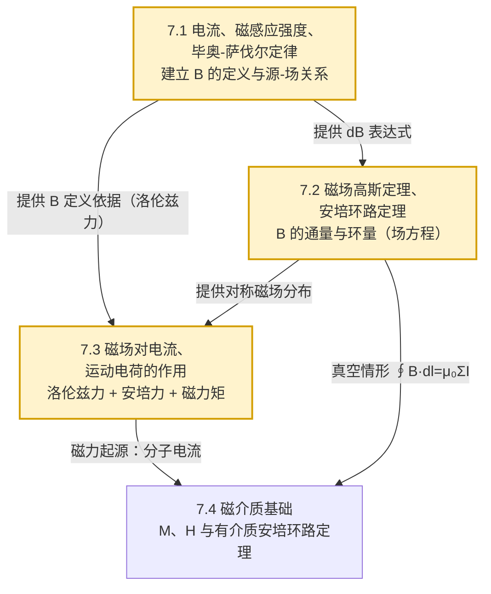

# MOC - 第7章 恒定磁场

> [!info] 本章定位
> 第7章把第 6 章建立的**场研究方法**从静电场迁移到由恒定电流激发的磁场。本章只解决四类问题：
> 1. **如何描述恒定电流**——引入电流密度 $\vec J$ 与电流强度 $I$，建立 $I=\iint\vec J\cdot d\vec S$ 的联系；
> 2. **如何由已知电流分布求磁场**——毕奥-萨伐尔定律（微分形式，普适但计算繁）与安培环路定理（积分形式，仅对高度对称电流分布简便）；
> 3. **磁场对电流与运动电荷的作用**——洛伦兹力 $\vec F=q\vec v\times\vec B$ 与安培力 $d\vec F=I\,d\vec l\times\vec B$，由此解释回旋运动、霍耳效应、磁力矩与磁电式电表；
> 4. **磁介质对磁场的影响**——磁化强度 $\vec M$、磁场强度 $\vec H$ 与有介质时的安培环路定理 $\oint\vec H\cdot d\vec l=\sum I_{\text{free}}$。
>
> 全章有一条主线：**与静电场严格类比又辨明差异**——$\vec E\leftrightarrow\vec B$、$q\leftrightarrow I\,dl$、$\dfrac{1}{4\pi\varepsilon_{0}}\leftrightarrow\dfrac{\mu_{0}}{4\pi}$、库仑定律 $\leftrightarrow$ 毕奥-萨伐尔定律、$\oint\vec E\cdot d\vec l=0\leftrightarrow\oint\vec B\cdot d\vec l=\mu_{0}\sum I$、$\oint\vec E\cdot d\vec S=\dfrac{q}{\varepsilon_{0}}\leftrightarrow\oint\vec B\cdot d\vec S=0$。最大差异是：静电场是有源无旋场，恒定磁场是无源有旋场（不存在磁单极子）。

## 学习路线图

- 入口：[[7.1 电流、磁感应强度、毕奥-萨伐尔定律]]（先建立电流描述与场-源关系）
- 主干：[[7.2 磁场高斯定理、安培环路定理]] $\to$ [[7.3 磁场对电流、运动电荷的作用]] $\to$ [[7.4 磁介质基础]]
- 先修：`[[MOC - 第6章]]`（静电场的场研究方法是本章类比的模板）

## 知识点导航

| 小节 | 主题 | 核心公式 | 核心考点 | 链接 |
| ---- | ---- | -------- | -------- | ---- |
| 7.1 | 电流、磁感应强度、毕奥-萨伐尔定律 | $I=\dfrac{dq}{dt}$；$\vec J=\rho\vec v$；$d\vec B=\dfrac{\mu_{0}}{4\pi}\dfrac{I\,d\vec l\times\hat r}{r^{2}}$ | 直线电流、圆电流轴线、螺线管磁场计算 | [[7.1 电流、磁感应强度、毕奥-萨伐尔定律]] |
| 7.2 | 磁场高斯定理、安培环路定理 | $\oint\vec B\cdot d\vec S=0$；$\oint\vec B\cdot d\vec l=\mu_{0}\sum I_{\text{内}}$ | 高斯定理判无源、环路定理求对称磁场（螺线管、环形螺线管、圆柱电流） | [[7.2 磁场高斯定理、安培环路定理]] |
| 7.3 | 磁场对电流、运动电荷的作用 | $\vec F=q\vec v\times\vec B$；$d\vec F=I\,d\vec l\times\vec B$；$\vec M=\vec m\times\vec B$ | 圆周/螺旋运动半径周期、安培力、载流线圈磁力矩、磁电式电表 | [[7.3 磁场对电流、运动电荷的作用]] |
| 7.4 | 磁介质基础 | $\vec H=\dfrac{\vec B}{\mu_{0}}-\vec M$；$\oint\vec H\cdot d\vec l=\sum I_{\text{free}}$；$\vec B=\mu\vec H$ | 顺/抗/铁磁分类、磁化机制、磁滞回线、有介质安培环路定理 | [[7.4 磁介质基础]] |

## 静电场与恒定磁场对照表

> [!summary] 静电场 ↔ 恒定磁场（真空中）
>
> | 项目 | 静电场（第 6 章） | 恒定磁场（第 7 章） | 关系/类比 |
> | ---- | ---- | ---- | ---- |
> | 源 | 静止电荷 $q$ (C) | 恒定电流元 $I\,dl$ (A·m) | 静止 vs 运动 |
> | 基本定律 | 库仑定律 $\vec F=\dfrac{1}{4\pi\varepsilon_{0}}\dfrac{q_{1}q_{2}}{r^{2}}\hat r$ | 毕奥-萨伐尔定律 $d\vec B=\dfrac{\mu_{0}}{4\pi}\dfrac{I\,d\vec l\times\hat r}{r^{2}}$ | 平方反比但方向不同 |
> | 场强 | $\vec E$ (N/C 或 V/m) | $\vec B$ (T) | 由力定义 |
> | 常数 | $\varepsilon_{0}=8.854\times10^{-12}$ C²/(N·m²) | $\mu_{0}=4\pi\times10^{-7}$ T·m/A | $\varepsilon_{0}\mu_{0}=\dfrac{1}{c^{2}}$ |
> | 力 | 库仑力 $\vec F=q\vec E$ | 洛伦兹力 $\vec F=q\vec v\times\vec B$ | 磁力与速度垂直 |
> | 高斯定理 | $\oint\vec E\cdot d\vec S=\dfrac{q_{\text{内}}}{\varepsilon_{0}}$（有源） | $\oint\vec B\cdot d\vec S=0$（无源） | 关键差异：无磁单极 |
> | 环路定理 | $\oint\vec E\cdot d\vec l=0$（无旋、保守） | $\oint\vec B\cdot d\vec l=\mu_{0}\sum I_{\text{内}}$（有旋、非保守） | 关键差异：磁场是涡旋场 |
> | 场线 | 始于正电荷止于负电荷 | 闭合曲线，无始无终 | 拓扑差异 |
> | 势 | 标量势 $\varphi$（$\vec E=-\nabla\varphi$） | 无标量势（一般需矢势 $\vec A$） | 保守性差异 |

## 核心考点

1. **毕奥-萨伐尔定律应用**：直线电流 $B=\dfrac{\mu_{0}I}{4\pi a}(\cos\theta_{1}-\cos\theta_{2})$（无限长 $\dfrac{\mu_{0}I}{2\pi a}$）、圆电流轴线 $B=\dfrac{\mu_{0}IR^{2}}{2(R^{2}+x^{2})^{3/2}}$、圆心处 $\dfrac{\mu_{0}I}{2R}$、长螺线管内 $\mu_{0}nI$。见 [[7.1 电流、磁感应强度、毕奥-萨伐尔定律#典型磁场计算]]。
2. **安培环路定理求对称磁场**：四类经典模型——长直螺线管（$B=\mu_{0}nI$）、环形螺线管（$B=\dfrac{\mu_{0}NI}{2\pi r}$）、无限长圆柱电流（内 $B=\dfrac{\mu_{0}Ir}{2\pi R^{2}}$，外 $B=\dfrac{\mu_{0}I}{2\pi r}$）、无限大电流片（$B=\dfrac{\mu_{0}j_{s}}{2}$）。这是**本章核心计算工具**，见 [[7.2 磁场高斯定理、安培环路定理#安培环路定理的应用]]。
3. **磁场高斯定理与"无源"性质**：磁感应线闭合、$\oint\vec B\cdot d\vec S=0$、不存在磁单极子，与静电场对照。
4. **洛伦兹力与带电粒子运动**：$\vec F=q\vec v\times\vec B$，垂直分量得圆周（$R=\dfrac{mv_{\perp}}{qB}$，$T=\dfrac{2\pi m}{qB}$），平行分量得螺旋线，回旋频率与速度无关。见 [[7.3 磁场对电流、运动电荷的作用#带电粒子在均匀磁场中的运动]]。
5. **安培力与磁力矩**：$d\vec F=I\,d\vec l\times\vec B$；载流线圈在均匀磁场中受合力为零但受力矩 $\vec M=\vec m\times\vec B$（$\vec m=IS\hat n$ 为磁矩），是磁电式电表与直流电动机原理。
6. **有磁介质时的安培环路定理**：引入 $\vec H$ 后 $\oint\vec H\cdot d\vec l=\sum I_{\text{free}}$ 只计自由电流，$\vec B=\mu\vec H=\mu_{0}\mu_{r}\vec H$。对铁磁质需考虑磁滞非线性。
7. **磁介质分类**：顺磁质（$\mu_{r}\gtrsim 1$）、抗磁质（$\mu_{r}\lesssim 1$）、铁磁质（$\mu_{r}\gg1$ 且有磁滞、居里点）。理解分子电流与磁化机制。

## 自测题

> [!question]- 自测 1（毕奥-萨伐尔定律）
> 一根长为 $2L$ 的直导线通有电流 $I$，求其垂直平分线上距导线 $a$ 处的磁感应强度大小与方向。
>
> > [!check]- 答案
> > 由对称性，磁场方向垂直纸面（由右手定则：电流向上则该点 $\vec B$ 垂直纸面向里）。取电流元 $I\,dx$，由 [[7.1 电流、磁感应强度、毕奥-萨伐尔定律#直线电流的磁场]] 公式：
> > $$B=\dfrac{\mu_{0}I}{4\pi a}(\cos\theta_{1}-\cos\theta_{2})$$
> > 此时 $\theta_{1}=\arctan\dfrac{L}{a}$（俯角），$\theta_{2}=\pi-\theta_{1}$，$\cos\theta_{2}=-\cos\theta_{1}$：
> > $$B=\dfrac{\mu_{0}I}{4\pi a}\cdot2\cos\theta_{1}=\dfrac{\mu_{0}I}{2\pi a}\cdot\dfrac{L}{\sqrt{a^{2}+L^{2}}}=\dfrac{\mu_{0}IL}{2\pi a\sqrt{a^{2}+L^{2}}}\quad(\text{T})$$
> > 当 $L\to\infty$ 时退化为 $B=\dfrac{\mu_{0}I}{2\pi a}$（无限长直线）。方向由右手定则判断。

> [!question]- 自测 2（安培环路定理）
> 一根半径为 $R$ 的无限长圆柱形导线通有均匀分布的电流 $I$（沿轴向）。求导线内 ($r<R$) 和导线外 ($r>R$) 的磁感应强度分布。
>
> > [!check]- 答案
> > 由轴对称性，$\vec B$ 沿以轴为圆心的同心圆切向，大小仅依赖 $r$。取半径 $r$ 的圆形安培回路（与电流成右手螺旋关系）：
> > - **导线内** $r<R$：回路包围电流 $I_{\text{内}}=I\cdot\dfrac{\pi r^{2}}{\pi R^{2}}=\dfrac{Ir^{2}}{R^{2}}$，由 [[7.2 磁场高斯定理、安培环路定理#安培环路定理]] $\oint\vec B\cdot d\vec l=B\cdot2\pi r=\mu_{0}I_{\text{内}}$：
> > $$B=\dfrac{\mu_{0}Ir}{2\pi R^{2}}\quad(\text{T})\quad(r<R)$$
> > - **导线外** $r\ge R$：$I_{\text{内}}=I$：
> > $$B=\dfrac{\mu_{0}I}{2\pi r}\quad(\text{T})\quad(r\ge R)$$
> > 内部 $B\propto r$，外部 $B\propto1/r$，与静电场长圆柱带电的 $E$ 分布形式一致但内外表达不同。

> [!question]- 自测 3（洛伦兹力与回旋运动）
> 一电子（质量 $m=9.11\times10^{-31}\,\text{kg}$，电量 $-e$，$e=1.602\times10^{-19}\,\text{C}$）以速率 $v=3.0\times10^{6}\,\text{m/s}$ 垂直射入 $B=0.10\,\text{T}$ 的均匀磁场。求电子作圆周运动的半径与周期。
>
> > [!check]- 答案
> > 洛伦兹力提供向心力 $qvB=\dfrac{mv_{\perp}^{2}}{R}$（$v_{\perp}=v$），由 [[7.3 磁场对电流、运动电荷的作用#圆周运动]]：
> > $$R=\dfrac{mv}{eB}=\dfrac{9.11\times10^{-31}\times3.0\times10^{6}}{1.602\times10^{-19}\times0.10}=\dfrac{2.733\times10^{-24}}{1.602\times10^{-20}}\approx1.71\times10^{-4}\,\text{m}=0.171\,\text{mm}$$
> > $$T=\dfrac{2\pi m}{eB}=\dfrac{2\pi\times9.11\times10^{-31}}{1.602\times10^{-19}\times0.10}\approx3.57\times10^{-10}\,\text{s}=0.357\,\text{ns}$$
> > 注意回旋频率 $f=\dfrac{1}{T}=\dfrac{eB}{2\pi m}$ 与速度无关——这是回旋加速器原理。

> [!question]- 自测 4（磁力矩）
> 一矩形线圈 $10\,\text{cm}\times5\,\text{cm}$，共 $N=20$ 匝，通有电流 $I=0.50\,\text{A}$，置于 $B=0.40\,\text{T}$ 的均匀磁场中。线圈平面与 $\vec B$ 平行（即线圈法线 $\hat n$ 与 $\vec B$ 夹角 $\theta=90^{\circ}$）。求线圈所受最大磁力矩及此位置实际力矩大小。
>
> > [!check]- 答案
> > 磁矩大小 $m=NIS=20\times0.50\times(0.10\times0.05)=20\times0.50\times5.0\times10^{-3}=5.0\times10^{-2}\,\text{A·m}^{2}$。由 [[7.3 磁场对电流、运动电荷的作用#磁场对载流线圈的力矩]]：
> > - 最大力矩（$\theta=90^{\circ}$，即线圈法线与 $\vec B$ 垂直、线圈平面与 $\vec B$ 平行）：
> > $$M_{\max}=mB=5.0\times10^{-2}\times0.40=2.0\times10^{-2}\,\text{N·m}$$
> > - 题目所给位置即 $\theta=90^{\circ}$，故此位置实际力矩即最大值 $2.0\times10^{-2}\,\text{N·m}$。
> > 注意：当 $\theta=0$（$\hat n\parallel\vec B$）时 $M=0$，为稳定平衡位置。

## 易错点与注意事项

> [!warning] 常见错误
> 1. **混淆电流方向与磁场方向**：磁场方向由右手定则判断（拇指沿电流方向，四指弯曲方向即 $\vec B$ 方向），不可与左手定则（判断力方向）混用。
> 2. **安培环路定理中电流正负**：$\sum I_{\text{内}}$ 取与回路绕行方向成右手螺旋关系的电流为正，反向为负；不穿过回路所张曲面的电流不计入。
> 3. **安培环路定理仅对恒定电流成立**：对非稳恒电流（如电容器充电中）需麦克斯韦位移电流修正（见 `[[MOC - 第8章]]`）。
> 4. **环路定理不是任意情形都简便**：仅当电流分布具有柱对称、面对称或适当的轴对称使 $\vec B$ 在回路上大小恒定、方向沿切向时，才能把 $B$ 提出积分号外。一般电流分布必须用毕奥-萨伐尔定律。
> 5. **洛伦兹力不做功**：$\vec F\perp\vec v$，瞬时功率 $P=\vec F\cdot\vec v=0$；只改变速度方向不改变动能。安培力则可做功（载流导线在磁场中运动时电源提供能量）。
> 6. **磁矩方向**：$\vec m=IS\hat n$，$\hat n$ 由线圈中电流方向按右手定则确定，**不是几何法线**。
> 7. **$\vec H$ 与 $\vec B$ 不要混用**：有介质时安培环路定理右边只计自由电流，必须用 $\vec H$；$\vec B$ 仍由 $\vec B=\mu\vec H$ 给出。
> 8. **铁磁质 $\mu$ 不是常数**：磁滞回线表明 $\vec B$ 与 $\vec H$ 关系非线性且与历史有关，不能简单套 $\vec B=\mu\vec H$。

## 章节导航

- 上一级：[[MOC - 大学物理B]]
- 先修章节：[[MOC - 第6章]]（静电场提供类比模板与场研究方法）
- 上一章：[[MOC - 第6章]]
- 下一章：[[MOC - 第8章]]（电磁感应把恒定场推广到变化场）
- 习题：[[MOC - 第7章习题]]

## 相关标签

#大学物理 #电磁学 #恒定磁场 #毕奥-萨伐尔定律 #安培环路定理 #洛伦兹力 #磁介质
