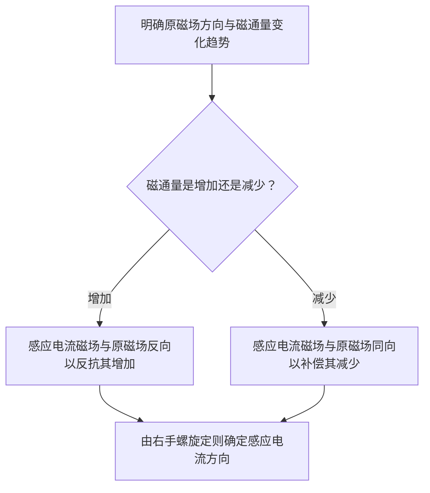

# 8.1 法拉第电磁感应定律

> [!info] 本节定位
> 本节是整个第8章的**起点与核心**。它回答一个实验事实：**当穿过闭合回路的磁通量发生变化时，回路中产生感应电动势与感应电流**。法拉第（M. Faraday）在 1831 年通过大量实验总结出这一规律，并用一个简洁的公式定量描述：
> $$\varepsilon=-\frac{\mathrm d\Phi}{\mathrm dt}$$
> 即感应电动势等于磁通量变化率的负值。负号不是数学装饰，而是**楞次定律**的数学化——它保证感应电流的效果总是反抗磁通量的变化，从而与**能量守恒定律**自洽。
>
> 本节为 [[8.2 动生电动势、感生电动势]] 提供总框架（磁通量变化可由两种机制引起），为 [[8.3 自感、互感、磁场能量]]（线圈中电流变化引起的自感/互感）和 [[8.4 麦克斯韦方程组简介]]（变化磁场产生涡旋电场即法拉第定律的微分形式）奠定基础。

## 一、电磁感应现象

> [!definition] 电磁感应
> **电磁感应（electromagnetic induction）** 是指：当穿过闭合导体回路的**磁通量发生变化**时，回路中出现电流的现象。该电流称为**感应电流（induced current）**，驱动它的等效非静电力所对应的电动势称为**感应电动势（induced emf）**，记作 $\varepsilon$，单位伏特（V）。

> [!note] 法拉第实验的典型情境
> 下列操作都能使穿过回路的磁通量改变，从而观察到感应电流：
> 1. **磁铁运动**：条形磁铁相对闭合线圈靠近或远离；
> 2. **回路变形**：在恒定磁场中改变闭合回路的面积或取向；
> 3. **回路平动**：导体回路整体在非均匀磁场中移动；
> 4. **磁场变化**：用电磁铁并通过变阻器改变其电流，使穿过另一回路的 $\vec B$ 随时间变化；
> 5. **相对运动**：闭合回路的一部分在磁场中作切割磁感线运动（动生电动势，见 [[8.2 动生电动势、感生电动势]]）。
>
> 关键判据不是"有磁场"，而是"磁通量发生变化"。回路静止于恒定磁场中不会有感应电流。

## 二、磁通量

磁通量是法拉第定律的核心中间量。复习并明确其定义与符号约定。

> [!definition] 磁通量
> 穿过曲面 $S$ 的**磁通量（magnetic flux）** 定义为
> $$\Phi=\int_S \vec B\cdot\mathrm d\vec S=\int_S B\cos\theta\,\mathrm dS\quad(\text{Wb})$$
> 其中 $\vec B$ 是磁感应强度（T），$\mathrm d\vec S$ 是面元矢量，$\theta$ 是 $\vec B$ 与面法向 $\hat n$ 的夹角。单位为韦伯（Wb），$1\,\text{Wb}=1\,\text{T}\cdot\text{m}^2$。

> [!warning] 磁通量的正负与方向约定
> 1. $\Phi$ 是**代数量**，其正负取决于面法向 $\hat n$ 的选择。对闭合回路，必须**先指定回路绕行正方向**，再由**右手螺旋定则**确定配套面法向：四指沿绕行方向，拇指指向 $\hat n$。
> 2. 一旦绕行方向选定，$\hat n$ 与 $\varepsilon$ 的正负就有了统一参考系。楞次定律可以独立判定方向，但用公式符号判定时务必保持上述约定一致。
> 3. 对闭合曲面，$\oint\vec B\cdot\mathrm d\vec S=0$（磁场高斯定理，磁单极不存在），故穿过任意闭合曲面的净磁通量为零。

## 三、法拉第电磁感应定律

> [!theorem] 法拉第电磁感应定律
> 不论什么原因使穿过闭合回路的磁通量 $\Phi$ 发生变化，回路中产生的感应电动势 $\varepsilon$ 总与磁通量的变化率成正比。在 SI 单位制下（比例系数为 1）：
> $$\boxed{\,\varepsilon=-\frac{\mathrm d\Phi}{\mathrm dt}\,}\quad(\text{V})$$
> 若回路为 $N$ 匝线圈且每匝磁通量相同，则总电动势为
> $$\varepsilon=-N\frac{\mathrm d\Phi}{\mathrm dt}=-\frac{\mathrm d\Psi}{\mathrm dt},\qquad \Psi=N\Phi$$
> 其中 $\Psi$ 称为**磁链（flux linkage）**，单位 Wb。

> [!note] 适用范围与有效范围
> - 适用于**任意机制**引起的磁通量变化（磁场变化、回路运动、形变、转动均可）；
> - 适用于**任意介质**中的宏观回路；强铁磁性介质中需考虑 $B\text{-}H$ 关系的非线性；
> - 经典电磁场极限，不涉及量子效应与相对论高速修正；
> - 当回路本身随时间显著变形时，需对面积 $S(t)$ 与法向 $\hat n(t)$ 的时间依赖作严格处理。

## 四、楞次定律

法拉第定律的负号需要楞次定律给出物理诠释，它也是判定感应电流方向的统一法则。

> [!theorem] 楞次定律
> **感应电流的方向**总是使其自身产生的磁场**阻碍引起它的磁通量的变化**。即：
> - 当原磁通量**增加**时，感应电流磁场与原磁场**反向**；
> - 当原磁通量**减少**时，感应电流磁场与原磁场**同向**。
>
> 楞次定律是**能量守恒定律**在电磁感应中的体现（详见下文负号物理意义）。

### 楞次定律的判定流程

> [!example] 楞次定律应用示例
> 一根条形磁铁的 N 极朝下、自上而下插入一个水平放置的闭合线圈。
> - 原磁场方向：穿过线圈向下（N 极发出的磁感线在线圈处方向向下）；
> - 磁通量变化：磁铁靠近，向下的磁通量**增加**；
> - 感应电流磁场：应**向上**（反抗向下磁通量增加）；
> - 由右手螺旋定则（拇指向上指向感应磁场方向），四指弯曲方向为**逆时针**（从上方俯视）。
>
> 也可用"反抗相对运动"理解：感应电流使线圈上端呈 N 极，与磁铁 N 极相斥，阻碍磁铁下落——这正是能量守恒的体现。

## 五、负号的物理意义——能量守恒

> [!proof] 负号与能量守恒
> 设想若法拉第定律没有负号，即 $\varepsilon=+\dfrac{\mathrm d\Phi}{\mathrm dt}$。当原磁通量增加时，感应电流的磁场将与原磁场同向，使总磁通量进一步增加；这又导致更大的感应电动势与电流……形成正反馈，能量无中生有。
>
> 加上负号后，感应电流的磁场总是反抗磁通量变化。维持磁通量变化需要外力做功，例如把磁铁推入线圈必须克服排斥力。这部分**机械功**转化为感应电流的焦耳热：
> $$\mathrm dW_{\text{外}}=I\,\mathrm d\Psi,\qquad Q=\int I^2 R\,\mathrm dt$$
> 在理想近似下能量平衡成立：外力功 = 感应电动势做的功 = 回路焦耳热。负号正是保证这一能量守恒关系成立的数学表达。$\square$

> [!warning] 关于"负号"的常见误解
> 1. 负号**不是**说电动势一定是"负值"。$\varepsilon$ 的正负取决于绕行方向与磁通量变化率的相对关系，电动势的实际方向由楞次定律独立判定。
> 2. 负号**不是**楞次定律本身，而是楞次定律在定量公式中的体现。判定方向时，先用楞次定律确定感应电流方向，再据此选择绕行正方向，可避免符号混乱。
> 3. 不要把 $\Phi$ 的正负与 $\dfrac{\mathrm d\Phi}{\mathrm dt}$ 的正负混为一谈：磁通量为正仍可减少（变化率为负），磁通量为负仍可变得更负（变化率为负）。

## 六、感应电流与感应电荷

闭合回路电阻为 $R$ 时，感应电流与感应电荷为：

> [!formula] 感应电流与感应电荷
> $$I=\frac{\varepsilon}{R}=-\frac{1}{R}\frac{\mathrm d\Phi}{\mathrm dt}\quad(\text{A})$$
> $$q=\int_{t_1}^{t_2}I\,\mathrm dt=-\frac{1}{R}\int_{\Phi_1}^{\Phi_2}\mathrm d\Phi=\frac{\Phi_1-\Phi_2}{R}\quad(\text{C})$$
> 感应电荷 $q$ 仅与磁通量的**总改变量**有关，与变化快慢无关。这是磁通计测量原理的基础。

> [!example] 例题 1：感应电荷与变化率无关
> 一探测线圈 $N=200$ 匝、电阻 $R=100\,\Omega$，初始穿过每匝的磁通量 $\Phi_1=3.0\times10^{-5}\,\text{Wb}$，经一段时间后变为 $\Phi_2=1.0\times10^{-5}\,\text{Wb}$。求通过线圈的感应电荷。若磁通量在 $0.10\,\text{s}$ 内完成此变化，求平均感应电动势。
>
> **解**：磁链变化 $\Delta\Psi=N(\Phi_1-\Phi_2)=200\times(3.0-1.0)\times10^{-5}=4.0\times10^{-3}\,\text{Wb}$。
> 感应电荷 $q=\dfrac{\Delta\Psi}{R}=\dfrac{4.0\times10^{-3}}{100}=4.0\times10^{-5}\,\text{C}$。
> 平均感应电动势 $\bar\varepsilon=\dfrac{\Delta\Psi}{\Delta t}=\dfrac{4.0\times10^{-3}}{0.10}=4.0\times10^{-2}\,\text{V}$。
>
> 可见 $q$ 不依赖变化快慢；而 $\varepsilon$ 与变化快慢成正比。

## 七、典型例题

### 例题 2：矩形线圈在非均匀磁场中平动

> [!example] 题目
> 真空中有一无限长直导线通有恒定电流 $I_0=10\,\text{A}$。一矩形线圈共 $N=100$ 匝，与导线共面，其长边 $l=0.20\,\text{m}$ 平行于导线，靠近导线的一边距导线 $r_1=0.05\,\text{m}$，另一边距导线 $r_2=0.15\,\text{m}$。若线圈以恒定速度 $v=0.020\,\text{m/s}$ 远离导线运动（沿径向），求某时刻线圈中的感应电动势大小，并判断方向。

**分析**：长直导线产生磁感应强度 $B(r)=\dfrac{\mu_0 I_0}{2\pi r}$，方向由右手定则在导线一侧垂直纸面。磁通量随线圈位置变化而变化。

**计算**：取垂直线圈平面、指向 $\vec B$ 的方向为面法向。距导线 $r$ 处取宽 $\mathrm dr$ 的窄条，面积 $\mathrm dS=l\,\mathrm dr$，单匝磁通量
$$\Phi(r_1)=\int_{r_1}^{r_2}\frac{\mu_0 I_0}{2\pi r}\,l\,\mathrm dr=\frac{\mu_0 I_0 l}{2\pi}\ln\frac{r_2}{r_1}$$

线圈远离导线运动时，$r_1(t)$ 与 $r_2(t)$ 同步增大，但比值 $\dfrac{r_2}{r_1}=\dfrac{r_2(t)}{r_1(t)}$ 由于 $r_2-r_1=l_{\text{宽}}$ 是宽度不变……

> [!warning] 严格处理
> 这里应明确：矩形线圈"两长边到导线距离"之差等于线圈**宽度** $w=r_2-r_1=0.10\,\text{m}$（与长边 $l$ 区分）。运动时 $r_1(t)$ 增大，$r_2(t)=r_1(t)+w$ 同步增大，比值 $\dfrac{r_2}{r_1}=\dfrac{r_1+w}{r_1}=1+\dfrac{w}{r_1}$ 随 $r_1$ 增大而减小，故 $\Phi$ 随时间减小。

令 $r_1(t)$ 为内边距导线距离，$\dfrac{\mathrm dr_1}{\mathrm dt}=v$。对 $\Phi=\dfrac{\mu_0 I_0 l}{2\pi}\ln\dfrac{r_1+w}{r_1}$ 求导：
$$\frac{\mathrm d\Phi}{\mathrm dt}=\frac{\mu_0 I_0 l}{2\pi}\left(\frac{1}{r_1+w}-\frac{1}{r_1}\right)\frac{\mathrm dr_1}{\mathrm dt}=\frac{\mu_0 I_0 l v}{2\pi}\left(\frac{1}{r_1+w}-\frac{1}{r_1}\right)$$

代入初始时刻 $r_1=0.05\,\text{m}$，$w=0.10\,\text{m}$。先算系数：
$$\frac{\mu_0 I_0 l v}{2\pi}=\frac{4\pi\times10^{-7}\times10\times0.20\times0.020}{2\pi}=\frac{1.6\times10^{-8}\,\pi}{2\pi}=8.0\times10^{-9}\,\text{Wb/s}$$
再算括号部分：$\left(\dfrac{1}{0.15}-\dfrac{1}{0.05}\right)=6.667-20=-13.33\,\text{m}^{-1}$。
故
$$\frac{\mathrm d\Phi}{\mathrm dt}=8.0\times10^{-9}\times(-13.33)\approx -1.07\times10^{-7}\,\text{Wb/s}$$

总电动势 $\varepsilon=-N\dfrac{\mathrm d\Phi}{\mathrm dt}=-100\times(-1.07\times10^{-7})\approx 1.07\times10^{-5}\,\text{V}$。

**方向**：$\Phi$ 随时间减小（线圈远离，磁场变弱），由楞次定律，感应电流磁场应与原磁场同向以补偿，故感应电流方向与原磁场右手配套的绕行方向一致（此处为顺时针，从 $\vec B$ 侧观察）。

**单位检验**：$\dfrac{\text{T}\cdot\text{m}^2}{\text{s}}=\text{Wb/s}=\text{V}$，自洽。

### 例题 3：转动线圈的交流电动势

> [!example] 题目
> 面积 $S=0.020\,\text{m}^2$、匝数 $N=500$ 的矩形线圈在均匀磁场 $B=0.40\,\text{T}$ 中以角速度 $\omega=100\pi\,\text{rad/s}$（即 $50\,\text{Hz}$）绕垂直于 $\vec B$ 的轴匀速转动。$t=0$ 时线圈平面法向与 $\vec B$ 平行。求感应电动势的表达式、最大值与有效值。

**分析**：这是交流发电机的原理模型。磁通量随线圈取向变化而变化。

**解**：设 $t$ 时刻面法向 $\hat n$ 与 $\vec B$ 夹角为 $\theta=\omega t$，则单匝磁通量
$$\Phi=B S\cos\omega t$$
总电动势
$$\varepsilon=-N\frac{\mathrm d\Phi}{\mathrm dt}=-N B S(-\omega\sin\omega t)=N B S\omega\sin\omega t$$
代入数据：
$$\varepsilon_{\max}=N B S\omega=500\times0.40\times0.020\times100\pi=400\pi\approx 1.26\times10^3\,\text{V}$$
表达式：$\varepsilon(t)=1.26\times10^3\sin(100\pi t)\,\text{V}$。
有效值 $E_{\text{rms}}=\dfrac{\varepsilon_{\max}}{\sqrt2}\approx 8.89\times10^2\,\text{V}$。

**单位检验**：$N B S\omega$ 的单位为 $\text{T}\cdot\text{m}^2\cdot\text{rad/s}=\text{Wb}\cdot\text{s}^{-1}=\text{V}$，正确（rad 无量纲）。

> [!note] 理想化假设
> 上述推导假设磁场完全均匀、线圈刚性、转速恒定、忽略线圈自身感应电流对磁场的反馈（即未考虑自感，见 [[8.3 自感、互感、磁场能量]]）。实际发电机中这些因素需逐项修正。

## 八、易错点

> [!warning] 易错点
> 1. **混淆"有磁场"与"磁通量变化"**：电磁感应的必要条件是磁通量**变化**。回路处于恒定磁场中无论多强，都不会产生感应电动势。
> 2. **磁通量正负与法向选择**：必须先约定回路绕行方向再由右手定则确定法向。同一问题中所有量（$\Phi$、$\varepsilon$、$I$）共用同一约定，否则符号出错。
> 3. **匝数因子**：多匝线圈要用磁链 $\Psi=N\Phi$，电动势公式为 $\varepsilon=-\dfrac{\mathrm d\Psi}{\mathrm dt}$，漏乘 $N$ 是常见错误。
> 4. **负号误用**：负号表示方向，不要把它当作"电动势一定取负"。先由楞次定律判方向，再用符号代入公式校核更稳妥。
> 5. **$\Phi$ 与 $\dfrac{\mathrm d\Phi}{\mathrm dt}$ 混淆**：感应电动势由变化率决定，与瞬时磁通量本身无直接关系；磁通量为零时变化率可能最大（如转动线圈在 $\theta=\pi/2$ 位置）。
> 6. **非均匀磁场要积分**：不能简单用 $\Phi=BS$ 处理非均匀磁场（如长直导线旁），必须做面积分。

## 九、与其他小节的联系

- 本节的总定律 $\varepsilon=-\dfrac{\mathrm d\Phi}{\mathrm dt}$ 在 [[8.2 动生电动势、感生电动势]] 中被拆解为两种微观机制：动生电动势（洛伦兹力做功）与感生电动势（涡旋电场）；
- 自感与互感（[[8.3 自感、互感、磁场能量]]）是法拉第定律应用于"线圈自身电流变化"和"邻近线圈电流变化"的特殊情形；
- 法拉第定律的积分形式 $\oint\vec E\cdot\mathrm d\vec l=-\int\dfrac{\partial\vec B}{\partial t}\cdot\mathrm d\vec S$ 是 [[8.4 麦克斯韦方程组简介]] 中四个基本方程之一；
- 本章 MOC：[[MOC - 第8章]]。

## 章节导航

- 上一级：[[MOC - 第8章]]
- 先修：[[MOC - 第7章]]（磁通量、磁场的源）
- 下一节：[[8.2 动生电动势、感生电动势]]
- 习题：[[MOC - 第8章习题]]
