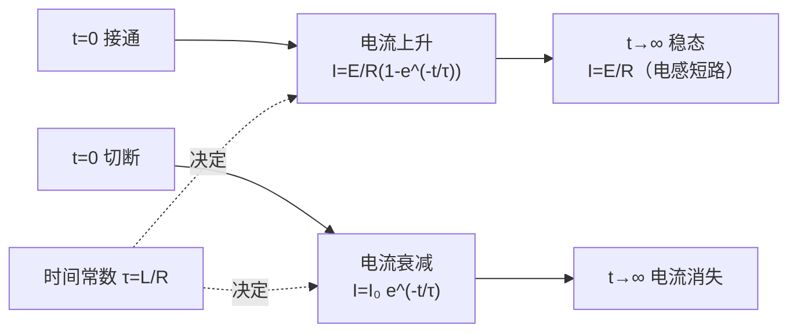

# 8.3 自感、互感、磁场能量

> [!info] 本节定位
> 本节是 [[8.1 法拉第电磁感应定律|法拉第定律]]在**电路元件**层面的应用。当一个线圈中的电流变化时，其自身磁通随之变化，产生反抗电流变化的自感电动势——这就是电感元件的行为；两个邻近线圈则通过磁场耦合发生互感。本节解决三个问题：
> 1. **如何度量线圈"产生感应电动势"的能力**——引入自感 $L$、互感 $M$；
> 2. **电感电路如何响应电流变化**——分析 RL 电路的暂态过程；
> 3. **磁场如何储能**——把"线圈储能"的观点推进为"磁场本身储能"，引入磁能密度 $w_m$，确立**场是能量载体**的物理图像。
>
> 本节的磁场能量观点为 [[8.4 麦克斯韦方程组简介|麦克斯韦方程组]]把电磁场视为统一物理实体提供了能量学依据；自感、互感也是工程中变压器、电感器件的理论基础。

## 一、自感

### 1.1 自感现象与自感系数

> [!definition] 自感与自感系数
> 当一个线圈中的电流 $I$ 随时间变化时，由它产生的穿过线圈自身的磁通量也发生变化，从而在线圈中产生感应电动势。这种现象称为**自感（self-induction）**，相应的电动势称为**自感电动势** $\varepsilon_L$。
>
> 设线圈中电流 $I$ 在其内部产生的总磁链为 $\Psi$，在**线性介质、线圈几何固定**的条件下，$\Psi$ 与 $I$ 成正比：
> $$\Psi=LI$$
> 比例系数
> $$\boxed{\,L=\frac{\Psi}{I}=\frac{N\Phi}{I}\,}\quad(\text{H})$$
> 称为该线圈的**自感系数（self-inductance）**，单位亨利（H），$1\,\text{H}=1\,\text{Wb/A}=1\,\text{V·s/A}$。

> [!note] 适用条件
> - 介质磁化是线性的（无铁芯或铁芯未饱和）；铁磁性介质中 $L$ 随电流变化，不再是常数；
> - 线圈几何形状、匝数固定；
> - $L$ 只由线圈自身的几何参数与介质决定，与电流无关（在线性条件下）。

### 1.2 自感电动势

> [!theorem] 自感电动势
> 由法拉第定律 $\varepsilon=-\dfrac{\mathrm d\Psi}{\mathrm dt}$ 和 $\Psi=LI$（$L$ 为常数）：
> $$\boxed{\,\varepsilon_L=-L\frac{\mathrm dI}{\mathrm dt}\,}\quad(\text{V})$$
> 负号表示：自感电动势总是**反抗电流的变化**（电流增大时反向、电流减小时同向），即"电磁惯性"。

> [!example] 长直螺线管的自感
> 长直螺线管长 $l$、截面积 $S$、匝数 $N$、内部磁介质磁导率 $\mu$（真空时 $\mu=\mu_0$）。求自感 $L$。
>
> **解**：内部均匀磁场 $B=\mu n I=\mu\dfrac{N}{l}I$（$n=N/l$ 为匝密度，适用条件 $l\gg\sqrt S$）。单匝磁通 $\Phi=BS$，总磁链 $\Psi=N\Phi=\mu\dfrac{N^2}{l}SI$，故
> $$L=\frac{\Psi}{I}=\mu\frac{N^2}{l}S=\mu n^2 V$$
> 其中 $V=lS$ 为螺线管内部体积。可见 $L\propto N^2$、$L\propto V$、$L\propto\mu$。
>
> **单位检验**：$\mu$ 单位 H/m，$n^2$ 单位 m⁻²，$V$ 单位 m³，乘积 $\text{(H/m)}\cdot\text{m}^{-2}\cdot\text{m}^3=\text{H}$，正确。

> [!example] 同轴电缆的自感（单位长度）
> 同轴电缆内芯半径 $R_1$、外导体半径 $R_2$，二者之间为真空，电流 $I$ 在内芯沿轴向流动、外导体返回。求单位长度自感 $L_0$。
>
> **解**：由安培环路定理（见 [[MOC - 第7章|第7章]]），两导体间 $B(r)=\dfrac{\mu_0 I}{2\pi r}$（$R_1<r<R_2$）。单位长度磁通量（穿过轴向长度为 1、径向从 $R_1$ 到 $R_2$ 的矩形面）：
> $$\Phi_0=\int_{R_1}^{R_2}B(r)\cdot 1\,\mathrm dr=\frac{\mu_0 I}{2\pi}\ln\frac{R_2}{R_1}$$
> 单位长度自感：
> $$L_0=\frac{\Phi_0}{I}=\frac{\mu_0}{2\pi}\ln\frac{R_2}{R_1}\quad(\text{H/m})$$
>
> **说明**：此处只计两导体之间的磁场能量。若计入内芯内部的磁通（电流均匀分布在芯截面上时），还需加 $\dfrac{\mu_0}{8\pi}$（内自感），结果待核实于具体电流分布假设。

## 二、互感

### 2.1 互感现象与互感系数

> [!definition] 互感与互感系数
> 两个邻近线圈 1、2。线圈 1 中通电流 $I_1$，其磁场穿过线圈 2 的磁链记为 $\Psi_{21}$。在线性介质、几何固定的条件下：
> $$\Psi_{21}=M_{21}I_1$$
> 比例系数 $M_{21}$ 称为线圈 1 对线圈 2 的**互感系数（mutual inductance）**。同理可定义 $M_{12}$。
>
> 可以证明（诺伊曼公式，待核实于稳恒/准稳恒条件）：
> $$M_{12}=M_{21}=M$$
> 即互感系数具有对称性，记作 $M$，单位亨利（H）。

> [!theorem] 互感电动势
> 当 $I_1$ 随时间变化时，线圈 2 中产生互感电动势：
> $$\boxed{\,\varepsilon_{21}=-M\frac{\mathrm dI_1}{\mathrm dt}\,}\quad(\text{V})$$
> 同理，$\varepsilon_{12}=-M\dfrac{\mathrm dI_2}{\mathrm dt}$。负号仍由楞次定律解释：互感电动势反抗对方电流变化引起的磁通变化。

### 2.2 互感的对称性——诺伊曼公式

> [!proof] 互感对称性（思路）
> 由毕奥-萨伐尔定律可写出 $\Psi_{21}$ 与 $I_1$ 的比例关系；再由矢势 $\vec A_1=\dfrac{\mu_0}{4\pi}\oint\dfrac{I_1\mathrm d\vec l_1}{r}$，线圈 2 的磁链 $\Psi_{21}=\oint_2\vec A_1\cdot\mathrm d\vec l_2$，得
> $$M_{21}=\frac{\mu_0}{4\pi}\oint_2\oint_1\frac{\mathrm d\vec l_1\cdot\mathrm d\vec l_2}{r}$$
> 此式关于两个线圈的标号对称（仅依赖二者几何与相对位置），故 $M_{12}=M_{21}$。$\square$
>
> 上式称为**诺伊曼公式**。它适用于准稳恒条件（线圈尺寸远小于波长）；高频情形需考虑推迟效应。

### 2.3 耦合系数

> [!definition] 耦合系数
> 两线圈自感分别为 $L_1$、$L_2$，互感 $M$。定义**耦合系数**
> $$k=\frac{M}{\sqrt{L_1 L_2}},\qquad 0\le k\le 1$$
> $k=1$ 为理想耦合（无漏磁，如理想变压器）；$k\to 0$ 为弱耦合。$k$ 由几何相对位置决定。

> [!example] 共轴螺线管的互感
> 一长直螺线管（长 $l$、截面积 $S$、匝数 $N_1$）内部紧密地绕有另一个匝数 $N_2$ 的短线圈，二者共轴。设介质磁导率 $\mu$，求互感 $M$。
>
> **解**：长螺线管内 $B=\mu\dfrac{N_1}{l}I_1$。短线圈每匝磁通近似为 $\Phi_{21}=BS$（认为短线圈也在均匀磁场区），磁链 $\Psi_{21}=N_2\Phi_{21}=\mu\dfrac{N_1 N_2}{l}SI_1$，故
> $$M=\mu\frac{N_1 N_2}{l}S$$
> 验证耦合系数：$L_1=\mu\dfrac{N_1^2}{l}S$，$L_2=\mu\dfrac{N_2^2}{l}S$（短线圈近似为同长），$\sqrt{L_1 L_2}=\mu\dfrac{N_1 N_2}{l}S=M$，故 $k=1$——这与"紧密绕制、无漏磁"的假设一致。

## 三、RL 电路的暂态过程

### 3.1 RL 电路接通电源

> [!theorem] RL 电路电流增长
> 电阻 $R$、自感 $L$ 串联，接通电动势 $\mathcal E$（直流）的电源。设 $t=0$ 时 $I=0$，回路方程为
> $$\mathcal E-L\frac{\mathrm dI}{\mathrm dt}=RI$$
> 解得：
> $$\boxed{\,I(t)=\frac{\mathcal E}{R}\left(1-e^{-t/\tau}\right),\qquad \tau=\frac{L}{R}\,}$$
> $\tau=\dfrac{L}{R}$ 称为 **RL 电路的时间常数**，单位秒（s）。$t=\tau$ 时 $I$ 达到稳态值 $I_\infty=\dfrac{\mathcal E}{R}$ 的 $1-e^{-1}\approx 63.2\%$。

### 3.2 RL 电路断开电源

> [!theorem] RL 电路电流衰减
> RL 电路已稳态后（$I=I_0=\dfrac{\mathcal E}{R}$），切断电源并短路（仅剩 $R$、$L$ 闭合）。回路方程 $-L\dfrac{\mathrm dI}{\mathrm dt}=RI$，解为
> $$\boxed{\,I(t)=I_0 e^{-t/\tau}=I_0 e^{-Rt/L}\,}$$
> 电流按指数衰减，时间常数仍为 $\tau=\dfrac{L}{R}$。

> [!warning] 断路时的自感高压
> 实际开关断开瞬间，电流急剧下降，$\left|\varepsilon_L\right|=L\left|\dfrac{\mathrm dI}{\mathrm dt}\right|$ 可能极大，在开关气隙间产生火花甚至击穿。这就是为何大电感电路需并联续流二极管或放电电阻以保护电路。

### 3.3 暂态过程的特点

> [!note] 稳态与暂态
> - 直流稳态下电感相当于短路（$\dfrac{\mathrm dI}{\mathrm dt}=0\Rightarrow\varepsilon_L=0$）；
> - 暂态过程是电感"反抗电流变化"的表现，$\tau=\dfrac{L}{R}$ 越大，过程越慢；
> - 上述公式适用于电源内阻可忽略、线性电感条件。

## 四、磁场能量

### 4.1 自感线圈的磁能

> [!theorem] 自感储能
> RL 电路接通电源建立电流的过程中，电源克服自感电动势做功。该功以磁场能量形式储存于线圈（及其磁场）中。电流达到稳态 $I$ 时，线圈储能为
> $$\boxed{\,W_m=\frac12 LI^2\,}\quad(\text{J})$$

> [!proof] 推导
> 电源做功 $\mathrm dW=\mathcal E\,I\,\mathrm dt$，其中一部分为 $RI^2\,\mathrm dt$（焦耳热），另一部分用于克服自感电动势：$\mathrm dW_m=-\varepsilon_L I\,\mathrm dt=LI\dfrac{\mathrm dI}{\mathrm dt}\,\mathrm dt=LI\,\mathrm dI$。从 $0$ 积分到 $I$：
> $$W_m=\int_0^I LI\,\mathrm dI=\frac12 LI^2$$
> $\square$

### 4.2 磁场能量密度

> [!theorem] 磁能密度
> 把磁场能量按"分布于场中"的观点处理。在磁感应强度为 $\vec B$ 的区域（各向同性线性介质 $\vec B=\mu\vec H$），单位体积的磁场能量为
> $$\boxed{\,w_m=\frac{B^2}{2\mu}=\frac12\mu H^2=\frac12\vec B\cdot\vec H\,}\quad(\text{J/m}^3)$$
> 真空中 $\mu=\mu_0$，$w_m=\dfrac{B^2}{2\mu_0}$。整个磁场总能量：
> $$W_m=\int_V w_m\,\mathrm dV=\int_V\frac{B^2}{2\mu}\,\mathrm dV$$

> [!proof] 由螺线管验证磁能密度
> 长直螺线管内 $B=\mu n I$，体积 $V$，磁场集中于管内均匀分布：
> $$W_m=w_m V=\frac{B^2}{2\mu}V=\frac{(\mu n I)^2}{2\mu}V=\frac{\mu n^2 V}{2}I^2=\frac12 LI^2$$
> 最后一步用到 [[#1.2 自感电动势|螺线管自感]] $L=\mu n^2 V$。两种途径一致，说明把磁能归于场是自洽的。$\square$

> [!note] 物理意义
> 磁场能量定域于磁场所在的整个空间，而不仅在线圈内部。这与电场能量 $w_e=\dfrac{\varepsilon_0 E^2}{2}$ 形成对称。**场是能量的载体**——这一观点是麦克斯韦电磁场理论的核心，也是 [[8.4 麦克斯韦方程组简介|麦克斯韦方程组]]的物理基础。

### 4.3 互感磁能与总能量

> [!note] 两线圈系统的总磁能
> 两个线圈分别通电流 $I_1$、$I_2$ 时，总磁场能量为
> $$W_m=\frac12 L_1 I_1^2+\frac12 L_2 I_2^2+MI_1 I_2$$
> 第三项为互感能量，符号取决于两线圈磁场是相互加强（$M>0$ 串联顺接）还是相互削弱（反接）。当 $I_1$、$I_2$ 方向使二者磁场同向时，互感能量为正；反向时为负。$M$ 本身由几何决定，可正可负取决于参考方向约定，但 $W_m\ge 0$ 总成立（需满足 $|M|\le\sqrt{L_1L_2}$）。

## 五、典型例题

### 例题 1：螺线管的自感与磁能

> [!example] 题目
> 长直螺线管长 $l=0.30\,\text{m}$、半径 $r=0.020\,\text{m}$、匝数 $N=500$，内部为真空。通有 $I=2.0\,\text{A}$ 电流。求：(1) 自感 $L$；(2) 内部磁感应强度 $B$；(3) 所储磁场能量 $W_m$；(4) 磁能密度 $w_m$。

**解**：
(1) $L=\mu_0\dfrac{N^2}{l}S=4\pi\times10^{-7}\times\dfrac{500^2}{0.30}\times(\pi\times0.020^2)$
$=4\pi\times10^{-7}\times\dfrac{250000}{0.30}\times1.257\times10^{-3}$
$\approx 4\pi\times10^{-7}\times8.333\times10^5\times1.257\times10^{-3}$
$\approx 1.32\times10^{-3}\,\text{H}=1.32\,\text{mH}$

(2) $B=\mu_0\dfrac{N}{l}I=4\pi\times10^{-7}\times\dfrac{500}{0.30}\times2.0\approx 4.19\times10^{-3}\,\text{T}$

(3) $W_m=\dfrac12 LI^2=\dfrac12\times1.32\times10^{-3}\times2.0^2\approx 2.64\times10^{-3}\,\text{J}$

(4) $w_m=\dfrac{B^2}{2\mu_0}=\dfrac{(4.19\times10^{-3})^2}{2\times4\pi\times10^{-7}}=\dfrac{1.76\times10^{-5}}{2.513\times10^{-6}}\approx 7.0\,\text{J/m}^3$

验证：管内体积 $V=\pi r^2 l=\pi\times0.020^2\times0.30\approx 3.77\times10^{-4}\,\text{m}^3$；$W_m=w_m V=7.0\times3.77\times10^{-4}\approx 2.64\times10^{-3}\,\text{J}$，与 (3) 一致。

**单位检验**：$w_m$ 单位 $\dfrac{\text{T}^2}{\text{H/m}}=\dfrac{(\text{Wb/m}^2)^2}{\text{H/m}}=\dfrac{\text{J/m}^3}{}$，正确（$\text{T}^2/\mu_0$ 量纲为能量密度）。

### 例题 2：RL 电路暂态

> [!example] 题目
> 一个 $R=10\,\Omega$、$L=0.20\,\text{H}$ 的串联电路，接通 $\mathcal E=20\,\text{V}$ 直流电源（$t=0$ 时 $I=0$）。求：(1) 时间常数；(2) $t=0.02\,\text{s}$ 时的电流；(3) 稳态电流；(4) 稳态时线圈储能。

**解**：
(1) $\tau=\dfrac{L}{R}=\dfrac{0.20}{10}=0.020\,\text{s}$。
(2) $I(t)=\dfrac{\mathcal E}{R}(1-e^{-t/\tau})=\dfrac{20}{10}(1-e^{-1})=2\times(1-0.368)=1.26\,\text{A}$。
(3) $I_\infty=\dfrac{\mathcal E}{R}=2.0\,\text{A}$。
(4) $W_m=\dfrac12 LI_\infty^2=\dfrac12\times0.20\times2.0^2=0.40\,\text{J}$。

**单位检验**：$\tau=\text{H}/\Omega=\text{(V·s/A)/(V/A)}=\text{s}$，正确。

### 例题 3：用磁能密度求同轴电缆自感

> [!example] 题目
> 同轴电缆内芯半径 $R_1$、外导体半径 $R_2$，内外通有等值反向电流 $I$，介质为真空。用磁场能量方法求单位长度自感 $L_0$。

**分析**：先由安培环路定理求各区域磁场，再积分磁能密度得单位长度总磁能，最后由 $W_{m,0}=\dfrac12 L_0 I^2$ 求 $L_0$。

**解**：磁场分布（安培环路定理，见 [[MOC - 第7章|第7章]]）：
- 内芯内部（设电流均匀分布）$r<R_1$：$B(r)=\dfrac{\mu_0 I r}{2\pi R_1^2}$；
- 两导体之间 $R_1<r<R_2$：$B(r)=\dfrac{\mu_0 I}{2\pi r}$；
- 外部 $r>R_2$：$B=0$（内外电流抵消）。

单位长度总磁能：
$$W_{m,0}=\int\frac{B^2}{2\mu_0}\,\mathrm dV=\int_0^{R_1}\frac{1}{2\mu_0}\left(\frac{\mu_0 I r}{2\pi R_1^2}\right)^2 2\pi r\,\mathrm dr+\int_{R_1}^{R_2}\frac{1}{2\mu_0}\left(\frac{\mu_0 I}{2\pi r}\right)^2 2\pi r\,\mathrm dr$$

第一项（内芯内）：
$$W_{m,0}^{(内)}=\frac{\mu_0 I^2}{4\pi R_1^4}\int_0^{R_1}r^3\,\mathrm dr=\frac{\mu_0 I^2}{4\pi R_1^4}\cdot\frac{R_1^4}{4}=\frac{\mu_0 I^2}{16\pi}$$

第二项（两导体间）：
$$W_{m,0}^{(间)}=\frac{\mu_0 I^2}{4\pi}\int_{R_1}^{R_2}\frac{\mathrm dr}{r}=\frac{\mu_0 I^2}{4\pi}\ln\frac{R_2}{R_1}$$

总磁能 $W_{m,0}=\dfrac12 L_0 I^2$，解得
$$\boxed{\,L_0=\frac{\mu_0}{8\pi}+\frac{\mu_0}{2\pi}\ln\frac{R_2}{R_1}\,}$$
第一项为内芯内自感，第二项为外部磁通对应自感（与前文 [[#1.2 自感电动势|直接求磁通]] 结果一致）。当 $R_1$ 较大或忽略芯内磁场时（如薄壁内导体），内自感项可略去。

**单位检验**：$\mu_0$ 单位 H/m，故 $L_0$ 单位 H/m，正确。

## 六、易错点

> [!warning] 易错点
> 1. **自感 $L$ 与匝数 $N$ 的关系**：$L\propto N^2$（不是 $N$）。原因是 $\Psi=N\Phi$ 中 $N$ 出现一次，而 $\Phi\propto N$（磁场由 $NI$ 决定），故 $\Psi\propto N^2$。
> 2. **$L$ 在铁芯下不是常数**：含铁芯线圈 $L$ 随电流变化，公式 $\varepsilon_L=-L\dfrac{\mathrm dI}{\mathrm dt}$ 仅适用于线性区。
> 3. **时间常数记错**：$\tau=\dfrac{L}{R}$，不是 $\dfrac{R}{L}$。增大 $L$ 使暂态变慢，增大 $R$ 使暂态变快。
> 4. **磁能公式中的 $\mu$**：$w_m=\dfrac{B^2}{2\mu}$，注意是 $\mu$（不是 $\mu_0$）在分母；真空中 $\mu=\mu_0$。容易与电场能量密度 $w_e=\dfrac{\varepsilon_0 E^2}{2}$（介电常数在分子）混淆。
> 5. **RL 稳态电感短路**：直流稳态下电感两端电压为零（相当于短路），但电流不为零；与电容稳态相反（电容稳态相当于断路）。
> 6. **互感系数符号**：$M$ 的正负取决于两线圈绕向与参考方向约定，但 $W_m=\dfrac12 L_1 I_1^2+\dfrac12 L_2 I_2^2+MI_1 I_2\ge 0$ 要求 $|M|\le\sqrt{L_1L_2}$。

## 七、与其他小节的联系

- 自感、互感电动势是 [[8.1 法拉第电磁感应定律|法拉第定律]]应用于"电流变化引起磁通变化"的特殊情形；
- RL 暂态过程与 RC 电路暂态类比，时间常数概念一脉相承；
- 磁场能量密度 $w_m$ 与电场能量密度 $w_e$ 共同构成电磁场能量 $w=\dfrac12(\varepsilon_0 E^2+\dfrac{B^2}{\mu_0})$，是 [[8.4 麦克斯韦方程组简介|麦克斯韦方程组]]能量动量守恒的来源；
- 本章 MOC：[[MOC - 第8章]]。

## 章节导航

- 上一级：[[MOC - 第8章]]
- 上一节：[[8.2 动生电动势、感生电动势]]
- 下一节：[[8.4 麦克斯韦方程组简介]]
- 习题：[[MOC - 第8章习题]]
