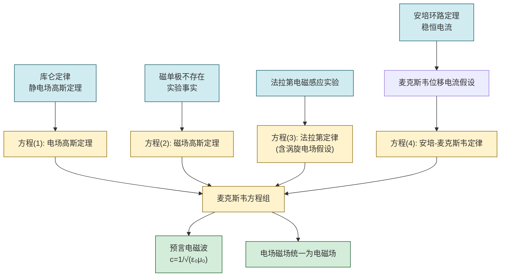
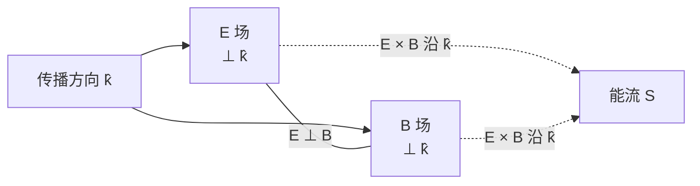

# 8.4 麦克斯韦方程组简介

> [!info] 本节定位
> 本节是整个经典电磁学的**收束与高潮**。麦克斯韦（J. C. Maxwell）在总结前人（库仑、高斯、安培、法拉第等）实验定律的基础上，提出了一个关键假设——**位移电流**：变化的电场和传导电流一样能产生磁场。这一假设修补了安培环路定理在非稳恒情形下的矛盾，并与法拉第电磁感应定律（变化磁场产生电场）形成对称，从而把电场与磁场统一为**电磁场**。
>
> 本节解决三个核心问题：
> 1. **为什么需要位移电流**——指出安培环路定理在电容器充电等暂态过程中的矛盾；
> 2. **麦克斯韦方程组是什么**——完整给出四个积分方程，明确每个方程的物理意义；
> 3. **方程组的伟大预言**——电磁波的存在及其传播速度等于光速，由此断言光即电磁波。
>
> 本节是 [[8.1 法拉第电磁感应定律|8.1]]–[[8.3 自感、互感、磁场能量|8.3]] 的理论归宿，也是后续 [[MOC - 第10章|波动光学]]（光为电磁波）与 [[MOC - 第11章|近代物理基础]]（相对论的电磁场变换）的理论源头。

## 一、安培环路定理的矛盾

### 1.1 稳恒条件下的安培环路定理

> [!theorem] 安培环路定理（稳恒电流）
> 在恒定电流条件下（见 [[MOC - 第7章|第7章]]），磁感应强度沿任意闭合回路 $L$ 的线积分等于该回路所包围的传导电流的 $\mu_0$ 倍：
> $$\oint_L\vec B\cdot\mathrm d\vec l=\mu_0 I_{\text{内}}\quad(\text{T·m})$$
> 其中 $I_{\text{内}}$ 是穿过以 $L$ 为边界的任意曲面 $S$ 的传导电流代数和。

### 1.2 矛盾的出现——电容器充电问题

> [!warning] 矛盾
> 考虑一个正在充电的平行板电容器。取一个围绕导线的闭合回路 $L$，并选两个不同的曲面：
> - **曲面 $S_1$** 穿过导线，传导电流 $I$ 穿过它：$\oint\vec B\cdot\mathrm d\vec l=\mu_0 I$；
> - **曲面 $S_2$** 从电容器两极板之间穿过（不穿过导线），板间为真空（或介质），无传导电流穿过：$\oint\vec B\cdot\mathrm d\vec l=\mu_0\cdot 0=0$。
>
> 同一回路 $L$、不同曲面给出不同结果，与磁场环路积分只依赖回路 $L$ 的事实矛盾。说明安培环路定理在**非稳恒情形下失效**，必须修正。

## 二、位移电流假设

### 2.1 位移电流的定义

> [!definition] 位移电流
> 麦克斯韦指出：在电容器充电过程中，极板间虽无传导电流，但**电场随时间变化**。他定义**位移电流（displacement current）** 为电场通量的变化率：
> $$\boxed{\,I_d=\varepsilon_0\frac{\mathrm d\Phi_E}{\mathrm dt}\,}\quad(\text{A})$$
> 其中 $\Phi_E=\int_S\vec E\cdot\mathrm d\vec S$ 是穿过曲面 $S$ 的电场通量（V·m），$\varepsilon_0$ 是真空电容率。
>
> 在介质中更一般的形式为 $I_d=\dfrac{\mathrm d}{\mathrm dt}\int_S\vec D\cdot\mathrm d\vec S$，其中 $\vec D=\varepsilon_0\vec E+\vec P$ 为电位移矢量（C/m²）。

> [!note] 电容器充电时位移电流与传导电流相等
> 设极板电荷为 $q$，充电电流 $I=\dfrac{\mathrm dq}{\mathrm dt}$。平行板间电场 $E=\dfrac{\sigma}{\varepsilon_0}=\dfrac{q}{\varepsilon_0 S}$（$S$ 为极板面积），故 $\Phi_E=ES=\dfrac{q}{\varepsilon_0}$，于是
> $$I_d=\varepsilon_0\frac{\mathrm d\Phi_E}{\mathrm dt}=\varepsilon_0\cdot\frac{1}{\varepsilon_0}\frac{\mathrm dq}{\mathrm dt}=\frac{\mathrm dq}{\mathrm dt}=I$$
> 即位移电流数值上等于极板导线中的传导电流。这就**填补了电容器内部"电流不连续"的空缺**，使电流在空间上闭合。

### 2.2 全电流——安培-麦克斯韦定律

> [!theorem] 安培-麦克斯韦定律
> 把传导电流 $I$ 与位移电流 $I_d$ 合称为**全电流**。修正后的安培环路定理为
> $$\boxed{\,\oint_L\vec B\cdot\mathrm d\vec l=\mu_0\left(I+I_d\right)=\mu_0 I+\mu_0\varepsilon_0\frac{\mathrm d\Phi_E}{\mathrm dt}\,}$$
> 该式对任意（稳恒或非稳恒）情形都成立。

> [!proof] 修正后矛盾消除
> 回到电容器问题，对曲面 $S_2$（穿过极板间）：传导电流 $I=0$，但位移电流 $I_d=\varepsilon_0\dfrac{\mathrm d\Phi_E}{\mathrm dt}=I$，故
> $$\oint\vec B\cdot\mathrm d\vec l=\mu_0(0+I_d)=\mu_0 I$$
> 与曲面 $S_1$ 结果一致，矛盾消除。$\square$

> [!note] 位移电流的物理本质
> 位移电流并非真实电荷的定向运动（真空极板间无电荷流动），而是**变化电场激发磁场**这一物理事实的等效表述。它和法拉第定律（变化磁场激发电场）形成完美的对称：
> - 变化的 $\vec B$ → 激发 $\vec E$（涡旋电场，法拉第定律）；
> - 变化的 $\vec E$ → 激发 $\vec B$（位移电流，安培-麦克斯韦定律）。
>
> 这种对称性是电磁波能够脱离源独立传播的物理根源。

## 三、麦克斯韦方程组（积分形式）

> [!theorem] 麦克斯韦方程组——积分形式（真空）
> 在真空中，电磁场由电场强度 $\vec E$ 和磁感应强度 $\vec B$ 描述，满足以下四个方程：
>
> | 编号 | 方程 | 名称 | 物理意义 |
> | ---- | ---- | ---- | ---- |
> | (1) | $\displaystyle\oint_S\vec E\cdot\mathrm d\vec S=\frac{q_{\text{内}}}{\varepsilon_0}$ | 电场高斯定理 | 电荷是电场的源；电场线起于正电荷止于负电荷 |
> | (2) | $\displaystyle\oint_S\vec B\cdot\mathrm d\vec S=0$ | 磁场高斯定理 | 磁单极不存在；磁感线闭合 |
> | (3) | $\displaystyle\oint_L\vec E\cdot\mathrm d\vec l=-\int_S\frac{\partial\vec B}{\partial t}\cdot\mathrm d\vec S$ | 法拉第电磁感应定律 | 变化磁场激发涡旋电场 |
> | (4) | $\displaystyle\oint_L\vec B\cdot\mathrm d\vec l=\mu_0 I+\mu_0\varepsilon_0\frac{\mathrm d\Phi_E}{\mathrm dt}$ | 安培-麦克斯韦定律 | 传导电流与变化电场共同激发磁场 |
>
> 四个方程中：(1)(2) 描述场的**通量**性质（有源/无源）；(3)(4) 描述场的**环流**性质（有旋/无旋）。它们共同构成经典电磁场的完整方程组。

### 方程组各部分的来源

> [!note] 微分形式（参考）
> 利用斯托克斯定理和高斯散度定理，可把积分形式化为微分形式（真空）：
> $$\nabla\cdot\vec E=\frac{\rho}{\varepsilon_0},\qquad \nabla\cdot\vec B=0$$
> $$\nabla\times\vec E=-\frac{\partial\vec B}{\partial t},\qquad \nabla\times\vec B=\mu_0\vec J+\mu_0\varepsilon_0\frac{\partial\vec E}{\partial t}$$
> 微分形式逐点描述场与源的关系，是求解电磁波方程的出发点。本课程以积分形式为主。

## 四、麦克斯韦方程组的物理意义

### 4.1 电场与磁场的统一

> [!summary] 电磁场统一的要点
> 1. **电场有两个来源**：电荷（方程 1，静电场，有源无旋）与变化磁场（方程 3，涡旋电场，无源有旋）。总电场 $\vec E=\vec E_s+\vec E_v$。
> 2. **磁场有两个来源**：传导电流（方程 4 第一项，恒定磁场）与变化电场（方程 4 第二项，位移电流激发的磁场）。二者都使磁场有旋（方程 2 表明磁场无源）。
> 3. **电场与磁场相互激发**：在远离电荷和电流的区域（$\rho=0$、$\vec J=0$），方程 (3)(4) 退化为 $\nabla\times\vec E=-\dfrac{\partial\vec B}{\partial t}$、$\nabla\times\vec B=\mu_0\varepsilon_0\dfrac{\partial\vec E}{\partial t}$，电场与磁场相互转化、相互支撑，形成**自维持的电磁波**。
> 4. **统一为电磁场**：电场和磁场不再是独立的两种场，而是同一电磁场张量在不同参考系中的不同分量表现。这一观点是狭义相对论的自然推论（见 [[MOC - 第11章|第11章]]）。

### 4.2 麦克斯韦方程组的对称性

> [!note] 理想真空中的对称结构
> 在无源（$\rho=0$、$\vec J=0$）真空中，方程组呈现近乎完美的 $\vec E\leftrightarrow\vec B$ 对称：
> $$\nabla\cdot\vec E=0,\quad \nabla\cdot\vec B=0,\quad \nabla\times\vec E=-\frac{\partial\vec B}{\partial t},\quad \nabla\times\vec B=\mu_0\varepsilon_0\frac{\partial\vec E}{\partial t}$$
> 唯一的不对称是第三、四方程中 $\vec B$ 时间导数前系数的符号差异（来自楞次定律/能量守恒），以及不存在磁单极这一事实。若磁单极存在，方程 (2) 和 (4) 会有对称的源项，但至今实验未发现磁单极（待核实）。

## 五、电磁波的预言

### 5.1 电磁波方程

> [!proof] 由麦克斯韦方程组导出波动方程
> 在无源真空（$\rho=0$、$\vec J=0$）中，对法拉第定律 $\nabla\times\vec E=-\dfrac{\partial\vec B}{\partial t}$ 两边取旋度：
> $$\nabla\times(\nabla\times\vec E)=-\frac{\partial}{\partial t}(\nabla\times\vec B)=-\mu_0\varepsilon_0\frac{\partial^2\vec E}{\partial t^2}$$
> 利用矢量恒等式 $\nabla\times(\nabla\times\vec E)=\nabla(\nabla\cdot\vec E)-\nabla^2\vec E$，以及 $\nabla\cdot\vec E=0$，得
> $$\boxed{\,\nabla^2\vec E=\mu_0\varepsilon_0\frac{\partial^2\vec E}{\partial t^2}\,}$$
> 同理 $\nabla^2\vec B=\mu_0\varepsilon_0\dfrac{\partial^2\vec B}{\partial t^2}$。这是典型的波动方程，波速为
> $$v=\frac{1}{\sqrt{\mu_0\varepsilon_0}}$$
> $\square$

### 5.2 光速的预言

> [!theorem] 电磁波速等于光速
> 代入真空电容率 $\varepsilon_0=8.854\times10^{-12}\,\text{F/m}$ 与真空磁导率 $\mu_0=4\pi\times10^{-7}\,\text{H/m}$：
> $$\boxed{\,c=\frac{1}{\sqrt{\mu_0\varepsilon_0}}\approx 2.998\times10^8\,\text{m/s}\,}$$
> 这一数值与实验测得的真空光速高度吻合。麦克斯韦据此断言：**光本身就是电磁波**，把光学纳入电磁学的统一框架。

> [!example] 数值验算
> $\mu_0\varepsilon_0=4\pi\times10^{-7}\times8.854\times10^{-12}=1.113\times10^{-17}\,\text{s}^2/\text{m}^2$；
> $\sqrt{\mu_0\varepsilon_0}=\sqrt{1.113\times10^{-17}}\approx 3.336\times10^{-9}\,\text{s/m}$；
> $c=\dfrac{1}{3.336\times10^{-9}}\approx 2.998\times10^8\,\text{m/s}$。结果与光速吻合。

### 5.3 电磁波的性质

> [!summary] 真空中平面电磁波的主要性质
> 1. **横波性**：$\vec E\perp\vec k$，$\vec B\perp\vec k$（$\vec k$ 为波矢），即电场、磁场均垂直于传播方向；
> 2. **相互垂直**：$\vec E\perp\vec B$，且 $\vec E\times\vec B$ 指向传播方向；
> 3. **同相振动**：$\vec E$ 与 $\vec B$ 同相位，大小满足 $E=cB$（即 $B=E/c$）；
> 4. **传播速度**：真空中 $c=\dfrac{1}{\sqrt{\mu_0\varepsilon_0}}$，介质中 $v=\dfrac{1}{\sqrt{\mu\varepsilon}}$；
> 5. **能流密度**：坡印廷矢量 $\vec S=\dfrac{1}{\mu_0}\vec E\times\vec B$（W/m²），方向即传播方向，表示单位时间通过单位垂直面积的电磁能量；
> 6. **无需介质**：电磁波可在真空中传播，与机械波依赖介质截然不同。

> [!note] 电磁波谱
> 麦克斯韦理论预言了从无线电波、微波、红外、可见光、紫外、X 射线到 γ 射线的整个电磁波谱，它们仅频率（波长）不同，本质都是电磁波。可见光只占其中极窄一段（约 400–700 nm）。这一统一图景是 19 世纪物理学最伟大的成就之一。

## 六、典型例题

### 例题 1：平行板电容器中的位移电流与磁场

> [!example] 题目
> 圆形平行板电容器极板半径 $R=0.050\,\text{m}$，充电时极板间电场变化率 $\dfrac{\mathrm dE}{\mathrm dt}=1.0\times10^{12}\,\text{V/(m·s)}$，板间为真空。求：(1) 极板间位移电流 $I_d$；(2) 极板间距轴 $r=0.030\,\text{m}$ 处的磁感应强度 $B$；(3) 极板外紧靠边缘 $r=R$ 处的 $B$。

**分析**：位移电流均匀分布在板间，磁场关于板轴对称。用安培-麦克斯韦定律 $\oint\vec B\cdot\mathrm d\vec l=\mu_0 I_d$（板间无传导电流）。

**解**：
(1) $I_d=\varepsilon_0\dfrac{\mathrm d\Phi_E}{\mathrm dt}=\varepsilon_0\pi R^2\dfrac{\mathrm dE}{\mathrm dt}=8.85\times10^{-12}\times\pi\times0.050^2\times1.0\times10^{12}$
$\approx 6.95\times10^{-2}\,\text{A}$。

(2) 板内 $r<R$：取半径 $r$ 的圆回路，所围位移电流 $I_d(r)=\varepsilon_0\pi r^2\dfrac{\mathrm dE}{\mathrm dt}=\dfrac{r^2}{R^2}I_d$。由安培-麦克斯韦定律：
$$B\cdot 2\pi r=\mu_0 I_d(r)=\mu_0\varepsilon_0\pi r^2\frac{\mathrm dE}{\mathrm dt}$$
$$B=\frac{\mu_0\varepsilon_0 r}{2}\frac{\mathrm dE}{\mathrm dt}=\frac{(4\pi\times10^{-7})(8.85\times10^{-12})(0.030)}{2}\times1.0\times10^{12}$$
$$\approx \frac{1.112\times10^{-17}\times0.030\times1.0\times10^{12}}{2}\approx 1.67\times10^{-7}\,\text{T}$$

(3) 板外 $r\ge R$：回路包围全部位移电流 $I_d$，
$$B\cdot 2\pi R=\mu_0 I_d\Rightarrow B=\frac{\mu_0 I_d}{2\pi R}=\frac{4\pi\times10^{-7}\times6.95\times10^{-2}}{2\pi\times0.050}\approx 2.78\times10^{-7}\,\text{T}$$

**方向**：由右手定则，沿环绕板轴的切向，与充电传导电流方向配套（从 $\dfrac{\mathrm dE}{\mathrm dt}$ 方向看为顺时针）。

**单位检验**：$B$ 单位 $\dfrac{\text{T·m}\cdot\text{A}}{\text{m}}=\text{T}$，正确。$B(r<R)\propto r$、$B(r\ge R)\propto 1/r$，与长直螺线管内涡旋电场分布形式一致（互换 $\vec E\leftrightarrow\vec B$、$\dfrac{\mathrm dB}{\mathrm dt}\leftrightarrow\dfrac{\mathrm dE}{\mathrm dt}$）。

### 例题 2：由位移电流验证电流连续性

> [!example] 题目
> 一根长直导线通有交变电流 $I(t)=I_0\cos\omega t$，给一个平行板电容器充电。导线半径 $a$，极板半径 $R$，板间距 $d$，介质真空。求极板间任意时刻的位移电流，验证全电流连续。

**解**：极板上电荷 $q(t)=\int I(t)\,\mathrm dt=\dfrac{I_0}{\omega}\sin\omega t$（设 $q(0)=0$）。板间电场 $E=\dfrac{\sigma}{\varepsilon_0}=\dfrac{q}{\varepsilon_0\pi R^2}$，电场通量 $\Phi_E=ES_{\text{板}}=\dfrac{q}{\varepsilon_0}$（$S_{\text{板}}=\pi R^2$，$\Phi_E=Ed\cdot$截面——更准确：$\Phi_E=\int\vec E\cdot\mathrm d\vec S=E\cdot\pi R^2=\dfrac{q}{\varepsilon_0}$）。
位移电流：
$$I_d=\varepsilon_0\frac{\mathrm d\Phi_E}{\mathrm dt}=\frac{\mathrm dq}{\mathrm dt}=I(t)=I_0\cos\omega t$$
即位移电流瞬时值等于导线中传导电流。全电流在空间上闭合：导线中 $I$（传导）→ 极板表面中断 → 极板间 $I_d$（位移）接续 → 另一极板 → 导线 $I$，形成闭合回路。$\square$

**单位检验**：$I_d=\dfrac{\mathrm dq}{\mathrm dt}$ 单位 A，正确。

### 例题 3：估算可见光的电场强度

> [!example] 题目
> 一束可见光（取波长 $\lambda=550\,\text{nm}$）的能流密度（光强）$S=1.0\times10^3\,\text{W/m}^2$。估算其电场强度振幅 $E_0$ 与磁感应强度振幅 $B_0$。

**分析**：平面电磁波能流密度的时间平均 $\bar S=\dfrac12 c\varepsilon_0 E_0^2$（瞬时 $\vec S=\dfrac{1}{\mu_0}\vec E\times\vec B$，$B=E/c$，对时间求平均后因子 $\tfrac12$ 来自余弦平方平均）。

**解**：
$$E_0=\sqrt{\frac{2\bar S}{c\varepsilon_0}}=\sqrt{\frac{2\times1.0\times10^3}{2.998\times10^8\times8.85\times10^{-12}}}=\sqrt{\frac{2.0\times10^3}{2.653\times10^{-3}}}$$
$$=\sqrt{7.54\times10^5}\approx 8.7\times10^2\,\text{V/m}$$

$$B_0=\frac{E_0}{c}=\frac{8.7\times10^2}{2.998\times10^8}\approx 2.9\times10^{-6}\,\text{T}$$

**单位检验**：$E_0$ 单位 $\sqrt{\dfrac{\text{W/m}^2}{(\text{m/s})\cdot\text{F/m}}}=\sqrt{\dfrac{\text{J/(s·m}^2)}{\text{C/(V·m)}\cdot\text{m/s}}}=\sqrt{\text{(V/m)}^2}=\text{V/m}$，正确。$B_0$ 单位 $\dfrac{\text{V/m}}{\text{m/s}}=\text{T}$，正确。

> [!note] 数量级说明
> 日常光强下，可见光电场振幅约 $10^2\text{–}10^3\,\text{V/m}$，磁感应强度仅 $10^{-6}\,\text{T}$ 量级。这就是为什么电磁波中电场效应通常远比磁场效应显著（例如使感光底片曝光的主要是电场作用），但二者是同一电磁波不可分割的两个分量。

## 七、易错点

> [!warning] 易错点
> 1. **位移电流不是电荷流动**：真空极板间无电荷定向运动，位移电流是"变化电场"的等效描述。不要把它当作真实电流处理电路中的焦耳热。
> 2. **方程 (4) 不要漏掉位移电流项**：$\oint\vec B\cdot\mathrm d\vec l=\mu_0 I+\mu_0\varepsilon_0\dfrac{\mathrm d\Phi_E}{\mathrm dt}$，在暂态、交流、电磁波问题中第二项不可忽略。稳恒条件下 $\Phi_E$ 不变，第二项为零，退化为安培环路定理。
> 3. **方程 (3) 中是 $\dfrac{\partial\vec B}{\partial t}$**：是磁场对时间的偏导数（在某固定点），不要写成全导数；回路本身运动时需另行处理。
> 4. **四个方程要配对理解**：(1)(2) 是通量定理（闭合曲面），(3)(4) 是环路定理（闭合回路），不要混用积分区域类型。
> 5. **$c=\dfrac{1}{\sqrt{\mu_0\varepsilon_0}}$ 仅限真空**：介质中波速 $v=\dfrac{1}{\sqrt{\mu\varepsilon}}=\dfrac{c}{n}$，$n$ 为折射率。
> 6. **电磁波 $E=cB$ 不是 $E=B$**：二者单位不同，数值上 $E$（V/m）与 $cB$（m/s × T = V/m）一致，不是 $E$ 与 $B$ 数值相等。
> 7. **磁单极不存在是实验事实而非理论必然**：方程 (2) $\oint\vec B\cdot\mathrm d\vec S=0$ 反映目前实验结论；理论上若发现磁单极，该方程需修改（狄拉克磁单极理论，待核实）。

## 八、与其他小节的联系

- 方程 (3) 即 [[8.1 法拉第电磁感应定律|8.1]] 与 [[8.2 动生电动势、感生电动势|8.2]] 中感生电动势的法拉第定律积分形式；
- 方程 (4) 的位移电流项是本节的核心创新，与 [[8.2 动生电动势、感生电动势|8.2]] 中"变化磁场产生电场"形成对称；
- 电磁波能量密度 $w=\dfrac12(\varepsilon_0 E^2+\dfrac{B^2}{\mu_0})$ 综合了 [[8.3 自感、互感、磁场能量|8.3]] 的磁场能量与电场能量；
- 电磁波理论是 [[MOC - 第10章|第10章 波动光学]]的理论基础（光即电磁波）；
- 电磁场的统一是 [[MOC - 第11章|第11章 近代物理基础]]中狭义相对论电磁场变换的物理动机；
- 本章 MOC：[[MOC - 第8章]]。

## 章节导航

- 上一级：[[MOC - 第8章]]
- 上一节：[[8.3 自感、互感、磁场能量]]
- 下一章：[[MOC - 第9章|第9章 机械振动与机械波]]（机械波与电磁波的对比）
- 关联：[[MOC - 第10章|第10章 波动光学]]（光为电磁波）
- 习题：[[MOC - 第8章习题]]
