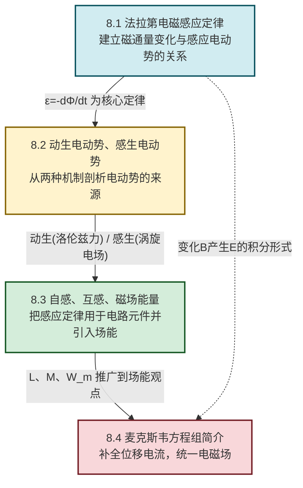

# MOC - 第8章 电磁感应与电磁场

> [!info] 本章定位
> 电磁感应与电磁场（Electromagnetic Induction and Electromagnetic Field）是经典电磁学的**收束与统一之章**。它要解决的核心问题是：**变化的磁场如何产生电场、变化的电场如何产生磁场，从而把电场与磁场统一为一个整体——电磁场**。
>
> 本章在 [[MOC - 第7章|恒定磁场]]（毕奥-萨伐尔定律、安培环路定理）和 [[MOC - 第6章|静电场]]（高斯定理、环路定理）的基础上展开：第7章解决了"电流产生磁场"和"磁场对电流的作用"，本章则回答其逆问题——"变化的磁场产生电场"（法拉第电磁感应定律），并进一步由麦克斯韦补充"变化的电场产生磁场"（位移电流），最终汇成**麦克斯韦方程组**。这是整个经典物理学最美的理论综合之一，也是电磁波存在的理论预言来源。
>
> 本章讨论范围限定于**宏观、低速（$v\ll c$）、经典电磁场**；量子效应与相对论修正见第11章近代物理基础。公式中各物理量均采用 SI 单位。

## 学习路线图

## 知识点导航

| 小节 | 标题 | 核心内容 | 关键物理量（SI单位） |
| ---- | ---- | -------- | -------------------- |
| [[8.1 法拉第电磁感应定律\|8.1]] | 法拉第电磁感应定律 | 电磁感应现象、磁通量 $\Phi$、法拉第定律 $\varepsilon=-\dfrac{\mathrm d\Phi}{\mathrm dt}$、楞次定律、负号与能量守恒 | 磁通量 $\Phi$（Wb）、电动势 $\varepsilon$（V） |
| [[8.2 动生电动势、感生电动势\|8.2]] | 动生电动势、感生电动势 | 动生电动势 $\varepsilon=\int(\vec v\times\vec B)\cdot\mathrm d\vec l$（洛伦兹力做功）、感生电动势与涡旋电场 $\oint\vec E_v\cdot\mathrm d\vec l=-\int\dfrac{\partial\vec B}{\partial t}\cdot\mathrm d\vec S$、涡旋电场性质 | 速度 $\vec v$（m/s）、涡旋电场 $\vec E_v$（V/m） |
| [[8.3 自感、互感、磁场能量\|8.3]] | 自感、互感、磁场能量 | 自感 $L=\Phi/I$、互感 $M=\Phi_{21}/I_1$、RL 暂态、磁场能量 $W_m=\tfrac12 LI^2$、磁能密度 $w_m=\dfrac{B^2}{2\mu_0}$ | 自感 $L$（H）、磁能 $W_m$（J）、磁能密度 $w_m$（J/m³） |
| [[8.4 麦克斯韦方程组简介\|8.4]] | 麦克斯韦方程组简介 | 位移电流 $I_d=\varepsilon_0\dfrac{\mathrm d\Phi_E}{\mathrm dt}$、四个积分方程、电磁波预言 $c=\dfrac{1}{\sqrt{\varepsilon_0\mu_0}}$、电磁场统一 | 位移电流 $I_d$（A）、光速 $c$（m/s） |

## 核心考点

> [!summary] 本章核心考点（7 点）
> 1. **法拉第电磁感应定律的应用**：由 $\Phi(t)$ 求 $\varepsilon=-\dfrac{\mathrm d\Phi}{\mathrm dt}$，注意 $\Phi=\int\vec B\cdot\mathrm d\vec S$ 是面积分，磁通量正负与面法向（右手定则与回路绕行方向配套）有关。
> 2. **楞次定律判定方向**：感应电流的磁场总是阻碍引起它的磁通量变化。这是负号的物理体现，也是判定方向的统一法则，比直接套符号更可靠。
> 3. **动生电动势计算**：$\varepsilon=\int(\vec v\times\vec B)\cdot\mathrm d\vec l$，本质是洛伦兹力 $\vec f=q\vec v\times\vec B$ 对载流子做功。直导线在均匀磁场中平动用 $\varepsilon=Bvl$（$B\perp v\perp l$）；转动的导体棒用 $\varepsilon=\tfrac12 B\omega l^2$。
> 4. **感生电动势与涡旋电场**：变化磁场在空间激发涡旋电场 $\vec E_v$，满足 $\oint\vec E_v\cdot\mathrm d\vec l=-\int\dfrac{\partial\vec B}{\partial t}\cdot\mathrm d\vec S$。涡旋电场**无源有旋**，与静电场（有源无旋）本质不同。
> 5. **自感与互感计算**：$L=\Phi/I$ 与 $M=\Phi_{21}/I_1$ 依赖线圈几何与磁介质；自感电动势 $\varepsilon_L=-L\dfrac{\mathrm dI}{\mathrm dt}$，互感电动势 $\varepsilon_{21}=-M\dfrac{\mathrm dI_1}{\mathrm dt}$，负号仍由楞次定律解释。
> 6. **磁场能量**：$W_m=\tfrac12 LI^2=\int\dfrac{B^2}{2\mu_0}\mathrm dV$，表明**磁场储存能量于场中**而非仅在线圈；磁能密度 $w_m=\dfrac{B^2}{2\mu_0}=\tfrac12\vec B\cdot\vec H$。
> 7. **麦克斯韦方程组与位移电流**：四个积分方程完整写出；安培-麦克斯韦定律 $\oint\vec B\cdot\mathrm d\vec l=\mu_0(I+I_d)$ 中 $I_d=\varepsilon_0\dfrac{\mathrm d\Phi_E}{\mathrm dt}$ 修补了安培环路定理在非稳恒电流下的矛盾，并预言电磁波 $c=\dfrac{1}{\sqrt{\varepsilon_0\mu_0}}\approx 3\times10^8\,\text{m/s}$。

## 自测题

> [!question]- 自测 1：磁通量与感应电动势
> 半径 $R=0.10\,\text{m}$ 的圆形线圈共 $N=50$ 匝，置于均匀磁场中，磁场方向垂直线圈平面。磁感应强度随时间变化为 $B=0.40+0.20t$（SI，$t$ 单位 s）。求线圈中的感应电动势大小与方向。
>
> > [!check]- 答案
> > 单匝磁通量 $\Phi=B\cdot\pi R^2$，取面法向与 $\vec B$ 同向。
> > $\varepsilon=-N\dfrac{\mathrm d\Phi}{\mathrm dt}=-N\pi R^2\dfrac{\mathrm dB}{\mathrm dt}=-50\times\pi\times0.10^2\times0.20\approx-0.314\,\text{V}$。
> > 大小 $|\varepsilon|\approx 0.314\,\text{V}$。$\dfrac{\mathrm dB}{\mathrm dt}>0$，磁通量增加，由楞次定律感应电流磁场应反抗 $\vec B$，故感应电流方向（从 $\vec B$ 方向看）为顺时针。

> [!question]- 自测 2：动生电动势
> 长 $l=0.50\,\text{m}$ 的直导体棒在 $B=0.60\,\text{T}$ 的均匀磁场中绕其一端以角速度 $\omega=20\,\text{rad/s}$ 转动，$\vec B\perp$ 转动平面。求棒两端电势差（动生电动势）并指出哪端电势高。
>
> > [!check]- 答案
> > 距转轴 $r$ 处线速度 $v=\omega r$，方向恒与棒垂直且与 $\vec B$ 垂直：
> > $$\varepsilon=\int_0^l B\omega r\,\mathrm dr=\tfrac12 B\omega l^2=\tfrac12\times0.60\times20\times0.50^2=1.5\,\text{V}$$
> > 由 $\vec v\times\vec B$ 方向（洛伦兹力推向正电荷的端点）判断，棒**自由端电势高**。

> [!question]- 自测 3：自感与磁场能量
> 一长直螺线管长 $L=0.20\,\text{m}$、截面积 $S=2.0\times10^{-4}\,\text{m}^2$、匝数 $N=400$，内部为真空。通有 $I=2.0\,\text{A}$ 电流时，求自感系数 $L$（注意符号重名，本题以 $L_s$ 表示自感）与所储磁场能量。
>
> > [!check]- 答案
> > 螺线管内 $B=\mu_0 nI=\mu_0\dfrac{N}{L}I$，单匝磁通 $\Phi=BS=\mu_0\dfrac{N}{L}IS$，总磁链 $\Psi=N\Phi=\mu_0\dfrac{N^2}{L}IS$。
> > $$L_s=\frac{\Psi}{I}=\mu_0\frac{N^2}{L}S=4\pi\times10^{-7}\times\frac{400^2}{0.20}\times2.0\times10^{-4}\approx 2.01\times10^{-4}\,\text{H}=0.201\,\text{mH}$$
> > 磁场能量 $W_m=\tfrac12 L_s I^2=\tfrac12\times2.01\times10^{-4}\times2.0^2\approx 4.02\times10^{-4}\,\text{J}$。

> [!question]- 自测 4：位移电流
> 平行板电容器极板为半径 $R=0.050\,\text{m}$ 的圆盘，充电时极板间电场变化率 $\dfrac{\mathrm dE}{\mathrm dt}=1.0\times10^{12}\,\text{V/(m·s)}$。求极板间的位移电流 $I_d$，并说明它产生的磁场方向。
>
> > [!check]- 答案
> > $I_d=\varepsilon_0\dfrac{\mathrm d\Phi_E}{\mathrm dt}=\varepsilon_0\pi R^2\dfrac{\mathrm dE}{\mathrm dt}=8.85\times10^{-12}\times\pi\times0.050^2\times1.0\times10^{12}\approx 6.95\times10^{-2}\,\text{A}$。
> > 充电时 $\vec E$ 增强，$\dfrac{\mathrm d\vec E}{\mathrm dt}$ 方向与 $\vec E$ 同向。位移电流产生磁场的方向由右手定则判断：与充电传导电流 $I$ 在导线中产生的磁场方向一致，即从电场方向看为顺时针环绕（与传导电流方向配套）。

## 章节导航

> [!nav] 导航
> 上级：[[MOC - 大学物理B|大学物理B 课程总览]]
> 先修：[[MOC - 第7章|第7章 恒定磁场]]、[[MOC - 第6章|第6章 静电场]]
> 下一章：[[MOC - 第9章|第9章 机械振动与机械波]]（电磁波与机械波的对比）
> 配套习题：[[MOC - 第8章习题|第8章 习题]]
