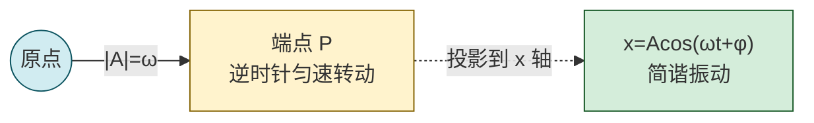

# 9.1 简谐振动、旋转矢量

> [!info] 本节定位
> 本节是整个第9章的**数学与物理基础**。它要回答的核心问题是：**一个受到线性回复力的物体，其位移如何随时间变化？** 答案是余弦（或正弦）函数形式的**简谐振动（simple harmonic motion, SHM）**：
> $$x=A\cos(\omega t+\varphi)$$
> 这一形式之所以重要，是因为：第一，弹簧振子、单摆、复摆、LC 振荡电路乃至分子振动、晶格声子在微小振幅近似下都归结为同一数学方程 $\ddot x+\omega^2 x=0$；第二，相位 $(\omega t+\varphi)$ 与旋转矢量表示法把"周期状态"几何化，是处理振动合成、波的干涉、交流电必不可少的语言。
>
> 本节为 [[9.2 简谐振动能量、阻尼振动、受迫振动|9.2 能量与受迫振动]]（频率 $\omega$ 决定能量 $\tfrac12 kA^2$ 与共振条件）、[[9.3 平面简谐波波动方程|9.3 波动方程]]（波是介质中各点按相位滞后依次作同频简谐振动）、[[9.4 波的干涉、驻波|9.4 干涉与驻波]]（相位差 $\Delta\varphi$ 决定加强减弱）提供共同的语言基础。

## 一、简谐振动的动力学定义

> [!definition] 简谐振动（动力学定义）
> 若质点所受合外力 $\vec F$ 总与相对平衡位置的位移 $\vec x$ 成正比、方向相反（线性回复力），即
> $$F=-kx\quad(\text{N})$$
> 其中 $k$ 为回复力系数（弹簧情形即劲度系数，单位 N/m），$x$ 为相对平衡位置的位移（m），则质点的运动称为**简谐振动**。由牛顿第二定律 $m\ddot x=-kx$，得
> $$\boxed{\,\ddot x+\omega^2 x=0,\qquad \omega=\sqrt{\frac{k}{m}}\,}\quad(\omega\text{ 单位 rad/s})$$
> 这是简谐振动的**动力学方程（微分形式）**。任何满足 $\ddot\xi+\omega^2\xi=0$ 的物理量 $\xi$ 都在做简谐振动。

> [!note] 理想化假设与有效范围
> - 回复力严格线性（胡克定律成立）。对弹簧要求形变在弹性限度内；对单摆、复摆要求摆角 $\theta$ 足够小（一般 $\theta<5^\circ$，$\sin\theta\approx\theta$ 误差 $<0.1\%$）；
> - 质量集中、弹簧质量忽略（弹簧振子）；刚体不变形（复摆）；
> - 忽略一切阻力（无阻尼理想模型，阻尼见 [[9.2 简谐振动能量、阻尼振动、受迫振动|9.2]]）；
> - $\omega$ 完全由系统本身（$k$、$m$ 或 $g$、$l$ 等）决定，与振幅、初条件无关——这是简谐振动的**等时性**。

### 常见简谐振动系统

| 系统 | 回复力（矩） | 角频率 $\omega$ | 周期 $T$ |
| ---- | ---- | ---- | ---- |
| 弹簧振子 | $F=-kx$ | $\sqrt{k/m}$ | $2\pi\sqrt{m/k}$ |
| 单摆（小角） | $F\approx-mg\theta$，力 $-mg\,x/l$ | $\sqrt{g/l}$ | $2\pi\sqrt{l/g}$ |
| 复摆（小角） | 力矩 $M=-mgl_c\theta$ | $\sqrt{mgl_c/J}$ | $2\pi\sqrt{J/(mgl_c)}$ |
| 扭摆 | 力矩 $M=-\kappa\theta$ | $\sqrt{\kappa/J}$ | $2\pi\sqrt{J/\kappa}$ |
| LC 振荡（电学类比） | "回复" $\dfrac{q}{C}$ | $1/\sqrt{LC}$ | $2\pi\sqrt{LC}$ |

表中 $l$ 为摆长（m），$l_c$ 为复摆质心到转轴距离（m），$J$ 为转动惯量（kg·m²），$\kappa$ 为扭转系数（N·m/rad），$g$ 为重力加速度（m/s²）。复摆推导见 [[MOC - 第4章|第4章]]。

## 二、简谐振动的运动学方程与特征量

解微分方程 $\ddot x+\omega^2 x=0$ 得通解 $x=A\cos(\omega t+\varphi)$（也可写作正弦形式，二者差一相位）。

> [!theorem] 简谐振动运动学方程
> $$\boxed{\,x=A\cos(\omega t+\varphi)\,}\quad(\text{m})$$
> 速度 $v=\dot x=-A\omega\sin(\omega t+\varphi)\quad(\text{m/s})$
> 加速度 $a=\ddot x=-A\omega^2\cos(\omega t+\varphi)=-\omega^2 x\quad(\text{m/s}^2)$
> 后者正是 $a=-\omega^2 x$，与 $F=-kx=ma$ 自洽（$k=m\omega^2$）。

> [!definition] 特征量
> - **振幅 $A$**（amplitude，m）：位移最大值，$A=\sqrt{x_0^2+(v_0/\omega)^2}$，由初条件决定，与系统无关；
> - **角频率 $\omega$**（angular frequency，rad/s）：$2\pi$ 秒内完成的振动弧度数，$\omega=\sqrt{k/m}$，由系统决定；
> - **频率 $\nu$**（frequency，Hz）：单位时间振动次数，$\nu=\omega/(2\pi)$；
> - **周期 $T$**（period，s）：完成一次全振动的时间，$T=2\pi/\omega=1/\nu$；
> - **相位 $\omega t+\varphi$**（phase，rad）：唯一决定 $t$ 时刻振动状态（位置与速度方向）；
> - **初相 $\varphi$**（initial phase，rad）：$t=0$ 时刻的相位。

> [!warning] 相位与状态
> 1. 相位 $(\omega t+\varphi)$ 与振动状态一一对应，但状态还包括速度方向：相位差 $2\pi$ 的两状态完全相同；相位差 $\pi$ 的两状态位移相反、速度方向也相反。
> 2. 初相 $\varphi$ 不是"初始位置的角度"，而是初始时刻在 $[0,2\pi)$ 内的相位。它由 $x_0$ 与 $v_0$ **联合**确定（见下文）。
> 3. $\omega$ 的单位 rad/s 中 rad 是无量纲量，但保留 rad 有助于物理理解；$T=2\pi/\omega$ 单位检验 $\text{s}=\text{s}/1$ 自洽。

## 三、初相的确定

由初条件 $x_0=A\cos\varphi$、$v_0=-A\omega\sin\varphi$ 联立：

$$A=\sqrt{x_0^2+\left(\frac{v_0}{\omega}\right)^2},\qquad \tan\varphi=-\frac{v_0}{\omega x_0}$$

> [!warning] 象限判定
> $\tan\varphi$ 有多值性，必须结合 $\cos\varphi=x_0/A$ 与 $\sin\varphi=-v_0/(A\omega)$ 的**正负**确定 $\varphi$ 所在象限。最稳妥方法是**旋转矢量法**（见下节）：把 $t=0$ 时旋转矢量端点的位置直接画出来。

## 四、旋转矢量表示法

> [!definition] 旋转矢量（相量）
> 在 $xy$ 平面内作一矢量 $\vec A$，起点为原点，模长为 $A$，以角速度 $\omega$ 绕原点**逆时针**匀速转动。设 $t=0$ 时 $\vec A$ 与 $x$ 轴夹角为 $\varphi$，则 $t$ 时刻 $\vec A$ 与 $x$ 轴夹角为 $\omega t+\varphi$。$\vec A$ 在 $x$ 轴上的投影
> $$x=A\cos(\omega t+\varphi)$$
> 恰为简谐振动位移。这种表示称为**旋转矢量法**（或振幅矢量法、相量法）。

> [!note] 旋转矢量的几个对应
> - 矢量模长 $A$ ↔ 振幅；
> - 角速度 $\omega$ ↔ 角频率；
> - 初始夹角 $\varphi$ ↔ 初相；
> - 端点在 $x$ 轴投影 ↔ 位移 $x$；
> - 端点在 $y$ 轴投影 ↔ $A\sin(\omega t+\varphi)$（正弦形式振动）；
> - 端点线速度在 $x$ 轴投影 $-A\omega\sin(\omega t+\varphi)$ ↔ 振动速度 $v$。

> [!tip] 旋转矢量法的用途
> 1. **求初相**：直接根据 $x_0$ 正负与 $v_0$ 方向画出 $t=0$ 矢量位置，量出 $\varphi$；
> 2. **比较相位**：两振动相位差即两矢量夹角，落后者位于顺时针方向；
> 3. **同向同频合成**：两旋转矢量按平行四边形合成为一个同频旋转矢量，模长与初相即合振幅与合初相（见 [[#六、同一直线同频率简谐振动的合成]]）；
> 4. **判断时间间隔**：两状态间相位差 $\Delta\varphi$ 对应时间 $\Delta t=\Delta\varphi/\omega$。

> [!example] 用旋转矢量求初相
> 弹簧振子 $A=0.040\,\text{m}$、$\omega=5.0\,\text{rad/s}$。$t=0$ 时 $x_0=0.020\,\text{m}$ 且向正方向运动（$v_0>0$）。
>
> **解**：$x_0=A\cos\varphi=0.020$，$\cos\varphi=0.5$，$\varphi=\pm\pi/3$。又 $v_0=-A\omega\sin\varphi>0$，故 $\sin\varphi<0$，$\varphi=-\pi/3$。
> 旋转矢量解释：$t=0$ 矢量在第一象限（$x>0$）但下一刻投影增大，说明矢量正向 $x$ 轴靠近、即位于 $x$ 轴下方，故 $\varphi=-\pi/3$（或 $5\pi/3$）。
> 振动方程 $x=0.040\cos(5.0t-\pi/3)\,\text{m}$。

## 五、相位差与时间差

> [!theorem] 相位差
> 两个同频简谐振动 $x_1=A_1\cos(\omega t+\varphi_1)$、$x_2=A_2\cos(\omega t+\varphi_2)$ 的**相位差**
> $$\Delta\varphi=\varphi_2-\varphi_1\quad(\text{rad})$$
> 与时间无关。若 $\Delta\varphi>0$，称 $x_2$ 比 $x_1$ **超前** $\Delta\varphi$（或 $x_1$ 比 $x_2$ 落后 $\Delta\varphi$）。
> 对应时间差 $\Delta t=\Delta\varphi/\omega$。

> [!warning] 相位差归约
> 习惯上把 $\Delta\varphi$ 归约到 $(-\pi,\pi]$ 内比较。如 $\Delta\varphi=3\pi/2$ 等价于 $-\pi/2$，即 $x_2$ 实际比 $x_1$ 落后 $\pi/2$。用旋转矢量看：夹角大于 $\pi$ 时取短角方向更直观。

## 六、同一直线同频率简谐振动的合成

> [!theorem] 同向同频合成
> $x_1=A_1\cos(\omega t+\varphi_1)$、$x_2=A_2\cos(\omega t+\varphi_2)$，则
> $$x=x_1+x_2=A\cos(\omega t+\varphi)$$
> 仍为同频简谐振动，其中
> $$\boxed{\,A=\sqrt{A_1^2+A_2^2+2A_1A_2\cos\Delta\varphi}\,}$$
> $$\tan\varphi=\frac{A_1\sin\varphi_1+A_2\sin\varphi_2}{A_1\cos\varphi_1+A_2\cos\varphi_2}$$
> $\Delta\varphi=\varphi_2-\varphi_1$。

> [!proof] 用旋转矢量证明
> 两同频旋转矢量 $\vec A_1$、$\vec A_2$ 以同一 $\omega$ 转动，二者夹角 $\Delta\varphi$ 恒定。由平行四边形法则，合矢量 $\vec A=\vec A_1+\vec A_2$ 也以 $\omega$ 同步转动，模长不变。由余弦定理
> $$A^2=A_1^2+A_2^2+2A_1A_2\cos\Delta\varphi$$
> 合矢量在 $x$ 轴投影等于分矢量投影之和，故合成仍是同频简谐振动。$\square$

> [!note] 两种重要特例
> - **同相**（$\Delta\varphi=2k\pi$）：$A=A_1+A_2$，**最大加强**；
> - **反相**（$\Delta\varphi=(2k+1)\pi$）：$A=|A_1-A_2|$，**最大减弱**；当 $A_1=A_2$ 时完全抵消（$A=0$）。

> [!warning] 适用条件
> 上述合成公式仅适用于**同方向、同频率**。若频率不同，合成不再是简谐振动，会出现**拍**（频率相近时振幅周期性变化，拍频 $\nu_{\text{拍}}=|\nu_1-\nu_2|$）；若方向互相垂直，合成轨迹为**李萨如图形**（频率比为整数比时闭合）。这些情形超出本章基本要求，但拍现象是声学调音的常用判据。

## 七、典型例题

### 例题 1：由初条件建立振动方程

> [!example] 题目
> 劲度系数 $k=8.0\,\text{N/m}$ 的轻弹簧下挂 $m=0.50\,\text{kg}$ 物体。将物体自平衡位置向右拉 $0.060\,\text{m}$ 后给予向右初速度 $v_0=0.24\,\text{m/s}$ 释放。取向右为正，$t=0$ 为释放时刻，写出振动方程并求从释放到第一次到达正向最大位移所需时间。

**解**：$\omega=\sqrt{k/m}=\sqrt{8.0/0.50}=\sqrt{16}=4.0\,\text{rad/s}$。
$A=\sqrt{x_0^2+(v_0/\omega)^2}=\sqrt{0.060^2+(0.24/4.0)^2}=\sqrt{3.6\times10^{-3}+3.6\times10^{-3}}=\sqrt{7.2\times10^{-3}}\approx 0.0849\,\text{m}$。
$\cos\varphi=x_0/A=0.060/0.0849\approx 0.707$，$\sin\varphi=-v_0/(A\omega)=-0.24/(0.0849\times4.0)\approx-0.707$，故 $\varphi=-\pi/4$。
$$x\approx 0.0849\cos(4.0t-\pi/4)\,\text{m}$$

第一次到正向最大位移对应相位 $\omega t-\pi/4=0$，$t=\pi/(4\omega)=\pi/16\approx 0.196\,\text{s}$。

**单位检验**：$\omega$ 单位 $\sqrt{\text{N/m}/\text{kg}}=\sqrt{\text{kg/s}^2/\text{kg}}=\text{s}^{-1}$；$A$ 单位 m；$t$ 单位 s，自洽。

### 例题 2：振动合成

> [!example] 题目
> 三个同向同频简谐振动 $x_1=A_0\cos\omega t$、$x_2=A_0\cos(\omega t+2\pi/3)$、$x_3=A_0\cos(\omega t+4\pi/3)$。求合振动。

**解**：用旋转矢量，三个矢量模长均为 $A_0$，相位依次差 $2\pi/3$，正好在圆周上三等分分布，矢量和为零。
$$A=\sqrt{A_0^2+A_0^2+2A_0^2\cos(2\pi/3)}\text{（先合 }x_1+x_2\text{）}=A_0$$
$(x_1+x_2)$ 与 $x_3$ 相位差恰为 $\pi$（$x_1+x_2$ 的相位为 $\pi/3$，$x_3$ 相位为 $4\pi/3$），故 $A_{\text{合}}=A_0-A_0=0$。
$$x_1+x_2+x_3=0$$

> [!note] 物理意义
> 三相对称振动合成相消，这正是三相交流电中性线电流为零（对称负载时）的力学类比。

### 例题 3：相位差与时间差

> [!example] 题目
> 一简谐振动周期 $T=0.80\,\text{s}$。质点从正向最大位移处运动到 $x=A/2$（向负方向运动）需多少时间？

**解**：正向最大位移处相位 $\varphi_1=0$。$x=A/2$ 且向负方向运动，对应相位 $\varphi_2=\pi/3$（$\cos\varphi_2=1/2$ 且 $\sin\varphi_2>0$ 使 $v<0$）。
相位差 $\Delta\varphi=\pi/3$，$\Delta t=\Delta\varphi/\omega=\dfrac{\pi/3}{2\pi/T}=\dfrac{T}{6}=\dfrac{0.80}{6}\approx 0.133\,\text{s}$。

**单位检验**：$T/6$ 单位 s，正确。

## 八、易错点

> [!warning] 易错点
> 1. **混淆 $\omega$ 与 $\nu$**：$\omega=2\pi\nu$，前者单位 rad/s，后者 Hz。代入公式时务必区分，常见错误是周期写成 $T=1/\omega$。
> 2. **初相只由 $x_0$ 决定**：错。$\varphi$ 由 $x_0$ 与 $v_0$ 联合决定，相同 $x_0$ 不同 $v_0$ 给出不同 $\varphi$（差 $\pi$）。
> 3. **相位差方向判反**：$\Delta\varphi=\varphi_2-\varphi_1>0$ 表示 $x_2$ 超前 $x_1$，但需归约到 $(-\pi,\pi]$；超 $\pi/2$ 后"超前"应改说"落后"。
> 4. **旋转矢量转向**：约定逆时针为正、角速度 $\omega>0$。若误画顺时针将得到 $\omega<0$ 的错误结果。
> 5. **合成公式滥用**：同向同频才能直接用余弦定理合振幅公式；不同频或不同向需用三角和差化积或分量法。
> 6. **单位遗漏**：$T=2\pi\sqrt{m/k}$ 中 $m$（kg）、$k$（N/m），不要把 g 当 kg 用。

## 九、与其他小节的联系

- 本节建立的 $x=A\cos(\omega t+\varphi)$ 与能量 $E=\tfrac12 kA^2$ 直接服务于 [[9.2 简谐振动能量、阻尼振动、受迫振动|9.2]]，阻尼与受迫振动是本节理想模型的修正；
- 把单个振子的振动状态按相位滞后推广到空间，即 [[9.3 平面简谐波波动方程|9.3]] 的波动方程 $y=A\cos[\omega(t-x/v)+\varphi]$；
- 相位差 $\Delta\varphi$ 的概念在 [[9.4 波的干涉、驻波|9.4]] 中决定干涉加强与减弱、驻波波节波腹位置；
- 旋转矢量法也是 [[9.5 多普勒效应|9.5]] 之外分析振动合成的统一工具；
- 本章 MOC：[[MOC - 第9章]]。

## 章节导航

- 上一级：[[MOC - 第9章]]
- 先修：[[MOC - 第4章]]（刚体转动惯量，复摆推导）
- 下一节：[[9.2 简谐振动能量、阻尼振动、受迫振动]]
- 习题：[[MOC - 第9章习题]]
