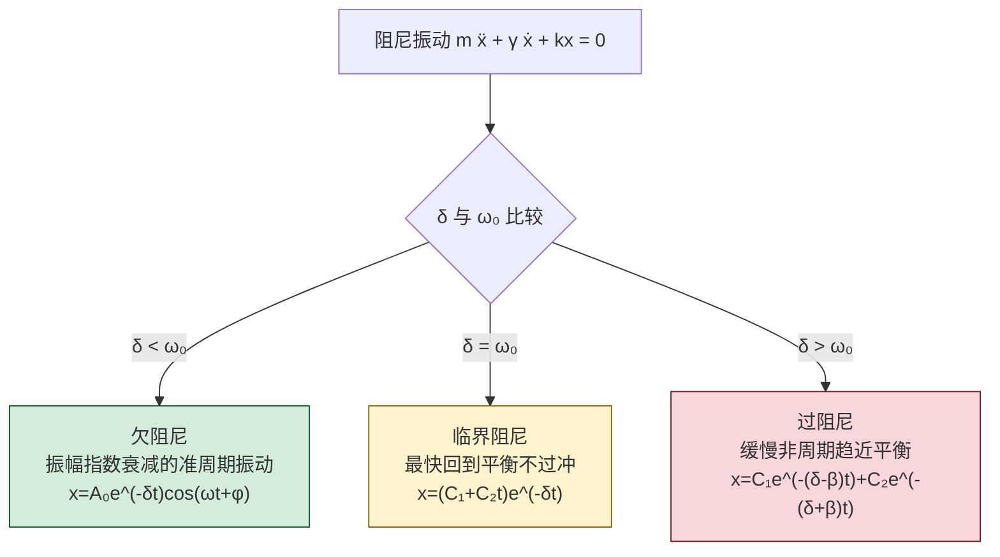
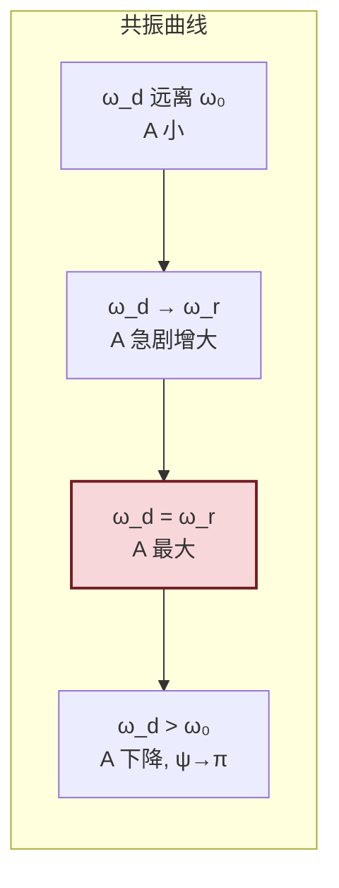

# 9.2 简谐振动能量、阻尼振动、受迫振动

> [!info] 本节定位
> 本节把 [[9.1 简谐振动、旋转矢量|9.1]] 建立的理想简谐振动模型向**能量**与**实际条件**两个方向拓展。它要回答三个核心问题：
> 1. **简谐振动的能量从哪里来、储存在哪里？** —— 动能与势能相互转化，总和 $\tfrac12 kA^2$ 守恒；
> 2. **有阻力时振动如何衰减？** —— 阻尼振动，按阻力大小分为欠阻尼、临界阻尼、过阻尼；
> 3. **有周期性驱动力时振动如何演化？** —— 受迫振动，过渡到稳态后以驱动力频率振动；当驱动力频率接近系统固有频率时发生**共振**。
>
> 本节为 [[9.3 平面简谐波波动方程|9.3]]（波是能量在介质中的传播，能流密度概念）、[[9.4 波的干涉、驻波|9.4]]（驻波能量在波节波腹间转移）提供能量观点；共振概念也直接关联声学、机械工程与电学中的谐振电路。

## 一、简谐振动的能量

以弹簧振子为例（结论对一般简谐振动普适）。设质量 $m$、劲度系数 $k$、振动 $x=A\cos(\omega t+\varphi)$，$\omega=\sqrt{k/m}$。

> [!theorem] 简谐振动能量
> - **动能**：
> $$E_k=\frac12 mv^2=\frac12 mA^2\omega^2\sin^2(\omega t+\varphi)=\frac12 kA^2\sin^2(\omega t+\varphi)\quad(\text{J})$$
> - **势能**（取平衡位置为零势能点）：
> $$E_p=\frac12 kx^2=\frac12 kA^2\cos^2(\omega t+\varphi)\quad(\text{J})$$
> - **总能量**：
> $$\boxed{\,E=E_k+E_p=\frac12 kA^2=\frac12 m\omega^2A^2\quad(\text{J})\,}$$
> 总能量守恒，且与振幅平方成正比。

> [!proof] 能量守恒证明
> $E_k+E_p=\tfrac12 kA^2[\sin^2(\omega t+\varphi)+\cos^2(\omega t+\varphi)]=\tfrac12 kA^2$，与时间无关。也可由机械能守恒验证：回复力 $F=-kx$ 是保守力，无耗散，故机械能守恒。$\square$

> [!note] 动能、势能的频率
> 利用 $\sin^2\theta=\tfrac12(1-\cos 2\theta)$、$\cos^2\theta=\tfrac12(1+\cos 2\theta)$：
> $$E_k=\frac14 kA^2[1-\cos(2\omega t+2\varphi)],\quad E_p=\frac14 kA^2[1+\cos(2\omega t+2\varphi)]$$
> 动能、势能均以频率 $2\omega$（即 $2\nu$）周期性变化，且二者反相：$E_k$ 最大时 $E_p$ 为零，反之亦然。每周期内能量在动能与势能间"来回交换"两次。

> [!warning] 与波能量的区别
> 单个振子的能量随时间在动能、势能间转移但总和守恒；而 [[9.3 平面简谐波波动方程|9.3]] 中介质质元的能量则**不守恒**——它在不断接收上游能量并向下游传递，这是振动与波动的本质区别之一。

### 能量法求角频率

> [!tip] 能量法
> 若能写出系统机械能 $E=\tfrac12 m_{\text{eff}}\dot x^2+\tfrac12 k_{\text{eff}}x^2$（动能 + 势能的二次型），由 $\dfrac{\mathrm dE}{\mathrm dt}=0$ 即得 $\ddot x+\omega^2 x=0$，其中 $\omega=\sqrt{k_{\text{eff}}/m_{\text{eff}}}$。这是处理复摆、LC 振荡等系统求固有频率的统一方法。

## 二、阻尼振动

实际振动总受阻力。最简单模型是与速度成正比的黏性阻尼 $F_r=-\gamma\dot x$（$\gamma$ 为阻力系数，单位 N·s/m）。

> [!definition] 阻尼振动方程
> $$m\ddot x+\gamma\dot x+kx=0$$
> 令 $\delta=\dfrac{\gamma}{2m}$（阻尼系数，单位 s⁻¹），$\omega_0=\sqrt{k/m}$（固有角频率），方程化为
> $$\boxed{\,\ddot x+2\delta\dot x+\omega_0^2 x=0\,}$$

依 $\delta$ 与 $\omega_0$ 的相对大小分三种情形：

> [!theorem] 三种阻尼情形
> 设 $\beta=\sqrt{\delta^2-\omega_0^2}$（实数或虚数视情形）。
> 1. **欠阻尼**（$\delta<\omega_0$）：振子作振幅指数衰减的准周期振动
> $$x=A_0 e^{-\delta t}\cos(\omega t+\varphi),\qquad \omega=\sqrt{\omega_0^2-\delta^2}$$
> 阻尼使频率略降低（$\omega<\omega_0$），振幅按 $e^{-\delta t}$ 衰减，$A_0$ 为 $t=0$ 包络。
> 2. **临界阻尼**（$\delta=\omega_0$）：$x=(C_1+C_2 t)e^{-\delta t}$，最快回到平衡位置而不过冲，用于仪表指针、门吸。
> 3. **过阻尼**（$\delta>\omega_0$）：$x=C_1 e^{-(\delta-\beta)t}+C_2 e^{-(\delta+\beta)t}$，缓慢非周期趋近平衡，比临界阻尼更慢。

> [!note] 阻尼描述量
> - **对数减缩** $\Lambda=\ln\dfrac{A(t)}{A(t+T)}=\delta T$，表征一周期内振幅相对衰减；
> - **品质因数** $Q=\dfrac{\omega_0}{2\delta}$（欠阻尼），$Q$ 越大阻尼越小、振铃持续越久。LC 谐振电路的 $Q$ 值同此定义。

> [!warning] 理想化假设
> 黏性阻尼模型 $F_r\propto\dot x$ 适用于流体中低速运动；干摩擦近似为常数（库仑阻尼），此时衰减规律为线性而非指数，本节公式不直接适用。

## 三、受迫振动

> [!definition] 受迫振动方程
> 在阻尼振动基础上施加周期性驱动力 $F(t)=F_m\cos\omega_d t$（$F_m$ 为力幅 N，$\omega_d$ 为驱动力角频率 rad/s）：
> $$m\ddot x+\gamma\dot x+kx=F_m\cos\omega_d t$$
> 即 $\ddot x+2\delta\dot x+\omega_0^2 x=f_m\cos\omega_d t$，$f_m=F_m/m$。

> [!theorem] 稳态解
> 经过一段时间（暂态衰减后），系统进入**稳态**，作与驱动力同频的简谐振动：
> $$\boxed{\,x=A\cos(\omega_d t-\psi)\,}$$
> 其中
> $$A=\frac{f_m}{\sqrt{(\omega_0^2-\omega_d^2)^2+(2\delta\omega_d)^2}},\qquad \tan\psi=\frac{2\delta\omega_d}{\omega_0^2-\omega_d^2}$$
> $\psi$ 为位移相对驱动力的相位滞后（位移落后于驱动力）。

> [!note] 暂态与稳态
> 完整解 = 暂态解（齐次方程通解，欠阻尼时为 $e^{-\delta t}$ 衰减项）+ 稳态解。暂态在数个 $\tau=1/\delta$ 时间内衰减殆尽，之后只剩稳态。考试中"受迫振动"通常指稳态。

## 四、共振

> [!definition] 共振
> 当驱动力频率 $\omega_d$ 接近系统固有频率 $\omega_0$ 时，稳态振幅 $A$ 出现极大值的现象称为**共振（resonance）**。

> [!theorem] 共振条件与共振频率
> 求振幅 $A$ 对 $\omega_d$ 的极值，得**位移共振频率**
> $$\omega_r=\sqrt{\omega_0^2-2\delta^2}$$
> 当阻尼很小（$\delta\ll\omega_0$）时，$\omega_r\approx\omega_0$。共振时振幅
> $$A_{\max}\approx\frac{f_m}{2\delta\omega_0}$$
> 阻尼越小，共振峰越尖锐、振幅越大；$\delta\to0$ 时 $A_{\max}\to\infty$（理论极限，实际由非线性或破坏限定）。

> [!warning] 共振的两面性
> - **利用**：声学乐器共鸣箱、无线电调谐（LC 谐振）、核磁共振、微波炉（水分子共振频率约 2.45 GHz）；
> - **危害**：桥梁、楼房、机械轴在周期外力下共振可致破坏（塔科马海峡大桥坍塌常被引为流体诱发振动案例，但具体机制较复杂，不可简单归因于单一共振）；
> - 工程上常通过增大阻尼、避开共振频率范围、加装吸振器等方式抑制共振。

> [!note] 速度共振与位移共振
> 速度幅 $v_m=A\omega_d$ 在 $\omega_d=\omega_0$ 时达极大（称**速度共振**），比位移共振条件更"干净"地等于 $\omega_0$。交流电路中电流共振对应速度共振。

## 五、典型例题

### 例题 1：简谐振动能量计算

> [!example] 题目
> 弹簧振子 $m=0.20\,\text{kg}$、$k=10\,\text{N/m}$、$A=0.060\,\text{m}$。求：(1) 总能量；(2) $x=A/2$ 处的动能与势能；(3) 动能与势能相等的位置。

**解**：
(1) $E=\tfrac12 kA^2=\tfrac12\times10\times0.060^2=0.018\,\text{J}$。

(2) $x=A/2=0.030\,\text{m}$：
$$E_p=\tfrac12 kx^2=\tfrac12\times10\times0.030^2=4.5\times10^{-3}\,\text{J}$$
$$E_k=E-E_p=0.018-4.5\times10^{-3}=0.0135\,\text{J}$$

(3) $E_k=E_p$ 即 $E_p=\tfrac12 E=\tfrac14 kA^2$，$\tfrac12 kx^2=\tfrac14 kA^2$，$x=\pm A/\sqrt2=\pm 0.042\,\text{m}$。

**单位检验**：$\text{N/m}\cdot\text{m}^2=\text{J}$，正确。

### 例题 2：欠阻尼振幅衰减

> [!example] 题目
> 欠阻尼振子 $x=A_0 e^{-\delta t}\cos\omega t$，已知 $\delta=0.50\,\text{s}^{-1}$，振动频率 $\nu=2.0\,\text{Hz}$。求经过 10 个周期后振幅与初始振幅之比，及对数减缩。

**解**：$T=1/\nu=0.50\,\text{s}$，10 个周期 $\Delta t=10T=5.0\,\text{s}$。
$$\frac{A(\Delta t)}{A_0}=e^{-\delta\Delta t}=e^{-0.50\times5.0}=e^{-2.5}\approx 0.0821$$
即振幅衰减为原来的约 $8.2\%$。
对数减缩 $\Lambda=\delta T=0.50\times0.50=0.25$。

**单位检验**：$\delta t$ 无量纲；$\delta T$ 单位 $\text{s}^{-1}\cdot\text{s}=1$，正确。

### 例题 3：受迫振动共振振幅

> [!example] 题目
> 受迫振动系统 $\omega_0=20\,\text{rad/s}$、$\delta=2.0\,\text{s}^{-1}$、$f_m=4.0\,\text{m/s}^2$。求共振频率与共振振幅，并估算 $\omega_d=18\,\text{rad/s}$ 时的振幅。

**解**：$\omega_r=\sqrt{\omega_0^2-2\delta^2}=\sqrt{400-8}=\sqrt{392}\approx 19.8\,\text{rad/s}$。
共振振幅
$$A_{\max}\approx\frac{f_m}{2\delta\omega_0}=\frac{4.0}{2\times2.0\times20}=0.050\,\text{m}$$
（更精确用 $\omega_r$ 代入，差别很小）。

$\omega_d=18\,\text{rad/s}$：
$$A=\frac{f_m}{\sqrt{(\omega_0^2-\omega_d^2)^2+(2\delta\omega_d)^2}}=\frac{4.0}{\sqrt{(400-324)^2+(2\times2.0\times18)^2}}$$
$$=\frac{4.0}{\sqrt{76^2+72^2}}=\frac{4.0}{\sqrt{5776+5184}}=\frac{4.0}{\sqrt{10960}}\approx\frac{4.0}{104.7}\approx 0.0382\,\text{m}$$

可见 $\omega_d$ 略偏离 $\omega_r$ 时振幅已显著下降，共振峰较窄。

**单位检验**：$A$ 单位 $\dfrac{\text{m/s}^2}{\text{s}^{-2}}=\text{m}$，正确。

## 六、易错点

> [!warning] 易错点
> 1. **总能量记错**：$E=\tfrac12 kA^2$，不是 $\tfrac12 kA$ 或 $kA^2$；也与 $m$ 无直接关系（$k=m\omega^2$，故也可写 $\tfrac12 m\omega^2A^2$）。
> 2. **动能势能频率误判**：动能、势能变化频率是 $2\omega$ 而非 $\omega$；它们在每周期内达到最大/最小各两次。
> 3. **阻尼频率公式**：欠阻尼频率 $\omega=\sqrt{\omega_0^2-\delta^2}$，不要漏根号内减 $\delta^2$；临界阻尼时 $\omega=0$，不再有周期。
> 4. **共振频率**：位移共振 $\omega_r=\sqrt{\omega_0^2-2\delta^2}$，不是 $\omega_0$；只有小阻尼时近似为 $\omega_0$。速度共振频率才是严格 $\omega_0$。
> 5. **稳态频率**：受迫振动稳态频率等于**驱动力频率** $\omega_d$，与系统固有频率无关；固有频率只影响振幅大小与相位滞后。
> 6. **临界阻尼非"最快停止"误读**：临界阻尼是回到平衡**不过冲**中最快的；过阻尼虽不振荡但回到平衡更慢。

## 七、与其他小节的联系

- 本节能量 $E=\tfrac12 kA^2$ 与 [[9.1 简谐振动、旋转矢量|9.1]] 的振幅直接挂钩，振幅平方代表能量；
- 阻尼与受迫振动解释了为何 [[9.3 平面简谐波波动方程|9.3]] 中实际波需不断补充能量才能维持传播；
- 能量在介质中的传递即 [[9.3 平面简谐波波动方程|9.3]] 的能流密度 $I$，在 [[9.4 波的干涉、驻波|9.4]] 驻波中则以波节波腹间能量转移的形式呈现；
- 共振是 [[9.5 多普勒效应|多普勒]] 之外另一类"频率匹配"现象；
- 本章 MOC：[[MOC - 第9章]]。

## 章节导航

- 上一级：[[MOC - 第9章]]
- 先修：[[9.1 简谐振动、旋转矢量]]
- 下一节：[[9.3 平面简谐波波动方程]]
- 习题：[[MOC - 第9章习题]]
