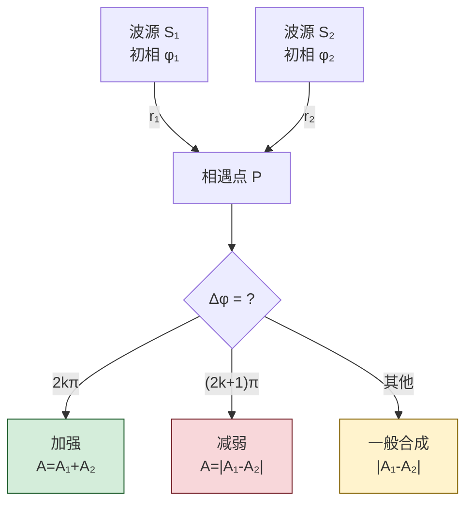
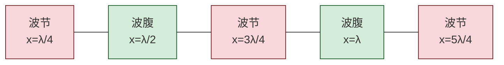

# 9.4 波的干涉、驻波

> [!info] 本节定位
> 本节研究**多列波同时存在时**介质的响应。它要回答两个核心问题：
> 1. **两列波在空间某点相遇，合成结果如何？** —— 由**波的叠加原理**与**相干条件**决定，得到**干涉**现象；
> 2. **两列反向行进的相干波叠加会形成什么？** —— **驻波**：波形不前进，介质分段振动，出现固定的波节与波腹。
>
> 本节是 [[9.3 平面简谐波波动方程|9.3]] 单列波描述的直接延伸，相位差 $\Delta\varphi$ 是贯穿全节的核心量；驻波又是弦乐器、管乐器发声与 [[MOC - 第10章|第10章]] 波动光学中法布里-珀罗腔、薄膜干涉的力学原型。半波损失则是波在边界反射时的相位突变现象。

## 一、波的叠加原理

> [!theorem] 波的叠加原理
> 当几列波在介质中相遇时，相遇区域每一点的位移等于各列波单独在该点引起位移的**矢量和**：
> $$\vec y=\sum_i \vec y_i$$
> 离开相遇区后各波仍按原方向、原频率、原振幅传播，互不干扰（波的独立性）。

> [!note] 适用条件
> - 介质是**线性**的（回复力与位移成正比，小振幅），且波幅不太大；
> - 大振幅或非线性介质中叠加原理失效，会出现非线性效应（谐波产生、激波等）；
> - 叠加原理对一切线性波（机械波、电磁波、量子波函数）都成立。

## 二、波的干涉

> [!definition] 相干波
> 能产生稳定干涉图样的两列波必须满足**相干条件**：
> 1. **频率相同**；
> 2. **振动方向相同**（或存在平行分量）；
> 3. **相位差恒定**（不随时间变化）。
>
> 满足上述条件的波源称为**相干波源**。两个独立普通光源通常不相干（自发辐射相位随机），需用同一波源分波（如双缝、分束器）获得相干光。

### 干涉加强与减弱条件

设两相干波源 $S_1$、$S_2$，初相分别为 $\varphi_1$、$\varphi_2$，频率 $\omega$，到相遇点 $P$ 的距离分别为 $r_1$、$r_2$。两波在 $P$ 引起的振动分别为
$$y_1=A_1\cos(\omega t+\varphi_1-kr_1),\qquad y_2=A_2\cos(\omega t+\varphi_2-kr_2)$$

> [!theorem] 相位差与干涉条件
> $P$ 点两振动的相位差
> $$\boxed{\,\Delta\varphi=\varphi_2-\varphi_1-k(r_2-r_1)=\varphi_2-\varphi_1-\frac{2\pi}{\lambda}(r_2-r_1)\,}\quad(\text{rad})$$
> - **加强**（合振幅最大 $A=A_1+A_2$）：
> $$\Delta\varphi=2k\pi,\quad k=0,\pm1,\pm2,\cdots$$
> - **减弱**（合振幅最小 $A=|A_1-A_2|$）：
> $$\Delta\varphi=(2k+1)\pi,\quad k=0,\pm1,\pm2,\cdots$$

> [!corollary] 波程差表示（同初相 $\varphi_1=\varphi_2$ 时）
> 令波程差 $\delta=r_2-r_1$：
> - **加强**：$\delta=k\lambda$；
> - **减弱**：$\delta=(2k+1)\lambda/2$。

> [!warning] 干涉的"稳定"含义
> 干涉图样稳定要求 $\Delta\varphi$ 不随时间变化，这正是相干条件中"相位差恒定"的体现。若两波源相位随机漂移，$\Delta\varphi$ 时变，则 $P$ 点合振动强度时强时弱，时间平均后各点近似相等，观察不到稳定干涉。这就是两独立灯泡不能产生可见干涉的原因。

## 三、驻波

> [!definition] 驻波
> 两列**振幅相同、频率相同、振动方向相同、反向传播**的相干波叠加，形成**驻波（standing wave）**。驻波波形不向前传播，介质分段振动，出现固定的波节（不振动的点）与波腹（振幅最大的点）。

### 驻波方程推导

> [!proof] 驻波方程
> 设两反向行波（取 $\varphi=0$）：
> $$y_1=A\cos(\omega t-kx),\qquad y_2=A\cos(\omega t+kx)$$
> 由叠加原理 $y=y_1+y_2$，用和差化积 $\cos\alpha+\cos\beta=2\cos\dfrac{\alpha+\beta}{2}\cos\dfrac{\alpha-\beta}{2}$：
> $$\boxed{\,y=2A\cos kx\cos\omega t=2A\cos\frac{2\pi x}{\lambda}\cos\omega t\,}$$
> 这是一个**空间因子** $\cos\dfrac{2\pi x}{\lambda}$ 与**时间因子** $\cos\omega t$ 的乘积，二者分离——这是驻波区别于行波的本质特征：波形不传播，每个 $x$ 处作同频振动，振幅 $|2A\cos\dfrac{2\pi x}{\lambda}|$ 随位置变化。$\square$

### 波节与波腹

> [!theorem] 波节与波腹位置
> - **波节**（振幅为零）：$\cos\dfrac{2\pi x}{\lambda}=0$，即
> $$x=(2k+1)\frac{\lambda}{4},\quad k=0,\pm1,\pm2,\cdots$$
> - **波腹**（振幅最大 $2A$）：$\left|\cos\dfrac{2\pi x}{\lambda}\right|=1$，即
> $$x=k\frac{\lambda}{2},\quad k=0,\pm1,\pm2,\cdots$$
> - 相邻波节（或相邻波腹）间距 $\lambda/2$；相邻波节与波腹间距 $\lambda/4$。

> [!note] 相邻波段的相位
> 驻波相邻两波节之间各点振动**同相**（同时达最大、同时过零），而波节两侧各点振动**反相**（一边正向最大时另一边负向最大）。这与行波中"相位逐点滞后"完全不同——驻波没有相位传播。

### 驻波的能量

> [!theorem] 驻波能量特点
> 驻波不传播能量（净能流为零）。能量在**波节处的势能**与**波腹处的动能**之间周期性转换：
> - 质元过平衡位置时（$\cos\omega t=0$），动能为零、势能集中于波节附近；
> - 质元达最大位移时（$\cos\omega t=\pm1$），势能为零、动能集中于波腹附近。
>
> 平均而言能量局域在波节波腹之间，不向前传播，故称"驻波"。

> [!note] 与行波能量对比
> 行波能量随波传播（[[9.3 平面简谐波波动方程|9.3]] 的能流密度 $I$）；驻波净能流为零。驻波可视为两束能量相等、方向相反的行波叠加，能流互相抵消。

## 四、半波损失

> [!definition] 半波损失
> 当波从**波疏介质**（波速大、折射率小、$\rho v$ 小）垂直入射到**波密介质**（波速小、折射率大、$\rho v$ 大）界面上反射时，反射波在反射点相位突变 $\pi$，相当于附加了 $\lambda/2$ 的光程，称为**半波损失**。
> - 反之，波从波密介质入射波疏介质反射时，**无**半波损失；
> - 透射波在任何情况下都无相位突变。

> [!warning] 反射点是波节还是波腹
> - 波从波疏→波密反射（有半波损失）：反射点处入射波与反射波相位差 $\pi$，叠加相消，反射点为**波节**。如绳波在固定端反射。
> - 波从波密→波疏反射（无半波损失）：反射点入射、反射波同相，叠加加强，反射点为**波腹**。如绳波在自由端反射。
>
> 这正是弦乐器一端固定、一端自由产生不同驻波模式的物理基础。

## 五、两端固定弦上的驻波（简正模式）

> [!theorem] 两端固定弦的简正模式
> 长度 $L$ 的弦两端固定（两端均为波节），允许的驻波波长满足
> $$L=n\frac{\lambda_n}{2},\quad n=1,2,3,\cdots$$
> 即 $\lambda_n=2L/n$，对应频率
> $$\nu_n=n\frac{v}{2L}=n\nu_1,\qquad \nu_1=\frac{v}{2L}\text{（基频）}$$
> $\nu_1$ 为基频，$\nu_n$ 为第 $n$ 阶泛音（谐频）。弦乐器调音即改变张力 $F_T$（影响 $v=\sqrt{F_T/\mu}$）从而改变基频。

> [!note] 管乐器中的驻波
> - **闭管**（一端封闭一端开口）：闭端为波节、开端为波腹，基频 $\nu_1=v/(4L)$，只含奇次谐频；
> - **开管**（两端开口）：两端均为波腹，基频 $\nu_1=v/(2L)$，含全部谐频。这是闭管音色与开管不同的原因。

## 六、典型例题

### 例题 1：干涉加强减弱判定

> [!example] 题目
> 两相干波源 $S_1$、$S_2$ 同相、同频 $\nu=100\,\text{Hz}$，波速 $v=400\,\text{m/s}$，振幅 $A_0$。$S_1$、$S_2$ 相距 $d=9.0\,\text{m}$。在 $S_1$、$S_2$ 连线上 $S_1$ 外侧距 $S_1$ 为 $r=4.0\,\text{m}$ 的 $P$ 点，干涉结果如何？

**解**：$\lambda=v/\nu=400/100=4.0\,\text{m}$。
$P$ 到 $S_1$ 距离 $r_1=4.0\,\text{m}$，到 $S_2$ 距离 $r_2=r+d=4.0+9.0=13.0\,\text{m}$。
波程差 $\delta=r_2-r_1=9.0\,\text{m}$，同初相故用波程差判据：
$\delta/\lambda=9.0/4.0=2.25$，即 $\delta=2.25\lambda=(2\times2+0.25)\lambda$，非整数倍也非半奇数倍。

换算为相位差：$\Delta\varphi=\dfrac{2\pi}{\lambda}\delta=\dfrac{2\pi}{4.0}\times9.0=4.5\pi=(2\times2+1)\pi+\pi/2$……更稳妥直接：
$\Delta\varphi=2\pi\delta/\lambda=2\pi\times2.25=4.5\pi=4\pi+\pi/2$，归约到 $(-\pi,\pi]$ 即 $\pi/2$。属一般合成，既不最大加强也不完全抵消，合振幅 $A=A_0\sqrt{2(1+\cos(\pi/2))}=A_0\sqrt{2}\approx1.414A_0$。

**单位检验**：$\delta$ 单位 m，$\Delta\varphi$ 单位 rad，正确。

### 例题 2：驻波波节波腹

> [!example] 题目
> 驻波方程 $y=0.04\cos(0.20\pi x)\cos(100\pi t)$（SI）。求波长、波节与波腹位置，并写出形成该驻波的两列行波方程。

**解**：与标准形式 $y=2A\cos\dfrac{2\pi x}{\lambda}\cos\omega t$ 比较：
- $2A=0.04\Rightarrow A=0.020\,\text{m}$；
- $\omega=100\pi\,\text{rad/s}\Rightarrow\nu=50\,\text{Hz}$；
- $\dfrac{2\pi}{\lambda}=0.20\pi\Rightarrow\lambda=10\,\text{m}$。

波节：$\cos(0.20\pi x)=0\Rightarrow 0.20\pi x=(2k+1)\pi/2\Rightarrow x=(2k+1)\times 2.5\,\text{m}$，即 $x=2.5,7.5,12.5,\cdots\,\text{m}$（及负值）。
波腹：$|0.20\pi x|=k\pi\Rightarrow x=5k\,\text{m}$，即 $x=0,5,10,\cdots\,\text{m}$。

两列行波：$y_1=0.020\cos(100\pi t-0.20\pi x)$、$y_2=0.020\cos(100\pi t+0.20\pi x)$（SI）。

**单位检验**：$\lambda$ 单位 m，$x$ 单位 m，正确。

### 例题 3：弦的基频

> [!example] 题目
> 长 $L=0.60\,\text{m}$ 的弦线质量 $m=3.0\times10^{-3}\,\text{kg}$，张力 $F_T=75\,\text{N}$，两端固定。求基频与第二次谐频。

**解**：线密度 $\mu=m/L=3.0\times10^{-3}/0.60=5.0\times10^{-3}\,\text{kg/m}$。
波速 $v=\sqrt{F_T/\mu}=\sqrt{75/(5.0\times10^{-3})}=\sqrt{1.5\times10^4}\approx 122.5\,\text{m/s}$。
基频 $\nu_1=v/(2L)=122.5/(2\times0.60)\approx 102\,\text{Hz}$。
第二次谐频 $\nu_2=2\nu_1\approx 204\,\text{Hz}$。

**单位检验**：$\sqrt{\text{N}/(\text{kg/m})}=\sqrt{\text{m}^2/\text{s}^2}=\text{m/s}$；$\nu$ 单位 $\text{m/s}/\text{m}=\text{s}^{-1}=\text{Hz}$，正确。

## 七、易错点

> [!warning] 易错点
> 1. **相位差公式漏项**：$\Delta\varphi=\varphi_2-\varphi_1-\dfrac{2\pi}{\lambda}(r_2-r_1)$，三项缺一不可。波程差判据仅在 $\varphi_1=\varphi_2$ 时成立。
> 2. **加强减弱条件记反**：$\Delta\varphi=2k\pi$ 加强，$(2k+1)\pi$ 减弱。波程差 $\delta=k\lambda$ 加强，$(2k+1)\lambda/2$ 减弱（同初相）。
> 3. **驻波方程符号**：两反向行波必须**振幅相等**才能形成纯驻波；振幅不等会形成部分驻波叠加行波分量。
> 4. **波节波腹位置**：波节 $x=(2k+1)\lambda/4$、波腹 $x=k\lambda/2$，不要混淆；记住"波节在 $\cos$ 因子为零处、波腹在 $|\cos|$ 最大处"。
> 5. **相邻间距**：相邻波节间距 $\lambda/2$、相邻波腹间距 $\lambda/2$、相邻波节波腹间距 $\lambda/4$，常考填空。
> 6. **半波损失方向**：波疏→波密反射有半波损失（反射点波节），波密→波疏反射无半波损失（反射点波腹）。绳固定端等同波疏→波密。
> 7. **驻波能量误判**：驻波净能流为零，不传播能量，与行波相反。

## 八、与其他小节的联系

- 干涉的相位差判据直接来自 [[9.1 简谐振动、旋转矢量|9.1]] 的同向同频合成；
- 驻波是 [[9.3 平面简谐波波动方程|9.3]] 两列反向行波的叠加特例；
- 半波损失、波程差概念是 [[MOC - 第10章|第10章]] 波动光学中薄膜干涉、劈尖干涉、牛顿环的力学原型；
- 驻波也是声学（管弦乐器）与微波谐振腔、激光谐振腔的共同物理基础；
- 本章 MOC：[[MOC - 第9章]]。

## 章节导航

- 上一级：[[MOC - 第9章]]
- 先修：[[9.1 简谐振动、旋转矢量]]、[[9.3 平面简谐波波动方程]]
- 下一节：[[9.5 多普勒效应]]
- 习题：[[MOC - 第9章习题]]
