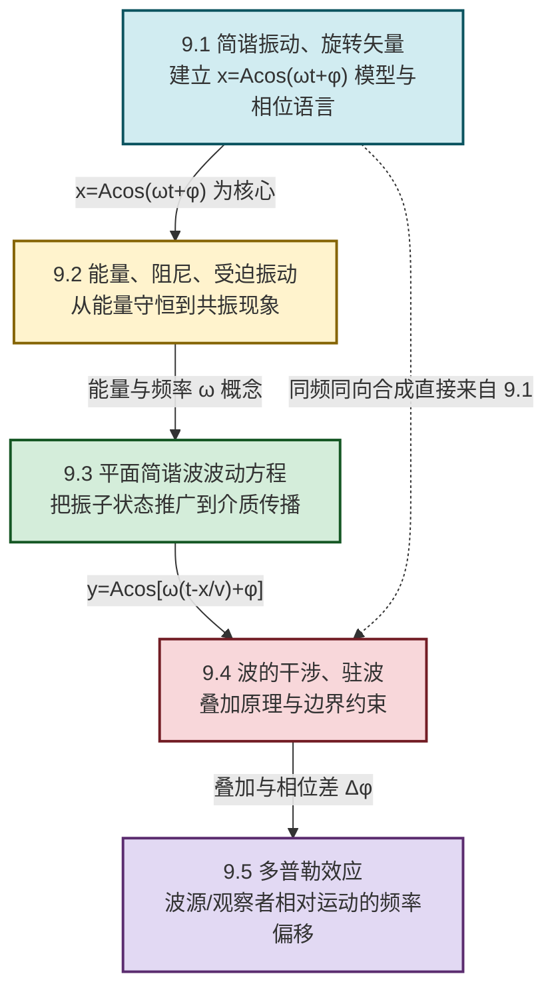

# MOC - 第9章 机械振动与机械波

> [!info] 本章定位
> 机械振动与机械波（Mechanical Oscillation and Mechanical Wave）是经典力学在**周期运动**方向的延伸，也是整个波动学的**力学原型**。它要解决的核心问题是：**偏离平衡位置的物体如何回复并在介质中把振动状态传播出去**。
>
> 本章在 [[MOC - 第4章|第4章 刚体的转动]]（角量描述、力矩、转动惯量）所建立的力学框架上展开：弹簧振子、单摆、复摆都可归结为"线性回复力（矩）+ 惯性"的模型，其数学结构 $m\ddot x=-kx$ 与第4章 $J\ddot\theta=-\kappa\theta$ 同构。把单个振子的振动状态推广到弹性介质中相邻质元间的耦合传播，就得到**机械波**；而 [[MOC - 第8章|第8章 电磁感应与电磁场]] 给出的麦克斯韦方程组则预言了**电磁波**——二者数学同构（波动方程 $\nabla^2 u=\dfrac{1}{v^2}\dfrac{\partial^2 u}{\partial t^2}$），但物理本质不同：机械波依赖弹性介质，电磁波自维持传播。
>
> 本章讨论范围限定于**宏观、低速、线性回复力（胡克弹性）近似下**的振动与波动；大振幅非线性振动、色散介质、量子谐振子不在本章范围。公式中各物理量均采用 SI 单位。

## 学习路线图

## 知识点导航

| 小节 | 标题 | 核心内容 | 关键物理量（SI单位） |
| ---- | ---- | -------- | -------------------- |
| [[9.1 简谐振动、旋转矢量\|9.1]] | 简谐振动、旋转矢量 | 简谐振动 $x=A\cos(\omega t+\varphi)$、振幅 $A$、角频率 $\omega$、频率 $\nu=\omega/2\pi$、周期 $T=2\pi/\omega$、相位 $(\omega t+\varphi)$、初相 $\varphi$、旋转矢量表示、同向同频合成 | 位移 $x$（m）、角频率 $\omega$（rad/s）、周期 $T$（s） |
| [[9.2 简谐振动能量、阻尼振动、受迫振动\|9.2]] | 能量、阻尼、受迫振动 | 动能 $E_k=\tfrac12 m\dot x^2$、势能 $E_p=\tfrac12 kx^2$、总能量 $E=\tfrac12 kA^2$（守恒）、欠/临界/过阻尼、受迫振动与共振 | 能量 $E$（J）、劲度系数 $k$（N/m）、阻尼系数 $\delta$（s⁻¹） |
| [[9.3 平面简谐波波动方程\|9.3]] | 平面简谐波波动方程 | 机械波产生条件、横波/纵波、波面与波线、波长 $\lambda$、波速 $v=\lambda\nu$、波动方程 $y=A\cos[\omega(t-x/v)+\varphi]$、能量与能流密度 | 波长 $\lambda$（m）、波速 $v$（m/s）、能流密度 $I$（W/m²） |
| [[9.4 波的干涉、驻波\|9.4]] | 波的干涉、驻波 | 叠加原理、相干条件、加强减弱条件 $\Delta\varphi=2k\pi/(2k+1)\pi$、驻波 $y=2A\cos\dfrac{2\pi x}{\lambda}\cos\omega t$、波节波腹、半波损失 | 相位差 $\Delta\varphi$（rad）、波节/波腹位置（m） |
| [[9.5 多普勒效应\|9.5]] | 多普勒效应 | 频率偏移 $\nu'=\nu_0\dfrac{v+v_o}{v-v_s}$、波源运动/观察者运动/二者均动、电磁波多普勒效应（红移/蓝移） | 观测频率 $\nu'$（Hz）、波源速度 $v_s$（m/s） |

## 核心考点

> [!summary] 本章核心考点（8 点）
> 1. **简谐振动方程的建立**：由动力学方程 $m\ddot x=-kx$（或单摆 $\ddot\theta=-\dfrac{g}{l}\theta$、复摆 $\ddot\theta=-\dfrac{mgl_c}{J}\theta$）化为 $\ddot x+\omega^2 x=0$，解为 $x=A\cos(\omega t+\varphi)$。$\omega$ 由系统本身决定（弹簧 $\omega=\sqrt{k/m}$、单摆 $\omega=\sqrt{g/l}$），$A$、$\varphi$ 由初条件确定。
> 2. **相位与旋转矢量法**：相位 $(\omega t+\varphi)$ 唯一决定振动状态；初相 $\varphi$ 由 $x_0=A\cos\varphi$、$v_0=-A\omega\sin\varphi$ 联立求出（注意 $v_0$ 的正负决定 $\varphi$ 象限）。旋转矢量把简谐振动视为匀速圆周运动的投影，是求合成、相位差最直观的工具。
> 3. **同向同频简谐振动的合成**：$A=\sqrt{A_1^2+A_2^2+2A_1A_2\cos\Delta\varphi}$，$\tan\varphi=\dfrac{A_1\sin\varphi_1+A_2\sin\varphi_2}{A_1\cos\varphi_1+A_2\cos\varphi_2}$。$\Delta\varphi=2k\pi$ 加强 $A=A_1+A_2$；$\Delta\varphi=(2k+1)\pi$ 减弱 $A=|A_1-A_2|$。
> 4. **简谐振动能量守恒**：$E=E_k+E_p=\tfrac12 kA^2$，动能与势能此消彼长但总和守恒（无阻尼理想情形）。注意动能、势能频率均为 $2\omega$。
> 5. **波动方程的建立与多种等价形式**：$y(x,t)=A\cos[\omega(t-x/v)+\varphi]$，等价于 $A\cos(\omega t-kx+\varphi)$、$A\cos 2\pi(\nu t-x/\lambda+\varphi/2\pi)$ 等。关键是"沿波传播方向每前进 $x$，相位滞后 $\omega x/v$"。由波形图与某点振动图可反推方程。
> 6. **波的干涉加强与减弱条件**：相干波（同频、同振动方向、恒定相位差）。$\Delta\varphi=\varphi_2-\varphi_1-2\pi(r_2-r_1)/\lambda$，加强 $\Delta\varphi=2k\pi$，减弱 $\Delta\varphi=(2k+1)\pi$；或用波程差 $\delta=r_2-r_1=k\lambda$ 加强，$\delta=(2k+1)\lambda/2$ 减弱（同初相时）。
> 7. **驻波计算**：两反向行波叠加 $y=2A\cos\dfrac{2\pi x}{\lambda}\cos\omega t$。波节 $\cos\dfrac{2\pi x}{\lambda}=0$，$x=(2k+1)\lambda/4$；波腹 $\left|\cos\dfrac{2\pi x}{\lambda}\right|=1$，$x=k\lambda/2$。相邻波节/波腹间距 $\lambda/4$。波从波疏介质入射波密介质反射时有半波损失（反射点为波节）。
> 8. **多普勒效应**：$\nu'=\nu_0\dfrac{v+v_o}{v-v_s}$（观察者与波源在二者连线上相向为正）。注意 $v_s<v$ 才有意义；电磁波多普勒效应用相对论公式 $\nu'=\nu_0\sqrt{\dfrac{c-u}{c+u}}$，红移（远离）/蓝移（靠近）。

## 自测题

> [!question]- 自测 1：建立简谐振动方程
> 一轻弹簧劲度系数 $k=20\,\text{N/m}$，下挂质量 $m=0.20\,\text{kg}$ 物体。将物体自平衡位置向下拉 $0.050\,\text{m}$ 后由静止释放，取向下为正，$t=0$ 为释放时刻。写出振动方程。
>
> > [!check]- 答案
> > $\omega=\sqrt{k/m}=\sqrt{20/0.20}=10\,\text{rad/s}$。初条件 $x_0=0.050\,\text{m}$、$v_0=0$。
> > 由 $x_0=A\cos\varphi$、$v_0=-A\omega\sin\varphi=0$，得 $\sin\varphi=0$；又 $x_0>0$，故 $\varphi=0$，$A=x_0=0.050\,\text{m}$。
> > $$x=0.050\cos(10t)\,\text{m}$$

> [!question]- 自测 2：相位差与合成
> 两同向同频简谐振动 $x_1=0.04\cos(2\pi t+\pi/3)$、$x_2=0.03\cos(2\pi t-\pi/6)$（SI）。求合振幅与初相，并判断是加强还是减弱。
>
> > [!check]- 答案
> > $\Delta\varphi=\varphi_2-\varphi_1=-\pi/6-\pi/3=-\pi/2$。
> > $$A=\sqrt{A_1^2+A_2^2+2A_1A_2\cos\Delta\varphi}=\sqrt{0.04^2+0.03^2+0}=0.05\,\text{m}$$
> > $$\tan\varphi=\frac{A_1\sin(\pi/3)+A_2\sin(-\pi/6)}{A_1\cos(\pi/3)+A_2\cos(-\pi/6)}=\frac{0.04\times0.866-0.03\times0.5}{0.04\times0.5+0.03\times0.866}=\frac{0.0196}{0.0460}\approx 0.426$$
> > $\varphi\approx 0.403\,\text{rad}\approx 23.1^\circ$。$\Delta\varphi=-\pi/2$ 既非 $2k\pi$ 也非 $(2k+1)\pi$，属一般合成（既不最大加强也不完全抵消）。

> [!question]- 自测 3：波动方程建立
> 一横波沿 $+x$ 方向传播，波速 $v=100\,\text{m/s}$，振幅 $A=0.020\,\text{m}$，频率 $\nu=50\,\text{Hz}$。$t=0$ 时原点处质点位于平衡位置且向 $+y$ 方向运动。写出波动方程。
>
> > [!check]- 答案
> > $\omega=2\pi\nu=100\pi\,\text{rad/s}$，$\lambda=v/\nu=2.0\,\text{m}$。
> > 原点振动 $y_0=A\cos(\omega t+\varphi)$。$t=0$：$y_0=0\Rightarrow\cos\varphi=0$；$v_{y0}=-A\omega\sin\varphi>0\Rightarrow\sin\varphi<0$，故 $\varphi=-\pi/2$。
> > 原：$y_0=0.020\cos(100\pi t-\pi/2)$。沿 $+x$ 传播每前进 $x$ 相位滞后 $\omega x/v=\pi x$：
> > $$y=0.020\cos[100\pi t-\pi x-\pi/2]\,\text{m}$$
> > 即 $y=0.020\cos[100\pi(t-x/100)-\pi/2]\,\text{m}$。

> [!question]- 自测 4：多普勒效应
> 静止观察者测得频率 $\nu_0=500\,\text{Hz}$ 的警车鸣笛。警车以 $v_s=20\,\text{m/s}$ 朝观察者驶来，声速 $v=340\,\text{m/s}$。求观察者听到的频率；若警车以同样速度远离，频率又为多少？
>
> > [!check]- 答案
> > 靠近（$v_s$ 取正值代入公式 $v-v_s$）：
> > $$\nu'=\nu_0\frac{v}{v-v_s}=500\times\frac{340}{340-20}=500\times\frac{340}{320}\approx 531\,\text{Hz}$$
> > 远离（$v_s$ 改为 $-v_s$，即 $v+v_s$）：
> > $$\nu''=\nu_0\frac{v}{v+v_s}=500\times\frac{340}{340+20}\approx 472\,\text{Hz}$$

## 章节导航

> [!nav] 导航
> 上级：[[MOC - 大学物理B|大学物理B 课程总览]]
> 先修：[[MOC - 第4章|第4章 刚体的转动]]（角量与转动惯量）、[[MOC - 第8章|第8章 电磁感应与电磁场]]（电磁波对比）
> 下一章：[[MOC - 第10章|第10章 波动光学]]（把波动理论用于光的干涉、衍射、偏振）
> 配套习题：[[MOC - 第9章习题|第9章 习题]]
