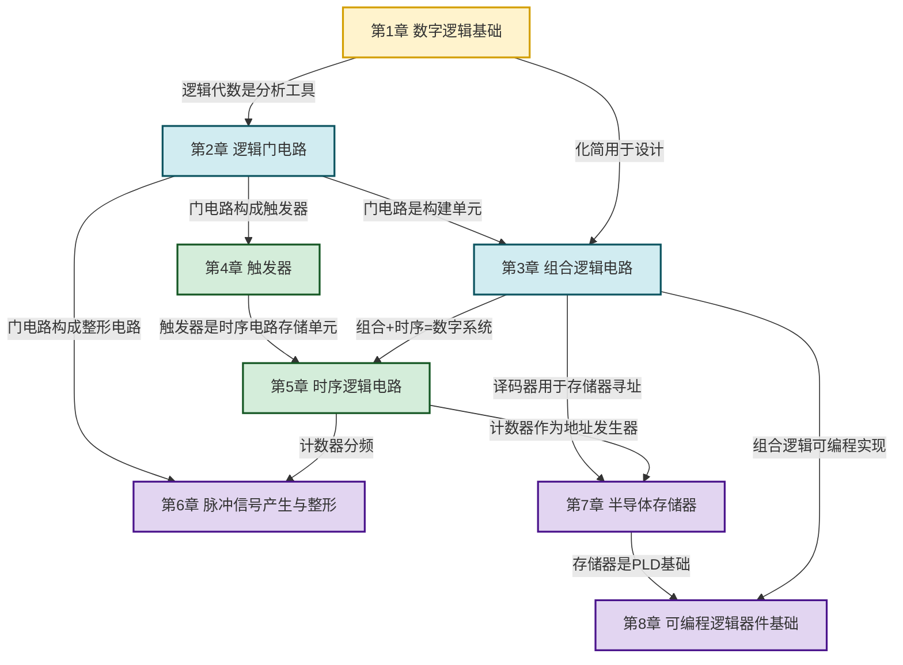

# MOC - 数字逻辑电路

> [!info] 课程定位
> 数字逻辑电路是研究**用离散电平（0/1）表示信息、用逻辑运算处理信息**的电子电路课程。它要解决的核心问题是：**如何用布尔代数描述逻辑功能、用门电路实现逻辑运算、用组合与时序电路构建数字系统？** 数字电路是计算机硬件、通信系统、控制系统的物理基础，与模拟电路（信号连续变化）形成对照。
>
> 本课程在 [[MOC - 电路与模拟电子技术|电路与模拟电子技术]]（半导体器件、门电路底层原理）之后展开：把模拟电子的"连续信号放大"转为"离散信号处理"，把晶体管的"线性工作区"转为"开关工作状态"。本课程是后续计算机组成原理、微机原理、嵌入式系统的直接先修。

## 课程摘要

本课程围绕"**数制—逻辑代数—门电路—组合逻辑—触发器—时序逻辑—脉冲整形—存储器—可编程器件**"九条主线展开：

1. 数制与编码（二进制、十六进制、BCD 码、格雷码）、逻辑变量与三种基本运算（与、或、非）、逻辑代数定律（交换、结合、分配、摩根定律）、逻辑函数表示（真值表、表达式、卡诺图）、逻辑函数化简（代数法、卡诺图法）；
2. 半导体开关特性（二极管、三极管、MOS 管开关）、TTL 集成门电路原理、CMOS 门电路特性、三态门/OC 门/线与逻辑、门电路接口特性（电平兼容、扇出）；
3. 组合逻辑电路分析与设计、编码器/译码器、数据选择器/分配器、加法器/数值比较器、竞争冒险判断与消除；
4. 触发器（基本 RS、同步 RS/D、JK/T、边沿触发器、触发器相互转换）；
5. 时序逻辑电路分析（状态方程、状态图、状态表）、寄存器/移位寄存器、同步/异步计数器、任意进制计数器设计、序列信号发生器；
6. 脉冲信号产生与整形（施密特触发器、单稳态触发器、多谐振荡器、555 定时器）；
7. 半导体存储器（ROM、RAM、容量扩展、ROM 实现组合逻辑）；
8. 可编程逻辑器件基础（PLA/PAL/GAL、FPGA 概念、Verilog HDL 入门）。

## 章节结构与依赖关系

> [!tip] 学习顺序建议
> 严格按 **第1章→第2章→第3章→第4章→第5章→第6章→第7章→第8章** 顺序学习。第1章逻辑代数是全课程数学工具；第2章门电路是物理实现；第3章组合逻辑是无记忆电路；第4章触发器引入记忆元件；第5章时序逻辑=组合+触发器；第6–8章是应用与扩展。组合逻辑与时序逻辑的分水岭是"是否有记忆元件（触发器）"。

## 章节导航

| 章节 | 主题 | 入口 | 小节数 | 核心考点 |
| ---- | ---- | ---- | ------ | -------- |
| 第1章 | 数字逻辑基础 | [[MOC - 第1章]] | 5 | 数制转换、卡诺图化简、摩根定律 |
| 第2章 | 逻辑门电路 | [[MOC - 第2章]] | 5 | TTL/CMOS 特性、三态门、线与 |
| 第3章 | 组合逻辑电路 | [[MOC - 第3章]] | 6 | 分析设计、译码器、数据选择器、竞争冒险 |
| 第4章 | 触发器 | [[MOC - 第4章]] | 5 | RS/D/JK/T 触发器、边沿触发、转换 |
| 第5章 | 时序逻辑电路 | [[MOC - 第5章]] | 5 | 状态方程、计数器设计、移位寄存器 |
| 第6章 | 脉冲产生与整形 | [[MOC - 第6章]] | 4 | 施密特、单稳态、多谐、555 定时器 |
| 第7章 | 半导体存储器 | [[MOC - 第7章]] | 4 | ROM/RAM、容量扩展、ROM 实现逻辑 |
| 第8章 | 可编程逻辑器件 | [[MOC - 第8章]] | 3 | PLA/PAL/GAL、FPGA、Verilog 入门 |

## 两大核心思想

> [!abstract] 数字逻辑的核心思想
> 1. **二值逻辑**：用 0 和 1 两个离散电平表示信息（低电平≈0V、高电平≈5V/3.3V），所有运算归结为布尔代数的与、或、非三种基本操作。这种抽象使数字电路抗噪能力强、精度高、可编程。
>
> 2. **组合与时序的分野**：
>    - **组合逻辑**：输出仅由当前输入决定，无记忆，由门电路构成（第3章）；
>    - **时序逻辑**：输出由当前输入与过去状态共同决定，有记忆，由触发器存储状态（第4–5章）。
>    时钟同步是时序电路的关键约束——所有触发器在同一时钟边沿更新状态，建立/保持时间必须满足。

## 与先修和后续课程的衔接

- **先修**：[[MOC - 电路与模拟电子技术|电路与模拟电子技术]]（半导体器件、PN 结、三极管开关特性为门电路基础）、[[MOC - 大学物理B|大学物理B]]（电磁学基础）
- **后续**：计算机组成原理（CPU 由组合+时序电路构成）、微机原理与接口技术（总线、存储器映射）、嵌入式系统（FPGA/MCU）、VLSI 设计
- **跨课程关联**：与计算机组成原理的编码、组合逻辑、时序逻辑、存储器内容建立语义链接

## 学习方法建议

> [!tip] 高效学习路径
> 1. **逻辑代数是基石**：第1章的化简技巧（卡诺图）贯穿全课程，必须熟练；
> 2. **真值表是通用语言**：分析任何电路先写真值表，设计任何电路先列真值表再化简；
> 3. **时序图是时序电路的核心**：学会画时钟、输入、输出、状态的波形图；
> 4. **区分功能与实现**：同一逻辑功能可用不同门电路实现（TTL/CMOS/PLD），功能是抽象、实现是物理；
> 5. **建立/保持时间是关键约束**：时序电路的可靠性依赖时序约束，不能只看功能正确；
> 6. **典型芯片**：记住 74LS00（与非）、74LS138（译码器）、74LS153（数据选择器）、74LS161（计数器）、74LS74（D 触发器）等经典型号。

## 章节导航

- 上一级：[[MOC - 物理与电路]]（如有）
- 配套习题：见各章节 MOC 中的"本章习题"链接
- 关联课程：[[MOC - 电路与模拟电子技术]]（先修）、计算机组成原理（后续）

## 相关标签

#数字逻辑 #数电 #逻辑代数 #组合逻辑 #时序逻辑 #触发器 #计数器 #存储器 #PLD
