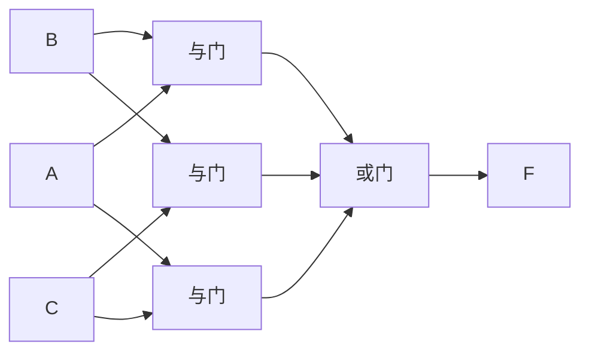

# MOC - 第1章习题 数字逻辑基础

> [!abstract] 本章习题概览
> 本章习题共 **24 题**，覆盖 [[1.1 数制与编码：二进制、十六进制、BCD 码|数制与编码]]、[[1.2 逻辑变量、三种基本逻辑运算|逻辑运算]]、[[1.3 逻辑代数定律、摩根定律|逻辑代数定律]]、[[1.4 逻辑函数表示方式：真值表、表达式、卡诺图|逻辑函数表示]]、[[1.5 逻辑函数化简（代数法、卡诺图法）|逻辑函数化简]] 五个知识板块。题型分布：选择 8 题、填空 6 题、化简 6 题、分析与设计 4 题。答案与详解折叠于 `
` 中，建议先独立作答再核对。

---

## 一、选择题（8 题）

**1.** 十进制数 $(25)_{10}$ 对应的二进制数是（ ）
A. $11001$
B. $10101$
C. $10011$
D. $11011$

**2.** 十六进制数 $(3F)_{16}$ 对应的十进制数是（ ）
A. $63$
B. $47$
C. $58$
D. $65$

**3.** 下列关于 8421 BCD 码的叙述，正确的是（ ）
A. $(59)_{10}$ 的 BCD 码为 $111011$
B. BCD 码中 $1010\sim1111$ 是有效码组
C. $(29)_{10}$ 的 BCD 码为 $0010\;1001$
D. BCD 码与自然二进制码完全相同

**4.** 4 位二进制数 $1011$ 对应的格雷码是（ ）
A. $1011$
B. $1110$
C. $1001$
D. $1101$

**5.** 逻辑函数 $F=AB+\bar{A}C$，当 $B=1$、$C=1$ 时，$F$ 的值为（ ）
A. $0$
B. $1$
C. $A$
D. $\bar{A}$

**6.** 下列等式中，正确的是（ ）
A. $A+AB=A$
B. $A+\bar{A}B=A$
C. $A(A+B)=B$
D. $AB+\bar{A}C=A$

**7.** $n$ 个变量的逻辑函数共有多少个最小项？（ ）
A. $n$
B. $2n$
C. $2^n$
D. $n^2$

**8.** 在卡诺图中，相邻两个最小项合并可以消去的变量数为（ ）
A. $1$ 个
B. $2$ 个
C. $3$ 个
D. $0$ 个

选择题答案

1. **A**。$25=16+8+1=2^4+2^3+2^0=(11001)_2$。
2. **A**。$(3F)_{16}=3\times16+15=48+15=63$。
3. **C**。BCD 码每 4 位独立表示 1 位十进制，$(29)_{10}=(0010\;1001)_{\text{BCD}}$。A 错：$111011$ 是二进制不是 BCD；B 错：$1010\sim1111$ 在 8421 BCD 中无效；D 错：BCD 与二进制不同。
4. **B**。格雷码 $g_i=b_i\oplus b_{i+1}$，最高位不变：$g_3=1$、$g_2=0\oplus1=1$、$g_1=1\oplus0=1$、$g_0=1\oplus1=0$，结果 $1110$。
5. **B**。$F=A\cdot1+\bar{A}\cdot1=A+\bar{A}=1$。
6. **A**。吸收律 $A+AB=A(1+B)=A\cdot1=A$。B 应为 $A+\bar{A}B=A+B$；C 应为 $A(A+B)=A$；D 应为 $AB+\bar{A}C=(A+C)(\bar{A}+B)$。
7. **C**。$n$ 个变量有 $2^n$ 种取值组合，对应 $2^n$ 个最小项。
8. **A**。卡诺图中几何相邻的两个最小项仅有一位变量取值不同，合并后消去该位变量。

---

## 二、填空题（6 题）

**1.** $(37)_{10}=$ $(\quad)_2=$ $(\quad)_{16}=$ $(\quad)_{\text{BCD}}$。

**2.** $(0.875)_{10}=$ $(\quad)_2$。

**3.** 摩根定律：$\overline{A+B}=$ ______，$\overline{AB}=$ ______。

**4.** 逻辑函数 $F=\bar{A}B+A\bar{B}$ 表示的是 ______ 运算（与/或/非/异或/同或），当 $A=B$ 时 $F=$ ______。

**5.** 三变量逻辑函数共有 ______ 个最小项，$F(A,B,C)=\sum m(1,3,5,7)$ 的最简与或式为 ______。

**6.** 卡诺图中 $2^k$ 个相邻最小项合并可消去 ______ 个变量；4 个相邻格可消去 ______ 个变量。

填空题答案

1. $37=32+4+1=(100101)_2$；$100101_2=0010\;0101=(25)_{16}$；$(37)_{10}=(0011\;0111)_{\text{BCD}}$。
2. $0.875\times2=1.75$→1；$0.75\times2=1.5$→1；$0.5\times2=1.0$→1。结果 $(0.111)_2$。
3. $\overline{A+B}=\bar{A}\cdot\bar{B}$；$\overline{AB}=\bar{A}+\bar{B}$。
4. **异或**运算（$A\oplus B$）；当 $A=B$ 时 $F=0$。
5. $2^3=8$ 个最小项；$F=\sum m(1,3,5,7)$，最小项 $1=001$、$3=011$、$5=101$、$7=111$，共同特征 $C=1$，最简式 $F=C$。
6. $2^k$ 个相邻格消去 $k$ 个变量；4 个相邻格消去 $2$ 个变量。

---

## 三、逻辑函数化简题（6 题）

**1.（代数法化简）** 用代数法将下列函数化简为最简与或式：
$$F_1 = AB + A\bar{B} + \bar{A}B$$

解答

$$F_1 = AB + A\bar{B} + \bar{A}B = A(B+\bar{B}) + \bar{A}B = A + \bar{A}B = A + B$$

**说明**：第一步用分配律提出 $A$，第二步用 $B+\bar{B}=1$，第三步用吸收律 $A+\bar{A}B=A+B$。

**2.（代数法化简）** 用代数法化简：
$$F_2 = A\bar{B} + \bar{A}B + BC + AC$$

解答

$$F_2 = A\bar{B} + \bar{A}B + BC + AC$$

添加冗余项 $A\bar{B}+AC$ 的冗余项为 $A\bar{B}C$（由 $A\bar{B}$ 和 $AC$ 产生），但这不易直接看出。换用配项法：

$$F_2 = A\bar{B} + AC + \bar{A}B + BC$$

由 $A\bar{B}+AC=A(\bar{B}+C)$，而 $\bar{A}B+BC=B(\bar{A}+C)$，所以：

$$F_2 = (A+B)(\bar{B}+C)$$

展开验证：$(A+B)(\bar{B}+C)=A\bar{B}+AC+B\bar{B}+BC=A\bar{B}+AC+BC$。

由 $A\bar{B}+AC=A\bar{B}+AC$ 无法继续化简，但发现 $AC$ 被 $A\bar{B}$ 和 $BC$ 覆盖（$A\bar{B}$ 中 $C=0$ 项，$BC$ 中 $A=1$ 项），利用 $A\bar{B}+BC=A\bar{B}+BC+AC$（冗余定理）：

$$F_2 = A\bar{B} + \bar{A}B + BC + AC = A\bar{B} + BC + \bar{A}B + AC$$

重新观察：$A\bar{B}+BC$ 展开含 $AC$（冗余），所以 $AC$ 可消去：

$$\boxed{F_2 = A\bar{B} + \bar{A}B + BC}$$

**说明**：利用冗余定理 $XY+\bar{X}Z+YZ=XY+\bar{X}Z$，令 $X=B$、$Y=AC$、$Z=\bar{A}$，需对应验证。

**3.（卡诺图化简）** 用卡诺图化简三变量函数：
$$F_3(A,B,C) = \sum m(0, 1, 2, 5, 6, 7)$$

解答

三变量卡诺图（行 $AB$：00、01、11、10；列 $C$：0、1）：

| $AB \backslash C$ | 0 | 1 |
| :-: | :-: | :-: |
| 00 | $m_0=1$ | $m_1=1$ |
| 01 | $m_2=1$ | $m_3=0$ |
| 11 | $m_6=1$ | $m_7=1$ |
| 10 | $m_4=0$ | $m_5=1$ |

分组：
- $m_0, m_1$（$AB=00$）→ $\bar{A}\bar{B}$
- $m_6, m_7$（$AB=11$）→ $AB$
- $m_2, m_6$（$C=0$，$B=1$）→ $B\bar{C}$
- $m_5, m_7$（$C=1$，$A=1$）→ $AC$

验证 $m_1$ 被覆盖：$m_1=001$，$\bar{A}\bar{B}$ 覆盖 $m_0,m_1$ ✓。

$$\boxed{F_3 = \bar{A}\bar{B} + AB + B\bar{C} + AC}$$

**4.（卡诺图化简含无关项）** 用卡诺图化简，其中 $d$ 为无关项：
$$F_4(A,B,C,D) = \sum m(0, 2, 5, 7, 8, 10, 13) + \sum d(1, 3, 9, 15)$$

解答

四变量卡诺图：

| $AB \backslash CD$ | 00 | 01 | 11 | 10 |
| :-: | :-: | :-: | :-: | :-: |
| 00 | $m_0=1$ | $m_1=d$ | $m_3=d$ | $m_2=1$ |
| 01 | $m_4=0$ | $m_5=1$ | $m_7=1$ | $m_6=0$ |
| 11 | $m_{12}=0$ | $m_{13}=1$ | $m_{15}=d$ | $m_{14}=0$ |
| 10 | $m_8=1$ | $m_9=d$ | $m_{11}=0$ | $m_{10}=1$ |

利用无关项扩大圈组：
- $m_0,m_1,m_2,m_3$（含 $d$）→ $\bar{A}\bar{B}$
- $m_0,m_2,m_8,m_{10}$→ $\bar{B}\bar{D}$
- $m_5,m_7,m_{13},m_{15}$（含 $d$）→ $BD$

验证：$m_0,m_2,m_8,m_{10}$ 覆盖；$m_5,m_7,m_{13}$ 覆盖，$m_{15}=d$ 圈入。

$$\boxed{F_4 = \bar{A}\bar{B} + \bar{B}\bar{D} + BD}$$

**5.（反演规则）** 已知 $F = A\bar{B} + C(D+\bar{E})$，用反演规则求 $\bar{F}$。

解答

反演规则：将原函数中的与运算和或运算互换、原变量和反变量互换、0 和 1 互换，保持运算优先级（先与后或）。

原函数 $F = A\bar{B} + C(D+\bar{E})$，按层次：
- 最外层是或：$F = (A\bar{B}) + (C(D+\bar{E}))$
- 第一项 $A\bar{B}$ 是与运算
- 第二项 $C(D+\bar{E})$ 是与运算，内层 $(D+\bar{E})$ 是或运算

反演：
$$\bar{F} = (\bar{A}+B)\cdot(\bar{C}+\bar{D}E)$$

**验证**：用摩根定律
$$\bar{F} = \overline{A\bar{B} + C(D+\bar{E})} = \overline{A\bar{B}}\cdot\overline{C(D+\bar{E})} = (\bar{A}+B)(\bar{C}+\overline{D+\bar{E}}) = (\bar{A}+B)(\bar{C}+\bar{D}E)$$

✓ 结果一致。

**6.（对偶规则）** 已知等式 $A+BC=(A+B)(A+C)$ 成立，写出其对偶式并验证。

解答

对偶规则：将与运算和或运算互换、0 和 1 互换，变量保持不变。

原等式：$A+BC=(A+B)(A+C)$

对偶式：
$$A(B+C) = AB + AC$$

**验证**：
- 左边：$A(B+C) = AB + AC$（分配律）
- 右边：$AB + AC$

两边相等 ✓。这是分配律的两种形式，互为对偶。

---

## 四、分析与设计题（4 题）

**1.（真值表与表达式互转）** 已知逻辑函数 $F(A,B,C)$ 的真值表如下，写出其与或表达式、最小项之和形式及最简式。

| $A$ | $B$ | $C$ | $F$ |
| :-: | :-: | :-: | :-: |
| 0 | 0 | 0 | 0 |
| 0 | 0 | 1 | 1 |
| 0 | 1 | 0 | 0 |
| 0 | 1 | 1 | 1 |
| 1 | 0 | 0 | 0 |
| 1 | 0 | 1 | 0 |
| 1 | 1 | 0 | 1 |
| 1 | 1 | 1 | 1 |

解答

**(1) 最小项之和形式**：$F=1$ 对应 $m_1(001), m_3(011), m_6(110), m_7(111)$。

$$F(A,B,C) = \sum m(1, 3, 6, 7)$$

**(2) 与或表达式**：
$$F = \bar{A}\bar{B}C + \bar{A}BC + AB\bar{C} + ABC$$

**(3) 卡诺图化简**：

| $AB\backslash C$ | 0 | 1 |
| :-: | :-: | :-: |
| 00 | 0 | 1 |
| 01 | 0 | 1 |
| 11 | 1 | 1 |
| 10 | 0 | 0 |

分组：
- $m_1, m_3$（$A=0, C=1$）→ $\bar{A}C$
- $m_6, m_7$（$A=1, B=1$）→ $AB$

$$\boxed{F = \bar{A}C + AB}$$

**2.（逻辑问题建模）** 设计一个三变量表决电路：当输入 $A, B, C$ 中有两个或两个以上为 1 时，输出 $F=1$，否则 $F=0$。要求：(1) 列出真值表；(2) 写出最小项表达式；(3) 用卡诺图化简；(4) 画出逻辑图。

解答

**(1) 真值表**：

| $A$ | $B$ | $C$ | $F$ |
| :-: | :-: | :-: | :-: |
| 0 | 0 | 0 | 0 |
| 0 | 0 | 1 | 0 |
| 0 | 1 | 0 | 0 |
| 0 | 1 | 1 | 1 |
| 1 | 0 | 0 | 0 |
| 1 | 0 | 1 | 1 |
| 1 | 1 | 0 | 1 |
| 1 | 1 | 1 | 1 |

**(2) 最小项表达式**：
$$F = \sum m(3, 5, 6, 7) = \bar{A}BC + A\bar{B}C + AB\bar{C} + ABC$$

**(3) 卡诺图化简**：

| $AB\backslash C$ | 0 | 1 |
| :-: | :-: | :-: |
| 00 | 0 | 0 |
| 01 | 0 | 1 |
| 11 | 1 | 1 |
| 10 | 0 | 1 |

分组（每个角的最小项被两个圈覆盖）：
- $m_3, m_7$（$B=1, C=1$）→ $BC$
- $m_5, m_7$（$A=1, C=1$）→ $AC$
- $m_6, m_7$（$A=1, B=1$）→ $AB$

$$\boxed{F = AB + BC + AC}$$

**(4) 逻辑图**：

**说明**：表决电路是组合逻辑设计的经典例题，体现了"先真值表、再表达式、再化简、最后画图"的标准设计流程。

**3.（数制综合应用）** 将 $(153)_{10}$ 分别转换为：(1) 二进制；(2) 八进制；(3) 十六进制；(4) 8421 BCD 码。并验证各结果是否一致。

解答

**(1) 二进制**（除 2 取余）：
$153\div2=76\cdots1$、$76\div2=38\cdots0$、$38\div2=19\cdots0$、$19\div2=9\cdots1$、$9\div2=4\cdots1$、$4\div2=2\cdots0$、$2\div2=1\cdots0$、$1\div2=0\cdots1$

从高位到低位：$(10011001)_2$

**(2) 八进制**（除 8 取余或二进制 3 位分组）：
$10011001_2 = 011\;011\;001 = (231)_8$

或直接：$153\div8=19\cdots1$、$19\div8=2\cdots3$、$2\div8=0\cdots2$，结果 $(231)_8$。

**(3) 十六进制**（4 位分组）：
$10011001_2 = 1001\;1001 = (99)_{16}$

或直接：$153\div16=9\cdots9$，结果 $(99)_{16}$。

**(4) BCD 码**：
$(153)_{10} = (0001\;0101\;0011)_{\text{BCD}}$

**验证**：
- $(10011001)_2 = 128+16+8+1 = 153$ ✓
- $(231)_8 = 2\times64+3\times8+1 = 128+24+1 = 153$ ✓
- $(99)_{16} = 9\times16+9 = 144+9 = 153$ ✓
- BCD 码 $0001=1$、$0101=5$、$0011=3$ → $153$ ✓

**说明**：二进制是数制转换的"桥梁"，八进制和十六进制可通过对二进制分组快速获得。

**4.（编码应用分析）** 某旋转编码器用 4 位二进制表示 0–15 共 16 个角度位置。由于机械误差，相邻两个位置的传感器可能无法同时切换。请回答：
(1) 若直接用自然二进制码，从位置 7（$0111$）转到位置 8（$1000$），可能产生什么问题？
(2) 改用格雷码后有何优势？写出 0–15 对应的格雷码序列中位置 7 和 8 的编码。
(3) 说明格雷码不能直接参与算术运算的原因。

解答

**(1) 自然二进制码的问题**：
从 $0111$ 到 $1000$，4 位全部翻转。若传感器切换存在时间差，可能经过 $1111$、$0011$、$1011$ 等中间态，导致读数瞬间跳变到错误值（如读成 15、3、11），这就是**竞争冒险**在编码器中的体现。

**(2) 格雷码的优势**：
格雷码相邻两数仅 1 位不同，从位置 $n$ 到 $n+1$ 只有 1 位翻转，不会出现多位同时变化引起的错误读数。

格雷码转换公式 $g_i = b_i \oplus b_{i+1}$（最高位不变）：
- 位置 7：二进制 $0111$ → 格雷码 $g_3=0, g_2=1\oplus0=1, g_1=1\oplus1=0, g_0=1\oplus1=0$ → **$0100$**
- 位置 8：二进制 $1000$ → 格雷码 $g_3=1, g_2=0\oplus1=1, g_1=0\oplus0=0, g_0=0\oplus0=0$ → **$1100$**

验证：$0100$ 与 $1100$ 仅最高位不同 ✓。

**(3) 格雷码不能直接算术运算**：
格雷码的权值不再按 $2^i$ 排列，相邻两数仅差 1 位但数值不一定差 1（如 $0100$ 表示 7，$1100$ 表示 8）。加法、减法等运算需要按权展开，而格雷码的"权"随位置变化，没有统一的按权展开式。必须先转换为自然二进制再运算。

**说明**：格雷码是 [[3.6 竞争冒险现象判断与消除|竞争冒险]] 在编码层面的预防手段，相关原理见 [[1.1 数制与编码：二进制、十六进制、BCD 码|1.1 数制与编码]]。

---

## 考点统计表

| 知识点 | 涉及题号 | 题数 | 难度分布 |
| :--- | :--- | :---: | :--- |
| [[1.1 数制与编码：二进制、十六进制、BCD 码\|数制转换]] | 选择1、选择2、填空1、填空2、分析3 | 5 | 易-中 |
| [[1.1 数制与编码：二进制、十六进制、BCD 码\|BCD码与格雷码]] | 选择3、选择4、分析4 | 3 | 中 |
| [[1.2 逻辑变量、三种基本逻辑运算\|基本逻辑运算]] | 选择5、填空4 | 2 | 易 |
| [[1.3 逻辑代数定律、摩根定律\|逻辑代数定律]] | 选择6、填空3、化简1、化简2 | 4 | 中 |
| [[1.3 逻辑代数定律、摩根定律\|反演与对偶规则]] | 化简5、化简6 | 2 | 中 |
| [[1.4 逻辑函数表示方式：真值表、表达式、卡诺图\|最小项与标准形式]] | 选择7、填空5、分析1、分析2 | 4 | 中 |
| [[1.5 逻辑函数化简（代数法、卡诺图法）\|代数法化简]] | 化简1、化简2 | 2 | 中 |
| [[1.5 逻辑函数化简（代数法、卡诺图法）\|卡诺图化简]] | 填空6、化简3、化简4、分析1、分析2 | 5 | 中-难 |
| [[1.5 逻辑函数化简（代数法、卡诺图法）\|含无关项化简]] | 化简4 | 1 | 难 |
| 综合（真值表→化简→逻辑图） | 分析2 | 1 | 难 |
| 合计 | — | 24 | — |

> [!tip] 复习建议
> - **数制转换**重点练习除基取余和乘基取整，注意整数低位在上、小数高位在上；
> - **卡诺图化简**是全课程的基础工具，必须熟练掌握圈组规则（$2^k$ 个相邻格、首尾环绕、优先大圈）；
> - **无关项**的利用是化简难点，按"需要则圈入"的原则处理；
> - **反演与对偶**规则易混淆：反演变量取反、对偶变量不取反；
> - **表决电路**是组合逻辑设计的入门题型，体会"真值表→表达式→化简→逻辑图"四步法。

## 章节导航

> [!nav] 导航
> [[MOC - 第1章|第1章 知识点目录]] · [[MOC - 数字逻辑电路|课程总览]] · 下一章习题：[[MOC - 第2章习题|第2章 逻辑门电路习题]]
