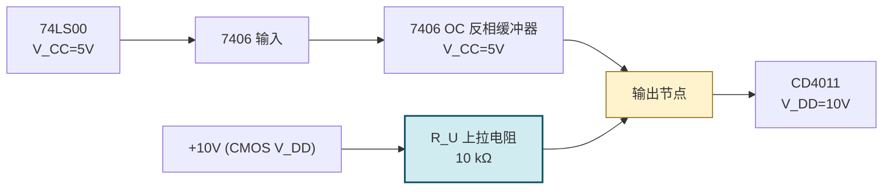

# MOC - 第2章习题 逻辑门电路

> [!abstract] 本章习题概览
> 本章习题共 **20 题**，覆盖 [[2.1 半导体开关特性|半导体开关特性]]、[[2.2 TTL 集成门电路原理|TTL 集成门电路]]、[[2.3 CMOS 门电路特性|CMOS 门电路]]、[[2.4 三态门、OC 门、线与逻辑|三态门/OC 门]]、[[2.5 门电路接口特性|接口特性]] 五个知识板块。题型分布：选择 6 题、填空 4 题、分析计算 10 题。答案与详解折叠于 `
` 中，建议先独立作答再核对。

---

## 一、选择题（6 题）

**1.** 硅 NPN 三极管作为开关使用时，工作在（ ）
A. 截止区与放大区
B. 放大区与饱和区
C. 截止区与饱和区
D. 任意工作区

**2.** TTL 与非门的输入端悬空时，其逻辑等效为（ ）
A. 逻辑 0
B. 逻辑 1
C. 高阻态
D. 不确定

**3.** CMOS 反相器在 $V_{DD}=5\text{ V}$ 下的噪声容限约为（ ）
A. $0.4\text{ V}$
B. $1.0\text{ V}$
C. $2.5\text{ V}$
D. $5.0\text{ V}$

**4.** 多个三态门输出端共用一根总线时，正确的使用方式是（ ）
A. 所有使能端同时有效
B. 任一时刻至多一个使能端有效
C. 所有使能端同时无效
D. 使能端状态任意

**5.** 下列关于 OC 门的叙述，错误的是（ ）
A. 输出端为集电极开路结构
B. 必须外接上拉电阻才能输出高电平
C. 多个 OC 门输出端可直接相连实现线与
D. 推拉输出的 TTL 门也能实现线与

**6.** 用 74LS 系列 TTL 门驱动 74HC 系列 CMOS 门（$V_{CC}=V_{DD}=5\text{ V}$），最简单的电平匹配方法是（ ）
A. 在 TTL 输出端加下拉电阻
B. 在 TTL 输出端加上拉电阻到 $V_{CC}$
C. 在两者之间加反相器
D. 直接连接即可

选择题答案

1. **C**。数字电路让三极管工作在截止（断开）与饱和（导通）两区，跳过放大区。
2. **B**。TTL 输入悬空时 $T_1$ 发射结无正偏通路，等效输入高电平。但工程中不允许悬空，需接确定电平。
3. **C**。CMOS 噪声容限约为 $V_{DD}/2=5/2=2.5\text{ V}$，远大于 TTL 的 $0.4\text{ V}$。
4. **B**。任一时刻只能一个三态门使能有效，其余输出高阻，否则会因冲突烧毁。
5. **D**。推拉输出 TTL 门输出端直接短接会因一管输出高、一管输出低形成低阻通路烧毁。OC 门专为线与设计。
6. **B**。74LS 输出高仅 $2.7\text{ V}$，低于 74HC 的 $U_{IH}=3.5\text{ V}$，加上拉到 $V_{CC}$ 把高电平拉到接近 $5\text{ V}$ 即可。也可改用 74HCT 系列。

---

## 二、填空题（4 题）

**1.** 硅二极管正向导通压降约为 ______ V；NPN 三极管饱和时 $V_{CE(sat)}$ 约为 ______ V。

**2.** TTL 与非门电压传输特性中，开门电平 $U_{ON}$ 表示输出刚降到 ______ 时的输入电平；关门电平 $U_{OFF}$ 表示输出刚升到 ______ 时的输入电平。

**3.** 三态门输出有三种状态：______、______、______；当使能端无效时输出为 ______。

**4.** CMOS 反相器由 ______ 和 ______ 互补连接构成；静态时一管导通、一管 ______，故静态功耗 ______。

填空题答案

1. $0.7$；$0.3$。
2. $U_{OL(\max)}$（输出低电平上限）；$U_{OH(\min)}$（输出高电平下限）。
3. 高电平（1）；低电平（0）；高阻态（$Z$）；高阻态（$Z$）。
4. 一只 NMOS；一只 PMOS；截止；极低（近零）。

---

## 三、分析计算题（10 题）

**1.（三极管开关状态判断）** 已知 NPN 共射极电路 $V_{CC}=5\text{ V}$、$R_C=1\,\text{k}\Omega$、$R_B=20\,\text{k}\Omega$、$\beta=40$、$V_{BE}=0.7\text{ V}$、$V_{CE(sat)}=0.3\text{ V}$。当输入 $V_I=5\text{ V}$ 时，判断三极管工作状态并求输出电压 $V_O$。

解答

**(1) 求临界饱和基极电流**：
$$I_{BS}=\dfrac{V_{CC}-V_{CE(sat)}}{\beta R_C}=\dfrac{5-0.3}{40\times1\,\text{k}\Omega}=\dfrac{4.7}{40\,\text{k}\Omega}\approx117.5\,\mu\text{A}$$

**(2) 求实际基极电流**：
$$I_B=\dfrac{V_I-V_{BE}}{R_B}=\dfrac{5-0.7}{20\,\text{k}\Omega}=\dfrac{4.3}{20\,\text{k}\Omega}=215\,\mu\text{A}$$

**(3) 比较**：$I_B=215\,\mu\text{A} > I_{BS}=117.5\,\mu\text{A}$，三极管**饱和导通**。

**(4) 输出电压**：
$$\boxed{V_O=V_{CE(sat)}\approx0.3\text{ V}}$$

**说明**：若 $I_B<I_{BS}$ 则工作于放大区，$V_O=V_{CC}-\beta I_B R_C$。

**2.（三极管临界饱和设计）** 上题电路中若要求 $V_I=5\text{ V}$ 时三极管恰好不饱和（临界饱和），求 $R_B$ 的最小值。若 $\beta$ 在 $30\sim60$ 间变化，保证饱和的 $R_B$ 上限应取多少？

解答

**(1) 临界饱和条件** $I_B=I_{BS}$：
$$I_B=\dfrac{V_I-V_{BE}}{R_B}=\dfrac{V_{CC}-V_{CE(sat)}}{\beta R_C}$$

代入解得：
$$R_{B(\min)}=\dfrac{(V_I-V_{BE})\,\beta R_C}{V_{CC}-V_{CE(sat)}}=\dfrac{4.3\times40\times1\,\text{k}\Omega}{4.7}\approx36.6\,\text{k}\Omega$$

即 $R_B<36.6\,\text{k}\Omega$ 时三极管饱和。

**(2) 考虑 $\beta$ 离散性**：取 $\beta_{\min}=30$（最坏情况）：
$$R_{B(\max)}=\dfrac{4.3\times30\times1\,\text{k}\Omega}{4.7}\approx27.4\,\text{k}\Omega$$

**为保证最低 $\beta$ 时仍饱和，$R_B$ 应小于 $27.4\,\text{k}\Omega$**。工程上常取 $R_B=10\,\text{k}\Omega$ 留出饱和深度裕量。

**3.（TTL 噪声容限计算）** 某 TTL 门电路参数：$U_{OH(\min)}=2.4\text{ V}$、$U_{OL(\max)}=0.4\text{ V}$、$U_{IH(\min)}=2.0\text{ V}$、$U_{IL(\max)}=0.8\text{ V}$。求高电平噪声容限 $U_{NH}$、低电平噪声容限 $U_{NL}$，并解释物理意义。

解答

$$U_{NH}=U_{OH(\min)}-U_{IH(\min)}=2.4-2.0=0.4\text{ V}$$

$$U_{NL}=U_{IL(\max)}-U_{OL(\max)}=0.8-0.4=0.4\text{ V}$$

**物理意义**：
- $U_{NH}=0.4\text{ V}$：输出高电平最低 $2.4\text{ V}$，叠加 $0.4\text{ V}$ 负向噪声降到 $2.0\text{ V}$ 时下级仍能识别为 1；
- $U_{NL}=0.4\text{ V}$：输出低电平最高 $0.4\text{ V}$，叠加 $0.4\text{ V}$ 正向噪声升到 $0.8\text{ V}$ 时下级仍能识别为 0；
- TTL 噪声容限较小，长线传输或强干扰场合需加缓冲器或选抗干扰强的 CMOS。

**4.（TTL 扇出系数计算）** 某 TTL 与非门 $I_{OL}=16\,\text{mA}$、$I_{OH}=400\,\mu\text{A}$；负载门参数 $I_{IL}=1.0\,\text{mA}$、$I_{IH}=20\,\mu\text{A}$。求该门能驱动同类门的扇出系数 $N$。

解答

**(1) 灌电流扇出**（输出低电平时）：
$$N_L=\left\lfloor\dfrac{I_{OL}}{I_{IL}}\right\rfloor=\left\lfloor\dfrac{16}{1.0}\right\rfloor=16$$

**(2) 拉电流扇出**（输出高电平时）：
$$N_H=\left\lfloor\dfrac{I_{OH}}{I_{IH}}\right\rfloor=\left\lfloor\dfrac{400}{20}\right\rfloor=20$$

**(3) 取较小值**：
$$\boxed{N=\min(N_L, N_H)=16}$$

**说明**：扇出取两者较小值，因为高、低电平时都必须满足驱动能力。

**5.（CMOS 反相器状态分析）** CMOS 反相器 $V_{DD}=5\text{ V}$，$V_{TN}=+1.5\text{ V}$，$V_{TP}=-1.5\text{ V}$。求输入 $V_I=0\text{ V}$、$2\text{ V}$、$2.5\text{ V}$、$3\text{ V}$、$5\text{ V}$ 时 $T_P$ 和 $T_N$ 的工作状态及输出 $V_O$。

解答

PMOS 导通条件：$V_{GS,P}=V_I-V_{DD}<-1.5$，即 $V_I<3.5\text{ V}$；
NMOS 导通条件：$V_{GS,N}=V_I>1.5\text{ V}$。

| $V_I$ | $T_P$（$V_I<3.5$ 导通） | $T_N$（$V_I>1.5$ 导通） | $V_O$ |
| ----- | ---------------------- | ---------------------- | ----- |
| $0\text{ V}$ | 导通 | 截止 | $\approx5\text{ V}$ |
| $2\text{ V}$ | 导通 | 导通（饱和） | 过渡区，约 $\approx V_{DD}/2=2.5\text{ V}$ |
| $2.5\text{ V}$ | 饱和 | 饱和 | **急剧翻转点** $\approx2.5\text{ V}$ |
| $3\text{ V}$ | 导通（饱和） | 导通 | 过渡区，$\approx2.5\text{ V}$ |
| $5\text{ V}$ | 截止 | 导通 | $\approx0\text{ V}$ |

**说明**：当 $1.5<V_I<3.5$ 时两管同时导通，处于过渡区；翻转点近似在 $V_{DD}/2=2.5\text{ V}$，对应传输特性最陡处。

**6.（CMOS 动态功耗计算）** 某 CMOS 反相器负载电容 $C_L=15\,\text{pF}$，$V_{DD}=5\text{ V}$，工作频率 $f=1\,\text{MHz}$。求动态功耗。若频率提高到 $100\,\text{MHz}$，功耗变为多少？与 TTL 静态功耗（约 $2\,\text{mW}$/门）比较。

解答

**(1) $f=1\,\text{MHz}$**：
$$P_{dyn}=C_L V_{DD}^2 f=15\times10^{-12}\times5^2\times10^6=375\,\mu\text{W}=0.375\,\text{mW}$$

**(2) $f=100\,\text{MHz}$**：
$$P_{dyn}=15\times10^{-12}\times25\times10^8=37.5\,\text{mW}$$

**(3) 对比**：
- $1\,\text{MHz}$ 时 CMOS 功耗 $0.375\,\text{mW}$ ≪ TTL 静态 $2\,\text{mW}$，CMOS 优势明显；
- $100\,\text{MHz}$ 时 CMOS 功耗 $37.5\,\text{mW}$ ≫ TTL 静态 $2\,\text{mW}$，**高频下 CMOS 反而更耗电**。

**说明**：动态功耗与频率线性相关，公式 $P=C_L V_{DD}^2 f$ 是核心。降功耗途径：降低 $V_{DD}$（平方关系）、降低 $f$、减小 $C_L$。

**7.（OC 门上拉电阻计算）** 用 2 个 OC 与非门线与驱动 4 个 TTL 与非门输入端。参数：$V_{CC}=5\text{ V}$、$U_{IH}=2.0\text{ V}$、$U_{OL}=0.4\text{ V}$、$I_{OH}=0.25\,\text{mA}$、$I_{IL}=1.2\,\text{mA}$、$I_{IH}=40\,\mu\text{A}$、$I_{OL}=12\,\text{mA}$。求上拉电阻 $R_L$ 取值范围并选择标称值。

解答

**(1) 求 $R_{L(\max)}$**（所有 OC 门截止，输出 1）：
- $n=2$ 个 OC 门漏电流：$2\times0.25=0.5\,\text{mA}$
- $k=4$ 个负载门输入电流：$4\times40=160\,\mu\text{A}=0.16\,\text{mA}$
$$R_{L(\max)}=\dfrac{V_{CC}-U_{IH}}{n\,I_{OH}+k\,I_{IH}}=\dfrac{5-2.0}{0.5+0.16}=\dfrac{3.0}{0.66}\approx4.55\,\text{k}\Omega$$

**(2) 求 $R_{L(\min)}$**（最坏情况仅 1 个 OC 门导通，输出 0）：
- $R_L$ 上电流：$I_{RL}=I_{OL}-m\,I_{IL}=12-4\times1.2=12-4.8=7.2\,\text{mA}$
$$R_{L(\min)}=\dfrac{V_{CC}-U_{OL}}{I_{RL}}=\dfrac{5-0.4}{7.2\,\text{mA}}=\dfrac{4.6}{7.2}\approx0.64\,\text{k}\Omega=640\,\Omega$$

**(3) 范围**：
$$\boxed{640\,\Omega\le R_L\le4.55\,\text{k}\Omega}$$

**(4) 标称值选择**：取中间偏小值兼顾速度，可选 **$2\,\text{k}\Omega$** 或 **$2.2\,\text{k}\Omega$**（标称系列值）。

**8.（线与逻辑表达式）** 三个 OC 与非门输出端线与，输入分别为 $(A,B)$、$(C,D)$、$(E,F)$。写出总线输出 $F$ 的表达式，并用摩根定律化为最简与或非形式。

解答

**(1) 各 OC 门输出**：
$$F_1=\overline{AB},\quad F_2=\overline{CD},\quad F_3=\overline{EF}$$

**(2) 线与结果**：
$$F=F_1\cdot F_2\cdot F_3=\overline{AB}\cdot\overline{CD}\cdot\overline{EF}$$

**(3) 摩根定律化简**：
$$F=\overline{AB}\cdot\overline{CD}\cdot\overline{EF}=\overline{AB+CD+EF}$$

**说明**：3 个 OC 与非门线与等价于一个**与或非门**，省去了一级或门和一级非门，是工程上常用的节省器件技巧。参见 [[1.3 逻辑代数定律、摩根定律|1.3 摩根定律]]。

**9.（接口电平判断）** 判断下列三种互联（$V_{CC}=V_{DD}=5\text{ V}$）是否需要接口，并说明原因：
(1) 74LS → 74LS；(2) 74LS → 74HC；(3) 74HC → 74LS。

参数：74LS 的 $U_{OH}=2.7\text{ V}$、$U_{OL}=0.5\text{ V}$；74HC 的 $U_{OH}=4.3\text{ V}$、$U_{OL}=0.3\text{ V}$、$U_{IH}=3.5\text{ V}$、$U_{IL}=1.5\text{ V}$；74LS 的 $U_{IH}=2.0\text{ V}$、$U_{IL}=0.8\text{ V}$。

解答

**(1) 74LS → 74LS（同类互联）**：
- $U_{OH}=2.7\ge U_{IH}=2.0$ ✓
- $U_{OL}=0.5\le U_{IL}=0.8$ ✓
- **可直接互联**。

**(2) 74LS → 74HC（TTL 驱动 CMOS）**：
- $U_{OH}=2.7 < U_{IH}=3.5$ ✗ **高电平不满足**
- $U_{OL}=0.5\le U_{IL}=1.5$ ✓
- **需要接口**：在 TTL 输出端加接上拉电阻到 $V_{CC}$，或改用 74HCT 系列（输入阈值与 TTL 兼容）。

**(3) 74HC → 74LS（CMOS 驱动 TTL）**：
- $U_{OH}=4.3\ge U_{IH}=2.0$ ✓
- $U_{OL}=0.3\le U_{IL}=0.8$ ✓
- **可直接互联**，但需核对电流驱动能力（一般 74HC 灌电流 $4\,\text{mA}$ 足以驱动多个 74LS）。

**10.（综合接口设计）** 设计一个 74LS00（TTL，$V_{CC}=5\text{ V}$）驱动 CD4011（CMOS，$V_{DD}=10\text{ V}$）的接口电路，画出连接示意图，并说明元件选择。

解答

**(1) 问题分析**：
- TTL 输出高电平仅 $2.7\text{ V}$，CMOS 在 $V_{DD}=10\text{ V}$ 时要求 $U_{IH}\ge7\text{ V}$，**严重不匹配**；
- TTL 的 $U_{OL}=0.5\text{ V}$ 低于 CMOS 的 $U_{IL}=3\text{ V}$，低电平勉强；
- 电源电压不同，TTL 输出最高 $5\text{ V}$ 远低于 CMOS 要求的 $10\text{ V}$。

**(2) 方案选择**：使用 **高压 OC 缓冲器 7406**（输出管耐压 $30\text{ V}$）+ 上拉电阻到 $10\text{ V}$。

**(3) 连接示意图**：

**(4) 工作原理**：
- 74LS 输出 1（$2.7\text{ V}$）→ 7406 输入为 1 → 7406 内 $T_5$ 饱和 → 输出 $\approx0.3\text{ V}$ → CMOS 侧逻辑 0；
- 74LS 输出 0（$0.5\text{ V}$）→ 7406 输入为 0 → 7406 截止 → 输出被 $R_U$ 拉到 $10\text{ V}$ → CMOS 侧逻辑 1。

**(5) 元件选择**：
- 7406：六高压 OC 反相缓冲器，输出耐压 $30\text{ V}$，可承受 $10\text{ V}$ 上拉；
- $R_U=10\,\text{k}\Omega$：兼顾速度（与负载电容构成 $RC$）和功耗（$10\text{V}$ 时电流 $1\,\text{mA}$，远低于 7406 的 $I_{OL}=40\,\text{mA}$）；
- 注意：7406 是反相器，若逻辑需要同相，应在 74LS 前再加一级反相器，或选用 7407（同相 OC 缓冲器）。

---

## 考点统计表

| 知识点 | 涉及题号 | 题数 | 难度分布 |
| :--- | :--- | :---: | :--- |
| [[2.1 半导体开关特性\|二极管/三极管开关条件]] | 选择1、填空1、分析1、分析2 | 4 | 易-中 |
| [[2.1 半导体开关特性\|MOS 管开关]] | 填空4 | 1 | 易 |
| [[2.2 TTL 集成门电路原理\|TTL 输入端处理]] | 选择2、填空2 | 2 | 易 |
| [[2.2 TTL 集成门电路原理\|噪声容限]] | 选择3、分析3 | 2 | 中 |
| [[2.2 TTL 集成门电路原理\|扇出系数]] | 分析4 | 1 | 中 |
| [[2.3 CMOS 门电路特性\|CMOS 反相器原理]] | 填空4、分析5 | 2 | 中 |
| [[2.3 CMOS 门电路特性\|CMOS 动态功耗]] | 分析6 | 1 | 中 |
| [[2.4 三态门、OC 门、线与逻辑\|三态门应用]] | 选择4、填空3 | 2 | 易 |
| [[2.4 三态门、OC 门、线与逻辑\|OC 门与线与]] | 选择5、分析7、分析8 | 3 | 中-难 |
| [[2.5 门电路接口特性\|TTL↔CMOS 电平兼容]] | 选择6、分析9 | 2 | 中 |
| [[2.5 门电路接口特性\|接口电路设计]] | 分析10 | 1 | 难 |
| 合计 | — | 20 | — |

> [!tip] 复习建议
> - **器件开关条件**：牢记二极管 $0.7\text{ V}$、三极管饱和判据 $I_B>I_{BS}=V_{CC}/(\beta R_C)$、MOS 管 $V_{GS}>V_T$，并能用于计算三极管状态；
> - **TTL 参数**：噪声容限 $U_{NH}=U_{OH}-U_{IH}$、$U_{NL}=U_{IL}-U_{OL}$；扇出取 $N_L$ 与 $N_H$ 较小值；输入端悬空等效高电平但工程上禁用；
> - **CMOS 特点**：互补结构、静态功耗近零、噪声容限 $V_{DD}/2$、动态功耗 $P=C_L V_{DD}^2 f$；输入端严禁悬空；
> - **三态门与 OC 门**：三态门总线任一时刻只一个使能；OC 门必须加上拉电阻；线与实现 $\overline{AB+CD}$ 等与或非逻辑；
> - **上拉电阻计算**：分 $R_{L(\max)}$（全截止）和 $R_{L(\min)}$（仅一个导通）两种最坏情况，工程取中间值；
> - **接口设计**：先核对电平（$U_{OH}\ge U_{IH}$、$U_{OL}\le U_{IL}$），再核对电流（$|I_{OH}|\ge\sum|I_{IH}|$、$I_{OL}\ge\sum|I_{IL}|$），不满足则加上拉、换 HCT 或加缓冲器；不同电源电压必须电平转换。

## 章节导航

> [!nav] 导航
> [[MOC - 第2章|第2章 知识点目录]] · [[MOC - 数字逻辑电路|课程总览]] · 上一章习题：[[MOC - 第1章习题|第1章 数字逻辑基础习题]] · 下一章习题：[[MOC - 第3章习题|第3章 组合逻辑电路习题]]
