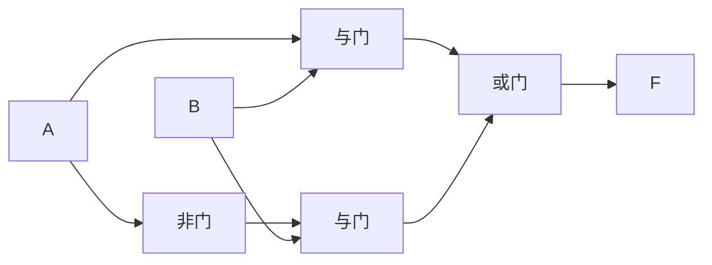
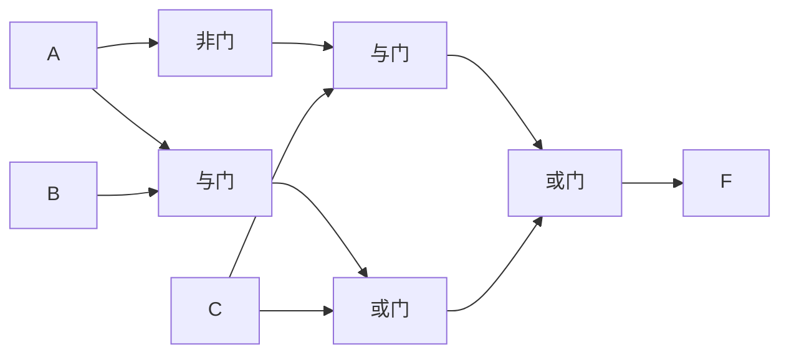
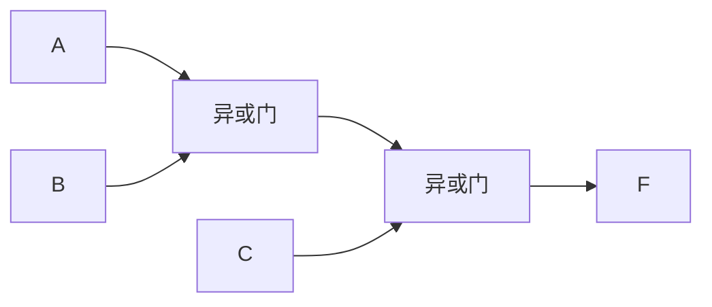
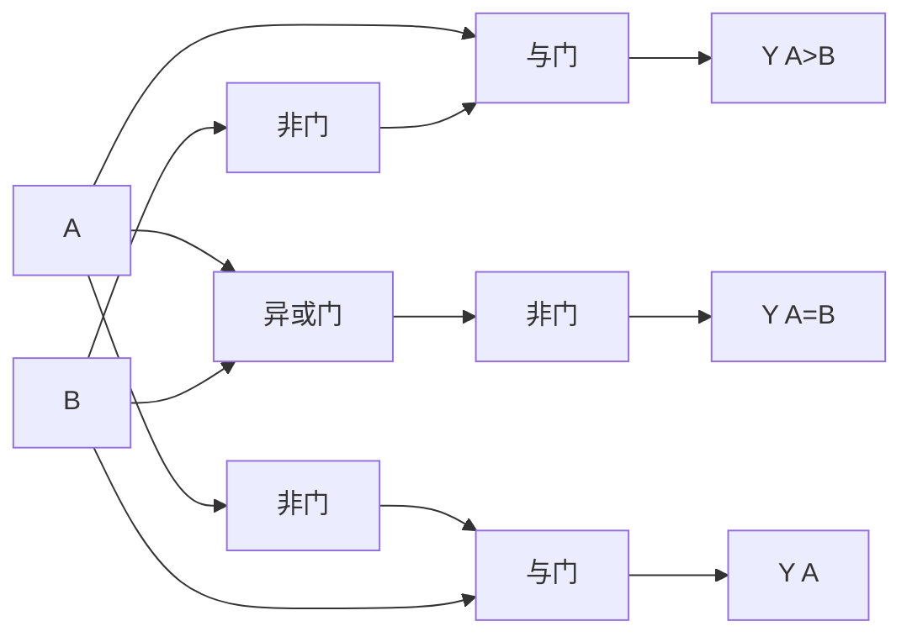
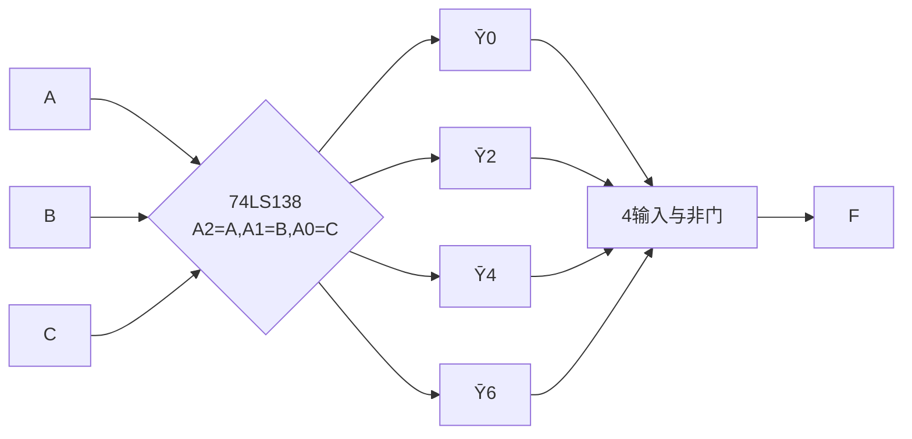
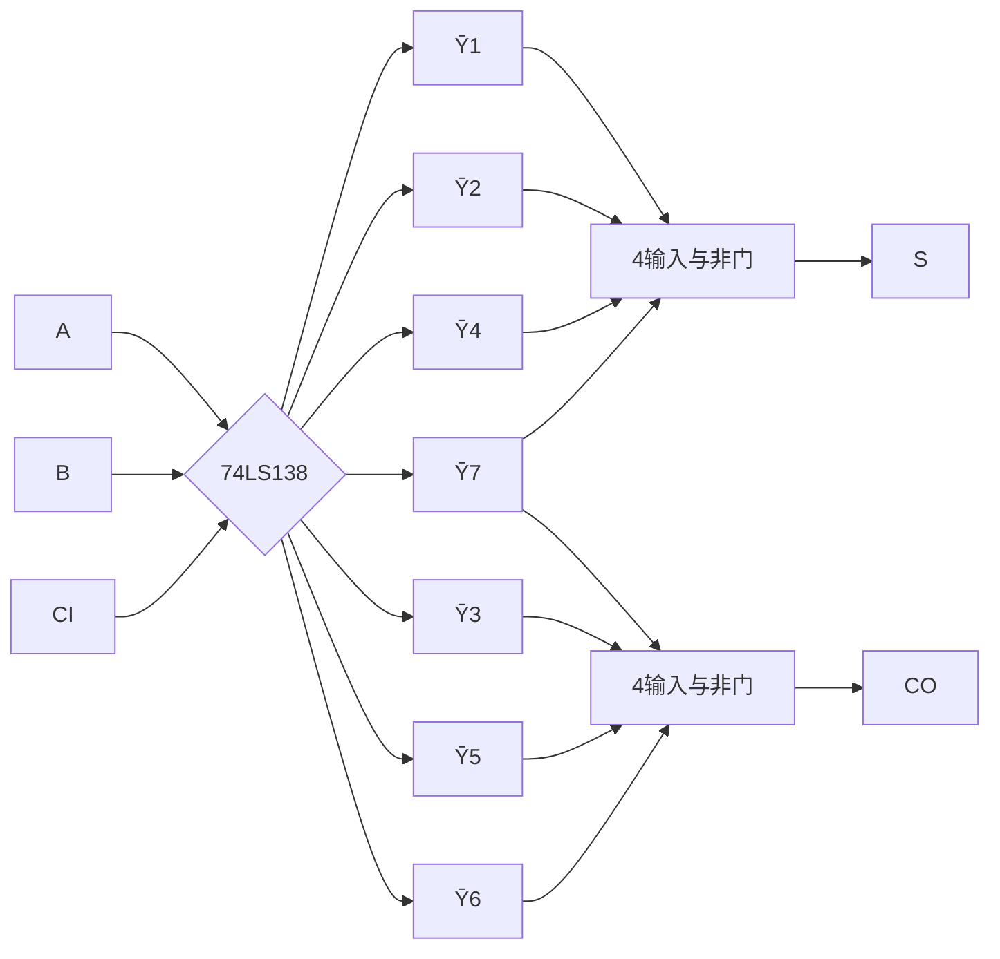
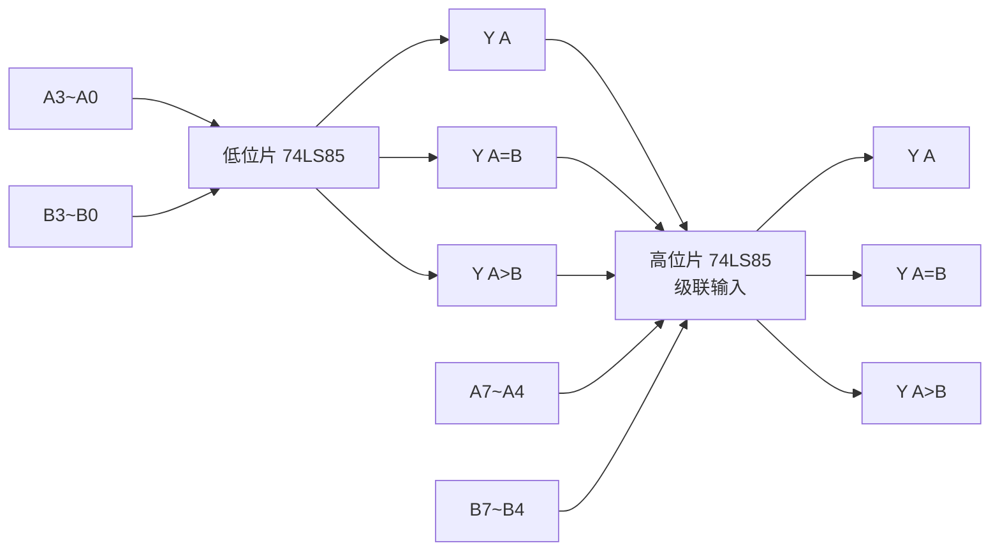
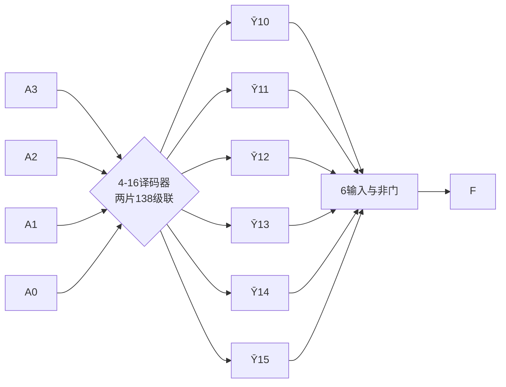

# MOC - 第3章习题 组合逻辑电路

> [!abstract] 本章习题概览
> 本章习题共 **22 题**，覆盖 [[3.1 组合电路分析方法|电路分析]]、[[3.2 组合电路设计步骤|电路设计]]、[[3.3 编码器、译码器原理|编码器/译码器]]、[[3.4 数据选择器、数据分配器|MUX 应用]]、[[3.5 加法器、数值比较器|加法器]]、[[3.6 竞争冒险现象判断与消除|竞争冒险]] 六个知识板块。题型分布：选择 6 题、填空 4 题、分析与设计 12 题。答案与详解折叠于 `
` 中，建议先独立作答再核对。

---

## 一、选择题（6 题）

**1.** 下列关于组合逻辑电路的叙述，正确的是（ ）
A. 含触发器，输出由当前输入和过去状态共同决定
B. 仅由门电路构成，输出仅由当前输入决定
C. 必须含反馈回路才能工作
D. 任意时刻的输出与输入无关

**2.** 8 线-3 线优先编码器 74LS148 的输入输出有效电平为（ ）
A. 输入高有效、输出高有效
B. 输入低有效、输出高有效
C. 输入低有效、输出低有效（反码）
D. 输入高有效、输出低有效

**3.** 用 3 线-8 线译码器 74LS138 实现三变量逻辑函数 $F=\sum m(1,3,5,7)$ 时，应把哪些输出端接到与非门输入？（ ）
A. $\overline{Y_1}, \overline{Y_3}, \overline{Y_5}, \overline{Y_7}$
B. $\overline{Y_0}, \overline{Y_2}, \overline{Y_4}, \overline{Y_6}$
C. $Y_1, Y_3, Y_5, Y_7$
D. $Y_0, Y_2, Y_4, Y_6$

**4.** 用 8 选 1 数据选择器实现三变量函数时，数据端的取值应为（ ）
A. 全部为 1
B. 按函数真值表取 0 或 1
C. 按函数最小项编号取反
D. 全部为 0

**5.** 4 位串行进位加法器从最低位进位输入到最高位进位输出，约经过几级全加器延迟？（ ）
A. 1 级
B. 2 级
C. 4 级
D. 8 级

**6.** 函数 $F = AB + \bar A C$ 在 $B=C=1$、$A$ 由 1 变 0 时可能产生的冒险类型是（ ）
A. 静态 0 冒险
B. 静态 1 冒险
C. 动态冒险
D. 无冒险

选择题答案

1. **B**。组合逻辑电路仅由门电路构成，无记忆元件、无反馈，输出仅由当前输入决定。A 描述的是时序电路；C 错在含反馈；D 显然错误。
2. **C**。74LS148 输入 $\overline{I_0}\sim\overline{I_7}$ 低有效，输出 $\overline{Y_2Y_1Y_0}$ 为反码且低有效。
3. **A**。74LS138 输出 $\overline{Y_i}=\overline{m_i}$，要得到 $F=\sum m(1,3,5,7)=m_1+m_3+m_5+m_7$，需用与非门汇总 $\overline{Y_1},\overline{Y_3},\overline{Y_5},\overline{Y_7}$（与非=反·反·反·反取反=或）。
4. **B**。MUX 输出 $Y=\sum m_i D_i$，按真值表 $F$ 取值填入对应 $D_i$ 即可。
5. **C**。4 位串行进位加法器的进位从 $C_0$ 传到 $C_4$ 需经 4 级全加器，约 4 级延迟。
6. **B**。$B=C=1$ 时 $F=A+\bar A=1$（稳态 1），$A$ 切换时因 $\bar A$ 滞后可能出现短暂 0，为静态 1 冒险。

---

## 二、填空题（4 题）

**1.** 组合逻辑电路分析的四步法是：① ______ → ② ______ → ③ ______ → ④ ______。

**2.** 74LS138 译码器共有 ______ 个输出端，每个输出 $\overline{Y_i}=$ ______（用最小项表示）。要使芯片工作，使能端 $S_1=$ ______、$\overline{S_2}=$ ______、$\overline{S_3}=$ ______。

**3.** 4 选 1 数据选择器的输出表达式 $Y=$ ______；用它实现三变量函数时需用 ______ 法把第 3 个变量接到数据端。

**4.** 4 位超前进位加法器中，进位生成 $g_i=$ ______、进位传递 $p_i=$ ______，进位递推公式 $C_{i+1}=$ ______；它的总延迟约 ______ 级门，与位数 ______（有关/无关）。

填空题答案

1. ① 逐级写表达式 ② 化简表达式 ③ 列真值表 ④ 说明功能。
2. 8；$\overline{m_i}$；$S_1=1$；$\overline{S_2}=0$；$\overline{S_3}=0$。
3. $Y=\bar A_1\bar A_0 D_0 + \bar A_1 A_0 D_1 + A_1\bar A_0 D_2 + A_1 A_0 D_3$；降维法。
4. $g_i=A_iB_i$；$p_i=A_i\oplus B_i$；$C_{i+1}=g_i+p_i C_i$；2 级；无关。

---

## 三、分析与设计题（12 题）

**1.（电路分析）** 分析下图所示电路的功能。

解答

1. 逐级写表达式：
   - $P_1 = AB$，$P_2 = \bar A$，$P_3 = \bar A B$，$F = P_1 + P_3 = AB + \bar A B = B(A+\bar A) = B$
2. 化简：$F = B$。
3. 真值表：

| $A$ | $B$ | $F$ |
| :-: | :-: | :-: |
| 0 | 0 | 0 |
| 0 | 1 | 1 |
| 1 | 0 | 0 |
| 1 | 1 | 1 |

4. 功能：输出 $F$ 始终等于 $B$，与 $A$ 无关。电路等效于"直通 B"。

**说明**：这是化简后退化为例子的典型分析题，体现"逐级写表达式→化简→列真值表→说明功能"四步法。

**2.（电路分析）** 分析下图所示三变量电路的功能。

解答

1. 逐级写表达式：
   - $P_1 = AB$，$P_2 = AB + C$，$P_3 = \bar A$，$P_4 = \bar A C$，$F = (AB+C) + \bar A C$
2. 化简：
   $$F = AB + C + \bar A C = AB + C(1+\bar A) = AB + C$$
3. 真值表：

| $A$ | $B$ | $C$ | $AB$ | $AB+C$ | $F$ |
| :-: | :-: | :-: | :--: | :-----: | :-: |
| 0 | 0 | 0 | 0 | 0 | 0 |
| 0 | 0 | 1 | 0 | 1 | 1 |
| 0 | 1 | 0 | 0 | 0 | 0 |
| 0 | 1 | 1 | 0 | 1 | 1 |
| 1 | 0 | 0 | 0 | 0 | 0 |
| 1 | 0 | 1 | 0 | 1 | 1 |
| 1 | 1 | 0 | 1 | 1 | 1 |
| 1 | 1 | 1 | 1 | 1 | 1 |

4. 功能：$F = AB + C$，即"$A$ 与 $B$ 同时为 1"或"$C=1$"时输出 1。

**3.（电路设计）** 设计一个三变量奇偶判别电路：输入 $A,B,C$，当输入中 1 的个数为奇数时输出 $F=1$，否则 $F=0$。要求：(1) 列真值表；(2) 写最简表达式；(3) 画逻辑图。

解答

**(1) 真值表**：

| $A$ | $B$ | $C$ | 1 的个数 | $F$ |
| :-: | :-: | :-: | :------: | :-: |
| 0 | 0 | 0 | 0 | 0 |
| 0 | 0 | 1 | 1 | 1 |
| 0 | 1 | 0 | 1 | 1 |
| 0 | 1 | 1 | 2 | 0 |
| 1 | 0 | 0 | 1 | 1 |
| 1 | 0 | 1 | 2 | 0 |
| 1 | 1 | 0 | 2 | 0 |
| 1 | 1 | 1 | 3 | 1 |

**(2) 表达式**：$F=\sum m(1,2,4,7)=\bar A\bar B C+\bar A B\bar C+A\bar B\bar C+ABC$。

卡诺图：

| $AB\backslash C$ | 0 | 1 |
| :-: | :-: | :-: |
| 00 | 0 | 1 |
| 01 | 1 | 0 |
| 11 | 0 | 1 |
| 10 | 1 | 0 |

4 个 1 互不相邻（棋盘格），无法合并。最简式即：
$$\boxed{F = A \oplus B \oplus C}$$

**(3) 逻辑图**：

**说明**：奇偶判别本质是三变量异或，是奇偶校验的硬件实现。

**4.（电路设计）** 设计一个 1 位二进制数比较器：输入 $A, B$，输出 $Y_{A>B}, Y_{A=B}, Y_{A<B}$ 三个信号。要求列真值表、写表达式、画逻辑图。

解答

**真值表**：

| $A$ | $B$ | $Y_{A>B}$ | $Y_{A=B}$ | $Y_{A<B}$ |
| :-: | :-: | :-------: | :-------: | :-------: |
| 0 | 0 | 0 | 1 | 0 |
| 0 | 1 | 0 | 0 | 1 |
| 1 | 0 | 1 | 0 | 0 |
| 1 | 1 | 0 | 1 | 0 |

**表达式**：
$$Y_{A>B}=A\bar B,\quad Y_{A=B}=\overline{A\oplus B}=A\odot B,\quad Y_{A<B}=\bar A B$$

**逻辑图**：

**说明**：这是 [[3.5 加法器、数值比较器|3.5]] 数值比较器的基础，4 位比较器通过级联扩展。

**5.（译码器应用）** 用 74LS138 译码器和必要的门电路实现三变量函数 $F(A,B,C)=\sum m(0,2,4,6)$。要求：(1) 说明连接方法；(2) 画出电路示意图；(3) 验证结果。

解答

**(1) 连接方法**：
- 把 $A,B,C$ 分别接 74LS138 的地址 $A_2,A_1,A_0$；
- 使能端 $S_1=1, \overline{S_2}=\overline{S_3}=0$；
- $F=\sum m(0,2,4,6)$ 对应输出端 $\overline{Y_0},\overline{Y_2},\overline{Y_4},\overline{Y_6}$；
- 由于 $\overline{Y_i}=\overline{m_i}$，需用 4 输入与非门汇总：
  $$F = \overline{\overline{Y_0}\cdot\overline{Y_2}\cdot\overline{Y_4}\cdot\overline{Y_6}} = m_0+m_2+m_4+m_6$$

**(2) 电路示意图**：

**(3) 验证**：
- $m_0=\bar A\bar B\bar C$（000），$m_2=\bar A B\bar C$（010），$m_4=A\bar B\bar C$（100），$m_6=AB\bar C$（110）
- 共同特征：$C=0$，故 $F=\bar C$
- 代数验证：$F=\bar A\bar B\bar C+\bar A B\bar C+A\bar B\bar C+AB\bar C=\bar C(\bar A\bar B+\bar A B+A\bar B+AB)=\bar C$ ✓

**说明**：用译码器实现函数时，输出端必须经与非门（不能是与门），否则得到反函数。

**6.（译码器多输出）** 用一片 74LS138 同时实现全加器的和 $S$ 与进位 $CO$（输入 $A,B,CI$）。要求写出连接方法。

解答

由 [[3.2 组合电路设计步骤|3.2]] 例题 2：
- $S = \sum m(1,2,4,7)$
- $CO = \sum m(3,5,6,7)$

**连接方法**：
- $A,B,CI$ 接 74LS138 的 $A_2,A_1,A_0$；
- $S$：把 $\overline{Y_1},\overline{Y_2},\overline{Y_4},\overline{Y_7}$ 接到一个 4 输入与非门，输出 $S$；
- $CO$：把 $\overline{Y_3},\overline{Y_5},\overline{Y_6},\overline{Y_7}$ 接到另一个 4 输入与非门，输出 $CO$；
- 注意 $\overline{Y_7}$ 同时驱动两个与非门（共享）。

**说明**：译码器法实现多输出函数的优势——共享译码器，每个输出只需一个与非门，比门级设计省器件。

**7.（MUX 应用）** 用 8 选 1 数据选择器 74LS151 实现函数 $F(A,B,C)=\sum m(1,3,5,7)$。要求写出数据端取值。

解答

$F=\sum m(1,3,5,7)$，按真值表填数据端：

| $i$ | $ABC$ | $D_i$ |
| :-: | :-: | :-: |
| 0 | 000 | 0 |
| 1 | 001 | 1 |
| 2 | 010 | 0 |
| 3 | 011 | 1 |
| 4 | 100 | 0 |
| 5 | 101 | 1 |
| 6 | 110 | 0 |
| 7 | 111 | 1 |

即 $D_1=D_3=D_5=D_7=1$，其余 $D_i=0$。地址 $A_2A_1A_0=ABC$。

**说明**：观察可知 $F=C$（最小项 1,3,5,7 共同特征是 $C=1$）。用 8 选 1 实现"恒等于 C"虽然浪费，但演示了通用方法。

**8.（MUX 降维）** 用 4 选 1 数据选择器 74LS153 实现函数 $F(A,B,C)=\sum m(1,3,5,7)$。要求写出数据端取值。

解答

把 $A,B$ 接地址 $A_1A_0$，$C$ 接数据端。按 $C$ 取值分组：

| $A$ | $B$ | $C=0$ 时 $F$ | $C=1$ 时 $F$ | $D_i$ |
| :-: | :-: | :----------: | :----------: | :---: |
| 0 | 0 | 0 | 1 | $C$ |
| 0 | 1 | 0 | 1 | $C$ |
| 1 | 0 | 0 | 1 | $C$ |
| 1 | 1 | 0 | 1 | $C$ |

故 $D_0=D_1=D_2=D_3=C$。

**验证**：$F=C\cdot\bar A\bar B + C\cdot\bar A B + C\cdot A\bar B + C\cdot AB = C(\bar A\bar B+\bar A B+A\bar B+AB)=C$ ✓

**说明**：降维法把三变量函数用 4 选 1 实现，节省一半 MUX 容量。

**9.（加法器）** 用 4 位二进制加法器计算 $A=(1011)_2$ 与 $B=(0111)_2$ 的和，写出计算过程与结果。

解答

逐位相加（$A_3A_2A_1A_0=1011$，$B_3B_2B_1B_0=0111$）：

| 位 | $A_i$ | $B_i$ | $CI_i$ | $S_i$ | $CO_i$ |
| -- | :-: | :-: | :----: | :-: | :----: |
| 0 | 1 | 1 | 0 | 0 | 1 |
| 1 | 1 | 1 | 1 | 1 | 1 |
| 2 | 0 | 1 | 1 | 0 | 1 |
| 3 | 1 | 0 | 1 | 0 | 1 |

结果：$S=S_3S_2S_1S_0=0010$，最高进位 $CO_3=1$，即 $A+B=(10010)_2=(18)_{10}$。

**验证**：$A=(11)_{10}$、$B=(7)_{10}$，$11+7=18$ ✓。

**说明**：4 位加法器的最高进位 $CO_3$ 表示结果超出 4 位表示范围，需要保留。

**10.（数值比较器）** 用两片 74LS85 构成 8 位数值比较器，画出级联示意图并说明最低位片的级联输入接法。

解答

**级联示意图**：

**最低位片级联输入接法**：
- $I_{A=B}=1$（相等标志，初值为 1 表示"若高位全等则两数相等"）
- $I_{A>B}=0$、$I_{A<B}=0$

**说明**：从高位到低位比较，高位片的结果即为最终结果；只有当高位全等时才看低位片的输出，故低位片输出接高位片级联输入。

**11.（竞争冒险）** 判断函数 $F = (A+B)(\bar A+C)$ 是否存在冒险，若有请说明类型与条件，并给出消除方法。

解答

**代数法判断**：
- 令 $B=C=0$：$F = A\cdot\bar A$，存在 **静态 0 冒险**（稳态应为 0，$A$ 切换时可能短暂为 1）；
- 令 $B=0, C=1$：$F = A\cdot(\bar A+1)=A$，无冒险；
- 令 $B=1, C=0$：$F = (A+1)\cdot\bar A=\bar A$，无冒险；
- 令 $B=C=1$：$F = (A+1)(\bar A+1)=1$，无冒险。

**结论**：当 $B=C=0$、$A$ 切换时存在静态 0 冒险。

**消除方法（冗余项法）**：
把 $F$ 转为或与式对应的卡诺图（圈 0），找到桥接位置增加冗余因子。
展开 $F = (A+B)(\bar A+C) = A\bar A + AC + B\bar A + BC = AC + \bar A B + BC$。
该式与 [[3.6 竞争冒险现象判断与消除|3.6]] 中 $F=AB+\bar A C+BC$ 同构，冒险出现在 $\bar A$ 与 $A$ 路径，可加冗余因子 $(B+C)$ 到原或与式：
$$\boxed{F = (A+B)(\bar A+C)(B+C)}$$

当 $B=C=0$ 时 $(B+C)=0$，$F=0$ 恒成立，消除静态 0 冒险。

**说明**：或与式的冗余因子法与与或式的冗余项法对称，对应冗余定理 $XY+\bar X Z+YZ=XY+\bar X Z$ 的对偶形式。

**12.（综合设计）** 设计一个 4 位二进制数的"大于 9"判断电路：输入 $A_3A_2A_1A_0$ 表示 4 位二进制数，当数值 $>9$ 时输出 $F=1$。要求：(1) 列真值表（含无关项说明）；(2) 用卡诺图化简；(3) 用 74LS138 译码器实现。

解答

**(1) 真值表**：
- 数值 0–9（0000–1001）：$F=0$（0–9 不大于 9）
- 数值 10–15（1010–1111）：$F=1$
- 无无关项（4 位二进制数取值 0–15 都可能）

| 数值 | $A_3$ | $A_2$ | $A_1$ | $A_0$ | $F$ |
| :-: | :-: | :-: | :-: | :-: | :-: |
| 0–9 | — | — | — | — | 0 |
| 10 | 1 | 0 | 1 | 0 | 1 |
| 11 | 1 | 0 | 1 | 1 | 1 |
| 12 | 1 | 1 | 0 | 0 | 1 |
| 13 | 1 | 1 | 0 | 1 | 1 |
| 14 | 1 | 1 | 1 | 0 | 1 |
| 15 | 1 | 1 | 1 | 1 | 1 |

$F=\sum m(10,11,12,13,14,15)$。

**(2) 卡诺图化简**：

| $A_3A_2\backslash A_1A_0$ | 00 | 01 | 11 | 10 |
| :-: | :-: | :-: | :-: | :-: |
| 00 | 0 | 0 | 0 | 0 |
| 01 | 0 | 0 | 0 | 0 |
| 11 | 1 | 1 | 1 | 1 |
| 10 | 0 | 0 | 1 | 1 |

分组：
- $m_{12}, m_{13}, m_{14}, m_{15}$（$A_3A_2=11$）→ $A_3A_2$
- $m_{10}, m_{11}, m_{14}, m_{15}$（$A_3=1, A_1=1$）→ $A_3A_1$

$$\boxed{F = A_3 A_2 + A_3 A_1 = A_3(A_2 + A_1)}$$

**(3) 用 74LS138 实现**：
- $A_3, A_2, A_1$ 接 74LS138 的 $A_2, A_1, A_0$（$A_0$ 不参与，可固定）；
- 注意 $F$ 仅含 3 变量，但 $A_0$ 是第 4 变量。需用降维或把 $A_0$ 接到使能端。
- 更直接：把 4 变量都接到 4 线-16 线译码器（两片 138 级联），输出 $\overline{Y_{10}}\sim\overline{Y_{15}}$ 接到一个 6 输入与非门即可。

**说明**：本题综合考察真值表、化简、译码器实现三种方法。注意 4 变量函数需 4 线-16 线译码器（或两片 138 级联）。

---

## 考点统计表

| 知识点 | 涉及题号 | 题数 | 难度分布 |
| :--- | :--- | :---: | :--- |
| [[3.1 组合电路分析方法\|组合电路分析]] | 选择1、分析1、分析2 | 3 | 易-中 |
| [[3.2 组合电路设计步骤\|组合电路设计]] | 分析3、分析4 | 2 | 中 |
| [[3.3 编码器、译码器原理\|编码器原理]] | 选择2 | 1 | 易 |
| [[3.3 编码器、译码器原理\|译码器应用]] | 选择3、填空2、分析5、分析6、分析12 | 5 | 中-难 |
| [[3.4 数据选择器、数据分配器\|MUX 应用]] | 选择4、填空3、分析7、分析8 | 4 | 中 |
| [[3.5 加法器、数值比较器\|加法器]] | 选择5、填空4、分析9 | 3 | 中 |
| [[3.5 加法器、数值比较器\|数值比较器]] | 分析4、分析10 | 2 | 中 |
| [[3.6 竞争冒险现象判断与消除\|竞争冒险]] | 选择6、分析11 | 2 | 中-难 |
| 综合（化简+译码器实现） | 分析12 | 1 | 难 |
| 合计 | — | 22 | — |

> [!tip] 复习建议
> - **分析题**先逐级标中间变量、化简后必须列真值表确认功能；
> - **设计题**牢记五步法，含无关项问题（如 BCD）必须利用无关项化简；
> - **译码器应用**核心是 $\overline{Y_i}=\overline{m_i}$，输出用**与非门**汇总；多输出函数优先用译码器法共享芯片；
> - **MUX 应用**注意地址与变量对应，降维法把第 $n$ 变量接数据端时按 $C=0/1$ 分组判断 $D_i$；
> - **加法器**区分串行进位（延迟 $n$ 级）与超前进位（延迟 2 级，与位数无关），减法用补码加 1；
> - **数值比较器**级联时最低位片 $I_{A=B}=1$；
> - **竞争冒险**代数法判断 $A+\bar A$（静 1）与 $A\bar A$（静 0），冗余项消除对应冗余定理。

## 章节导航

> [!nav] 导航
> [[MOC - 第3章|第3章 知识点目录]] · [[MOC - 数字逻辑电路|课程总览]] · 下一章习题：[[MOC - 第4章习题|第4章 触发器习题]]
