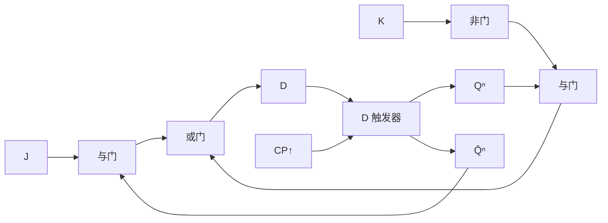
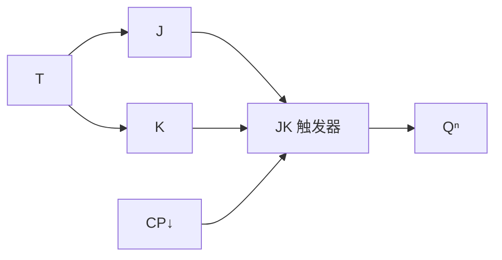

# MOC - 第4章习题 触发器

> [!abstract] 本章习题概览
> 本章习题共 **20 题**，覆盖 [[4.1 基本 RS 触发器|基本 RS 触发器]]、[[4.2 同步 RS、D 触发器|同步 RS/D 触发器]]、[[4.3 JK 触发器、T 触发器|JK/T 触发器]]、[[4.4 边沿触发器特性|边沿触发器]]、[[4.5 触发器相互转换|触发器转换]] 五个知识板块。题型分布：选择 6 题、填空 4 题、分析计算 10 题。答案与详解折叠于 `
` 中，建议先独立作答再核对。

---

## 一、选择题（6 题）

**1.** 由与非门构成的基本 RS 触发器，禁止状态对应的输入是（ ）
A. $\bar{S}=0,\ \bar{R}=0$
B. $\bar{S}=0,\ \bar{R}=1$
C. $\bar{S}=1,\ \bar{R}=0$
D. $\bar{S}=1,\ \bar{R}=1$

**2.** 同步 RS 触发器产生"空翻"现象的原因是（ ）
A. 时钟频率过高
B. $CP=1$ 期间输入变化导致输出多次翻转
C. 触发器为下降沿触发
D. 输入端存在干扰

**3.** JK 触发器的特性方程是（ ）
A. $Q^{n+1}=J+\bar{K}Q^n$
B. $Q^{n+1}=J\bar{Q^n}+\bar{K}Q^n$
C. $Q^{n+1}=J\oplus K$
D. $Q^{n+1}=JK+\bar{J}\bar{K}Q^n$

**4.** T 触发器在 $T=1$ 时的功能是（ ）
A. 置 0
B. 置 1
C. 保持
D. 翻转

**5.** 下列关于边沿触发器的叙述，正确的是（ ）
A. 在 $CP=1$ 期间输出随输入变化
B. 只在 $CP$ 的跳变沿时刻采样输入
C. 建立时间是指有效沿之后输入需稳定的时间
D. 下降沿触发器的 $CP$ 端无小圆圈

**6.** 74LS74 是（ ）
A. 下降沿 JK 触发器
B. 上升沿 D 触发器
C. 下降沿 D 触发器
D. 上升沿 JK 触发器

选择题答案

1. **A**。与非门结构输入低有效，$\bar{S}=\bar{R}=0$ 时两输出同时为 1，违反互补关系，且撤销时次态不可预测，属禁止状态。
2. **B**。电平触发在 $CP=1$ 全程对输入敏感，输入变化即输出跟随，导致一个时钟周期内多次翻转。
3. **B**。JK 特性方程 $Q^{n+1}=J\bar{Q^n}+\bar{K}Q^n$，无约束条件。
4. **D**。$T=1$ 时 $Q^{n+1}=1\oplus Q^n=\bar{Q^n}$，即翻转。
5. **B**。边沿触发只在 $CP$ 跳变沿采样；A 是电平触发；C 建立时间在有效沿**之前**；D 下降沿触发 $CP$ 端**有**小圆圈。
6. **B**。74LS74 是双上升沿 D 触发器，74LS112 才是下降沿 JK 触发器。

---

## 二、填空题（4 题）

**1.** 同步 D 触发器（D 锁存器）的特性方程为 ______，当 $CP=1$ 时输出 $Q$ ______ 输入 $D$（跟随/锁存），当 $CP=0$ 时输出 ______。

**2.** T' 触发器的特性方程为 ______，将 3 级 T' 触发器级联，输出频率为时钟频率的 ______ 分之一。

**3.** 边沿触发器中，建立时间 $t_{\text{setup}}$ 是指时钟有效沿到来 ______（之前/之后）输入需稳定的最短时间；保持时间 $t_{\text{hold}}$ 是有效沿到来 ______（之前/之后）输入需稳定的最短时间。

**4.** 用 JK 触发器转换为 D 触发器时，应令 $J=$ ______，$K=$ ______；用 JK 触发器转换为 T 触发器时，应令 $J=K=$ ______。

填空题答案

1. $Q^{n+1}=D$；跟随；锁存（保持不变）。D 锁存器在 $CP=1$ 期间透明，$CP=0$ 期间锁存。
2. $Q^{n+1}=\bar{Q^n}$；$8$（$2^3=8$）。每级 T' 实现 2 分频，3 级级联实现 $2^3=8$ 分频。
3. 之前；之后。建立时间约束有效沿前的稳定期，保持时间约束有效沿后的稳定期。
4. $D$；$\bar{D}$；$T$。由比较特性方程得出：JK→D 时 $J=D,K=\bar{D}$；JK→T 时 $J=K=T$。

---

## 三、分析计算题（10 题）

**1.（基本 RS 触发器次态计算）** 由与非门构成的基本 RS 触发器，初态 $Q=0$，依次施加输入 $(\bar{S},\bar{R})=(0,1)\to(1,1)\to(1,0)\to(1,1)$，求每步的次态 $Q^{n+1}$。

解答

按特性表逐段分析（与非门结构低有效）：

| 步骤 | $\bar{S}$ | $\bar{R}$ | $Q^n$ | $Q^{n+1}$ | 功能 |
| :--: | :-: | :-: | :-: | :-: | :--- |
| 1 | 0 | 1 | 0 | 1 | 置 1 |
| 2 | 1 | 1 | 1 | 1 | 保持 |
| 3 | 1 | 0 | 1 | 0 | 置 0 |
| 4 | 1 | 1 | 0 | 0 | 保持 |

状态序列：$Q=0\to 1\to 1\to 0\to 0$。

**说明**：第 2 步 $\bar{S}=\bar{R}=1$ 时保持上一步的 1；第 4 步保持上一步的 0。

**2.（同步 D 触发器时序分析）** 同步 D 锁存器初态 $Q=0$，$CP$ 与 $D$ 的波形按时序为：$CP=1$ 时 $D$ 依次为 $1\to 0$，然后 $CP=0$ 时 $D$ 变为 $1$，再 $CP=1$ 时 $D=0$。求 $Q$ 的完整变化过程。

解答

分段分析（$CP=1$ 透明跟随，$CP=0$ 锁存）：

| 阶段 | $CP$ | $D$ | $Q$ | 说明 |
| :--: | :--: | :-: | :-: | :--- |
| 初态 | — | — | 0 | — |
| ① | 1 | 1 | 1 | 透明，$Q$ 跟随 $D=1$ |
| ② | 1 | 0 | 0 | 透明，$Q$ 跟随 $D=0$ |
| ③ | 0 | 1 | 0 | 锁存，$D$ 变化不影响，$Q$ 保持 0 |
| ④ | 1 | 0 | 0 | 透明，$Q$ 跟随 $D=0$ |

$Q$ 序列：$0\to 1\to 0\to 0\to 0$。

**关键**：阶段③ $CP=0$ 期间虽然 $D=1$，但锁存器已关闭，$Q$ 保持阶段②结束时的 0。

**3.（JK 触发器波形分析）** 下降沿 JK 触发器，初态 $Q=0$，时钟下降沿处 $J$、$K$ 取值依次为：$(0,0),(1,0),(1,1),(0,1),(1,1)$。画出 $Q$ 的波形序列。

解答

每个 $CP$ 下降沿按 JK 特性表更新：

| 下降沿序号 | $J$ | $K$ | $Q^n$ | $Q^{n+1}$ | 功能 |
| :--------: | :-: | :-: | :---: | :-------: | :--- |
| 1 | 0 | 0 | 0 | 0 | 保持 |
| 2 | 1 | 0 | 0 | 1 | 置 1 |
| 3 | 1 | 1 | 1 | 0 | 翻转 |
| 4 | 0 | 1 | 0 | 0 | 置 0 |
| 5 | 1 | 1 | 0 | 1 | 翻转 |

$Q$ 序列：$0\to 0\to 1\to 0\to 0\to 1$。

**说明**：第 3 沿 $J=K=1$ 翻转，$Q$ 从 1 变 0；第 5 沿 $J=K=1$ 翻转，$Q$ 从 0 变 1。下降沿之间 $Q$ 不变。

**4.（T 触发器分频电路）** 上升沿 T 触发器，$T$ 恒接 1（即 T' 触发器），时钟 $CP$ 频率 $f=1\,\text{kHz}$，初态 $Q=0$。求：(1) $Q$ 的频率；(2) 4 个 $CP$ 周期内的 $Q$ 波形。

解答

**(1) 频率计算**

T' 触发器每个上升沿翻转一次，$Q$ 每两个 $CP$ 周期完成一个完整周期：
$$f_Q = \frac{f_{CP}}{2} = \frac{1000}{2} = 500\,\text{Hz}$$

**(2) 波形**

| $CP$ 周期 | 0 | 1 | 2 | 3 |
| :--------: | :-: | :-: | :-: | :-: |
| $CP$ 上升沿 | ↑ | ↑ | ↑ | ↑ |
| $Q$ | 1 | 0 | 1 | 0 |

（初态 $Q=0$，第 1 个上升沿翻为 1，第 2 个翻回 0，依此类推。）

**说明**：T' 触发器实现 2 分频，是 [[MOC - 第5章|第5章]] 二进制计数器的基本单元。

**5.（边沿 D 触发器波形分析）** 上升沿 D 触发器 74LS74，初态 $Q=0$，$\bar{S}_D=\bar{R}_D=1$。在 $CP$ 上升沿处 $D$ 取值依次为 $1,0,1,1,0$。求 $Q$ 序列，并说明若在第 3 个上升沿后令 $\bar{R}_D=0$ 会发生什么。

解答

**(1) 正常工作（$\bar{S}_D=\bar{R}_D=1$）**

每个 $CP$ 上升沿采样 $D$，$Q^{n+1}=D$：

| 上升沿序号 | $D$ | $Q^{n+1}$ |
| :--------: | :-: | :-------: |
| 1 | 1 | 1 |
| 2 | 0 | 0 |
| 3 | 1 | 1 |
| 4 | 1 | 1 |
| 5 | 0 | 0 |

$Q$ 序列：$0\to 1\to 0\to 1\to 1\to 0$。

**(2) 异步置 0 的影响**

第 3 个上升沿后 $Q=1$，此时令 $\bar{R}_D=0$：异步置 0 端优先级最高，不受 $CP$ 控制，$Q$ **立即**被强制为 0，不论 $D$ 为何值。此后若恢复 $\bar{R}_D=1$，则从下一个上升沿起恢复正常采样。

**关键**：异步端 $\bar{S}_D,\bar{R}_D$ 随时生效，优先级高于 $CP$ 与 $D$，常用于上电初始化。

**6.（D→JK 转换设计）** 试用上升沿 D 触发器及必要的门电路实现 JK 触发器功能。要求写出转换表达式、画出电路图。

解答

**(1) 转换方程推导**

D 特性方程：$Q^{n+1}=D$
JK 特性方程：$Q^{n+1}=J\bar{Q^n}+\bar{K}Q^n$

令二者相等：
$$\boxed{D = J\,\overline{Q^n} + \bar{K}\,Q^n}$$

**(2) 电路图**

**(3) 验证**

当 $J=K=1$：$D=\bar{Q^n}+0\cdot Q^n=\bar{Q^n}$，翻转 ✓
当 $J=0,K=0$：$D=0+1\cdot Q^n=Q^n$，保持 ✓
当 $J=1,K=0$：$D=\bar{Q^n}+Q^n=1$，置 1 ✓
当 $J=0,K=1$：$D=0+0=0$，置 0 ✓

**7.（JK→T 转换设计）** 试用下降沿 JK 触发器实现 T 触发器功能，并验证。

解答

**(1) 转换方程推导**

JK 方程：$Q^{n+1}=J\bar{Q^n}+\bar{K}Q^n$
T 方程：$Q^{n+1}=T\bar{Q^n}+\bar{T}Q^n$

比较系数：
$$\boxed{J = T,\quad K = T}$$

**(2) 电路图**

**(3) 验证**

- $T=0$：$J=K=0$，保持，$Q^{n+1}=Q^n=0\oplus Q^n$ ✓
- $T=1$：$J=K=1$，翻转，$Q^{n+1}=\bar{Q^n}=1\oplus Q^n$ ✓

与 T 触发器特性方程 $Q^{n+1}=T\oplus Q^n$ 完全一致。

**8.（RS 触发器特性方程应用）** 或非门构成的基本 RS 触发器（输入高有效），初态 $Q=1$。求下列输入序列下的次态序列：$(S,R)=(0,0)\to(1,0)\to(0,1)\to(0,0)\to(1,1)$。并指出哪一步违反约束。

解答

或非门版特性方程：$Q^{n+1}=S+\bar{R}Q^n$，约束 $SR=0$。

| 步骤 | $S$ | $R$ | $Q^n$ | $Q^{n+1}=S+\bar{R}Q^n$ | 功能 | 是否违反 |
| :--: | :-: | :-: | :---: | :--------------------- | :--- | :------: |
| 1 | 0 | 0 | 1 | $0+1\cdot1=1$ | 保持 | 否 |
| 2 | 1 | 0 | 1 | $1+1\cdot1=1$ | 置 1 | 否 |
| 3 | 0 | 1 | 1 | $0+0\cdot1=0$ | 置 0 | 否 |
| 4 | 0 | 0 | 0 | $0+1\cdot0=0$ | 保持 | 否 |
| 5 | 1 | 1 | 0 | 禁止（$SR=1$） | 禁止 | **是** |

$Q$ 序列：$1\to 1\to 1\to 0\to 0\to$ 禁止。

**说明**：第 5 步 $S=R=1$ 违反约束 $SR=0$，此时或非门输出 $Q=\bar{Q}=0$，撤销时次态不可预测。

**9.（JK 触发器多周期次态计算）** 下降沿 JK 触发器，初态 $Q=0$，$J$、$K$ 波形满足下表。计算前 6 个下降沿的 $Q$ 序列。

| 下降沿序号 | 1 | 2 | 3 | 4 | 5 | 6 |
| :--------: | :-: | :-: | :-: | :-: | :-: | :-: |
| $J$ | 1 | 1 | 0 | 1 | 0 | 1 |
| $K$ | 0 | 1 | 1 | 1 | 0 | 1 |

解答

按 $Q^{n+1}=J\bar{Q^n}+\bar{K}Q^n$ 逐拍计算：

| 序号 | $J$ | $K$ | $Q^n$ | $\bar{Q^n}$ | $J\bar{Q^n}$ | $\bar{K}$ | $\bar{K}Q^n$ | $Q^{n+1}$ | 功能 |
| :--: | :-: | :-: | :---: | :--------: | :----------: | :-------: | :----------: | :-------: | :--- |
| 1 | 1 | 0 | 0 | 1 | 1 | 1 | 0 | **1** | 置1 |
| 2 | 1 | 1 | 1 | 0 | 0 | 0 | 0 | **0** | 翻转 |
| 3 | 0 | 1 | 0 | 1 | 0 | 0 | 0 | **0** | 置0 |
| 4 | 1 | 1 | 0 | 1 | 1 | 0 | 0 | **1** | 翻转 |
| 5 | 0 | 0 | 1 | 0 | 0 | 1 | 1 | **1** | 保持 |
| 6 | 1 | 1 | 1 | 0 | 0 | 0 | 0 | **0** | 翻转 |

$Q$ 序列：$0\to 1\to 0\to 0\to 1\to 1\to 0$。

**说明**：序号 4 中 $J=K=1$ 时翻转，$Q$ 从 0 变 1；序号 5 中 $J=K=0$ 时保持，$Q$ 维持 1。

**10.（级联分频综合题）** 用 3 级上升沿 T' 触发器级联构成分频电路，第一级 $CP$ 接 $1\,\text{MHz}$ 时钟，后一级 $CP$ 接前一级 $Q$。初态均为 0。求：(1) 各级输出频率；(2) 画出 8 个时钟周期内 $Q_1,Q_2,Q_3$ 的波形；(3) 该电路可作为一个几位二进制计数器？

解答

**(1) 频率计算**

每级 T' 实现 2 分频：
- $f_{Q_1} = \dfrac{1\,\text{MHz}}{2} = 500\,\text{kHz}$
- $f_{Q_2} = \dfrac{500\,\text{kHz}}{2} = 250\,\text{kHz}$
- $f_{Q_3} = \dfrac{250\,\text{kHz}}{2} = 125\,\text{kHz}$

**(2) 波形（8 个 $CP$ 周期，初态 $Q_1=Q_2=Q_3=0$）**

每级在自身 $CP$ 上升沿翻转。$Q_1$ 每个 $CP$ 上升沿翻转；$Q_2$ 在 $Q_1$ 上升沿翻转；$Q_3$ 在 $Q_2$ 上升沿翻转。

| $CP$ 周期 | 0 | 1 | 2 | 3 | 4 | 5 | 6 | 7 |
| :--------: | :-: | :-: | :-: | :-: | :-: | :-: | :-: | :-: |
| $Q_1$ | 0 | 1 | 0 | 1 | 0 | 1 | 0 | 1 |
| $Q_2$ | 0 | 0 | 1 | 1 | 0 | 0 | 1 | 1 |
| $Q_3$ | 0 | 0 | 0 | 0 | 1 | 1 | 1 | 1 |

读取 $(Q_3Q_2Q_1)$：000→001→010→011→100→101→110→111，即从 0 到 7 的二进制递增序列。

**(3) 计数器位数**

3 级 T' 触发器级联可计 $2^3=8$ 个状态（0–7），是一个 **3 位二进制加法计数器**（模 8 计数器）。

**说明**：这是 [[MOC - 第5章|第5章]] 异步二进制计数器的经典结构。将 $Q$ 接下一级 $CP$ 实现"逢二进一"的级联进位。

---

## 考点统计表

| 知识点 | 涉及题号 | 题数 | 难度分布 |
| :--- | :--- | :---: | :--- |
| [[4.1 基本 RS 触发器\|基本 RS 触发器]] | 选择1、填空4（部分）、分析1、分析8 | 3 | 易-中 |
| [[4.2 同步 RS、D 触发器\|同步 RS、D 触发器与空翻]] | 选择2、填空1、分析2 | 3 | 中 |
| [[4.3 JK 触发器、T 触发器\|JK 触发器]] | 选择3、分析3、分析9 | 3 | 中 |
| [[4.3 JK 触发器、T 触发器\|T/T' 触发器与分频]] | 选择4、填空2、分析4、分析10 | 4 | 中-难 |
| [[4.4 边沿触发器特性\|边沿触发与建立/保持时间]] | 选择5、选择6、填空3、分析5 | 4 | 中 |
| [[4.5 触发器相互转换\|触发器转换]] | 填空4、分析6、分析7 | 3 | 中-难 |
| 综合（级联分频/计数器） | 分析10 | 1 | 难 |
| 合计 | — | 20 | — |

> [!tip] 复习建议
> - **特性表与特性方程**是核心，务必背熟 RS、D、JK、T 四类方程及约束条件；
> - **波形分析题**先确认触发方式（电平/上升沿/下降沿），再逐拍代入方程，注意有效沿之间 $Q$ 不变；
> - **空翻现象**是电平触发的固有缺陷，理解其成因才能体会边沿触发的必要性；
> - **建立/保持时间**方向不可颠倒：建立在前、保持在后，违反会引发亚稳态；
> - **触发器转换**关键是"比较特性方程求源输入"，JK→D/T 较简，D→JK 需完整组合逻辑；
> - **T' 级联分频**是 [[MOC - 第5章|第5章]] 计数器的雏形，掌握频率计算与波形对应关系。

## 章节导航

> [!nav] 导航
> [[MOC - 第4章|第4章 知识点目录]] · [[MOC - 数字逻辑电路|课程总览]] · 下一章习题：[[MOC - 第5章习题|第5章 时序逻辑电路习题]]
