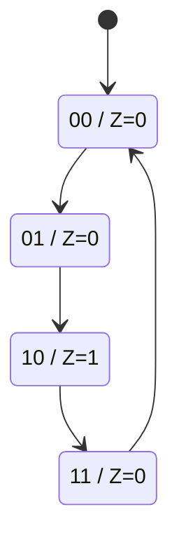
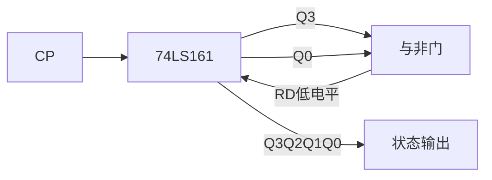
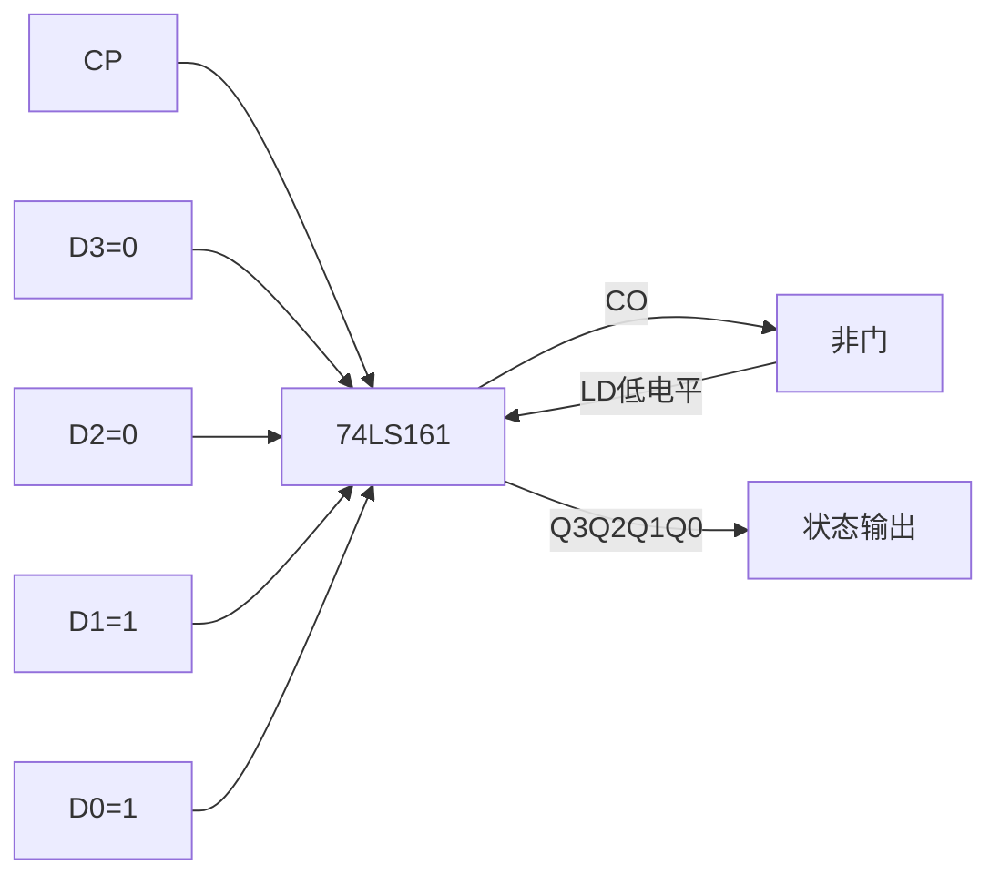
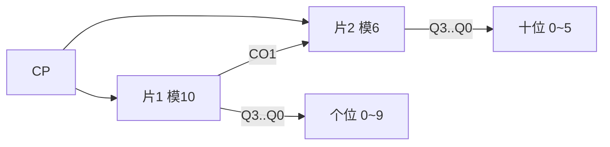
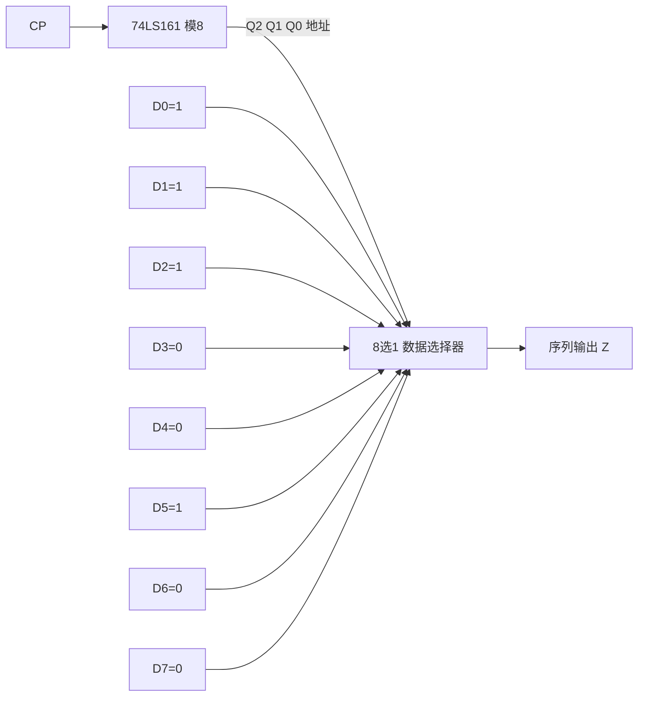

# MOC - 第5章习题 时序逻辑电路

> [!abstract] 本章习题概览
> 本章习题共 **22 题**，覆盖 [[5.1 时序电路分析步骤|时序电路分析]]、[[5.2 寄存器、移位寄存器|寄存器与移位寄存器]]、[[5.3 同步计数器、异步计数器|计数器分析]]、[[5.4 任意进制计数器设计|任意进制设计]]、[[5.5 序列信号发生器|序列发生器]] 五个知识板块。题型分布：选择 6 题、填空 4 题、分析与设计 12 题。答案与详解折叠于 `
` 中，建议先独立作答再核对。

---

## 一、选择题（6 题）

**1.** 时序逻辑电路与组合逻辑电路的根本区别是（ ）
A. 是否使用门电路
B. 是否有反馈回路和存储元件
C. 输入信号是模拟还是数字
D. 是否需要时钟脉冲

**2.** 同步时序电路中，所有触发器的时钟端（ ）
A. 分别接不同信号
B. 共用同一个时钟脉冲 CP
C. 接前级触发器的输出
D. 接地

**3.** 74LS161 的 $\overline{LD}$ 端的功能是（ ）
A. 异步清零
B. 同步并行置数
C. 异步并行置数
D. 计数使能

**4.** 用 74LS161（异步清零）设计模 7 计数器，反馈清零信号应检测状态（ ）
A. $0110$
B. $0111$
C. $1000$
D. $0110$ 并在下一 CP 清零

**5.** 4 位移位寄存器构成的环形计数器有效状态数为（ ）
A. 4
B. 8
C. 15
D. 16

**6.** 3 级线性反馈移位寄存器产生的 m 序列周期为（ ）
A. 3
B. 7
C. 8
D. 15

选择题答案

1. **B**。时序电路的核心特征是含有存储元件（触发器）并形成反馈回路，使输出与历史状态有关。组合电路无存储元件。
2. **B**。同步时序电路定义：所有触发器共用同一 CP，在同一时钟边沿同时更新状态。
3. **B**。74LS161 的 $\overline{LD}$ 为**同步并行置数**端，低电平有效，需配合 CP 上升沿完成置数；$\bar R_D$ 才是异步清零端。
4. **B**。异步清零检测**过渡状态** $S_N=S_7=0111$，状态出现瞬间立即清零，有效循环为 $0000\sim0110$。若用同步清零才检测 $S_{N-1}=S_6=0110$。
5. **A**。$n$ 位环形计数器有效状态数为 $n$，4 位即 4 个状态（每个状态仅 1 位为 1）。
6. **B**。$n$ 级 LFSR 的 m 序列周期 $L=2^n-1=2^3-1=7$（全 0 状态排除）。

---

## 二、填空题（4 题）

**1.** 时序电路的三组方程是 ______、______、______。

**2.** 74LS194 的工作方式控制端 $S_1S_0=11$ 时执行 ______ 操作；$S_1S_0=01$ 时执行 ______ 操作。

**3.** 用 74LS161 的 $CO$ 端置数法设计模 10 计数器，预置数据 $D=$ ______（用二进制表示）。

**4.** 移位型序列信号发生器由 ______ 和 ______ 两部分构成；计数型序列信号发生器由 ______ 和 ______ 两部分构成。

填空题答案

1. **输出方程** $Z=F(X,Q^n)$；**驱动方程** $W=G(X,Q^n)$；**状态方程** $Q^{n+1}=H(W,Q^n)$。
2. $S_1S_0=11$ 时执行**并行加载（同步置数）**；$S_1S_0=01$ 时执行**右移**。
3. $D=16-10=6=0110$。CO 置数法预置 $D=M-N=16-10=6$，计数序列 $0110\sim1111$ 共 10 个状态。
4. 移位型由**移位寄存器**和**反馈组合电路**构成；计数型由**计数器**和**输出组合电路**构成。

---

## 三、分析与设计题（12 题）

**1.（时序电路分析）** 同步时序电路由两个下降沿 JK 触发器构成：$J_0=1, K_0=1$；$J_1=Q_0^n, K_1=Q_0^n$；输出 $Z=Q_1^n\bar Q_0^n$；两触发器共用 CP 下降沿。要求：(1) 写出驱动方程、输出方程、状态方程；(2) 列状态表；(3) 画状态图；(4) 说明功能。

解答

**(1) 方程**：
- 驱动方程：$J_0=K_0=1$，$J_1=K_1=Q_0^n$
- 输出方程：$Z=Q_1^n\bar Q_0^n$
- 状态方程（代入 $Q^{n+1}=J\bar Q^n+\bar K Q^n$）：
$$Q_0^{n+1}=\bar Q_0^n$$
$$Q_1^{n+1}=Q_0^n\bar Q_1^n+\bar Q_0^n Q_1^n=Q_0^n\oplus Q_1^n$$

**(2) 状态表**：

| $Q_1^n Q_0^n$ | $Q_1^{n+1}Q_0^{n+1}$ | $Z$ |
| :-: | :-: | :-: |
| 00 | 01 | 0 |
| 01 | 10 | 0 |
| 10 | 11 | 1 |
| 11 | 00 | 0 |

**(3) 状态图**（Moore 型，输出标在状态圈上）：

**(4) 功能**：4 状态循环递增，模 4 同步加法计数器；当状态为 10 时 $Z=1$，可作进位或节拍输出。

**2.（异步时序电路分析）** 异步时序电路由 3 个下降沿 JK 触发器构成，均接成 T' 触发器（$J=K=1$）：$CP_0=CP$，$CP_1=Q_0$，$CP_2=Q_1$。要求：(1) 写时钟方程与状态方程；(2) 列状态表（8 个状态）；(3) 说明功能并指出延迟特点。

解答

**(1) 时钟方程**：$CP_0=CP$，$CP_1=Q_0$，$CP_2=Q_1$，均下降沿有效。
状态方程（仅当各自时钟有下降沿时翻转）：
$$Q_0^{n+1}=\bar Q_0^n,\quad Q_1^{n+1}=\bar Q_1^n,\quad Q_2^{n+1}=\bar Q_2^n$$

**(2) 状态表**：

| CP | $Q_2Q_1Q_0$ | $CP_0$ | $CP_1$ | $CP_2$ |
| :-: | :-: | :-: | :-: | :-: |
| 0 | 000 | — | — | — |
| 1 | 001 | ↓ | — | — |
| 2 | 010 | ↓ | ↓ | — |
| 3 | 011 | ↓ | — | — |
| 4 | 100 | ↓ | ↓ | ↓ |
| 5 | 101 | ↓ | — | — |
| 6 | 110 | ↓ | ↓ | — |
| 7 | 111 | ↓ | — | — |
| 8 | 000 | ↓ | ↓ | ↓ |

**(3) 功能**：模 8 异步加法计数器（行波计数器）。延迟特点：状态更新逐级传播，从 CP 到达到最高位 $Q_2$ 稳定需 3 级触发器延迟之和；过渡期间会出现短暂错误状态，**不能直接译码输出**。

**3.（移位寄存器分析）** 74LS194 接成右移方式（$S_1S_0=01$），$D_{SR}$ 接串行输入，初态 $Q_3Q_2Q_1Q_0=0000$，串行输入序列依次为 $1,1,0,1$（先送第一位 1）。要求：(1) 列出 4 个 CP 后寄存器状态变化表；(2) 指出经过几个 CP 可完成串入并出；(3) 若要实现并入串出，应如何操作？

解答

**(1) 状态变化表**：

| CP | $D_{SR}$ | $Q_0$ | $Q_1$ | $Q_2$ | $Q_3$ |
| :-: | :-: | :-: | :-: | :-: | :-: |
| 0 | — | 0 | 0 | 0 | 0 |
| 1 | 1 | 1 | 0 | 0 | 0 |
| 2 | 1 | 1 | 1 | 0 | 0 |
| 3 | 0 | 0 | 1 | 1 | 0 |
| 4 | 1 | 1 | 0 | 1 | 1 |

**(2) 4 个 CP 后并行输出 $Q_3Q_2Q_1Q_0=1101$，完成 4 位串入并出。

**(3) 并入串出操作**：先令 $S_1S_0=11$，将并行数据加载到 74LS194（CP 上升沿同步置数），然后切换到 $S_1S_0=01$ 右移方式，每个 CP 从 $Q_3$ 输出一位，依次输出最高位到最低位，共 4 个 CP 完成。

**4.（环形计数器）** 用 74LS194 设计 4 位环形计数器。要求：(1) 画出电路连接图（用文字描述）；(2) 设有效状态为 $0001\to0010\to0100\to1000\to0001$，列出状态表；(3) 指出其作节拍脉冲发生器的优点与缺点。

解答

**(1) 电路连接**：
- $S_1S_0=01$（右移方式）；
- $D_{SR}$ 接 $Q_3$（末级反馈到首级串行输入）；
- 上电时先用 $S_1S_0=11$ 并行加载 $D_3D_2D_1D_0=0001$ 使 $Q_3Q_2Q_1Q_0=0001$，再切换右移；
- CP 接外部时钟。

**(2) 状态表**：

| CP | $Q_3$ | $Q_2$ | $Q_1$ | $Q_0$ | 有效节拍 |
| :-: | :-: | :-: | :-: | :-: | :-: |
| 0 | 0 | 0 | 0 | 1 | $P_0$ |
| 1 | 0 | 0 | 1 | 0 | $P_1$ |
| 2 | 0 | 1 | 0 | 0 | $P_2$ |
| 3 | 1 | 0 | 0 | 0 | $P_3$ |
| 4 | 0 | 0 | 0 | 1 | $P_0$（循环） |

**(3) 优缺点**：
- **优点**：每个状态只有 1 位为 1，可直接从 $Q$ 端输出 4 路节拍脉冲，**无需译码电路**，无译码毛刺；
- **缺点**：状态利用率低（4 个触发器仅用 4 个状态，剩余 12 个无效），且**无自启动能力**，需预置有效初态或加反馈修正电路。

**5.（74LS161 功能分析）** 74LS161 接成计数方式：$\bar R_D=1$，$\overline{LD}=1$，$CT_P=CT_T=1$，CP 接外部时钟。要求：(1) 说明工作方式；(2) 列出完整状态序列；(3) 计算 $CO$ 在哪些状态为 1。

解答

**(1) 工作方式**：由功能表，$\overline{LD}=1$ 且 $CT_P=CT_T=1$ 时为**计数方式**，每个 CP 上升沿状态加 1。

**(2) 状态序列**：$0000\to0001\to\cdots\to1111\to0000$，共 16 个状态，模 16。

**(3) $CO=Q_3Q_2Q_1Q_0\cdot CT_T$，$CT_T=1$，故 $CO=Q_3Q_2Q_1Q_0$，仅在状态 $1111$（即 15）时为 1，其余状态为 0。$CO$ 可作进位输出或级联控制信号。

**6.（74LS90 分析）** 74LS90 接成 8421 BCD 计数模式：$CP_A$ 接外部 CP，$Q_A$ 接 $CP_B$，$R_{0(1)}=R_{0(2)}=0$，$S_{9(1)}=S_{9(2)}=0$。要求：(1) 说明内部结构；(2) 列出 10 个状态；(3) 说明若要实现 5421 模式应如何改接。

解答

**(1) 内部结构**：74LS90 内含二进制计数器 $\text{FF}_A$（模 2，由 $CP_A$ 驱动）和五进制计数器 $\text{FF}_B\text{FF}_C\text{FF}_D$（模 5，由 $CP_B$ 驱动）。8421 模式下二进制在前、五进制在后，总模 $2\times5=10$。

**(2) 10 个状态**（输出 $Q_DQ_CQ_BQ_A$）：

| CP | $Q_D$ | $Q_C$ | $Q_B$ | $Q_A$ | 十进制 |
| :-: | :-: | :-: | :-: | :-: | :-: |
| 0 | 0 | 0 | 0 | 0 | 0 |
| 1 | 0 | 0 | 0 | 1 | 1 |
| 2 | 0 | 0 | 1 | 0 | 2 |
| 3 | 0 | 0 | 1 | 1 | 3 |
| 4 | 0 | 1 | 0 | 0 | 4 |
| 5 | 0 | 1 | 0 | 1 | 5 |
| 6 | 0 | 1 | 1 | 0 | 6 |
| 7 | 0 | 1 | 1 | 1 | 7 |
| 8 | 1 | 0 | 0 | 0 | 8 |
| 9 | 1 | 0 | 0 | 1 | 9 |
| 10 | 0 | 0 | 0 | 0 | 0（回零） |

**(3) 5421 模式改接**：$CP_B$ 接外部 CP，$Q_D$ 接 $CP_A$。此时五进制在前、二进制在后，输出顺序为 $Q_AQ_DQ_CQ_B$（$Q_A$ 为最高位），状态序列为 5421 码。

**7.（任意进制设计：异步清零）** 用 74LS161 异步清零法设计模 9 计数器。要求：(1) 写出过渡状态与反馈逻辑；(2) 列有效状态；(3) 画出电路连接示意图（Mermaid）。

解答

**(1) 过渡状态 $S_9=1001$，反馈逻辑**：
$$\bar R_D=\overline{Q_3Q_0}$$
（$S_9$ 中为 1 的位是 $Q_3$ 和 $Q_0$，经与非门产生低电平清零信号）

**(2) 有效状态**：$0000\sim1000$ 共 9 个，$1001$ 为短暂过渡状态。

**(3) 电路连接**：

**8.（任意进制设计：同步置数）** 用 74LS161 同步置数法设计模 9 计数器（置入 0000）。要求：(1) 写出末态与反馈逻辑；(2) 列有效状态；(3) 与异步清零法对比优缺点。

解答

**(1) 末态 $S_8=1000$，反馈逻辑**：
$$\overline{LD}=\overline{Q_3}$$
并行输入 $D_3D_2D_1D_0=0000$。当 $Q_3Q_2Q_1Q_0=1000$ 时 $\overline{LD}=0$，下一 CP 上升沿同步置入 0000。

**(2) 有效状态**：$0000\sim1000$ 共 9 个，**无过渡状态**，$1000$ 是有效末态。

**(3) 对比**：
- **同步置数优点**：无过渡毛刺，状态 1000 稳定存在一个 CP 周期，可直接译码；可靠性高；
- **异步清零优点**：电路略简单（清零端优先级高，无需等 CP）；缺点是有短暂过渡状态 1001，高速时可能被捕获；
- **注意**：异步清零检测 $S_N$，同步置数检测 $S_{N-1}$，反馈逻辑不同。

**9.（CO 置数法设计）** 用 74LS161 的 $CO$ 端置数法设计模 13 计数器。要求：(1) 计算预置数据；(2) 列有效状态序列；(3) 画出电路连接示意图（Mermaid）。

解答

**(1) 预置数据**：$D=16-13=3=0011$。将 $CO$ 经非门接 $\overline{LD}$，$D_3D_2D_1D_0=0011$。

**(2) 有效状态序列**：$0011\to0100\to0101\to0110\to0111\to1000\to1001\to1010\to1011\to1100\to1101\to1110\to1111\to0011$，共 13 个状态。当计满 1111 时 $CO=1$，下一 CP 同步置入 0011。

**(3) 电路连接**：

**10.（级联设计）** 用两片 74LS161 设计模 60 计数器（$60=10\times6$ 分解）。要求：(1) 说明片 1（模 10）和片 2（模 6）各自的设计；(2) 说明级联连接方式；(3) 画出整体框图（Mermaid）。

解答

**(1) 片级设计**：
- **片 1（低位，模 10）**：同步置数法，末态 $S_9=1001$，$\overline{LD_1}=\overline{Q_3Q_0}$，$D=0000$，状态 $0000\sim1001$；
- **片 2（高位，模 6）**：同步置数法，末态 $S_5=0101$，$\overline{LD_2}=\overline{Q_2Q_0}$，$D=0000$，状态 $0000\sim0101$。

**(2) 级联方式**（同步级联）：
- 两片共用同一 CP；
- 片 1 的 $CO_1$（计满 1001 时为 1）接片 2 的 $CT_P$ 和 $CT_T$；
- 当片 1 计到 1001 时下一 CP 片 1 回 0000、片 2 加 1；
- 片 2 计到 0101 时下一 CP 片 2 回 0000；
- 总模值 $10\times6=60$。

**(3) 整体框图**：

**11.（序列发生器：移位型）** 设计移位型序列信号发生器，产生周期序列 `11100100`（周期 $L=8$）。要求：(1) 确定移位寄存器位数；(2) 列状态序列与反馈函数真值表；(3) 化简反馈函数；(4) 说明电路构成。

解答

**(1) 确定位数**：$2^n\ge8$，取 $n=3$。检查 3 位子串是否重复：序列 `11100100` 循环展开为 `...1110010011100100...`，3 位子串依次为 111、110、100、001、010、100——`100` 出现两次但后续不同，需增加到 $n=4$。

$n=4$ 时 4 位子串：1111、1110、1100、1001、0010、0100、1001（重复）——仍有重复。再增到 $n=5$ 不实际。

**换思路**：本题序列 `11100100` 中 4 位子串存在重复，**移位型实现需用 $n=5$ 或改用计数型**。这里给出 $n=3$ 检查后改用计数型的方案（见第 12 题）。若坚持移位型，需重新设计反馈使重复状态能区分，通常通过增加位数到 $n=5$ 实现。

**(2) 用 $n=4$ 列状态（接受 `100` 重复并改用 5 位）**：略（本题重点在于发现重复并增加位数，体现移位型的限制）。

**(3) 改用计数型更简洁**：见第 12 题。

**(4) 电路构成**：移位型由 4/5 位移位寄存器（74LS194 级联）加反馈组合电路构成，$D_{SR}=F(Q)$，从某级 $Q$ 输出序列。

> [!note] 本题关键
> 移位型序列发生器设计时必须检查 $n$ 位子串是否重复。若重复且次态不同，必须增加位数。这是移位型相对计数型的局限。

**12.（序列发生器：计数型）** 用 74LS161 和 8 选 1 数据选择器设计计数型序列信号发生器，产生周期序列 `11100100`（周期 $L=8$）。要求：(1) 设计模 8 计数器；(2) 列输出真值表；(3) 说明数据选择器接法；(4) 画出整体框图（Mermaid）。

解答

**(1) 模 8 计数器**：74LS161 同步置数法，末态 $S_7=0111$，$\overline{LD}=\overline{Q_2Q_1Q_0}$，$D=0000$，状态 $0000\sim0111$ 共 8 个。注意 $Q_3$ 始终为 0，可用 $Q_2Q_1Q_0$ 作 3 位地址。

**(2) 输出真值表**（序列 `11100100`，状态 0 对应第一位 1）：

| 状态 | $Q_2Q_1Q_0$ | 序列位 $Z$ |
| :-: | :-: | :-: |
| 0 | 000 | 1 |
| 1 | 001 | 1 |
| 2 | 010 | 1 |
| 3 | 011 | 0 |
| 4 | 100 | 0 |
| 5 | 101 | 1 |
| 6 | 110 | 0 |
| 7 | 111 | 0 |

**(3) 数据选择器接法**：以 $Q_2Q_1Q_0$ 为 3 位地址，8 选 1 数据选择器的 8 个数据输入端 $D_0\sim D_7$ 分别接：

$$D_0=D_1=D_2=D_5=1,\quad D_3=D_4=D_6=D_7=0$$

输出 $Z=Y$（数据选择器输出）。

**(4) 整体框图**：

---

## 考点统计表

| 知识点 | 涉及题号 | 题数 | 难度分布 |
| :--- | :--- | :---: | :--- |
| [[5.1 时序电路分析步骤\|时序电路结构与方程]] | 选择1、选择2、填空1、分析1 | 4 | 易-中 |
| [[5.1 时序电路分析步骤\|同步时序电路分析]] | 分析1 | 1 | 中 |
| [[5.1 时序电路分析步骤\|异步时序电路分析]] | 分析2 | 1 | 中-难 |
| [[5.2 寄存器、移位寄存器\|74LS194 功能]] | 选择5、填空2、分析3 | 3 | 中 |
| [[5.2 寄存器、移位寄存器\|环形计数器]] | 分析4 | 1 | 中 |
| [[5.3 同步计数器、异步计数器\|74LS161 功能]] | 选择3、分析5 | 2 | 中 |
| [[5.3 同步计数器、异步计数器\|74LS90 分析]] | 分析6 | 1 | 中 |
| [[5.4 任意进制计数器设计\|异步清零法]] | 选择4、分析7 | 2 | 中 |
| [[5.4 任意进制计数器设计\|同步置数法]] | 分析8 | 1 | 中-难 |
| [[5.4 任意进制计数器设计\|CO 置数法]] | 填空3、分析9 | 2 | 中-难 |
| [[5.4 任意进制计数器设计\|级联法]] | 分析10 | 1 | 难 |
| [[5.5 序列信号发生器\|移位型发生器]] | 填空4、分析11 | 2 | 难 |
| [[5.5 序列信号发生器\|计数型发生器]] | 分析12 | 1 | 难 |
| [[5.5 序列信号发生器\|m 序列]] | 选择6 | 1 | 中 |
| 合计 | — | 22 | — |

> [!tip] 复习建议
> - **三组方程是分析基础**：必须熟练写出驱动方程、输出方程、状态方程，并区分现态 $Q^n$ 与次态 $Q^{n+1}$；
> - **异步电路时钟检查**是易错点：每个触发器每次转换都要确认时钟是否有效，建议画状态表时列出每级的时钟列；
> - **74LS161 三个控制端优先级**要牢记：$\bar R_D$（异步清零）> $\overline{LD}$（同步置数）> $CT_P,CT_T$（计数使能）；
> - **任意进制设计**重点区分异步清零（检测 $S_N$）与同步置数（检测 $S_{N-1}$），CO 置数法预置 $D=M-N$；
> - **级联设计**先分解 $N=N_1\times N_2$，再用同步级联（前级 $CO$ 控后级使能）；
> - **序列发生器**优先考虑计数型（设计简单），移位型需检查 $n$ 位子串重复；
> - **m 序列**记住周期 $L=2^n-1$ 和本原多项式查表，避免全 0 初态；
> - **画图规范**：状态图标注 Moore/Mealy 输出位置，电路图标注控制端连接与 CP 方向。

## 章节导航

> [!nav] 导航
> [[MOC - 第5章|第5章 知识点目录]] · [[MOC - 数字逻辑电路|课程总览]] · 下一章习题：[[MOC - 第6章习题|第6章 脉冲信号产生与整形习题]]
