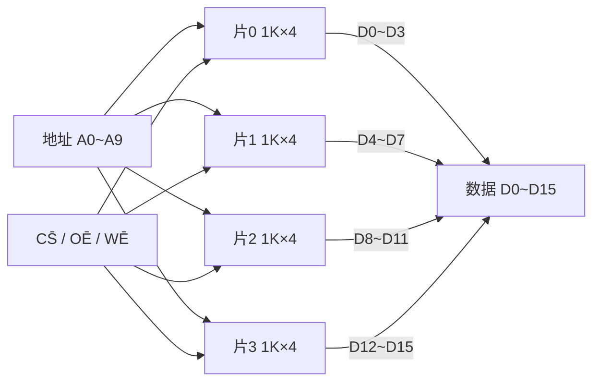
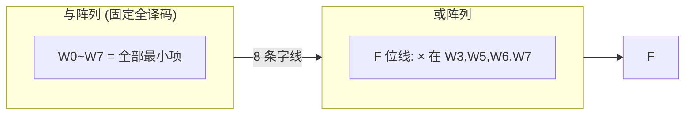

# MOC - 第7章习题 半导体存储器

> [!abstract] 本章习题概览
> 本章习题共 **18 题**，覆盖 [[7.1 ROM 只读存储器原理|ROM 原理]]、[[7.2 RAM 随机存储器|RAM/SRAM/DRAM]]、[[7.3 存储器容量扩展|容量扩展]]、[[7.4 ROM 实现组合逻辑函数|ROM 实现逻辑]] 四个知识板块。题型分布：选择 6 题、填空 4 题、分析计算 8 题。重点考查 ROM 与/或阵列结构、容量公式 $2^n\times m$、SRAM 与 DRAM 的刷新差别、位/字/字位扩展的片数与连接、ROM 阵列图实现多输出逻辑。答案与详解折叠于 `
` 中，建议先独立作答再核对。

---

## 一、选择题（6 题）

**1.** ROM 的核心结构由两级阵列构成，它们是（ ）
A. 或阵列 + 与非阵列
B. 与阵列 + 或阵列
C. 与阵列 + 与阵列
D. 或阵列 + 或阵列

**2.** 某 ROM 有 10 位地址、8 位数据输出，其存储容量为（ ）
A. $1\,\text{Kbit}$
B. $8\,\text{Kbit}$
C. $10\,\text{Kbit}$
D. $80\,\text{Kbit}$

**3.** 下列关于 SRAM 与 DRAM 的叙述，正确的是（ ）
A. SRAM 需要刷新，DRAM 不需要
B. 两者都需要刷新
C. DRAM 需要刷新，SRAM 不需要
D. 两者都不需要刷新

**4.** DRAM 存储一位数据所用的基本元件是（ ）
A. 六管触发器
B. 一个电容 + 一个 MOS 管
C. 熔丝
D. 浮栅 MOS 管

**5.** 用多片存储器进行**字扩展**时，为使任一时刻只有一片工作，应使用（ ）
A. 多路选择器
B. 编码器
C. 译码器产生片选
D. 比较器

**6.** 用 ROM 实现组合逻辑函数时，其与阵列的作用是（ ）
A. 产生全部最小项
B. 产生全部最大项
C. 对最小项求和
D. 对最大项求积

选择题答案

1. **B**。ROM 由地址译码器（与阵列）+ 存储矩阵（或阵列）构成。
2. **B**。容量 $=2^{10}\times8=1024\times8=8192\,\text{bit}=8\,\text{Kbit}$（$=1\,\text{KB}$）。
3. **C**。DRAM 靠电容存储，电荷泄漏需刷新；SRAM 靠触发器，不需刷新。
4. **B**。DRAM 单元为"单管 + 单电容"；六管触发器是 SRAM；熔丝属 PROM；浮栅属 EPROM/EEPROM。
5. **C**。字扩展用高位地址经译码器产生片选，使各片分时工作。
6. **A**。与阵列（地址译码器）固定全译码产生全部 $2^n$ 个最小项；或阵列对最小项求和。

---

## 二、填空题（4 题）

**1.** 某 ROM 有 12 位地址、8 位数据，容量为 $\text{______}\,\text{bit}$，合 $\text{______}\,\text{KB}$。

**2.** 用 $256\times4$ 的存储芯片构成 $1\,\text{K}\times8$ 的存储器，需要 $\text{______}$ 片；其中位扩展需 $\text{______}$ 片为一组，字扩展需 $\text{______}$ 组。

**3.** DRAM 必须周期性刷新的原因是 $\text{______}$；SRAM 不需刷新的原因是 $\text{______}$。

**4.** SRAM 的存储单元是 $\text{______}$，DRAM 的存储单元是 $\text{______}$；其中集成度更高的是 $\text{______}$。

填空题答案

1. $2^{12}\times8=4096\times8=32768\,\text{bit}=32\,\text{Kbit}$；$32768/8/1024=4\,\text{KB}$。
   - 即 $2^{12}=4\,\text{K}$ 字，每字 8 位，$4\,\text{K}\times8=32\,\text{Kbit}=4\,\text{KB}$ ✓
2. 总片数 $=\dfrac{1\,\text{K}\times8}{256\times4}=\dfrac{1024\times8}{256\times4}=\dfrac{8192}{1024}=8$ 片；
   - 位扩展 $p=8/4=2$ 片为一组；
   - 字扩展 $q=1024/256=4$ 组。
3. DRAM 靠电容存储电荷，电容漏电导致电荷流失，需周期性刷新（读出回写）；SRAM 靠六管触发器双稳态存储，只要不断电数据稳定保持，不需刷新。
4. 六管触发器；单管 + 单电容；DRAM。

---

## 三、分析计算题（8 题）

**1.（ROM 容量计算）** 某存储器芯片有 11 位地址线、8 位数据线。求：(1) 该芯片字数；(2) 容量（bit、Kbit、KB）；(3) 若用十六进制表示地址范围，写出首末地址。

解答

**(1) 字数**：

$$\text{字数}=2^{11}=2048=2\,\text{K}$$

**(2) 容量**：

$$\text{容量}=2^{11}\times8=2048\times8=16384\,\text{bit}=16\,\text{Kbit}$$

$$= \frac{16384}{8}\,\text{B}=2048\,\text{B}=2\,\text{KB}$$

**(3) 地址范围**：11 位地址 $A_{10}\dots A_0$，十六进制从 $000\,\text{H}$ 到 $7FF\,\text{H}$。

$$\boxed{2\,\text{K 字},\;16\,\text{Kbit}=2\,\text{KB},\;000\,\text{H}\sim7FF\,\text{H}}$$

**说明**：11 位地址最大值为 $2^{11}-1=2047=7FF\,\text{H}$。

**2.（SRAM 与 DRAM 对比）** 列表对比 SRAM 与 DRAM 在存储单元、是否需刷新、集成度、速度、功耗、成本、读出方式、典型应用八个方面的差异，并说明计算机主存为何选用 DRAM、CPU 缓存为何选用 SRAM。

解答

| 对比项 | SRAM（静态） | DRAM（动态） |
| ------ | ----------- | ----------- |
| 存储单元 | 六管触发器 | 单管 + 单电容 |
| 是否需刷新 | 否 | 是（ms 级周期） |
| 集成度 | 低 | 高 |
| 速度 | 快（ns 级） | 较慢（10 ns 级） |
| 功耗 | 静态功耗大 | 静态功耗小、有刷新功耗 |
| 成本 | 高 | 低 |
| 读出方式 | 非破坏性 | 破坏性（需回写） |
| 典型应用 | CPU 缓存 L1/L2/L3 | 计算机主存、显存 |

- **主存选 DRAM**：主存容量大、成本敏感，DRAM 集成度高、单位成本低，刷新开销可接受；
- **缓存选 SRAM**：缓存要求速度逼近 CPU、无需刷新延迟，SRAM 速度快、控制简单，集成度低但容量小可承受。

**3.（位扩展）** 用 $1\,\text{K}\times4$ 的 RAM 芯片构成 $1\,\text{K}\times16$ 的存储器。求：(1) 所需芯片数；(2) 地址线、数据线、片选、读写控制的连接方式；(3) 画出连接示意图。

解答

**(1) 芯片数**：

$$p=\frac{m_2}{m_1}=\frac{16}{4}=4\;\text{片}$$

（字数相同 $2^{10}=1\,\text{K}$，仅位扩展。）

**(2) 连接方式**：
- **地址线** $A_9\dots A_0$：4 片并联；
- **片选 $\overline{CS}$**：4 片并联（同时工作）；
- **读写控制 $\overline{OE}/\overline{WE}$**：4 片并联；
- **数据线**：片 0 接 $D_0\sim D_3$、片 1 接 $D_4\sim D_7$、片 2 接 $D_8\sim D_{11}$、片 3 接 $D_{12}\sim D_{15}$。

**(3) 连接示意图**：

$$\boxed{4\;\text{片，地址/CS/控制并联，数据分四段}}$$

**4.（字扩展）** 用 $256\times8$ 的 ROM 芯片构成 $1\,\text{K}\times8$ 的存储器。求：(1) 芯片数；(2) 片选译码方案；(3) 各芯片地址范围（十六进制）。

解答

**(1) 芯片数**：

$$q=\frac{2^{n_2}}{2^{n_1}}=\frac{2^{10}}{2^{8}}=2^{2}=4\;\text{片}$$

**(2) 片选译码**：
- 低位地址 $A_7\dots A_0$ 并联到 4 片地址线（片内寻址 256 单元）；
- 高位地址 $A_9A_8$ 经 **2-4 译码器**（如 74LS139）产生 4 个片选 $\overline{CS_0}\sim\overline{CS_3}$；
- 数据线 $D_7\dots D_0$ 并联（任一时刻仅一片使能）。

**(3) 地址范围**：

| 片号 | $A_9A_8$ | 地址范围（$A_9\dots A_0$） | 十进制 |
| :-: | :-: | :-- | :-- |
| 片 0 | 00 | $000\,\text{H}\sim0FF\,\text{H}$ | $0\sim255$ |
| 片 1 | 01 | $100\,\text{H}\sim1FF\,\text{H}$ | $256\sim511$ |
| 片 2 | 10 | $200\,\text{H}\sim2FF\,\text{H}$ | $512\sim767$ |
| 片 3 | 11 | $300\,\text{H}\sim3FF\,\text{H}$ | $768\sim1023$ |

$$\boxed{4\;\text{片，2-4 译码，}000\,\text{H}\sim3FF\,\text{H}}$$

**校验**：$3FF\,\text{H}-000\,\text{H}+1=400\,\text{H}=1024=1\,\text{K}$ ✓

**5.（字位同时扩展）** 用 $256\times4$ 的 RAM 芯片构成 $1\,\text{K}\times8$ 的存储器。求：(1) 总芯片数；(2) 分组方案（位扩展片数、字扩展组数）；(3) 连接方式；(4) 各组地址范围。

解答

**(1) 总芯片数**：

$$N=\frac{2^{n_2}\cdot m_2}{2^{n_1}\cdot m_1}=\frac{1024\times8}{256\times4}=\frac{8192}{1024}=8\;\text{片}$$

**(2) 分组方案**：
- 位扩展 $p=8/4=2$ 片为一组（凑 8 位字长）；
- 字扩展 $q=1024/256=4$ 组；
- $p\times q=2\times4=8$ 片 ✓。

**(3) 连接方式**：
- 低位地址 $A_7\dots A_0$ 并联到 8 片地址线；
- 高位地址 $A_9A_8$ 经 2-4 译码器产生 4 个组片选 $\overline{CS_0}\sim\overline{CS_3}$，同组 2 片 $\overline{CS}$ 并联；
- 同组内：片 a 数据接 $D_0\sim D_3$、片 b 数据接 $D_4\sim D_7$；
- $\overline{OE}/\overline{WE}$ 全部并联。

**(4) 各组地址范围**：

| 组号 | $A_9A_8$ | 地址范围 | 数据位 |
| :-: | :-: | :-- | :-: |
| 组 0 | 00 | $000\,\text{H}\sim0FF\,\text{H}$ | $D_0\sim D_7$ |
| 组 1 | 01 | $100\,\text{H}\sim1FF\,\text{H}$ | $D_0\sim D_7$ |
| 组 2 | 10 | $200\,\text{H}\sim2FF\,\text{H}$ | $D_0\sim D_7$ |
| 组 3 | 11 | $300\,\text{H}\sim3FF\,\text{H}$ | $D_0\sim D_7$ |

$$\boxed{8\;\text{片，2 片/组×4 组，2-4 译码}}$$

**6.（ROM 实现逻辑函数）** 用 ROM 实现三变量多数表决函数 $F(A,B,C)=AB+BC+AC$。求：(1) 列真值表；(2) 确定 ROM 容量；(3) 写出 $F$ 的最小项表达式；(4) 画或阵列连接示意。

解答

**(1) 真值表**：

| $A$ | $B$ | $C$ | $F$ |
| :-: | :-: | :-: | :-: |
| 0 | 0 | 0 | 0 |
| 0 | 0 | 1 | 0 |
| 0 | 1 | 0 | 0 |
| 0 | 1 | 1 | 1 |
| 1 | 0 | 0 | 0 |
| 1 | 0 | 1 | 1 |
| 1 | 1 | 0 | 1 |
| 1 | 1 | 1 | 1 |

**(2) ROM 容量**：3 输入 1 输出，$2^3\times1=8\times1=8\,\text{bit}$，选 $8\times1$ ROM。

**(3) 最小项表达式**：

$$F=\sum m(3,5,6,7)$$

即 $F=\overline{A}BC+A\overline{B}C+AB\overline{C}+ABC$。

**(4) 或阵列连接**：与阵列固定产生 $W_0\sim W_7$；$F$ 位线在 $W_3,W_5,W_6,W_7$ 打"×"。

$$\boxed{F=\sum m(3,5,6,7),\;8\times1\,\text{ROM}}$$

**7.（ROM 实现码制转换）** 用 ROM 实现 4 位二进制码 $B_3B_2B_1B_0$ 到格雷码 $G_3G_2G_1G_0$ 的转换。求：(1) 转换关系式；(2) ROM 容量；(3) 列出真值表（前 8 行）；(4) 说明 $G_3$ 位线的连接。

解答

**(1) 转换关系式**：

$$G_3=B_3,\quad G_2=B_3\oplus B_2,\quad G_1=B_2\oplus B_1,\quad G_0=B_1\oplus B_0$$

**(2) ROM 容量**：4 输入 4 输出，

$$2^4\times4=16\times4=64\,\text{bit}$$

选 $16\times4$ ROM 一片，$B_3B_2B_1B_0$ 接地址 $A_3A_2A_1A_0$，$G_3G_2G_1G_0$ 接数据 $D_3D_2D_1D_0$。

**(3) 真值表（前 8 行，$B_3=0$）**：

| $B_3B_2B_1B_0$ | $G_3$ | $G_2$ | $G_1$ | $G_0$ |
| :--: | :-: | :-: | :-: | :-: |
| 0000 | 0 | 0 | 0 | 0 |
| 0001 | 0 | 0 | 0 | 1 |
| 0010 | 0 | 0 | 1 | 1 |
| 0011 | 0 | 0 | 1 | 0 |
| 0100 | 0 | 1 | 1 | 0 |
| 0101 | 0 | 1 | 1 | 1 |
| 0110 | 0 | 1 | 0 | 1 |
| 0111 | 0 | 1 | 0 | 0 |

（后 8 行 $B_3=1$，$G_3=1$，$G_2=\overline{B_2}$，$G_1=B_2\oplus B_1$，$G_0=B_1\oplus B_0$，对照 [[7.4 ROM 实现组合逻辑函数|7.4]] 完整表。）

**(4) $G_3$ 位线连接**：

由 $G_3=B_3$，$G_3$ 在 $B_3=1$ 时为 1，即 $W_8\sim W_{15}$ 对应字线选中时输出 1。故 $G_3$ 位线在 $W_8\sim W_{15}$ 共 8 个交叉点打"×"。

$$\boxed{16\times4\,\text{ROM},\;G_3=B_3\;\Rightarrow\;W_8\sim W_{15}\;\text{打}\;\times}$$

**8.（综合设计）** 用 $1\,\text{K}\times4$ 的 RAM 芯片构成 $4\,\text{K}\times8$ 的存储器。求：(1) 总芯片数；(2) 分组方案；(3) 地址线分配与片选译码；(4) 各组地址范围（十六进制）。

解答

**(1) 总芯片数**：

$$N=\frac{4\,\text{K}\times8}{1\,\text{K}\times4}=\frac{4096\times8}{1024\times4}=\frac{32768}{4096}=8\;\text{片}$$

**(2) 分组方案**：
- 位扩展 $p=8/4=2$ 片为一组（凑 8 位字长，得 $1\,\text{K}\times8$）；
- 字扩展 $q=4096/1024=4$ 组；
- $2\times4=8$ 片 ✓。

**(3) 地址线分配**：
- 目标 $4\,\text{K}=2^{12}$，共 12 位地址 $A_{11}\dots A_0$；
- 片内地址 $A_9\dots A_0$（10 位，$1\,\text{K}$）并联到 8 片；
- 高位 $A_{11}A_{10}$（2 位）经 **2-4 译码器**产生 4 个组片选 $\overline{CS_0}\sim\overline{CS_3}$；
- 同组 2 片 $\overline{CS}$ 并联；片 a 数据 $D_0\sim D_3$、片 b 数据 $D_4\sim D_7$；
- $\overline{OE}/\overline{WE}$ 全部并联。

**(4) 各组地址范围**：

| 组号 | $A_{11}A_{10}$ | 地址范围 | 容量 |
| :-: | :-: | :-- | :-: |
| 组 0 | 00 | $000\,\text{H}\sim3FF\,\text{H}$ | $1\,\text{K}\times8$ |
| 组 1 | 01 | $400\,\text{H}\sim7FF\,\text{H}$ | $1\,\text{K}\times8$ |
| 组 2 | 10 | $800\,\text{H}\sim BFF\,\text{H}$ | $1\,\text{K}\times8$ |
| 组 3 | 11 | $C00\,\text{H}\sim FFF\,\text{H}$ | $1\,\text{K}\times8$ |

$$\boxed{8\;\text{片，2 片/组×4 组，2-4 译码，}000\,\text{H}\sim FFF\,\text{H}}$$

**校验**：
- $FFF\,\text{H}-000\,\text{H}+1=1000\,\text{H}=4096=4\,\text{K}$ ✓
- 每组 $3FF\,\text{H}-000\,\text{H}+1=400\,\text{H}=1024=1\,\text{K}$ ✓
- 总容量 $4\,\text{K}\times8=32\,\text{Kbit}=4\,\text{KB}$ ✓

---

## 考点统计表

| 知识点 | 涉及题号 | 题数 | 难度分布 |
| :--- | :--- | :---: | :--- |
| [[7.1 ROM 只读存储器原理\|ROM 与/或阵列结构]] | 选择1、选择6 | 2 | 易 |
| [[7.1 ROM 只读存储器原理\|ROM 容量计算]] | 选择2、填空1、分析1 | 3 | 易-中 |
| [[7.1 ROM 只读存储器原理\|ROM 分类（PROM/EPROM/EEPROM/Flash）]] | 选择4 | 1 | 易 |
| [[7.2 RAM 随机存储器\|SRAM vs DRAM 刷新差别]] | 选择3、填空3、填空4、分析2 | 4 | 中 |
| [[7.2 RAM 随机存储器\|SRAM/DRAM 存储单元]] | 选择4、填空4、分析2 | 3 | 中 |
| [[7.3 存储器容量扩展\|位扩展计算与连接]] | 分析3 | 1 | 中 |
| [[7.3 存储器容量扩展\|字扩展计算与地址范围]] | 选择5、填空2、分析4 | 3 | 中 |
| [[7.3 存储器容量扩展\|字位同时扩展]] | 填空2、分析5、分析8 | 3 | 中-难 |
| [[7.4 ROM 实现组合逻辑函数\|ROM 实现逻辑函数]] | 选择6、分析6 | 2 | 中 |
| [[7.4 ROM 实现组合逻辑函数\|ROM 实现码制转换]] | 分析7 | 1 | 中 |
| 合计 | — | 18 | — |

> [!tip] 复习建议
> - **容量公式**必记：$\text{容量}=2^n\times m\;\text{bit}$，注意 $\text{bit}$ 与 $\text{Byte}$ 差 8 倍；
> - **SRAM/DRAM 对比**是高频考点：触发器 vs 电容、不刷新 vs 刷新、非破坏性 vs 破坏性读出；
> - **扩展判据**：位扩展并联片选、字扩展译码片选；总片数 $=\dfrac{\text{目标容量}}{\text{单片容量}}$ 通用；
> - **字位同时扩展**先位后字：先凑字长成组，再对组做字扩展，画图时分清组内/组间；
> - **地址范围**用十六进制书写，带上高位片选位，校验末地址 $+1$ 是否等于总字数；
> - **ROM 实现逻辑**不需化简，直接按真值表填或阵列；与阵列固定产生最小项，或阵列按"×"求和；
> - **多输出函数**优先用 ROM：一片 ROM 共享与阵列，只增加位线。

## 章节导航

> [!nav] 导航
> [[MOC - 第7章|第7章 知识点目录]] · [[MOC - 数字逻辑电路|课程总览]] · 下一章习题：[[MOC - 第8章习题|第8章 可编程逻辑器件习题]]
