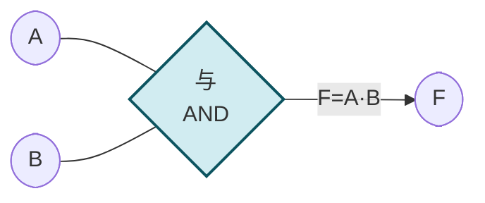

# 1.2 逻辑变量、三种基本逻辑运算

> [!abstract] 本节概述
> 逻辑代数（布尔代数）用变量表示条件成立与否（1=真、0=假），用三种基本运算（与、或、非）描述条件之间的逻辑关系。本节定义逻辑变量与三种基本运算的真值表、逻辑符号与表达式，是 [[1.3 逻辑代数定律、摩根定律|1.3]] 定律推导与 [[1.5 逻辑函数化简（代数法、卡诺图法）|1.5]] 化简的基础。

## 一、逻辑变量

> [!definition] 逻辑变量
> 取值仅为 $0$ 或 $1$ 的变量称为逻辑变量（布尔变量）。
> - $0$ 表示条件"假"（低电平、开关断开、不成立）；
> - $1$ 表示条件"真"（高电平、开关闭合、成立）。
> 逻辑变量之间的运算结果仍是 $0$ 或 $1$，这是二值逻辑的核心。

## 二、与运算（AND）

> [!definition] 与运算
> 仅当所有输入均为 $1$ 时输出才为 $1$，否则为 $0$。记作 $F=A\cdot B$ 或 $F=AB$ 或 $F=A\land B$。

**真值表**：

| $A$ | $B$ | $F=A\cdot B$ |
| --- | --- | ------------ |
| 0 | 0 | 0 |
| 0 | 1 | 0 |
| 1 | 0 | 0 |
| 1 | 1 | 1 |

> [!tip] 与运算的物理意义
> 两个开关**串联**控制一盏灯：只有两开关都闭合灯才亮。任一断开灯灭。

## 三、或运算（OR）

> [!definition] 或运算
> 只要有一个输入为 $1$ 输出就为 $1$，仅当所有输入为 $0$ 时输出才为 $0$。记作 $F=A+B$ 或 $F=A\lor B$。

**真值表**：

| $A$ | $B$ | $F=A+B$ |
| --- | --- | ------- |
| 0 | 0 | 0 |
| 0 | 1 | 1 |
| 1 | 0 | 1 |
| 1 | 1 | 1 |

> [!tip] 或运算的物理意义
> 两个开关**并联**控制一盏灯：任一开关闭合灯就亮。仅当两开关都断开灯才灭。

## 四、非运算（NOT）

> [!definition] 非运算
> 输出为输入的取反：输入 $0$ 输出 $1$，输入 $1$ 输出 $0$。记作 $F=\bar A$ 或 $F=A'$ 或 $F=\lnot A$。

**真值表**：

| $A$ | $F=\bar A$ |
| --- | ---------- |
| 0 | 1 |
| 1 | 0 |

> [!tip] 非运算的物理意义
> 一个常闭开关：按下（$A=1$）断开电路灯灭，松开（$A=0$）接通灯亮。

## 五、常用复合逻辑运算

> [!definition] 复合运算
> 由三种基本运算组合而成，工程中常用复合门实现：

| 名称 | 表达式 | 真值关系 | 说明 |
| ---- | ------ | -------- | ---- |
| 与非 NAND | $F=\overline{A\cdot B}$ | 与后取反 | 通用门，可构成任意逻辑 |
| 或非 NOR | $F=\overline{A+B}$ | 或后取反 | 通用门 |
| 与或非 AOI | $F=\overline{AB+CD}$ | 与或后取反 | 两级逻辑 |
| 异或 XOR | $F=A\oplus B=\bar A B+A\bar B$ | 不同为 1 | 二进制加法、奇偶校验 |
| 同或 XNOR | $F=A\odot B=AB+\bar A\bar B$ | 相同为 1 | 比较两数相等 |

> [!theorem] 异或的性质
> - $A\oplus 0 = A$（与 0 异或不变）
> - $A\oplus 1 = \bar A$（与 1 异或取反）
> - $A\oplus A = 0$（自异或为 0）
> - 交换律：$A\oplus B = B\oplus A$
> - 结合律：$(A\oplus B)\oplus C = A\oplus(B\oplus C)$

> [!example] 异或用于二进制加法
> 两个 1 位二进制数 $A$、$B$ 相加，本位和 $S=A\oplus B$、进位 $C=A\cdot B$。这是 [[3.5 加法器、数值比较器|3.5]] 半加器的核心。

## 六、逻辑运算的优先级

> [!note] 运算优先级（从高到低）
> 1. 非运算（$\bar A$，括号内优先）
> 2. 与运算（$A\cdot B$）
> 3. 或运算（$A+B$）
>
> 例：$F=A+\bar B\cdot C$ 等价于 $F=A+(\bar B\cdot C)$，不是 $(A+\bar B)\cdot C$。

## 七、典型例题

### 例题 1：用基本运算表示复合逻辑

> [!example] 题目
> 用与、或、非三种基本运算表示异或 $F=A\oplus B$。

**解**：

由异或定义"两输入不同时为 1"：
- $A=0,B=1$：$\bar A\cdot B=1$
- $A=1,B=0$：$A\cdot\bar B=1$

故 $F=A\oplus B=\bar A\cdot B+A\cdot\bar B$。

### 例题 2：真值表与表达式互推

> [!example] 题目
> 写出三变量多数表决器（多数为 1 则输出 1）的真值表与表达式。

**解**：

| $A$ | $B$ | $C$ | $F$ |
| --- | --- | --- | --- |
| 0 | 0 | 0 | 0 |
| 0 | 0 | 1 | 0 |
| 0 | 1 | 0 | 0 |
| 0 | 1 | 1 | 1 |
| 1 | 0 | 0 | 0 |
| 1 | 0 | 1 | 1 |
| 1 | 1 | 0 | 1 |
| 1 | 1 | 1 | 1 |

$F=\bar A BC+A\bar B C+AB\bar C+ABC$（使 $F=1$ 的最小项之和），化简见 [[1.5 逻辑函数化简（代数法、卡诺图法）|1.5]]。

## 八、易错点

> [!warning] 易错点
> 1. **混淆逻辑加与算术加**：$1+1=1$（逻辑或），不是 $10$（二进制加）；
> 2. **异或与或的混淆**：$1\oplus1=0$，但 $1+1=1$；
> 3. **优先级错误**：$A+B\cdot C$ 是 $A+(B\cdot C)$ 不是 $(A+B)\cdot C$；
> 4. **非号范围**：$\overline{A+B}$ 是对 $A+B$ 整体取反，$\bar A+B$ 只对 $A$ 取反；
> 5. **同或与异或**：同或 $=$ 异或取反 $A\odot B=\overline{A\oplus B}$。

## 九、与其他小节的联系

- 基本运算是 [[1.3 逻辑代数定律、摩根定律|1.3]] 定律的基础；
- 逻辑符号对应 [[MOC - 第2章|第2章]] 门电路的物理实现；
- 异或用于 [[3.5 加法器、数值比较器|3.5]] 加法器；
- 复合门见 [[2.2 TTL 集成门电路原理|2.2]]、[[2.3 CMOS 门电路特性|2.3]]。

## 章节导航

- 上一级：[[MOC - 第1章]]
- 上一节：[[1.1 数制与编码：二进制、十六进制、BCD 码]]
- 下一节：[[1.3 逻辑代数定律、摩根定律]]
- 习题：[[MOC - 第1章习题]]
