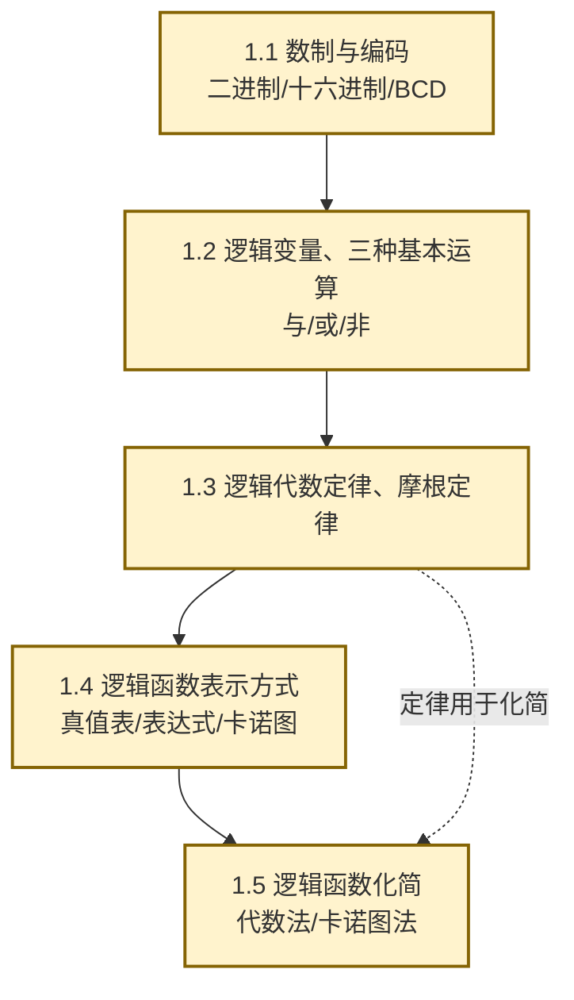

# MOC - 第1章 数字逻辑基础

> [!info] 本章定位
> 数字逻辑基础是全课程的**数学工具章**。本章要回答的核心问题是：**如何用二进制表示数值与信息？如何用布尔代数描述逻辑关系？如何把复杂的逻辑函数化简为最简形式？** 这些工具是 [[MOC - 第2章|第2章 逻辑门电路]]（门电路实现逻辑运算）、[[MOC - 第3章|第3章 组合逻辑电路]]（分析与设计）和 [[MOC - 第5章|第5章 时序逻辑电路]]（状态方程化简）的共同基础。

## 学习路线图

## 知识点导航

| 小节 | 标题 | 核心内容 | 关键公式/方法 |
| ---- | ---- | -------- | ------------- |
| [[1.1 数制与编码：二进制、十六进制、BCD 码\|1.1]] | 数制与编码 | 二进制/八进制/十六进制互转、BCD 码、格雷码、ASCII | $(N)_r=\sum d_i r^i$ |
| [[1.2 逻辑变量、三种基本逻辑运算\|1.2]] | 逻辑变量、基本运算 | 与（$\cdot$）、或（$+$）、非（$\bar{}$）运算、真值表 | $F=A\cdot B$、$F=A+B$、$F=\bar A$ |
| [[1.3 逻辑代数定律、摩根定律\|1.3]] | 逻辑代数定律 | 交换/结合/分配/吸收/摩根定律、反演规则 | $\overline{AB}=\bar A+\bar B$ |
| [[1.4 逻辑函数表示方式：真值表、表达式、卡诺图\|1.4]] | 逻辑函数表示 | 真值表、与或/或与表达式、标准形式（最小项/最大项）、卡诺图 | $F=\sum m(1,3,5,7)$ |
| [[1.5 逻辑函数化简（代数法、卡诺图法）\|1.5]] | 逻辑函数化简 | 代数化简法、卡诺图化简法、含无关项化简 | 卡诺图圈组规则 |

## 核心考点

> [!summary] 本章核心考点（7 点）
> 1. **数制转换**：二进制↔十进制↔十六进制互转，整数除 2 取余、小数乘 2 取整；
> 2. **BCD 码与格雷码**：8421 BCD 码用 4 位二进制表示 1 位十进制；格雷码相邻两数仅 1 位不同，用于减少转换错误；
> 3. **摩根定律**：$\overline{A+B}=\bar A\cdot\bar B$、$\overline{AB}=\bar A+\bar B$，是表达式变换的核心工具；
> 4. **最小项与标准与或式**：$n$ 个变量有 $2^n$ 个最小项，$F=\sum m(i)$ 表示使函数为 1 的最小项之和；
> 5. **卡诺图化简**：相邻最小项（含首尾环绕）可合并消去 1 个变量；$2^k$ 个相邻格可消去 $k$ 个变量；
> 6. **无关项利用**：无关项（约束项）可取 0 或 1，化简时按需要圈入以扩大合并组；
> 7. **反演规则与对偶规则**：反演求反函数 $\bar F$、对偶用于定律证明。

## 章节导航

> [!nav] 导航
> 上级：[[MOC - 数字逻辑电路|课程总览]]
> 下一章：[[MOC - 第2章|第2章 逻辑门电路]]
> 配套习题：[[MOC - 第1章习题|第1章 习题]]
