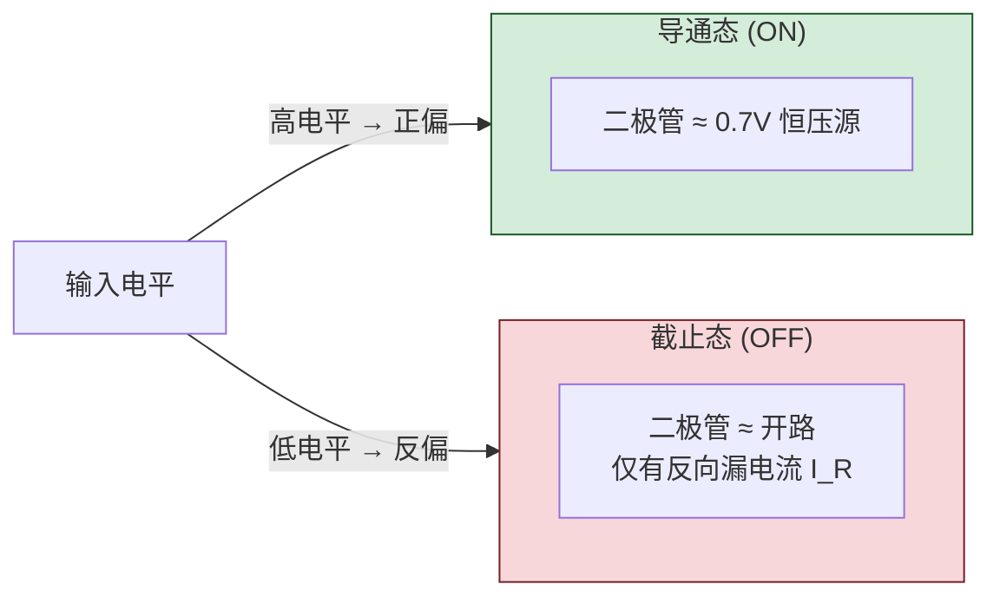
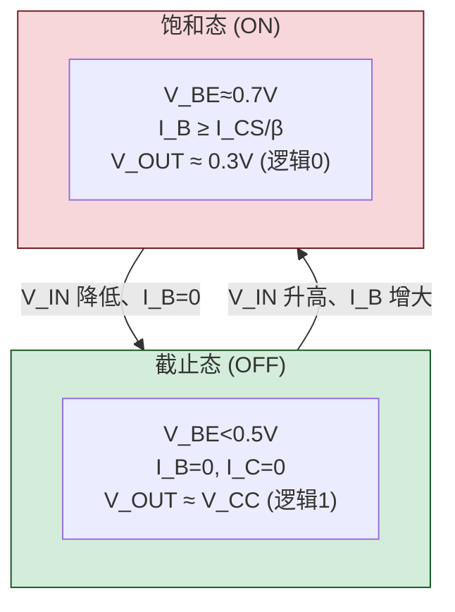
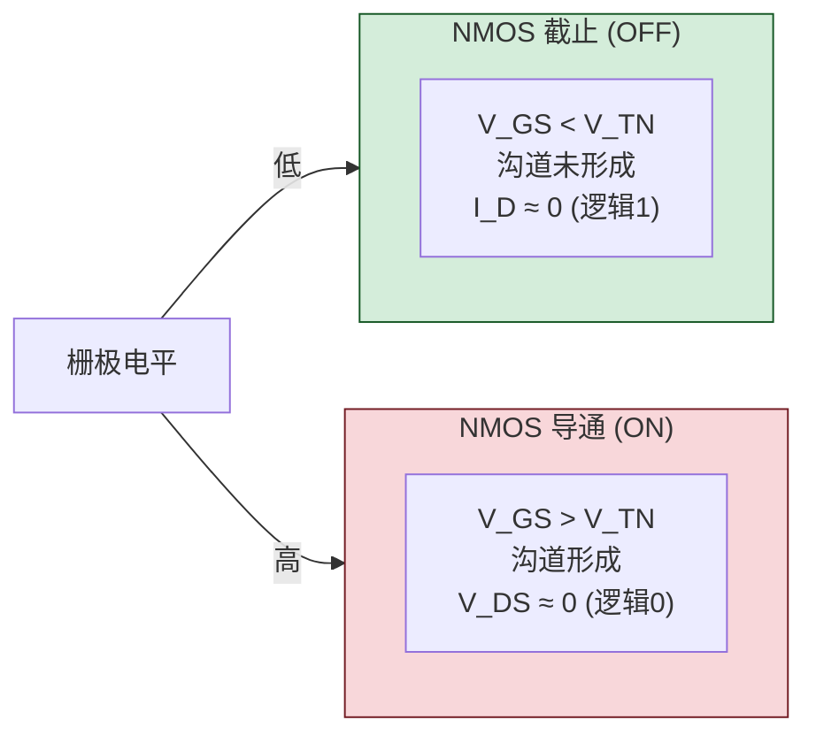

# 2.1 半导体开关特性

> [!abstract] 本节概述
> 数字电路用"通"和"断"两种状态表示 0 和 1，这要求半导体器件工作在开关状态而非线性放大状态。本节分析二极管、双极型三极管（BJT）和绝缘栅场效应管（MOSFET）三种器件作为开关时的**等效电路、导通/截止条件与开关时间**，是理解 [[2.2 TTL 集成门电路原理|2.2]] TTL 门电路（双极型工艺）和 [[2.3 CMOS 门电路特性|2.3]] CMOS 门电路（MOS 工艺）的器件基础。

## 一、二极管的开关特性

> [!definition] 二极管开关等效
> 理想二极管加正向电压导通（短路）、加反向电压截止（开路）。实际硅二极管有固定正向压降：
> - **导通条件**：$V_D \ge V_{on}\approx 0.7\text{ V}$（硅管），等效为一恒压源 $0.7\text{ V}$ 串小电阻；
> - **截止条件**：$V_D < V_{on}$，等效为开路，仅存在微小反向漏电流 $I_R$。

> [!warning] 二极管开关时间——反向恢复时间 $t_{re}$
> 二极管从导通切换到截止不能瞬间完成。原因是导通时 P 区和 N 区存储了大量少数载流子，反偏时这些电荷需要被抽走才能恢复截止，这段时间称为**反向恢复时间** $t_{re}$。
> - $t_{re}$ 限制了二极管最高开关频率；
> - 开关二极管（如 1N4148）通过减小结面积和掺金工艺降低 $t_{re}$（可达纳秒级）；
> - 肖特基二极管靠多数载流子导通，**几乎没有存储电荷**，$t_{re}$ 极小，是高速开关和 TTL 肖特基系列（74LS）的关键器件。

> [!example] 二极管开关应用
> 在二极管与门中，两只二极管阳极接公共点经电阻接 $V_{CC}$：
> - 任一输入为低（$0\text{ V}$）：对应二极管正偏导通，输出被钳位在 $0.7\text{ V}$（逻辑 0）；
> - 两输入均高（$+5\text{ V}$）：二极管均截止，输出被上拉到 $V_{CC}$（逻辑 1）。
> 这正是"与"逻辑的物理实现。

## 二、双极型三极管（BJT）的开关特性

> [!definition] 三极管三个工作区
> 以 NPN 三极管共射极电路为例，根据 $V_{BE}$ 和 $V_{CE}$ 不同分三个工作区：

| 工作区 | 条件 | 集电极电流 | 等效 | 逻辑意义 |
| ------ | ---- | ---------- | ---- | -------- |
| 截止区 | $V_{BE}<0.5\text{ V}$（发射结反偏或弱正偏） | $I_C\approx 0$ | C-E 间断路 | 开关**断开**（输出高） |
| 放大区 | $V_{BE}\approx0.7\text{ V}$ 且 $V_{CE}>V_{CE(sat)}$ | $I_C=\beta I_B$ | 受控电流源 | 线性放大，**非开关态** |
| 饱和区 | $V_{BE}\approx0.7\text{ V}$ 且 $I_B\ge I_{BS}$ | $I_C=I_{CS}\approx V_{CC}/R_C$ | C-E 间短路（$V_{CE(sat)}\approx0.3\text{ V}$） | 开关**闭合**（输出低） |

> [!theorem] 三极管开关条件
> 数字电路让三极管工作在**截止**和**饱和**两个极端，跳过放大区：
> - **截止条件**：$V_{BE}<V_{on}$（约 $0.5\text{ V}$），$I_B=0$，输出 $V_{OUT}\approx V_{CC}$（逻辑 1）；
> - **饱和导通条件**：基极电流足够大，使
> $$\boxed{I_B \ge I_{BS}=\dfrac{I_{CS}}{\beta}=\dfrac{V_{CC}-V_{CE(sat)}}{\beta\, R_C}\approx\dfrac{V_{CC}}{\beta\, R_C}}$$
> 此时 $V_{OUT}=V_{CE(sat)}\approx0.3\text{ V}$（逻辑 0）。

> [!warning] 三极管开关时间
> 三极管开关需要经历少数载流子在基区的建立与消散：
> - **开启时间 $t_{on}=t_d+t_r$**：延迟时间 $t_d$（建立正偏）+ 上升时间 $t_r$（载流子建立）；
> - **关断时间 $t_{off}=t_s+t_f$**：存储时间 $t_s$（**饱和越深，$t_s$ 越大**）+ 下降时间 $t_f$；
> - 通常 $t_{off}\gg t_{on}$，存储时间 $t_s$ 是主要瓶颈。
>
> **加速电容**：在基极电阻 $R_B$ 上并联小电容 $C_B$，输入跳变瞬间提供过驱动电流，加速开通和关断。

> [!tip] 饱和深度的双面性
> 设计时常取 $I_B=(2\sim3)\,I_{BS}$ 保证可靠饱和（抗干扰）；但过饱和会显著增大 $t_s$，降低开关速度。肖特基三极管在基极-集电极间加肖特基二极管钳位，防止深饱和，是 74LS 系列的核心工艺。

## 三、MOS 场效应管的开关特性

> [!definition] MOS 管开关等效
> 以 N 沟道增强型 MOS（NMOS）为例：
> - **截止条件**：$V_{GS}<V_{TN}$（开启电压，正数），D-S 间相当于断开，$I_D\approx0$；
> - **导通条件**：$V_{GS}>V_{TN}$，D-S 间形成沟道，等效为低阻电阻 $R_{ON}$（导通电阻），$V_{DS}\approx0$。
>
> PMOS 与之对偶：$V_{GS}<V_{TP}$（负开启电压）时导通。

> [!note] MOS 管开关速度
> - MOS 管靠**多数载流子**导电，没有少数载流子存储效应，原理上开关速度优于 BJT；
> - 但 MOS 管栅极电容 $C_{gs}$、$C_{gd}$ 较大，开关时需要充放电，**实际开关速度受负载电容和驱动能力限制**；
> - 随着 CMOS 工艺特征尺寸缩小，开关速度大幅提升，现代 CMOS 已超过 TTL。

## 四、三种器件开关特性对比

| 对比项 | 二极管 | 双极型三极管 BJT | MOS 管 MOSFET |
| ------ | ------ | ---------------- | ------------- |
| 控制方式 | 电压自控（单向） | 电流控制（$I_B$ 控制 $I_C$） | 电压控制（$V_{GS}$ 控制 $I_D$） |
| 输入阻抗 | 中 | 低（kΩ 级） | 极高（$10^{10}\,\Omega$ 以上） |
| 开关速度 | 受 $t_{re}$ 限制 | 受 $t_s$ 限制（ns 级） | 受栅极电容充放电限制（现代可达 ps 级） |
| 静态功耗 | 中 | 较高（饱和时 $I_C\cdot V_{CE}$） | 极低（截止时几乎无电流） |
| 集成度 | 低 | 中（功耗限制） | 高（适合 VLSI） |
| 主要应用 | 简单门、钳位 | TTL 系列 | CMOS 系列、现代 IC |

> [!info] 三种器件与两大工艺
> - **TTL 工艺**基于 BJT，强调驱动能力与速度，[[2.2 TTL 集成门电路原理|2.2]] 详述；
> - **CMOS 工艺**基于 MOSFET 互补对，强调低功耗与高集成度，[[2.3 CMOS 门电路特性|2.3]] 详述；
> - 二极管一般只用于电平钳位、保护电路或二极管-三极管逻辑（DTL）等历史结构。

## 五、典型例题

> [!example] 例题 1：判断三极管工作状态
> 已知 NPN 共射电路 $V_{CC}=5\text{ V}$、$R_C=1\text{ k}\Omega$、$R_B=10\text{ k}\Omega$、$\beta=50$、$V_{CE(sat)}=0.3\text{ V}$。当输入 $V_I=5\text{ V}$ 时判断三极管状态并求输出电压。

**解**：

1. 假设三极管饱和，求临界饱和基极电流：
$$I_{BS}=\dfrac{V_{CC}-V_{CE(sat)}}{\beta R_C}=\dfrac{5-0.3}{50\times 1\,\text{k}\Omega}\approx 94\,\mu\text{A}$$

2. 求实际基极电流（设 $V_{BE}=0.7\text{ V}$）：
$$I_B=\dfrac{V_I-V_{BE}}{R_B}=\dfrac{5-0.7}{10\,\text{k}\Omega}=430\,\mu\text{A}$$

3. 比较：$I_B=430\,\mu\text{A} \gg I_{BS}=94\,\mu\text{A}$，**饱和导通**成立。

4. 输出电压：
$$V_{OUT}=V_{CE(sat)}\approx 0.3\text{ V}$$（逻辑 0）

> [!tip] 验证技巧
> 若 $I_B<I_{BS}$，则工作在放大区，$I_C=\beta I_B$，$V_{OUT}=V_{CC}-I_C R_C$；若结果 $V_{OUT}<V_{CE(sat)}$，说明假设错误，实际饱和。

> [!example] 例题 2：MOS 管反相器
> NMOS 反相器由一只 NMOS 管 $T$ 和负载电阻 $R_L$ 组成。$V_{DD}=5\text{ V}$、$V_{TN}=1\text{ V}$。求 $V_I=0\text{ V}$ 和 $V_I=5\text{ V}$ 时的输出。

**解**：

- $V_I=0\text{ V}$：$V_{GS}=0<V_{TN}=1\text{ V}$，NMOS 截止，$I_D=0$，$V_{OUT}=V_{DD}=5\text{ V}$（逻辑 1）；
- $V_I=5\text{ V}$：$V_{GS}=5>V_{TN}=1\text{ V}$，NMOS 导通，D-S 间低阻，$V_{OUT}\approx0\text{ V}$（逻辑 0）。

这就是最简单的 MOS 反相器（非门）。缺点是输出低电平时负载电阻持续耗电，[[2.3 CMOS 门电路特性|2.3]] 用 PMOS 替代电阻构成互补结构解决此问题。

## 六、易错点

> [!warning] 易错点
> 1. **混淆放大区与饱和区**：数字电路工作在截止与饱和两区，禁止停留在放大区；
> 2. **饱和判据使用错误**：判断饱和用 $I_B\ge I_{BS}$，而非 $V_{BE}$；$V_{BE}\approx0.7\text{ V}$ 仅说明发射结正偏；
> 3. **MOS 阈值电压极性**：NMOS 阈值 $V_{TN}>0$，PMOS 阈值 $V_{TP}<0$，导通条件方向相反；
> 4. **二极管压降方向**：硅管正偏约 $0.7\text{ V}$，锗管约 $0.3\text{ V}$，理想模型可忽略；
> 5. **开关时间方向**：BJT 关断时间 $t_{off}>t_{on}$，主因是饱和存储电荷，加速电容用于缩短两者；
> 6. **MOS 管静态功耗**：截止时栅极无电流，但导通时 D-S 间有 $I_D$ 流过，单纯 NMOS 反相器功耗并不为零——CMOS 互补结构才真正实现低静态功耗。

## 七、与其他小节的联系

- 二极管、BJT 是 [[2.2 TTL 集成门电路原理|2.2]] TTL 门电路的器件基础（多发射极三极管实现与运算）；
- MOS 管是 [[2.3 CMOS 门电路特性|2.3]] CMOS 门电路的器件基础（互补对称结构）；
- 三极管饱和/截止分析是 [[2.4 三态门、OC 门、线与逻辑|2.4]] 三态门控制端的基础；
- 器件开关时间是 [[2.5 门电路接口特性|2.5]] 传输延迟分析的物理来源。

## 章节导航

- 上一级：[[MOC - 第2章|第2章 知识点目录]]
- 上一章：[[1.5 逻辑函数化简（代数法、卡诺图法）|1.5 逻辑函数化简]]
- 下一节：[[2.2 TTL 集成门电路原理|2.2 TTL 集成门电路原理]]
- 习题：[[MOC - 第2章习题|第2章 习题]]
