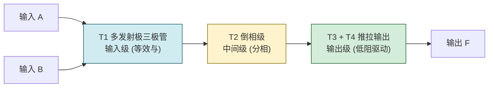
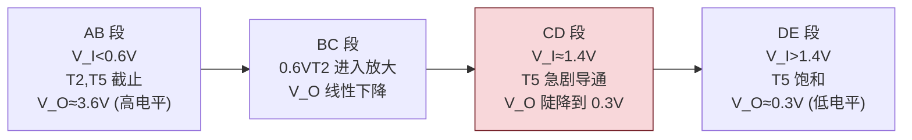

# 2.2 TTL 集成门电路原理

> [!abstract] 本节概述
> TTL（Transistor-Transistor Logic，晶体管-晶体管逻辑）是双极型集成门电路的经典工艺。本节以最典型的 **TTL 与非门**为例，剖析其三级电路结构、工作原理、电压传输特性曲线和主要参数（输出电平、输入电平、噪声容限、功耗、传输延迟、扇出系数），是 [[2.3 CMOS 门电路特性|2.3]] 对比分析与 [[2.5 门电路接口特性|2.5]] 接口设计的依据。

## 一、TTL 与非门的电路结构

典型 TTL 与非门（如 7400）由**输入级、中间级、输出级**三部分组成：

> [!definition] 三级结构职责
> - **输入级（$T_1$ 多发射极三极管）**：多个发射极对应多个输入端，**等效实现"与"运算**——任一输入为低，对应发射结正偏，$T_1$ 深度饱和，将 $T_2$ 基极拉低；
> - **中间级（$T_2$ 倒相分相）**：从集电极和发射极输出一对**相位相反**的信号，分别驱动 $T_3$（或 $T_4$）和 $T_5$；
> - **输出级（$T_3$、$T_4$ 与 $T_5$ 推拉/Totem-Pole 结构）**：上下两只管交替导通，任一时刻只有一管导通，输出阻抗低、驱动能力强。

> [!note] 多发射极三极管的"与"功能
> 多发射极三极管可视为多个发射结共用一个基极和集电极。仅当所有发射极输入均为高时，所有发射结才反偏，$T_1$ 转入倒置工作状态，电流经 $R_1$ 流向 $T_2$ 基极；任一输入为低，相应发射结正偏，$T_1$ 饱和，把 $T_2$ 基极电位钳低——这正是"与"逻辑。

## 二、工作原理分析

设 $V_{CC}=5\text{ V}$，输入高电平 $V_{IH}=3.6\text{ V}$、低电平 $V_{IL}=0.3\text{ V}$。

> [!theorem] 输入全高 → 输出低
> 当 $A=B=1$（输入均高）：
> 1. $T_1$ 所有发射结反偏，集电结正偏，$T_1$ 处于**倒置放大**状态，电流经 $R_1$ 流入 $T_2$ 基极；
> 2. $T_2$ 饱和导通，其发射极电位抬高使 $T_5$ 饱和；同时 $T_2$ 集电极电位被拉低，使 $T_3$ 微导通、$T_4$ 截止；
> 3. 输出 $V_O=V_{CE(sat)5}\approx0.3\text{ V}$（逻辑 0）。
>
> **逻辑关系**：输入全 1 → 输出 0。

> [!theorem] 输入有低 → 输出高
> 当 $A=0$（或 $B=0$）：
> 1. 对应 $T_1$ 发射结正偏，$T_1$ 深度饱和，集电极电位 $\approx0.3\text{ V}+0.1\text{ V}=0.4\text{ V}$；
> 2. 此电位不足以开启 $T_2$ 和 $T_5$，二者**截止**；
> 3. $V_{CC}$ 经 $R_2$ 为 $T_3$、$T_4$ 提供基极电流，$T_3$、$T_4$ 导通（射极跟随），输出被拉高；
> 4. 输出 $V_O\approx V_{CC}-V_{BE3}-V_{BE4}\approx5-0.7-0.7=3.6\text{ V}$（逻辑 1）。
>
> **逻辑关系**：输入有 0 → 输出 1。

| 输入组合 | $T_1$ 状态 | $T_2$ 状态 | $T_5$ 状态 | $T_4$ 状态 | 输出 | 逻辑 |
| -------- | ---------- | ---------- | ---------- | ---------- | ---- | ---- |
| $A=B=1$ | 倒置放大 | 饱和 | 饱和 | 截止 | $\approx0.3\text{ V}$ | 0 |
| 任一为 0 | 深饱和 | 截止 | 截止 | 导通 | $\approx3.6\text{ V}$ | 1 |

> [!info] 与非门的真值表
> 综上，TTL 三级电路实现的是**与非逻辑** $F=\overline{A\cdot B}$，这也是 74LS00 等芯片命名为"与非门"的原因。

## 三、电压传输特性

> [!definition] 电压传输特性曲线
> 反映输入电压 $V_I$ 与输出电压 $O$ 关系的曲线。典型 TTL 与非门电压传输特性分为四段：

> [!theorem] 关键电平参数
> | 参数 | 名称 | 典型值（74 系列） | 含义 |
> | ---- | ---- | ----------------- | ---- |
> | $U_{OH(\min)}$ | 输出高电平下限 | $2.4\text{ V}$ | 厂家保证的输出 1 最低电压 |
> | $U_{OL(\max)}$ | 输出低电平上限 | $0.4\text{ V}$ | 厂家保证的输出 0 最高电压 |
> | $U_{IH(\min)}$ | 输入高电平下限 | $2.0\text{ V}$ | 能被识别为 1 的最低输入 |
> | $U_{IL(\max)}$ | 输入低电平上限 | $0.8\text{ V}$ | 能被识别为 0 的最高输入 |
> | $U_{TH}$ | 阈值电压 | $\approx1.4\text{ V}$ | 转折中点 |
> | $U_{ON}$ | 开门电平 | $\approx1.8\text{ V}$ | 输出刚降到 $U_{OL}$ 时的输入 |
> | $U_{OFF}$ | 关门电平 | $\approx0.8\text{ V}$ | 输出刚升到 $U_{OH}$ 时的输入 |

> [!definition] 噪声容限
> 噪声容限（Noise Margin）反映电路对干扰的容忍能力，分为高电平噪声容限和低电平噪声容限：
> $$\boxed{U_{NH}=U_{OH(\min)}-U_{IH(\min)}}$$
> $$\boxed{U_{NL}=U_{IL(\max)}-U_{OL(\max)}}$$
> 74 系列：$U_{NH}=2.4-2.0=0.4\text{ V}$，$U_{NL}=0.8-0.4=0.4\text{ V}$。

> [!warning] 噪声容限的物理意义
> $U_{NH}$ 表示输出高电平最低 $2.4\text{ V}$ 时，即使叠加 $0.4\text{ V}$ 负向噪声降到 $2.0\text{ V}$，下级仍能识别为 1；$U_{NL}$ 类似。**噪声容限越大抗干扰越强**。TTL 的 $0.4\text{ V}$ 容限相对较小，是 [[2.3 CMOS 门电路特性|2.3]] CMOS 的优势所在。

## 四、TTL 门电路主要参数

> [!definition] 静态参数
> | 参数 | 名称 | 典型值 | 说明 |
> | ---- | ---- | ------ | ---- |
> | $I_{IH}$ | 高电平输入电流 | $\le40\,\mu\text{A}$ | 输入为高时流入输入端的电流 |
> | $I_{IL}$ | 低电平输入电流 | $\le1.6\,\text{mA}$ | 输入为低时从输入端流出的电流 |
> | $I_{OH}$ | 高电平输出电流 | $\le400\,\mu\text{A}$ | 输出为高时能提供的拉电流 |
> | $I_{OL}$ | 低电平输出电流 | $\ge16\,\text{mA}$ | 输出为低时能吸收的灌电流 |
> | $P_{D}$ | 静态功耗 | $\approx10\,\text{mW}$/门 | TTL 功耗较高 |

> [!theorem] 扇出系数 $N$
> 扇出系数指一个门能驱动同类门的个数，由灌电流和拉电流约束共同决定：
> - **灌电流扇出**（输出低电平时）：
>   $$N_{L}=\left\lfloor\dfrac{I_{OL}}{I_{IL}}\right\rfloor=\left\lfloor\dfrac{16\,\text{mA}}{1.6\,\text{mA}}\right\rfloor=10$$
> - **拉电流扇出**（输出高电平时）：
>   $$N_{H}=\left\lfloor\dfrac{I_{OH}}{I_{IH}}\right\rfloor=\left\lfloor\dfrac{400\,\mu\text{A}}{40\,\mu\text{A}}\right\rfloor=10$$
> - 取两者较小值，**扇出 $N=\min(N_L, N_H)=10$**。

> [!warning] 灌电流与拉电流方向
> 这是 TTL 易错点：
> - **灌电流（Sinking Current）**：负载电流从外部**流入**门电路输出端（输出为低时，电流灌入 $T_5$ 集电极）；
> - **拉电流（Sourcing Current）**：电流从门电路输出端**流出**到外部负载（输出为高时，电流由 $T_4$ 射极拉出）；
> - TTL 灌电流能力远大于拉电流能力（$16\,\text{mA}\gg400\,\mu\text{A}$），故驱动重负载时优先让门输出低电平灌电流。

> [!definition] 动态参数
> - **传输延迟时间 $t_{pd}$**：
>   $$t_{pd}=\dfrac{t_{PLH}+t_{PHL}}{2}$$
>   其中 $t_{PLH}$ 为输出由低变高的延迟，$t_{PHL}$ 为输出由高变低的延迟。74 系列 $t_{pd}\approx10\,\text{ns}$，74LS 系列 $\approx9\,\text{ns}$，74ALS $\approx4\,\text{ns}$。
> - **功耗-延迟积 $M=P_D\cdot t_{pd}$**：评价门电路综合性能的指标，单位 pJ。越小越好。

## 五、TTL 改进系列对比

| 系列 | 后缀 | $P_D$/门 | $t_{pd}$ | 特点 |
| ---- | ---- | -------- | -------- | ---- |
| 标准 TTL | 74/54 | $10\,\text{mW}$ | $10\,\text{ns}$ | 早期标准 |
| 高速 TTL | 74H/54H | $22\,\text{mW}$ | $6\,\text{ns}$ | 速度高，功耗大 |
| 低功耗 TTL | 74L/54L | $1\,\text{mW}$ | $33\,\text{ns}$ | 功耗低，速度慢 |
| 肖特基 TTL | 74S/54S | $19\,\text{mW}$ | $3\,\text{ns}$ | 抗深饱和，速度快 |
| 低功耗肖特基 | **74LS/54LS** | $2\,\text{mW}$ | $9\,\text{ns}$ | **主流**，速度功耗折中 |
| 先进肖特基 | 74AS/54AS | $8\,\text{mW}$ | $1.5\,\text{ns}$ | 速度极快 |
| 先进低功耗肖特基 | 74ALS/54ALS | $1\,\text{mW}$ | $4\,\text{ns}$ | 综合最优 TTL |

> [!tip] 肖特基工艺原理
> 标准三极管深饱和时集电结正偏，存储大量少数载流子，关断时间 $t_s$ 很大。肖特基三极管在 B-C 间并联一只肖特基二极管，把集电极电位钳在 $V_{BE}-V_{Schottky}\approx0.7-0.3=0.4\text{ V}$，避免进入深饱和区，$t_s$ 大幅减小。

## 六、典型例题

> [!example] 例题 1：噪声容限计算
> 已知某 TTL 门 $U_{OH}=3.6\text{ V}$、$U_{OL}=0.3\text{ V}$、$U_{IH}=2.0\text{ V}$、$U_{IL}=0.8\text{ V}$。求噪声容限并解释。

**解**：

$$U_{NH}=U_{OH}-U_{IH}=3.6-2.0=1.6\text{ V}$$
$$U_{NL}=U_{IL}-U_{OL}=0.8-0.3=0.5\text{ V}$$

含义：高电平时最多可承受 $1.6\text{ V}$ 负向干扰仍被识别为 1；低电平时最多可承受 $0.5\text{ V}$ 正向干扰仍被识别为 0。

> [!example] 例题 2：扇出系数计算
> 某 TTL 与非门 $I_{OL}=16\,\text{mA}$、$I_{OH}=400\,\mu\text{A}$，负载门参数 $I_{IL}=1.2\,\text{mA}$、$I_{IH}=20\,\mu\text{A}$。求该门能驱动多少个同类门。

**解**：

灌电流扇出：
$$N_L=\left\lfloor\dfrac{I_{OL}}{I_{IL}}\right\rfloor=\left\lfloor\dfrac{16}{1.2}\right\rfloor=13$$

拉电流扇出：
$$N_H=\left\lfloor\dfrac{I_{OH}}{I_{IH}}\right\rfloor=\left\lfloor\dfrac{400}{20}\right\rfloor=20$$

取较小值，**扇出 $N=13$**。

> [!example] 例题 3：多余输入端的处理
> TTL 与非门有 4 个输入端，只用 2 个，多余 2 个应如何处理？

**解**：

对于 TTL 与非门 $F=\overline{ABCD}$：
- **多余端接高电平**（接 $V_{CC}$ 经 $1\,\text{k}\Omega$ 限流电阻或直接接 $+5\text{ V}$）：使对应变量恒为 1，不影响逻辑；
- **多余端并联到使用端**：等效增加输入端，但增加前级驱动负担；
- **绝对不能悬空**：悬空相当于高电平（噪声敏感），且易引入干扰；
- **不能接地**：会使输出恒为 1，破坏逻辑。

> [!warning] TTL 输入端悬空特性
> TTL 输入端悬空时，$T_1$ 发射结无正偏通路，等效为输入高电平。但悬空端会拾取噪声，工程中**不允许**让 TTL 输入端悬空，必须接确定电平。

## 七、易错点

> [!warning] 易错点
> 1. **混淆 $T_1$ 的两种工作状态**：输入有低时 $T_1$ 深饱和，输入全高时 $T_1$ 倒置放大——两者不能混淆；
> 2. **推拉输出与开路输出的区别**：标准 TTL 是推拉输出，**禁止两个输出端直接短接**（高电平输出管 $T_4$ 和低电平输出管 $T_5$ 同时导通会烧毁）。需要短接的应用要用 [[2.4 三态门、OC 门、线与逻辑|2.4]] OC 门或三态门；
> 3. **噪声容限方向**：$U_{NH}=U_{OH}-U_{IH}$（下限减下限），$U_{NL}=U_{IL}-U_{OL}$（上限减上限），不要写反；
> 4. **扇出取较小值**：$N=\min(N_L, N_H)$，不是两者之和或平均；
> 5. **输入端处理**：与门/与非门多余端接高；或门/或非门多余端接低；
> 6. **传输延迟方向**：$t_{pd}$ 是平均值，不同方向延迟并不相等，$t_{PHL}$ 一般略小于 $t_{PLH}$。

## 八、与其他小节的联系

- 器件基础见 [[2.1 半导体开关特性|2.1]]（BJT 开关条件）；
- 与 CMOS 工艺对比见 [[2.3 CMOS 门电路特性|2.3]]；
- 推拉输出限制引出 [[2.4 三态门、OC 门、线与逻辑|2.4]] OC 门、三态门；
- TTL↔CMOS 电平不匹配引出 [[2.5 门电路接口特性|2.5]] 接口设计；
- 与非门是 [[MOC - 第3章|第3章]] 组合逻辑的常用构建块。

## 章节导航

- 上一级：[[MOC - 第2章|第2章 知识点目录]]
- 上一节：[[2.1 半导体开关特性|2.1 半导体开关特性]]
- 下一节：[[2.3 CMOS 门电路特性|2.3 CMOS 门电路特性]]
- 习题：[[MOC - 第2章习题|第2章 习题]]
