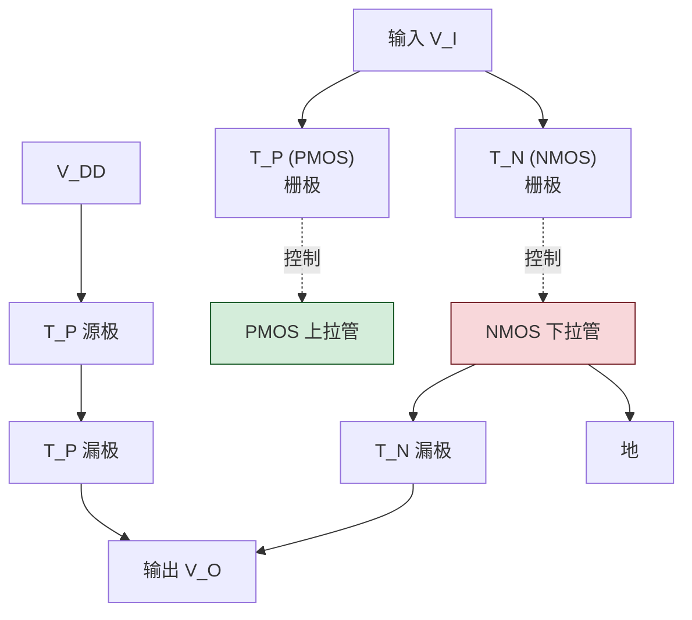
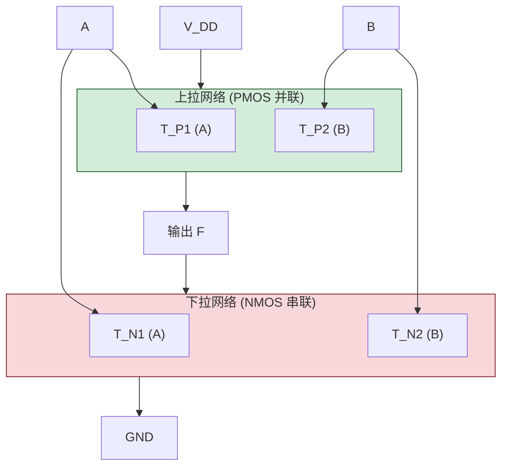

# 2.3 CMOS 门电路特性

> [!abstract] 本节概述
> CMOS（Complementary Metal-Oxide-Semiconductor，互补金属氧化物半导体）是当代集成电路的主流工艺。本节剖析 CMOS 反相器的**互补对称结构**与工作原理，分析其电压传输特性与功耗特点，并与 [[2.2 TTL 集成门电路原理|2.2]] TTL 工艺在功耗、速度、抗干扰、驱动能力等方面进行系统对比，是 [[2.5 门电路接口特性|2.5]] 接口设计与现代 IC 选型的依据。

## 一、CMOS 反相器的电路结构

> [!definition] 互补对称结构
> CMOS 反相器由一只**增强型 NMOS**（下拉管 $T_N$）和一只**增强型 PMOS**（上拉管 $T_P$）互补对称连接组成：
> - 两管栅极相连作为输入 $V_I$；
> - 两管漏极相连作为输出 $V_O$；
> - $T_P$ 源极接 $V_{DD}$，$T_N$ 源极接地；
> - 参数对称：$V_{TN}=|V_{TP}|=V_T$，跨导相同。

## 二、工作原理

设 $V_{DD}=5\text{ V}$、$V_{TN}=+2\text{ V}$、$V_{TP}=-2\text{ V}$（即 $|V_{TP}|=2\text{ V}$）。

> [!theorem] 输入高电平 $V_I=V_{DD}$
> - $T_N$：$V_{GS}=V_{DD}=5\text{ V}>V_{TN}=2\text{ V}$，**导通**；
> - $T_P$：$V_{GS}=V_I-V_{DD}=5-5=0\text{ V}>V_{TP}=-2\text{ V}$，**截止**；
> - 输出经 $T_N$ 下拉到地：$V_O\approx0\text{ V}$（逻辑 0）。
> - 此时 $V_{DD}$ 到地**无直流通路**（$T_P$ 截止），静态电流近零。

> [!theorem] 输入低电平 $V_I=0$
> - $T_N$：$V_{GS}=0<V_{TN}=2\text{ V}$，**截止**；
> - $T_P$：$V_{GS}=V_I-V_{DD}=0-5=-5\text{ V}<V_{TP}=-2\text{ V}$，**导通**；
> - 输出经 $T_P$ 上拉到 $V_{DD}$：$V_O\approx V_{DD}=5\text{ V}$（逻辑 1）。
> - 同样 $V_{DD}$ 到地**无直流通路**（$T_N$ 截止），静态电流近零。

| 输入 $V_I$ | $T_P$ 状态 | $T_N$ 状态 | 输出 $V_O$ | 逻辑 |
| ---------- | ---------- | ---------- | ---------- | ---- |
| $0$（低） | 导通 | 截止 | $\approx V_{DD}$ | 1 |
| $V_{DD}$（高） | 截止 | 导通 | $\approx0$ | 0 |

> [!info] 互补导通的本质
> 任一输入状态下，PMOS 与 NMOS **一管导通、一管截止**，从 $V_{DD}$ 到地不存在低阻直流通路。这正是 CMOS 静态功耗极低的物理根源，与 [[2.2 TTL 集成门电路原理|2.2]] TTL 推拉输出有本质区别（TTL 输出低时 $T_5$ 饱和有 $I_C$ 流过）。

## 三、电压传输特性

> [!definition] CMOS 反相器电压传输特性
> 当 $V_I$ 从 $0$ 缓慢上升到 $V_{DD}$ 时，传输特性曲线分为五段：

| 段 | 输入范围 | $T_P$ 状态 | $T_N$ 状态 | 输出 |
| -- | -------- | ---------- | ---------- | ---- |
| AB | $0\le V_I<V_{TN}$ | 导通 | 截止 | $V_{DD}$ |
| BC | $V_{TN}\le V_I<\frac{V_{DD}}{2}$ | 导通（电阻态） | 导通（饱和态） | 缓慢下降 |
| CD | $V_I\approx\frac{V_{DD}}{2}$ | 饱和 | 饱和 | **急剧下降**（转折） |
| DE | $\frac{V_{DD}}{2}< V_I\le V_{DD}+V_{TP}$ | 饱和 | 电阻态 | 缓慢下降 |
| EF | $V_I>V_{DD}+V_{TP}$ | 截止 | 导通 | $0$ |

> [!theorem] 阈值与噪声容限
> CMOS 反相器传输特性**在 $V_I=\frac{V_{DD}}{2}$ 处急剧翻转**，过渡区极窄。其噪声容限：
> $$\boxed{U_{NH}=U_{OH}-U_{IH}\approx V_{DD}-\frac{V_{DD}}{2}=\frac{V_{DD}}{2}}$$
> $$\boxed{U_{NL}=U_{IL}-U_{OL}\approx\frac{V_{DD}}{2}-0=\frac{V_{DD}}{2}}$$
> 即**高电平噪声容限等于低电平噪声容限，约为 $V_{DD}/2$**。$V_{DD}=5\text{ V}$ 时 $U_{NH}=U_{NL}\approx2.5\text{ V}$，远大于 TTL 的 $0.4\text{ V}$。

> [!warning] CMOS 输入端不能悬空
> CMOS 输入阻抗极高（$10^{10}\,\Omega$ 以上），悬空输入会拾取静电和干扰电荷，使栅极电位不确定，导致：
> - 输出状态不确定；
> - $T_P$ 与 $T_N$ 可能同时微导通，产生**较大穿通电流**，功耗激增甚至损坏；
> - 静电击穿栅极氧化层。
>
> **必须**将未使用的 CMOS 输入端接到确定电平（$V_{DD}$ 或地），或并联到使用端。这与 TTL 悬空等效高电平不同。

## 四、CMOS 门电路特点

> [!theorem] CMOS 的六大优点
> 1. **静态功耗极低**：互补结构使静态时无直流通路，单门静态功耗仅纳瓦级，适合电池供电和大规模集成；
> 2. **噪声容限大**：约 $V_{DD}/2$，抗干扰能力强，远优于 TTL；
> 3. **输入阻抗高**：栅极氧化层绝缘，输入电流几乎为零，扇出系数极大（理论上仅受动态电容限制）；
> 4. **电源电压范围宽**：4000 系列可工作在 $3\sim18\text{ V}$，74HC/AC 系列 $2\sim6\text{ V}$，与多种电源兼容；
> 5. **集成度高**：低功耗允许高密度集成，是 VLSI/ULSI 主流工艺；
> 6. **逻辑摆幅大**：输出 $0$ 到 $V_{DD}$ 全摆幅，比 TTL（$0.3\sim3.6\text{ V}$）更接近理想。

> [!warning] CMOS 的主要缺点
> 1. **静态敏感**：栅极氧化层极薄（nm 级），易被静电击穿，运输和操作需防静电；
> 2. **早期速度较慢**：4000 系列传输延迟 $100\,\text{ns}$ 量级，比 TTL 慢；74HC/AC 系列已改进到与 74LS 相当；
> 3. **动态功耗随频率线性增长**：
>    $$P_{dyn}=C_L\cdot V_{DD}^2\cdot f$$
>    其中 $C_L$ 为负载电容、$f$ 为工作频率。高频下 CMOS 功耗可能超过 TTL；
> 4. **拉/灌电流能力对称但绝对值较小**：约 $\pm4\,\text{mA}$（标准 CMOS），驱动重负载需缓冲器。

> [!note] 动态功耗的来源
> CMOS 开关过程中有两部分动态功耗：
> - **充放电功耗**：对负载电容 $C_L$ 充放电消耗；
> - **穿通电流功耗**：状态切换瞬间 $T_P$ 与 $T_N$ 同时短暂导通，从 $V_{DD}$ 到地形成窄脉冲电流。
> 工作频率越高，每秒切换次数越多，动态功耗越大。

## 五、CMOS 与 TTL 系统对比

| 对比项 | TTL（74LS） | CMOS（4000B） | 高速 CMOS（74HC） |
| ------ | ----------- | ------------- | ----------------- |
| 电源电压 | $5\text{ V}\pm0.25$ | $3\sim18\text{ V}$ | $2\sim6\text{ V}$ |
| 静态功耗/门 | $2\,\text{mW}$ | $10\,\text{nW}$ | $1\,\mu\text{W}$ |
| 传输延迟 | $9\,\text{ns}$ | $100\,\text{ns}$ | $10\,\text{ns}$ |
| 噪声容限（$5\text{ V}$） | $0.4\text{ V}$ | $1.5\text{ V}$ | $1.5\text{ V}$ |
| 输出高/低电平 | $2.7/0.4\text{ V}$ | $4.95/0.05\text{ V}$ | $4.3/0.3\text{ V}$ |
| 输入电流 | $I_{IH}=20\,\mu\text{A}$ | $<1\,\mu\text{A}$ | $<1\,\mu\text{A}$ |
| 灌/拉电流 | $8/-0.4\,\text{mA}$ | $0.5/-0.5\,\text{mA}$ | $4/-4\,\text{mA}$ |
| 扇出（同类） | $10$ | $>50$ | $>50$ |
| 抗静电能力 | 较强 | 较差 | 较差 |
| 集成度 | 中 | 高 | 高 |

> [!tip] 工艺选择原则
> - **超低功耗、便携**：CMOS（特别是电池供电设备）；
> - **高速、强驱动**：74ACT 或 TTL（74F、74ALS）；
> - **兼容 TTL 输入**：选 74HCT/ACT（输入阈值与 TTL 兼容）；
> - **大规模集成（CPU、FPGA、存储器）**：CMOS 是唯一选择。

## 六、典型 CMOS 门电路结构

> [!definition] CMOS 与非门
> 由两只 PMOS **并联**（上拉网络）和两只 NMOS **串联**（下拉网络）组成：
> - 输入 $A=B=1$ 时，两 NMOS 同时导通，PMOS 同时截止，输出 $0$；
> - 任一输入为 $0$ 时，对应 PMOS 导通、NMOS 截止，输出 $V_{DD}$。

> [!note] CMOS 门电路构成规则
> - **与非门**：PMOS 并联（上拉）、NMOS 串联（下拉）；
> - **或非门**：PMOS 串联（上拉）、NMOS 并联（下拉）；
> - 上下网络**对偶**——上拉网络的串并联结构是下拉网络的对偶。

## 七、典型例题

> [!example] 例题 1：CMOS 反相器状态判断
> $V_{DD}=5\text{ V}$、$V_{TN}=+1.5\text{ V}$、$V_{TP}=-1.5\text{ V}$。求 $V_I=0\text{ V}$、$3\text{ V}$、$5\text{ V}$ 时各管状态及输出。

**解**：

| $V_I$ | $T_P$ 条件 $V_{GS,P}=V_I-V_{DD}$ | $T_P$ | $T_N$ 条件 $V_{GS,N}=V_I$ | $T_N$ | $V_O$ |
| ----- | ------------------------------- | ----- | ------------------------- | ----- | ----- |
| $0$ | $-5<-1.5$ | 导通 | $0<1.5$ | 截止 | $\approx5\text{ V}$ |
| $3$ | $-2<-1.5$ | 导通 | $3>1.5$ | 导通 | 中间（过渡区） |
| $5$ | $0>-1.5$ | 截止 | $5>1.5$ | 导通 | $\approx0\text{ V}$ |

> [!example] 例题 2：CMOS 动态功耗计算
> 某 CMOS 门驱动 $C_L=10\,\text{pF}$ 负载，$V_{DD}=5\text{ V}$，工作频率 $f=10\,\text{MHz}$。求动态功耗。

**解**：

$$P_{dyn}=C_L V_{DD}^2 f=10\times10^{-12}\times 5^2\times 10^7=2.5\,\text{mW}$$

若 $f$ 升到 $100\,\text{MHz}$：$P_{dyn}=25\,\text{mW}$，已超过 TTL 静态功耗。这说明"CMOS 永远低功耗"是误解——**高频下 CMOS 动态功耗不可忽略**。

## 八、易错点

> [!warning] 易错点
> 1. **CMOS 输入端处理**：与 TTL 不同，**严禁悬空**，必须接确定电平；
> 2. **PMOS 阈值极性**：$V_{TP}$ 为负值，导通条件是 $V_{GS}<V_{TP}$（负向超过阈值），不要写成 $V_{GS}>V_{TP}$；
> 3. **噪声容限数值**：CMOS 噪声容限接近 $V_{DD}/2$，不是固定 $0.4\text{ V}$；
> 4. **功耗误解**：CMOS 静态功耗极低，但**动态功耗随频率线性增加**，高速时可能超过 TTL；
> 5. **与非/或非结构混淆**：PMOS 并联对应与非，PMOS 串联对应或非，与下拉网络对偶；
> 6. **扇出理解**：CMOS 静态扇出几乎无限，但实际受输入电容限制，工作频率越高扇出越小。

## 九、与其他小节的联系

- 器件基础见 [[2.1 半导体开关特性|2.1]] MOS 管开关；
- 与 TTL 对比见 [[2.2 TTL 集成门电路原理|2.2]]；
- TTL↔CMOS 电平匹配问题见 [[2.5 门电路接口特性|2.5]]；
- CMOS 传输门、三态门应用见 [[2.4 三态门、OC 门、线与逻辑|2.4]]；
- CMOS 是 [[MOC - 第8章|第8章]] FPGA、CPLD 与现代 IC 的工艺基础。

## 章节导航

- 上一级：[[MOC - 第2章|第2章 知识点目录]]
- 上一节：[[2.2 TTL 集成门电路原理|2.2 TTL 集成门电路原理]]
- 下一节：[[2.4 三态门、OC 门、线与逻辑|2.4 三态门、OC 门、线与逻辑]]
- 习题：[[MOC - 第2章习题|第2章 习题]]
