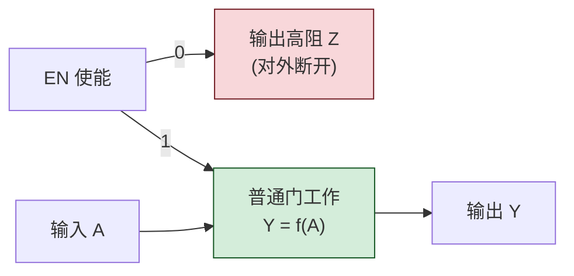
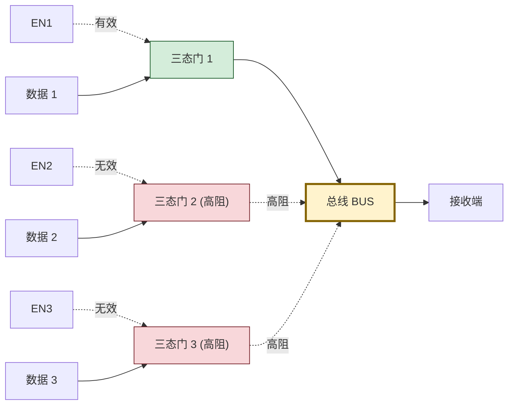
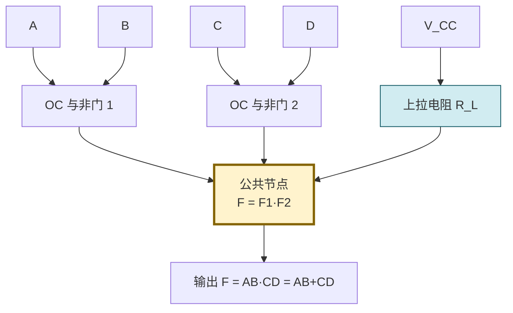

# 2.4 三态门、OC 门、线与逻辑

> [!abstract] 本节概述
> 标准 TTL/CMOS 门的推拉输出结构**禁止输出端直接相连**（高电平管和低电平管同时导通会烧毁），但工程上常需要把多个门的输出连接到同一根线（总线、共享节点）。为此发展出两类**特殊输出结构**：**三态门（TS 门）** 通过使能控制实现"高阻"第三态；**OC 门（集电极开路门）/ OD 门（漏极开路门）** 通过去掉上拉管，外接公共上拉电阻实现"线与"。本节剖析两者的工作原理、典型应用和上拉电阻计算，是 [[MOC - 第3章|第3章]] 总线设计与可编程逻辑的基础。

## 一、三态门（TS 门）

> [!definition] 三态门
> 三态门（Tri-State Gate, TS 门）在普通门的基础上增加一个**使能端 EN**（Enable），输出有三种状态：
> - **高电平**（逻辑 1）；
> - **低电平**（逻辑 0）；
> - **高阻态 $Z$**（High-Impedance，输出端对外呈现极高阻抗，相当于断开）。
>
> 当使能端有效时，三态门按普通门工作；当使能端无效时，输出进入高阻态，对总线"透明断开"。

> [!theorem] 三态门的逻辑功能
> 以三态非门为例（使能高有效）：

| $EN$ | $A$ | 输出 $Y$ | 状态 |
| ---- | --- | -------- | ---- |
| $0$ | $\times$ | $Z$ | 高阻（断开） |
| $1$ | $0$ | $1$ | 正常输出 |
| $1$ | $1$ | $0$ | 正常输出 |

使能低有效的三态门符号上 EN 端带小圆圈，逻辑对应取反。

> [!info] 高阻态的物理实现
> 在 TTL 三态门中，使能无效时同时关断推拉输出的上管 $T_4$ 和下管 $T_5$，使输出端对 $V_{CC}$ 和地都呈现高阻抗；CMOS 三态门则同时关断 PMOS 上拉管和 NMOS 下拉管。两种工艺的输出端都相当于"悬空"，对外等效断开。

> [!example] 三态门总线应用
> 多个三态门输出端接同一根总线，**任一时刻只允许一个三态门的 EN 有效**，其余 EN 均无效（输出高阻）。这样总线上的电平由唯一被使能的门决定，互不冲突。

> [!warning] 三态门总线使用规则
> 1. **任一时刻至多一个 EN 有效**——若两个 EN 同时有效且输出不同，仍会发生短路烧毁；
> 2. **切换时序控制**：先让当前门进入高阻，再让下一门使能，避免**重叠期**冲突；
> 3. 总线空闲时所有 EN 都无效，总线呈高阻，需加**上拉或下拉电阻**确定默认电平；
> 4. 三态门是计算机总线、存储器数据总线、双向 I/O 的核心元件。

## 二、OC 门（集电极开路门）

> [!definition] OC 门
> OC 门（Open-Collector Gate，集电极开路门）是在 TTL 与非门基础上**去掉输出级上拉管 $T_3$、$T_4$**，仅保留 $T_5$，使其集电极开路引出。使用时**必须外接上拉电阻 $R_L$** 到 $V_{CC}$，否则输出无法呈现高电平。
>
> CMOS 中对应结构称为 **OD 门**（Open-Drain，漏极开路门），原理相同。

> [!theorem] OC 门的工作原理
> - 当 $T_5$ 饱和（输出逻辑 0）时，输出端被 $T_5$ 拉到 $\approx0.3\text{ V}$；
> - 当 $T_5$ 截止（输出逻辑 1）时，输出端由外接 $R_L$ 拉到 $V_{CC}$；
> - 因此 OC 门**输出 1 时的电平由 $V_{CC}$ 决定**，可与不同电源电压的系统接口。

> [!note] OC 门与推拉门对比
> | 对比项 | 推拉输出 TTL | OC 门 |
> | ------ | ------------ | ----- |
> | 上拉管 | 内置 $T_3$、$T_4$ | 无，需外接 $R_L$ |
> | 输出 1 电平 | $\approx3.6\text{ V}$ | $\approx V_{CC}$（由外电源决定） |
> | 输出端能否短接 | **不能**（烧毁） | **可以**（线与） |
> | 速度 | 快 | 较慢（$R_L$ 充放电） |
> | 应用 | 普通逻辑 | 线与、电平转换、驱动 |

## 三、线与逻辑

> [!definition] 线与逻辑
> 把多个 OC 门（或 OD 门）的输出端接在一起，并共用一只上拉电阻 $R_L$，形成的逻辑关系称为**线与**：
> - 任一 OC 门输出 0（$T_5$ 饱和），总线被拉低；
> - 所有 OC 门输出 1（$T_5$ 截止），总线被 $R_L$ 拉高。
>
> 总线电平 $F$ 等于各 OC 门输出之**与**：
> $$\boxed{F = F_1 \cdot F_2 \cdot \cdots \cdot F_n = \overline{AB}\cdot\overline{CD}\cdot\cdots}$$

> [!example] 线与逻辑示例
> 两个 OC 与非门输出线与：
> - 门 1：$F_1=\overline{AB}$
> - 门 2：$F_2=\overline{CD}$
> - 线与结果：
> $$F = F_1\cdot F_2 = \overline{AB}\cdot\overline{CD} = \overline{AB+CD}$$
>
> 利用摩根定律，线与两个与非门等效实现**与或非**逻辑，省去一级或门。

> [!warning] 为什么推拉输出不能线与
> 两个推拉 TTL 门输出短接时，若一个输出 1（$T_4$ 导通、$T_5$ 截止），另一个输出 0（$T_4$ 截止、$T_5$ 饱和），则 $V_{CC}$ 经 $T_4$ 和 $T_5$ 形成低阻直流通路，电流可达几十毫安，**持续将烧毁芯片**。OC 门去掉了 $T_4$，根本杜绝此情况。

## 四、OC 门上拉电阻 $R_L$ 的计算

> [!theorem] $R_L$ 的取值范围
> 设 $n$ 个 OC 门输出线与，驱动 $m$ 个负载门（共 $k$ 个输入端），$V_{CC}$ 为上拉电源：
> - **$R_L$ 最大值**：所有 OC 门截止（输出 1），电流经 $R_L$ 流入负载门输入端，要求 $R_L$ 上压降不致使总线低于 $U_{IH(\min)}$：
>   $$\boxed{R_{L(\max)}=\dfrac{V_{CC}-U_{IH(\min)}}{n\,I_{OH}+k\,I_{IH}}}$$
>   其中 $I_{OH}$ 为 OC 门截止时的漏电流。
> - **$R_L$ 最小值**：仅一个 OC 门导通（输出 0），灌电流最大，要求 $R_L$ 电流加负载门 $I_{IL}$ 不超过导通门的 $I_{OL}$：
>   $$\boxed{R_{L(\min)}=\dfrac{V_{CC}-U_{OL(\max)}}{I_{OL}-m\,I_{IL}}}$$
>
> 实际取值应满足 $R_{L(\min)}\le R_L\le R_{L(\max)}$，工程上通常取中间值以兼顾速度与功耗。

> [!note] $R_L$ 选择的工程权衡
> - $R_L$ 取小：灌电流大、输出 0 容易维持、低→高过渡快（$RC$ 小），但功耗大；
> - $R_L$ 取大：功耗小，但低→高过渡慢（$RC$ 大），限制工作频率；
> - 高速电路取偏小值，低功耗电路取偏大值。

> [!example] 例题 1：上拉电阻计算
> 用 2 个 OC 与非门线与驱动 3 个 TTL 与非门输入端，参数：$V_{CC}=5\text{ V}$、$U_{IH}=2.0\text{ V}$、$U_{OL}=0.4\text{ V}$、$I_{OH}=0.25\,\text{mA}$、$I_{IL}=1.6\,\text{mA}$、$I_{IH}=40\,\mu\text{A}$、$I_{OL}=16\,\text{mA}$。求 $R_L$ 范围。

**解**：

(1) 求 $R_{L(\max)}$（所有 OC 截止，输出 1）：
- $n=2$ 个 OC 门漏电流：$2\times0.25=0.5\,\text{mA}$
- $k=3$ 个负载输入电流：$3\times40=120\,\mu\text{A}=0.12\,\text{mA}$
$$R_{L(\max)}=\dfrac{5-2.0}{0.5+0.12}=\dfrac{3.0}{0.62}\approx4.84\,\text{k}\Omega$$

(2) 求 $R_{L(\min)}$（最坏情况仅 1 个 OC 导通，输出 0）：
- 灌电流能力 $I_{OL}=16\,\text{mA}$
- 负载门低电平输入电流 $m=3$ 个：$3\times1.6=4.8\,\text{mA}$
- $R_L$ 上电流：$I_{RL}=I_{OL}-m\,I_{IL}=16-4.8=11.2\,\text{mA}$
$$R_{L(\min)}=\dfrac{5-0.4}{11.2}=\dfrac{4.6}{11.2\,\text{mA}}\approx0.41\,\text{k}\Omega=410\,\Omega$$

(3) 取值范围：
$$\boxed{410\,\Omega\le R_L\le4.84\,\text{k}\Omega}$$

工程上可取标称值 $1\,\text{k}\Omega$ 或 $2.2\,\text{k}\Omega$。

## 五、OC 门/OD 门的典型应用

> [!tip] OC 门/OD 门的四大应用
> 1. **线与逻辑**：多个 OC 门输出短接实现与运算，省器件；
> 2. **总线驱动**：与三态门类似，但 OC 门是"低电平有效"的总线（多门可同时输出 1，仅一个输出 0 时拉低）；
> 3. **电平转换**：OC 门输出 1 时电平由上拉电源决定，可把 TTL 的 $5\,\text{V}$ 逻辑转换到 $12\,\text{V}$、$24\,\text{V}$ 等高压逻辑；
> 4. **驱动指示灯与继电器**：OC 门灌电流能力较强，可直接驱动 LED、继电器线圈等。

> [!example] 例题 2：电平转换
> 用 TTL OC 门把 $5\,\text{V}$ 逻辑信号转换为 $12\,\text{V}$ 逻辑信号。说明接法。

**解**：

- OC 门输入端接 TTL $5\,\text{V}$ 系统；
- OC 门输出端外接上拉电阻 $R_L$ 到 $+12\,\text{V}$ 电源；
- 当 TTL 输入使 OC 门导通时，输出 $\approx0.3\,\text{V}$（$12\,\text{V}$ 侧逻辑 0）；
- 当 TTL 输入使 OC 门截止时，输出被拉到 $12\,\text{V}$（$12\,\text{V}$ 侧逻辑 1）。

注意 OC 门的 $T_5$ 必须能承受 $12\,\text{V}$ 反压，需选耐压足够的器件（如 7406 是高压 OC 缓冲器，耐压 $30\,\text{V}$）。

## 六、三态门与 OC 门对比

| 对比项 | 三态门（TS） | OC 门（OC/OD） |
| ------ | ------------ | -------------- |
| 输出状态数 | 3（高、低、高阻） | 2（高、低），高态靠外接上拉 |
| 是否需要外接电阻 | 不需要 | **必须**外接 $R_L$ |
| 多门共享总线 | 任一时刻仅一个使能 | 可多门同时输出 1（线与） |
| 速度 | 快（推拉驱动） | 较慢（$R_L$ 充电） |
| 功耗 | 较低 | 较高（$R_L$ 持续耗电） |
| 应用 | 总线驱动、双向 I/O | 线与、电平转换、驱动 |

## 七、易错点

> [!warning] 易错点
> 1. **三态门冲突**：多个 EN 同时有效会烧毁芯片，设计总线控制逻辑时必须确保互斥；
> 2. **OC 门不加 $R_L$**：忘记外接上拉电阻会导致输出永远为低或浮空，逻辑错误；
> 3. **线与逻辑符号**：线与不是或，是**与**——任一门输出 0 总线就为 0；
> 4. **$R_L$ 计算漏项**：求 $R_{L(\max)}$ 时漏加 $n\,I_{OH}$ 漏电流；求 $R_{L(\min)}$ 时漏减负载门 $I_{IL}$；
> 5. **三态门高阻 ≠ 0**：高阻态总线电平不确定，不能等同于逻辑 0；
> 6. **OD 门与 CMOS 配套**：CMOS 系统用 OD 门而非 OC 门（工艺匹配），但电路原理一致。

## 八、与其他小节的联系

- 三态门、OC 门以 [[2.2 TTL 集成门电路原理|2.2]] 推拉输出结构为起点；
- OD 门是 [[2.3 CMOS 门电路特性|2.3]] CMOS 输出结构的开路变体；
- 线与和总线是 [[MOC - 第3章|第3章]] 数据选择器、译码器、总线收发器的核心；
- 三态门广泛用于 [[MOC - 第7章|第7章]] 存储器数据总线复用；
- OC 门电平转换是 [[2.5 门电路接口特性|2.5]] 不同电源电压系统互联的手段。

## 章节导航

- 上一级：[[MOC - 第2章|第2章 知识点目录]]
- 上一节：[[2.3 CMOS 门电路特性|2.3 CMOS 门电路特性]]
- 下一节：[[2.5 门电路接口特性|2.5 门电路接口特性]]
- 习题：[[MOC - 第2章习题|第2章 习题]]
