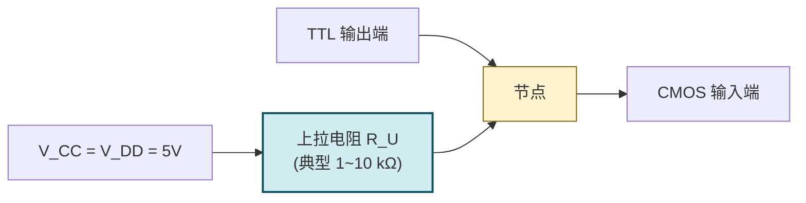

# 2.5 门电路接口特性

> [!abstract] 本节概述
> 实际数字系统常混合使用 TTL 和 CMOS 两种工艺（如 TTL 用于高速驱动、CMOS 用于低功耗高集成）。但两者的**输出电平范围、输入电平阈值、电流驱动能力均不同**，直接互联会出现电平不匹配或驱动不足。本节分析 TTL↔CMOS 互联的电平兼容性，给出 TTL 驱动 CMOS、CMOS 驱动 TTL 的接口方法与设计要点，是 [[MOC - 第3章|第3章]] 板级电路设计与混合工艺系统的工程基础。

## 一、TTL 与 CMOS 电平兼容性分析

> [!definition] 电平参数对照（$V_{CC}=V_{DD}=5\text{ V}$）

| 参数 | TTL（74LS） | CMOS（4000B） | 高速 CMOS（74HC） | TTL 兼容 CMOS（74HCT） |
| ---- | ----------- | ------------- | ----------------- | ---------------------- |
| $U_{OH(\min)}$ | $2.7\text{ V}$ | $4.95\text{ V}$ | $4.3\text{ V}$ | $4.3\text{ V}$ |
| $U_{OL(\max)}$ | $0.5\text{ V}$ | $0.05\text{ V}$ | $0.3\text{ V}$ | $0.3\text{ V}$ |
| $U_{IH(\min)}$ | $2.0\text{ V}$ | $3.5\text{ V}$ | $3.5\text{ V}$ | $2.0\text{ V}$ |
| $U_{IL(\max)}$ | $0.8\text{ V}$ | $1.5\text{ V}$ | $1.5\text{ V}$ | $0.8\text{ V}$ |
| $I_{OH}$ | $-0.4\,\text{mA}$ | $-0.5\,\text{mA}$ | $-4\,\text{mA}$ | $-4\,\text{mA}$ |
| $I_{OL}$ | $8\,\text{mA}$ | $0.5\,\text{mA}$ | $4\,\text{mA}$ | $4\,\text{mA}$ |
| $I_{IH}$ | $20\,\mu\text{A}$ | $<1\,\mu\text{A}$ | $<1\,\mu\text{A}$ | $<1\,\mu\text{A}$ |
| $I_{IL}$ | $-0.4\,\text{mA}$ | $<1\,\mu\text{A}$ | $<1\,\mu\text{A}$ | $<1\,\mu\text{A}$ |

> [!warning] 兼容性判断原则
> 互联必须同时满足两个条件：
> 1. **电平兼容**：驱动门 $U_{OH(\min)} \ge$ 负载门 $U_{IH(\min)}$，且驱动门 $U_{OL(\max)} \le$ 负载门 $U_{IL(\max)}$；
> 2. **电流兼容**：驱动门 $|I_{OH}| \ge$ 负载门 $|I_{IH}|$ 之和，且驱动门 $I_{OL} \ge$ 负载门 $|I_{IL}|$ 之和。
>
> 任一条件不满足就需要加接口电路。

## 二、TTL 驱动 CMOS

> [!theorem] 电平兼容性判断
> 用 74LS（TTL）驱动 74HC（CMOS，$V_{DD}=5\text{ V}$）：
> - **低电平**：$U_{OL(\max),TTL}=0.5\text{ V} \le U_{IL(\max),CMOS}=1.5\text{ V}$ ✓
> - **高电平**：$U_{OH(\min),TTL}=2.7\text{ V} < U_{IH(\min),CMOS}=3.5\text{ V}$ ✗
> - **结论**：低电平满足，但**高电平不满足**，需加接口电路。

> [!tip] 解决方案 1：上拉电阻法
> 在 TTL 输出端与 $V_{CC}$（=CMOS 的 $V_{DD}$）之间接上拉电阻 $R_U$，当 TTL 输出高时，TTL 内部 $T_4$ 截止，输出被 $R_U$ 拉到接近 $V_{CC}$，满足 CMOS 的 $U_{IH}$ 要求。

> [!note] 上拉电阻 $R_U$ 的选择
> - $R_U$ 太大：上升沿慢，限制工作频率；
> - $R_U$ 太小：TTL 输出低时灌电流过大，可能超过 $I_{OL}$；
> - 典型值 $1\sim10\,\text{k}\Omega$，工程上常取 $4.7\,\text{k}\Omega$ 或 $10\,\text{k}\Omega$。
>
> $R_U$ 上下限计算（设 TTL $I_{OL}=8\,\text{mA}$、$U_{OL}=0.5\text{V}$，CMOS $I_{IH}=1\,\mu\text{A}$、$U_{IH}=3.5\text{V}$）：
> - $R_{U(\min)}=\dfrac{V_{CC}-U_{OL}}{I_{OL}}=\dfrac{5-0.5}{8}=562\,\Omega$
> - $R_{U(\max)}=\dfrac{V_{CC}-U_{IH}}{k\,I_{IH}}\approx\dfrac{5-3.5}{1\,\mu\text{A}}=1.5\,\text{M}\Omega$（实际取 $10\,\text{k}\Omega$ 以兼顾速度）

> [!tip] 解决方案 2：使用 74HCT 系列
> 74HCT 是**输入电平与 TTL 兼容的高速 CMOS**（输入阈值 $U_{IH}=2.0\text{ V}$、$U_{IL}=0.8\text{ V}$），可直接由 TTL 驱动，无需上拉电阻。这是现代设计最简洁的方法。

> [!tip] 解决方案 3：使用电平转换芯片
> 不同电源电压系统（如 $5\,\text{V}$ TTL 驱动 $3.3\,\text{V}$ CMOS）应使用专用电平转换芯片（如 74LVC、TXB0108 等），避免过压损坏。

## 三、CMOS 驱动 TTL

> [!theorem] 电平兼容性判断
> 用 74HC（CMOS，$V_{DD}=5\text{ V}$）驱动 74LS（TTL）：
> - **电平**：$U_{OH}=4.3\text{ V}\ge2.0\text{ V}$ ✓，$U_{OL}=0.3\text{ V}\le0.8\text{ V}$ ✓；
> - **高电平电流**：$|I_{OH,HC}|=4\,\text{mA} \ge |I_{IH,TTL}|=20\,\mu\text{A}$ ✓；
> - **低电平电流**：$I_{OL,HC}=4\,\text{mA} \ge |I_{IL,TTL}|=0.4\,\text{mA}$ ✓；
> - **结论**：74HC 可直接驱动若干 74LS，但扇出受低电平灌电流限制：
> $$N_L=\left\lfloor\dfrac{I_{OL,HC}}{|I_{IL,TTL}|}\right\rfloor=\left\lfloor\dfrac{4}{0.4}\right\rfloor=10$$

> [!warning] 4000 系列 CMOS 驱动 TTL 的问题
> 4000B 系列 CMOS 的 $I_{OL}$ 仅 $0.5\,\text{mA}$，而 TTL 的 $I_{IL}=1.6\,\text{mA}$（标准 TTL）或 $0.4\,\text{mA}$（74LS）：
> - 驱动标准 74 系列：$I_{OL}=0.5\,\text{mA}<I_{IL}=1.6\,\text{mA}$ ✗ **不能直接驱动**；
> - 驱动 74LS：$I_{OL}=0.5\,\text{mA}\ge I_{IL}=0.4\,\text{mA}$ ✓ 仅能驱动 1 个，扇出极小。
>
> 此时需加**缓冲器**（如 4050 六缓冲器）或选用 74HC/74HCT 等驱动能力更强的 CMOS。

> [!example] 例题 1：CMOS 驱动 TTL 扇出
> 74HC00 驱动 74LS00，参数：$I_{OL,HC}=4\,\text{mA}$、$I_{OH,HC}=-4\,\text{mA}$、$I_{IL,LS}=-0.4\,\text{mA}$、$I_{IH,LS}=20\,\mu\text{A}$。求扇出。

**解**：

- 灌电流扇出：$N_L=\left\lfloor\dfrac{4}{0.4}\right\rfloor=10$
- 拉电流扇出：$N_H=\left\lfloor\dfrac{4}{0.02}\right\rfloor=200$
- 取较小值：**$N=10$**

> [!note] CMOS 驱动 TTL 的电流方向
> - TTL 输入为低时**电流从 TTL 输入端流出**（$I_{IL}$ 方向为负），CMOS 必须能**灌入**此电流；
> - TTL 输入为高时**电流流入 TTL 输入端**（$I_{IH}$ 方向为正），CMOS 必须能**拉出**此电流；
> - 关键限制是低电平灌电流——CMOS 灌电流能力通常小于拉电流能力，是扇出瓶颈。

## 四、不同电源电压系统的接口

> [!definition] 常见电源电压组合
> | 驱动 → 负载 | $V_{CC}$ → $V_{DD}$ | 兼容性 | 接口方法 |
> | ----------- | ------------------ | ------ | -------- |
> | TTL（5V）→ CMOS（5V） | $5\to5$ | 高电平不匹配 | 上拉电阻或 74HCT |
> | CMOS（5V）→ TTL（5V） | $5\to5$ | 兼容 | 直接连接（注意扇出） |
> | CMOS（5V）→ CMOS（3.3V） | $5\to3.3$ | **过压危险** | 串联电阻、电平转换器 |
> | CMOS（3.3V）→ TTL（5V） | $3.3\to5$ | 高电平勉强（$3.3\ge2.0$） | 直接或上拉 |
> | TTL（5V）→ CMOS（3.3V） | $5\to3.3$ | **过压危险** | 必须电平转换 |

> [!warning] 5V CMOS 驱动 3.3V CMOS 的危险
> 5V CMOS 输出高电平接近 $5\text{V}$，超过 3.3V CMOS 输入端的耐压上限（通常 $V_{DD}+0.5\text{V}$），可能损坏 3.3V 器件。**不能直接连接**。解决方法：
> 1. 串联限流电阻（仅当 3.3V 器件输入有钳位二极管时）；
> 2. 使用专用电平转换芯片（74LVC245、SN74AVC、TXB 系列）；
> 3. 使用漏极开路输出加上拉到 3.3V（[[2.4 三态门、OC 门、线与逻辑|2.4]] OD 门方案）；
> 4. 选用输入耐 5V 的 3.3V 器件（如 74LVC 系列，输入可承受 $5.5\text{V}$）。

## 五、接口设计要点

> [!tip] 接口设计五步法
> 1. **核对电源电压**：是否相同？不同则必须考虑电平转换；
> 2. **核对电平参数**：$U_{OH}\ge U_{IH}$？$U_{OL}\le U_{IL}$？不满足则加上拉或选 HCT 系列；
> 3. **核对电流能力**：$|I_{OH}|\ge\sum|I_{IH}|$？$I_{OL}\ge\sum|I_{IL}|$？不满足则加缓冲器；
> 4. **核对速度**：上拉电阻是否过大导致上升沿过慢？必要时减小 $R$ 或选有源驱动；
> 5. **核对耐压**：5V 输出能否加到 3.3V 输入？不能则加电平转换器。

> [!example] 例题 2：综合接口设计
> 设计一个 74LS04（TTL 反相器，$V_{CC}=5\text{V}$）驱动 CD4011（CMOS 与非门，$V_{DD}=10\text{V}$）的接口。

**解**：

(1) 核对电源：TTL $5\text{V}$，CMOS $10\text{V}$，**电源不同且 CMOS 高于 TTL**。

(2) 电平核对：
- TTL $U_{OH}=2.7\text{V}$，CMOS $U_{IH}=7\text{V}$（$10\text{V}/2+2$）→ 严重不足；
- TTL $U_{OL}=0.5\text{V}$，CMOS $U_{IL}=3\text{V}$ → 低电平勉强。

(3) 接口方案：**使用 OC 门 + 上拉到 $10\text{V}$**。
- 选 7406（高压 OC 反相缓冲器，输出管耐压 $30\text{V}$）；
- 输入接 TTL 信号；
- 输出端外接上拉电阻 $R_U$ 到 $+10\text{V}$；
- 当 TTL 输入为 1 时，7406 内 $T_5$ 饱和，输出 $\approx0.3\text{V}$（CMOS 侧逻辑 0）；
- 当 TTL 输入为 0 时，7406 截止，输出被 $R_U$ 拉到 $10\text{V}$（CMOS 侧逻辑 1）。

(4) $R_U$ 选择：取 $10\,\text{k}\Omega$（兼顾速度与功耗，工作频率不高时）。

> [!note] 接口设计的工程化考虑
> 实际板级设计中，常用**专用电平转换芯片**（如 74LVC4245、TXS0108E）替代分立方案，优点：
> - 双向转换，自动方向识别；
> - 速度高（数十 MHz）；
> - 集成度高，省面积；
> - 内置 ESD 保护。
>
> 详见器件数据手册（Datasheet）的"Voltage Translation"章节。

## 六、典型例题

> [!example] 例题 3：判断能否直接互联
> 判断以下三种互联是否需要接口（$V_{CC}=V_{DD}=5\text{V}$）：
> (1) 74LS → 74LS；(2) 74LS → 74HC；(3) 74HC → 74LS。

**解**：

(1) 74LS → 74LS（同类）：
- $U_{OH}=2.7\ge U_{IH}=2.0$ ✓，$U_{OL}=0.5\le U_{IL}=0.8$ ✓；
- 直接互联，扇出 $N=10$。

(2) 74LS → 74HC：
- $U_{OH}=2.7 < U_{IH}=3.5$ ✗；
- **需加接口**：上拉电阻或改用 74HCT。

(3) 74HC → 74LS：
- $U_{OH}=4.3\ge2.0$ ✓，$U_{OL}=0.3\le0.8$ ✓；
- $I_{OL}=4\,\text{mA}\ge I_{IL}=0.4\,\text{mA}$ ✓；
- **可直接互联**，扇出 $N=10$。

> [!example] 例题 4：上拉电阻计算
> 74LS00 输出经上拉电阻驱动 74HC00，$V_{CC}=5\text{V}$，参数 $I_{OL}=8\,\text{mA}$、$U_{OL}=0.5\text{V}$、$U_{IH,HC}=3.5\text{V}$、$I_{IH,HC}=1\,\mu\text{A}$。求 $R_U$ 范围。

**解**：

(1) $R_{U(\min)}$（TTL 输出低，最坏为灌电流上限）：
$$R_{U(\min)}=\dfrac{V_{CC}-U_{OL}}{I_{OL}}=\dfrac{5-0.5}{8\,\text{mA}}=562\,\Omega$$

(2) $R_{U(\max)}$（TTL 输出高，$T_4$ 截止，电流仅流入 CMOS 输入）：
$$R_{U(\max)}=\dfrac{V_{CC}-U_{IH}}{k\,I_{IH}}=\dfrac{5-3.5}{1\times1\,\mu\text{A}}=1.5\,\text{M}\Omega$$

(3) 范围：$562\,\Omega\le R_U\le1.5\,\text{M}\Omega$。

实际取 $10\,\text{k}\Omega$，平衡速度与功耗。

## 七、易错点

> [!warning] 易错点
> 1. **只看电平不看电流**：电平满足不代表能驱动——4000B CMOS 灌电流仅 $0.5\,\text{mA}$，驱动标准 TTL（$I_{IL}=1.6\,\text{mA}$）会失败；
> 2. **TTL→CMOS 漏掉上拉**：74LS 输出高仅 $2.7\text{V}$，低于 74HC 输入阈值 $3.5\text{V}$，必须加上拉或换 74HCT；
> 3. **5V 直接驱动 3.3V 器件**：5V CMOS 输出超过 3.3V 器件耐压，可能损坏，必须电平转换；
> 4. **混淆 $I_{IH}$ 与 $I_{IL}$ 量级**：TTL 的 $I_{IL}$（mA 级）远大于 $I_{IH}$（$\mu$A 级），扇出由 $I_{IL}$ 决定；
> 5. **上拉电阻取值随意**：太大则上升沿慢，太小则功耗大且可能超 $I_{OL}$；
> 6. **忽略速度**：上拉电阻 + 负载电容构成 $RC$，会限制最高工作频率，高速信号需有源驱动。

## 八、与其他小节的联系

- 接口设计基于 [[2.2 TTL 集成门电路原理|2.2]] 与 [[2.3 CMOS 门电路特性|2.3]] 的电平电流参数；
- 上拉电阻法、OC 门电平转换见 [[2.4 三态门、OC 门、线与逻辑|2.4]]；
- 板级系统接口是 [[MOC - 第3章|第3章]] 组合电路设计的工程延伸；
- 总线接口、存储器接口见 [[MOC - 第7章|第7章]]、[[MOC - 第8章|第8章]]；
- 与微机原理、嵌入式系统的 I/O 接口直接衔接。

## 章节导航

- 上一级：[[MOC - 第2章|第2章 知识点目录]]
- 上一节：[[2.4 三态门、OC 门、线与逻辑|2.4 三态门、OC 门、线与逻辑]]
- 下一章：[[MOC - 第3章|第3章 组合逻辑电路]]
- 习题：[[MOC - 第2章习题|第2章 习题]]
