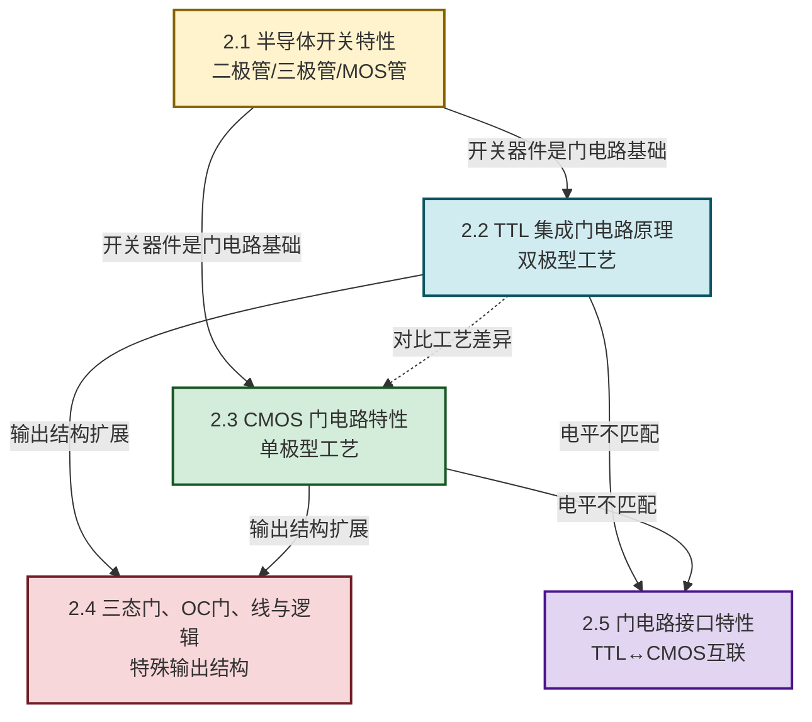

# MOC - 第2章 逻辑门电路

> [!info] 本章定位
> 第2章是数字逻辑电路的**物理实现章**。本章要回答的核心问题是：**第1章定义的与/或/非运算如何用半导体器件物理实现？不同工艺（TTL/CMOS）的门电路在速度、功耗、抗干扰、驱动能力上有何差异？如何把不同工艺的门电路可靠互联？** 本章是 [[MOC - 第3章|第3章 组合逻辑电路]]的构建单元，也是 [[MOC - 第4章|第4章 触发器]]与 [[MOC - 第6章|第6章 脉冲整形电路]]的硬件底层。
>
> 本章承上启下：向上承接 [[MOC - 电路与模拟电子技术|电路与模拟电子技术]]（PN 结、三极管、MOS 管的器件物理）与 [[MOC - 第1章|第1章]]（逻辑抽象），向下为后续章节提供"逻辑运算 ⇄ 物理电平"的转换依据。

## 学习路线图

## 知识点导航

| 小节 | 标题 | 核心内容 | 关键参数/方法 |
| ---- | ---- | -------- | ------------- |
| [[2.1 半导体开关特性\|2.1]] | 半导体开关特性 | 二极管、三极管、MOS 管的开关等效电路与开关时间 | $V_D\approx0.7\text{V}$、$I_B>I_{BS}$、$V_{GS}>V_T$ |
| [[2.2 TTL 集成门电路原理\|2.2]] | TTL 集成门电路原理 | 与非门三级结构、电压传输特性、噪声容限 | $U_{OH}\ge2.4\text{V}$、$U_{OL}\le0.4\text{V}$、扇出 $N$ |
| [[2.3 CMOS 门电路特性\|2.3]] | CMOS 门电路特性 | 互补对称反相器、电压传输、功耗与速度对比 | 静态功耗 $\approx0$、$V_{NH}=V_{NL}$ |
| [[2.4 三态门、OC 门、线与逻辑\|2.4]] | 三态门、OC 门、线与 | 高阻态、上拉电阻计算、总线应用 | $R_{\min}\le R_L\le R_{\max}$ |
| [[2.5 门电路接口特性\|2.5]] | 门电路接口特性 | TTL↔CMOS 电平兼容、上拉、驱动能力匹配 | $I_{OH}\ge n\cdot I_{IH}$ |

## 核心考点

> [!summary] 本章核心考点（7 点）
> 1. **三种器件的开关条件**：二极管导通压降 $0.7\text{V}$；三极管饱和条件 $I_B>I_{BS}=I_{CS}/\beta$；MOS 管导通条件 $V_{GS}>V_T$（NMOS）或 $V_{GS}<V_T$（PMOS，负阈值）。
> 2. **TTL 与非门三级结构**：输入级（多发射极三极管，等效与运算）、中间级（倒相器）、输出级（推拉式 Totem-Pole，低阻输出）。
> 3. **电压传输特性与噪声容限**：$U_{NH}=U_{OH}-U_{IH}$、$U_{NL}=U_{IL}-U_{OL}$，是衡量抗干扰能力的核心指标。
> 4. **CMOS 反相器互补结构**：NMOS 与 PMOS 互补导通，静态时一管导通一管截止，静态功耗近零；传输特性陡峭，噪声容限大（接近 $V_{DD}/2$）。
> 5. **TTL vs CMOS 对比**：CMOS 功耗低、集成度高、抗干扰强、输入阻抗高；TTL 速度较快、驱动能力强、对静电不敏感。
> 6. **三态门与总线**：使能端无效时输出高阻 $Z$，允许多个三态门共享总线，任一时刻仅一个使能。
> 7. **OC 门与线与**：集电极开路需外接上拉电阻 $R_L$，输出可直接短接实现"线与"$F=\overline{AB}\cdot\overline{CD}$；$R_L$ 由灌电流与拉电流约束求得。

## 典型芯片速查

| 型号 | 功能 | 工艺 | 说明 |
| ---- | ---- | ---- | ---- |
| 74LS00 | 四 2 输入与非门 | TTL（低功耗肖特基） | 最常用基础门 |
| 74LS02 | 四 2 输入或非门 | TTL | — |
| 74LS04 | 六反相器 | TTL | — |
| 74LS125 | 四总线缓冲门（三态） | TTL | 低电平使能 |
| 74LS03 | 四 2 输入与非门（OC） | TTL | 集电极开路 |
| CD4011 | 四 2 输入与非门 | CMOS 4000 系列 | — |
| 74HC00 | 四 2 输入与非门 | 高速 CMOS | 引脚兼容 TTL |

> [!note] 工艺后缀含义
> - **LS**：Low-power Schottky，低功耗肖特基，速度与功耗折中；
> - **HC**：High-speed CMOS，与 TTL 引脚兼容、电平接近；
> - **HCT**：HC + TTL 输入电平兼容，可直接由 TTL 驱动；
> - **ACT**：Advanced CMOS + TTL 兼容；
> - **ALS**：Advanced Low-power Schottky。

## 章节导航

> [!nav] 导航
> 上级：[[MOC - 数字逻辑电路|课程总览]]
> 上一章：[[MOC - 第1章|第1章 数字逻辑基础]]
> 下一章：[[MOC - 第3章|第3章 组合逻辑电路]]
> 配套习题：[[MOC - 第2章习题|第2章 习题]]
