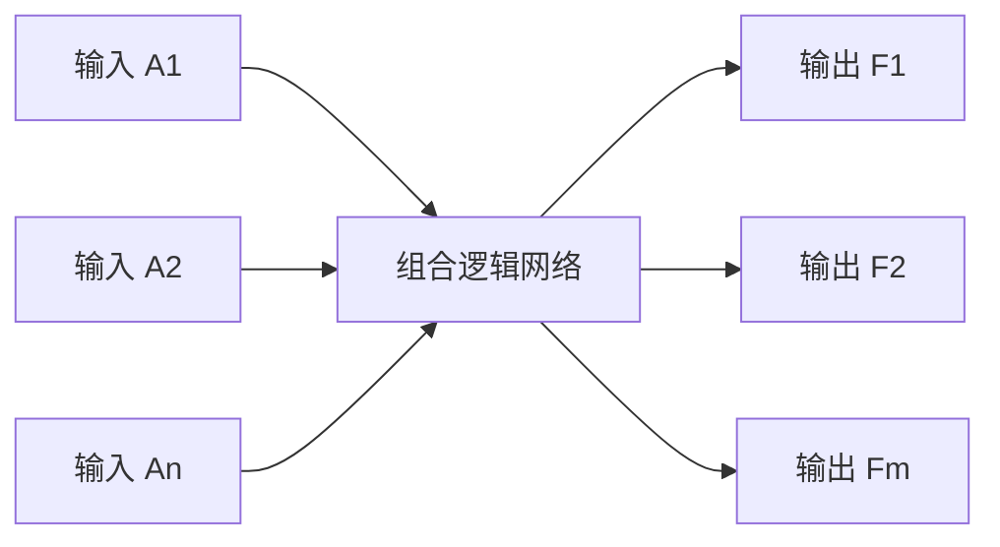
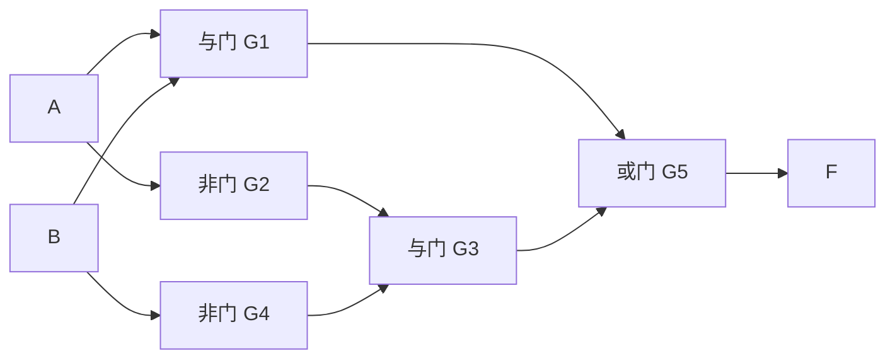
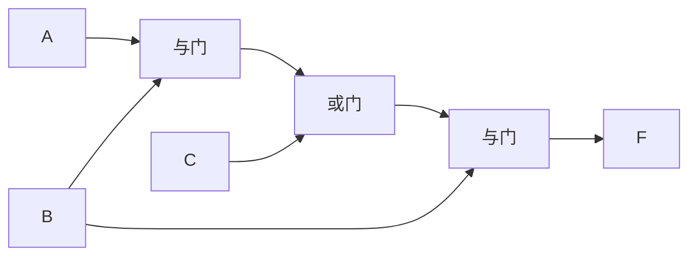
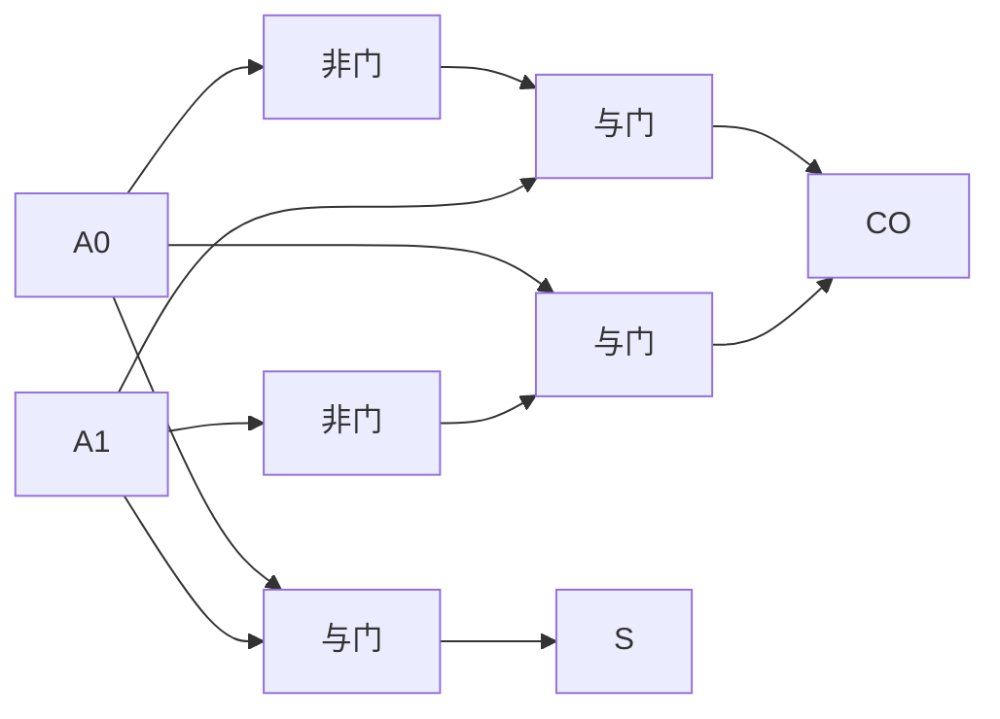

# 3.1 组合电路分析方法

> [!abstract] 本节概述
> 组合逻辑电路分析回答"**这个电路实现了什么功能？**"——给定一张由门电路构成的逻辑图，如何反推其逻辑功能。本节建立"逐级写表达式 → 化简 → 列真值表 → 说明功能"的标准四步流程，并通过典型例题演示完整分析过程。分析是 [[3.2 组合电路设计步骤|3.2]] 设计的逆过程，两者共用真值表与化简工具。

## 一、组合逻辑电路的特点

> [!definition] 组合逻辑电路
> 任一时刻的输出**仅由该时刻的输入**决定，而与电路原来的状态无关的数字电路称为组合逻辑电路，简称组合电路。

> [!info] 组合电路的结构特征
> 1. **仅由门电路构成**：不含记忆元件（触发器、寄存器）；
> 2. **无反馈环路**：信号从输入到输出单向流动，不形成回路；
> 3. **输出函数**：每个输出都是输入的布尔函数 $F_i = f_i(A_1, A_2, \ldots, A_n)$。

> [!note] 组合电路与时序电路的分界
> 组合电路**无记忆**——输出只看当下输入；时序电路**有记忆**——输出还依赖过去状态（由触发器存储）。是否含触发器是两者最直观的判据，详见 [[MOC - 第5章|第5章 时序逻辑电路]]。

## 二、分析的一般步骤

> [!tip] 组合电路分析四步法
> 1. **逐级写表达式**：从输入到输出，依次为每一级门电路写出输出表达式，最终得到输出与输入的函数关系；
> 2. **化简表达式**：用 [[1.5 逻辑函数化简（代数法、卡诺图法）|代数法或卡诺图法]] 化简为最简与或式（或其他规定形式）；
> 3. **列真值表**：将输入所有取值组合代入化简后的表达式，求出对应输出，列成 [[1.4 逻辑函数表示方式：真值表、表达式、卡诺图|真值表]]；
> 4. **说明功能**：根据真值表归纳电路的逻辑功能。

> [!warning] 写表达式时的注意点
> 1. **逐级标注中间变量**：给每一级门输出命名（如 $P_1, P_2, \ldots$），逐级代入避免出错；
> 2. **注意运算优先级**：括号 → 非 → 与 → 或，跨级代入时务必加括号；
> 3. **多输出电路分别分析**：每个输出独立走完四步，最后综合说明整体功能；
> 4. **真值表必须穷举**：$n$ 个输入有 $2^n$ 行，不能漏写。

## 三、典型分析例题

### 例题 1：单输出两级电路

> [!example] 题目
> 分析下图所示组合逻辑电路的功能。

**解**：

1. **逐级写表达式**：
   - $P_1 = AB$（G1）
   - $P_2 = \bar A$（G2），$P_3 = \bar B$（G4）
   - $P_4 = P_2 \cdot P_3 = \bar A \cdot \bar B$（G3）
   - $F = P_1 + P_4 = AB + \bar A \bar B$

2. **化简**：$F = AB + \bar A \bar B$ 已是最简与或式。

3. **列真值表**：

| $A$ | $B$ | $AB$ | $\bar A\bar B$ | $F$ |
| :-: | :-: | :--: | :------------: | :-: |
| 0 | 0 | 0 | 1 | 1 |
| 0 | 1 | 0 | 0 | 0 |
| 1 | 0 | 0 | 0 | 0 |
| 1 | 1 | 1 | 0 | 1 |

4. **功能说明**：仅当 $A, B$ 取值相同时输出 1，否则输出 0。这是 **同或（XNOR）** 运算，即 $F = A \odot B = \overline{A \oplus B}$。

### 例题 2：三变量多级电路

> [!example] 题目
> 分析下图所示三变量电路的功能。

**解**：

1. **逐级写表达式**：
   - $P_1 = AB$（第一级与门）
   - $P_2 = P_1 + C = AB + C$（或门）
   - $F = P_2 \cdot B = (AB + C) \cdot B$（第二级与门）

2. **化简**：
   $$F = (AB + C) \cdot B = ABB + BC = AB + BC = B(A + C)$$

3. **列真值表**：

| $A$ | $B$ | $C$ | $AB$ | $AB+C$ | $F=(AB+C)\cdot B$ |
| :-: | :-: | :-: | :--: | :-----: | :---------------: |
| 0 | 0 | 0 | 0 | 0 | 0 |
| 0 | 0 | 1 | 0 | 1 | 0 |
| 0 | 1 | 0 | 0 | 0 | 0 |
| 0 | 1 | 1 | 0 | 1 | 1 |
| 1 | 0 | 0 | 0 | 0 | 0 |
| 1 | 0 | 1 | 0 | 1 | 0 |
| 1 | 1 | 0 | 1 | 1 | 1 |
| 1 | 1 | 1 | 1 | 1 | 1 |

4. **功能说明**：$F = B(A + C)$，当 $B=1$ 且 $A,C$ 至少一个为 1 时输出 1。可看作"$B$ 为使能信号的 $A$ 或 $C$ 通路"。

### 例题 3：多输出电路

> [!example] 题目
> 分析下图所示两输出电路的功能（输入为 2 位二进制数 $A_1A_0$）。

**解**：

1. **逐级写表达式**：
   - $S = A_0 \cdot A_1$
   - $\overline{CO} = \bar{A_0} \cdot A_1 + A_0 \cdot \bar{A_1}$（先写 CO 的非）
   - 即 $\overline{CO} = A_0 \oplus A_1$，故 $CO = \overline{A_0 \oplus A_1} = A_0 \odot A_1$

   > [!note] 修正
   > 仔细看图：$S$ 是 $A_0 \cdot A_1$，$CO$ 由 $\bar A_0 A_1$ 与 $A_0 \bar A_1$ 求和组成。但若 $S = A_0 A_1$ 而 $CO = A_0 \oplus A_1$，二者功能需重新审视。设输入 $A_1A_0$ 视为加数与被加数。

2. **重新列真值表**（设输入 $A=A_1$、$B=A_0$）：

| $A$ | $B$ | $S=A\cdot B$ | $CO=A\oplus B$ |
| :-: | :-: | :----------: | :------------: |
| 0 | 0 | 0 | 0 |
| 0 | 1 | 0 | 1 |
| 1 | 0 | 0 | 1 |
| 1 | 1 | 1 | 0 |

3. **功能说明**：当 $A=B=1$ 时 $S=1$；当 $A, B$ 不同时 $CO=1$；二者不会同时为 1。这是一种特殊编码器，用于检测输入是否"全 1"或"恰好一个 1"。该例题展示多输出电路需分别列真值表再综合判断。

## 四、易错点

> [!warning] 易错点
> 1. **跳过化简直接列真值表**：未化简的表达式代入取值容易算错，应先化简；
> 2. **运算优先级混乱**：跨级代入时若不加括号，$AB+C$ 写成 $AB+C\cdot B$ 会变成 $AB+CB$，与原意 $(AB+C)B$ 不同；
> 3. **真值表行数漏写**：$n$ 变量必须 $2^n$ 行，按格雷码或二进制升序排列避免遗漏；
> 4. **多输出电路混淆**：每个输出独立分析，不要把 $F_1$ 的中间变量代入 $F_2$；
> 5. **功能描述过于笼统**：不能只说"是组合电路"，应具体到"同或""半加器""表决"等明确功能；
> 6. **忽略使能/控制端**：含使能端的芯片需考虑使能条件对功能的影响。

## 五、与其他小节的联系

- 分析是 [[3.2 组合电路设计步骤|3.2]] 设计的逆过程，共用真值表与化简工具；
- 分析结果常需识别出 [[3.3 编码器、译码器原理|3.3]]–[[3.5 加法器、数值比较器|3.5]] 的典型模块（编码器、译码器、加法器等）；
- 多级门电路的传输延迟可能引发 [[3.6 竞争冒险现象判断与消除|3.6]] 竞争冒险。

## 章节导航

- 上一级：[[MOC - 第3章]]
- 下一节：[[3.2 组合电路设计步骤]]
- 习题：[[MOC - 第3章习题]]
