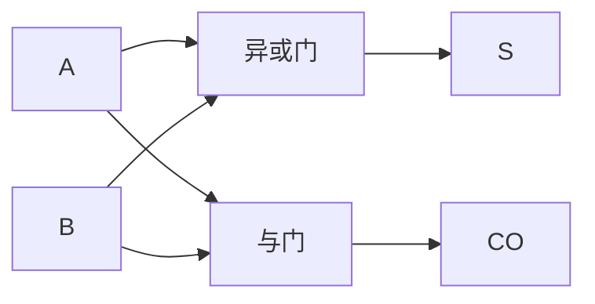
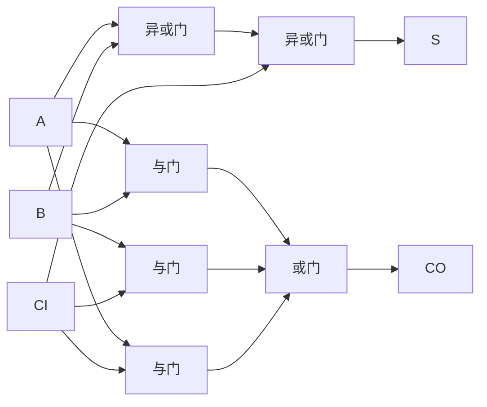
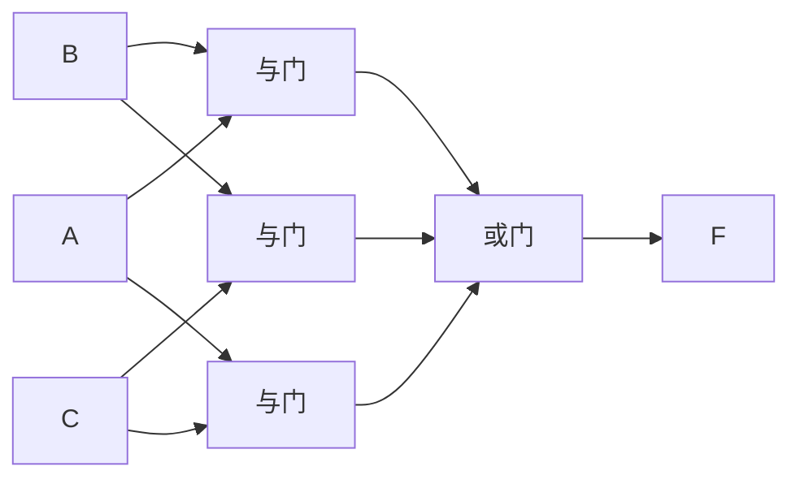

# 3.2 组合电路设计步骤

> [!abstract] 本节概述
> 组合逻辑电路设计回答"**给定功能需求，如何用门电路实现？**"——这是 [[3.1 组合电路分析方法|3.1]] 分析的逆过程。本节建立"逻辑抽象 → 列真值表 → 写表达式 → 化简 → 画逻辑图"的标准五步流程，并以半加器、全加器、三变量表决电路等经典设计为载体演示完整设计过程，最后讨论多输出电路的设计要点。

## 一、设计的一般步骤

> [!tip] 组合电路设计五步法
> 1. **逻辑抽象**：分析设计要求，确定输入变量与输出变量，定义 0/1 的含义；
> 2. **列真值表**：穷举所有输入组合，按功能要求填入输出值（含无关项时标 $\times$）；
> 3. **写表达式**：由真值表写出标准与或式 $F=\sum m(i)$（或根据情况写或与式）；
> 4. **化简**：用 [[1.5 逻辑函数化简（代数法、卡诺图法）|代数法或卡诺图法]] 化为最简形式，并按可用器件要求转换（与非-与非、或非-或非等）；
> 5. **画逻辑图**：用 [[MOC - 第2章|第2章]] 的门电路符号画出最简逻辑图。

> [!warning] 设计与化简中的常见陷阱
> 1. **逻辑抽象错误**：把输入变量数搞错、把 0/1 含义颠倒，导致后续全部错误；
> 2. **真值表遗漏无关项**：实际问题中不可能出现的输入组合应标为无关项 $\times$，参与化简可简化电路；
> 3. **化简目标不明确**：要求用与非门实现时，需将最简与或式两次取反转为与非-与非式；
> 4. **未利用约束条件**：忽略无关项会得到非最简结果。

## 二、经典设计例题

### 例题 1：半加器设计

> [!example] 题目
> 设计一个半加器（Half Adder）：对两个 1 位二进制数 $A, B$ 求和，输出和 $S$ 与进位 $CO$。

**解**：

1. **逻辑抽象**：输入 $A, B$ 为两个 1 位二进制数；输出 $S$ 为本位和、$CO$ 为向高位的进位。
2. **列真值表**：

| $A$ | $B$ | $S$（和） | $CO$（进位） |
| :-: | :-: | :-------: | :----------: |
| 0 | 0 | 0 | 0 |
| 0 | 1 | 1 | 0 |
| 1 | 0 | 1 | 0 |
| 1 | 1 | 0 | 1 |

3. **写表达式**：
   - $S = \bar A B + A \bar B = A \oplus B$
   - $CO = AB$

4. **化简**：$S, CO$ 均已最简。

5. **画逻辑图**：

> [!note] 半加器的局限
> 半加器只考虑两个 1 位相加，**未计入低位来的进位**，因此无法直接级联构成多位加法器。引入低位进位的加法器见 [[3.5 加法器、数值比较器|3.5]] 全加器。

### 例题 2：全加器设计

> [!example] 题目
> 设计一个全加器（Full Adder）：输入两个 1 位二进制数 $A, B$ 与低位来的进位 $CI$，输出本位和 $S$ 与向高位的进位 $CO$。

**解**：

1. **逻辑抽象**：输入 $A, B, CI$；输出 $S, CO$。
2. **列真值表**：

| $A$ | $B$ | $CI$ | $S$ | $CO$ |
| :-: | :-: | :--: | :-: | :--: |
| 0 | 0 | 0 | 0 | 0 |
| 0 | 0 | 1 | 1 | 0 |
| 0 | 1 | 0 | 1 | 0 |
| 0 | 1 | 1 | 0 | 1 |
| 1 | 0 | 0 | 1 | 0 |
| 1 | 0 | 1 | 0 | 1 |
| 1 | 1 | 0 | 0 | 1 |
| 1 | 1 | 1 | 1 | 1 |

3. **写表达式**：
   - $S = \sum m(1,2,4,7) = \bar A \bar B CI + \bar A B \bar{CI} + A \bar B \bar{CI} + ABCI$
   - $CO = \sum m(3,5,6,7) = \bar A BCI + A\bar B CI + AB\bar{CI} + ABCI$

4. **化简**：

   **$S$ 的卡诺图**：

   | $AB\backslash CI$ | 0 | 1 |
   | :-: | :-: | :-: |
   | 00 | 0 | 1 |
   | 01 | 1 | 0 |
   | 11 | 0 | 1 |
   | 10 | 1 | 0 |

   $S$ 的 4 个 1 互不相邻（棋盘格分布），无法合并：
   $$\boxed{S = A \oplus B \oplus CI}$$

   **$CO$ 的卡诺图**：

   | $AB\backslash CI$ | 0 | 1 |
   | :-: | :-: | :-: |
   | 00 | 0 | 0 |
   | 01 | 0 | 1 |
   | 11 | 1 | 1 |
   | 10 | 0 | 1 |

   分组：$m_3, m_7$（$BCI$）、$m_5, m_7$（$ACI$）、$m_6, m_7$（$AB$）：
   $$\boxed{CO = AB + BCI + ACI}$$

5. **画逻辑图**：

> [!tip] 全加器的两种常用形式
> - **双异或结构**：$S = A \oplus B \oplus CI$，$CO = AB + CI(A \oplus B)$，门数少；
> - **两级与或结构**：$CO = AB + BCI + ACI$，延迟低但门数多。
> 详见 [[3.5 加法器、数值比较器|3.5]]。

### 例题 3：三变量表决电路

> [!example] 题目
> 设计三变量表决电路：输入 $A, B, C$，当有两个或两个以上为 1 时输出 $F=1$（多数表决）。

**解**：

1. **逻辑抽象**：输入 $A, B, C$ 表示三个表决者（1=同意、0=反对）；输出 $F$ 表示决议（1=通过）。
2. **列真值表**：

| $A$ | $B$ | $C$ | $F$ |
| :-: | :-: | :-: | :-: |
| 0 | 0 | 0 | 0 |
| 0 | 0 | 1 | 0 |
| 0 | 1 | 0 | 0 |
| 0 | 1 | 1 | 1 |
| 1 | 0 | 0 | 0 |
| 1 | 0 | 1 | 1 |
| 1 | 1 | 0 | 1 |
| 1 | 1 | 1 | 1 |

3. **写表达式**：$F = \sum m(3,5,6,7) = \bar A BC + A\bar B C + AB\bar C + ABC$

4. **化简**（卡诺图）：

   | $AB\backslash C$ | 0 | 1 |
   | :-: | :-: | :-: |
   | 00 | 0 | 0 |
   | 01 | 0 | 1 |
   | 11 | 1 | 1 |
   | 10 | 0 | 1 |

   分组：$m_3, m_7 \to BC$；$m_5, m_7 \to AC$；$m_6, m_7 \to AB$：
   $$\boxed{F = AB + BC + AC}$$

5. **画逻辑图**：

### 例题 4：含无关项的设计

> [!example] 题目
> 设计一个 1 位十进制数（0–9）的"大于 5"判断电路：输入用 8421 BCD 码 $ABCD$ 表示，当数值 $>5$ 时输出 $F=1$。

**解**：

1. **逻辑抽象**：输入 $ABCD$ 为 8421 BCD 码；输出 $F=1$ 表示数值 $>5$。1010–1111（10–15）不会出现，为无关项。
2. **列真值表**（仅列有效项）：

| 数值 | $A$ | $B$ | $C$ | $D$ | $F$ |
| :-: | :-: | :-: | :-: | :-: | :-: |
| 0 | 0 | 0 | 0 | 0 | 0 |
| 1 | 0 | 0 | 0 | 1 | 0 |
| 2 | 0 | 0 | 1 | 0 | 0 |
| 3 | 0 | 0 | 1 | 1 | 0 |
| 4 | 0 | 1 | 0 | 0 | 0 |
| 5 | 0 | 1 | 0 | 1 | 0 |
| 6 | 0 | 1 | 1 | 0 | 1 |
| 7 | 0 | 1 | 1 | 1 | 1 |
| 8 | 1 | 0 | 0 | 0 | 1 |
| 9 | 1 | 0 | 0 | 1 | 1 |
| 10–15 | — | — | — | — | $\times$ |

3. **写表达式**：$F = \sum m(6,7,8,9) + \sum d(10,11,12,13,14,15)$

4. **化简**（卡诺图，把无关项按需取 1）：

   | $AB\backslash CD$ | 00 | 01 | 11 | 10 |
   | :-: | :-: | :-: | :-: | :-: |
   | 00 | 0 | 0 | 0 | 0 |
   | 01 | 0 | 0 | 1 | 1 |
   | 11 | $\times$ | $\times$ | $\times$ | $\times$ |
   | 10 | 1 | 1 | $\times$ | $\times$ |

   利用无关项扩大圈组：$m_8, m_9, m_{12}, m_{13} \to A\bar C$；$m_6, m_7, m_{14}, m_{15} \to BC$：
   $$\boxed{F = A\bar C + BC}$$

   > [!note] 不利用无关项的结果
   > 若不利用无关项，$F = \bar A BC + \bar A BD + A\bar B\bar C$，项数与变量数都更多。

5. **画逻辑图**：（略，按 $A\bar C + BC$ 用两个与门加一个或门实现）

## 三、多输出电路设计要点

> [!tip] 多输出电路设计原则
> 当一个电路有多个输出 $F_1, F_2, \ldots, F_k$ 时，不能每个输出独立化简到最简，而应**追求整体最简**：
> 1. **共享乘积项**：若多个输出含相同乘积项，可共享同一与门输出；
> 2. **共享子函数**：若一个输出可表示为另一输出的子表达式，可复用中间结果；
> 3. **整体卡诺图**：在多个卡诺图上同时观察，优先圈出能被多个输出共用的合并组；
> 4. **牺牲局部换取全局**：某个输出可能不是局部最简，但通过共享使总门数最少。

> [!example] 多输出共享示例
> 设 $F_1 = AB + AC$、$F_2 = AB + BC$。独立看 $F_1, F_2$ 都已最简，共需 4 个与门 + 2 个或门。但二者共享 $AB$ 项，可让一个与门同时驱动两个或门，实际只需 3 个与门 + 2 个或门。

> [!warning] 多输出电路的检验
> 多输出电路设计后必须**逐个输出验证真值表**，确保共享优化没有改变任一输出的功能。

## 四、易错点

> [!warning] 易错点
> 1. **逻辑抽象颠倒 0/1**：例如"灯亮"是 0 还是 1 必须先约定，否则功能相反；
> 2. **真值表漏掉无关项**：BCD 码、互斥输入等问题中，不可能的组合应标 $\times$；
> 3. **化简时不利用无关项**：会得到非最简结果，丢失化简机会；
> 4. **多输出独立化简**：未共享乘积项，导致总门数偏多；
> 5. **未按要求转换形式**：题目要求用与非门实现却给出与或式，需用摩根定律转换；
> 6. **画图时漏画反变量**：反变量输入端必须画非门或显式标 $\bar A$。

## 五、与其他小节的联系

- 设计是 [[3.1 组合电路分析方法|3.1]] 分析的逆过程；
- 化简工具来自 [[1.5 逻辑函数化简（代数法、卡诺图法）|1.5]]；
- 半加器、全加器是 [[3.5 加法器、数值比较器|3.5]] 多位加法器的基础；
- 设计中可能引入冗余项以消除 [[3.6 竞争冒险现象判断与消除|3.6]] 竞争冒险；
- 复杂函数可用 [[3.3 编码器、译码器原理|3.3]] 译码器或 [[3.4 数据选择器、数据分配器|3.4]] 数据选择器替代门级设计。

## 章节导航

- 上一级：[[MOC - 第3章]]
- 上一节：[[3.1 组合电路分析方法]]
- 下一节：[[3.3 编码器、译码器原理]]
- 习题：[[MOC - 第3章习题]]
