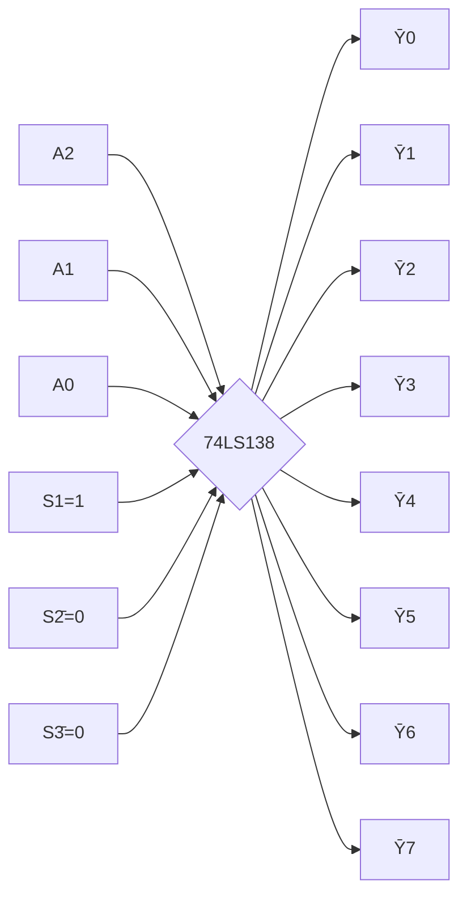
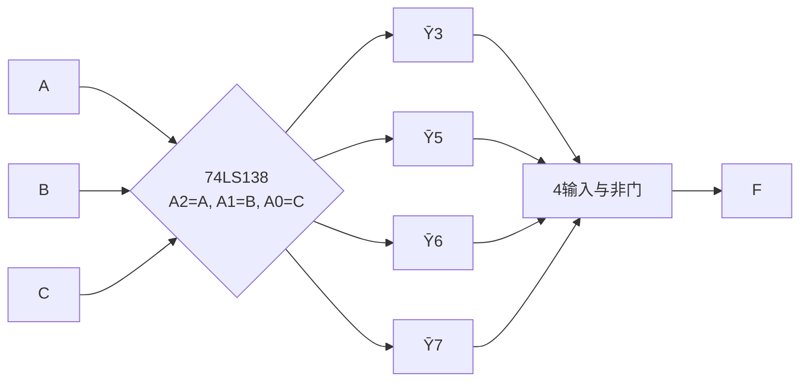

# 3.3 编码器、译码器原理

> [!abstract] 本节概述
> 编码器与译码器是组合逻辑中最常用的**中规模集成（MSI）模块**。编码器把 $2^n$ 个互斥输入压缩为 $n$ 位二进制代码；译码器则相反，把 $n$ 位代码展开为 $2^n$ 个互斥输出。本节介绍普通编码器、优先编码器（74LS148）、二进制译码器（74LS138）、显示译码器（七段数码管）的工作原理，并重点讲解**用译码器实现任意组合逻辑函数**的方法——这是从门级设计走向模块级设计的关键。

## 一、编码器

> [!definition] 编码器（Encoder）
> 编码器是一种将 $2^n$ 个输入信号转换为 $n$ 位二进制代码的器件，又称"二进制编码器"。其特点是任意时刻**仅一个输入有效**，输出为该有效输入对应的二进制编码。

### 1.1 普通编码器

> [!info] 普通编码器的约束
> 8 线-3 线普通编码器有 8 个输入 $I_0\sim I_7$，3 个输出 $Y_2Y_1Y_0$。约束条件：**任意时刻仅一个输入为 1**，否则输出无意义。

8 线-3 线普通编码器真值表（节选）：

| 有效输入 | $Y_2$ | $Y_1$ | $Y_0$ |
| :------: | :-: | :-: | :-: |
| $I_0$ | 0 | 0 | 0 |
| $I_1$ | 0 | 0 | 1 |
| $I_2$ | 0 | 1 | 0 |
| $I_3$ | 0 | 1 | 1 |
| $I_4$ | 1 | 0 | 0 |
| $I_5$ | 1 | 0 | 1 |
| $I_6$ | 1 | 1 | 0 |
| $I_7$ | 1 | 1 | 1 |

> [!warning] 普通编码器的缺陷
> 普通编码器要求输入互斥，但实际应用中可能出现多个输入同时有效（如键盘同时按键），此时输出会混乱。这引出了**优先编码器**。

### 1.2 优先编码器（74LS148）

> [!definition] 优先编码器
> 优先编码器允许同时多个输入有效，但**仅响应优先级最高的那一个**。它给每个输入赋予固定优先级（通常下标越大优先级越高），输出最高优先级有效输入的编码。

**74LS148** 是 8 线-3 线优先编码器，输入/输出均**低电平有效**：

| 端口 | 方向 | 含义 |
| ---- | ---- | ---- |
| $\overline{I_0}\sim\overline{I_7}$ | 输入 | 8 路请求，低有效；$\overline{I_7}$ 优先级最高 |
| $\overline{Y_2},\overline{Y_1},\overline{Y_0}$ | 输出 | 3 位反码输出 |
| $\overline{EI}$（使能输入） | 输入 | 低有效，=1 时编码器禁止工作，输出全 1 |
| $\overline{GS}$（工作标志） | 输出 | 低有效，=0 表示有有效输入且正在编码 |
| $\overline{EO}$（使能输出） | 输出 | 低有效，=0 表示无有效输入，可用于级联低位芯片 |

> [!note] 反码输出
> 74LS148 输出是输入编号的反码。例如 $\overline{I_5}$ 有效时输出 $\overline{Y_2Y_1Y_0}=\overline{101}=010$（即输出 010 是 101 的反码）。读数时需再取反。

> [!tip] 三个使能/标志端的作用
> - $\overline{EI}$：主使能，决定芯片是否工作；
> - $\overline{GS}$：区分"无有效输入"与"编号 0 有效"——两种情况输出都是 000，靠 $\overline{GS}$ 区分（前者 $\overline{GS}=1$，后者 $\overline{GS}=0$）；
> - $\overline{EO}$：级联扩展，高位芯片的 $\overline{EO}$ 接低位芯片的 $\overline{EI}$，构成 16 线-4 线等更大编码器。

### 1.3 优先编码器的级联扩展

> [!example] 用两片 74LS148 构成 16 线-4 线优先编码器
> - 高位片处理 $\overline{I_8}\sim\overline{I_{15}}$，低位片处理 $\overline{I_0}\sim\overline{I_7}$；
> - 高位片的 $\overline{EO}$ 接低位片的 $\overline{EI}$：高位片无有效输入时才允许低位片工作；
> - 输出最高位 $Y_3$ 取高位片的 $\overline{GS}$（高位片工作时 $Y_3=1$）；
> - 低 3 位 $Y_2Y_1Y_0$ 由两片输出通过与门（负逻辑或）合成。

## 二、译码器

> [!definition] 译码器（Decoder）
> 译码器是编码器的逆操作：将 $n$ 位二进制代码翻译为 $2^n$ 个互斥输出信号，每个输出对应一种输入代码。输入每取一组值，仅有对应的一个输出有效。

### 2.1 二进制译码器（74LS138）

**74LS138** 是 3 线-8 线译码器，输出**低电平有效**：

| 端口 | 方向 | 含义 |
| ---- | ---- | ---- |
| $A_2, A_1, A_0$ | 输入 | 3 位二进制地址（高有效） |
| $\overline{Y_0}\sim\overline{Y_7}$ | 输出 | 8 路译码输出，低有效 |
| $S_1$ | 使能 | 高有效 |
| $\overline{S_2}, \overline{S_3}$ | 使能 | 低有效 |

> [!theorem] 74LS138 的输出表达式
> 当使能条件 $S_1\overline{\overline{S_2}}\,\overline{\overline{S_3}}=1\cdot 1\cdot 1=1$ 满足时：
> $$\boxed{\overline{Y_i} = \overline{m_i},\quad i=0,1,\ldots,7}$$
> 其中 $m_i$ 是 $A_2A_1A_0$ 的第 $i$ 个最小项。即每个输出端输出"对应最小项的反"。

74LS138 真值表（使能 $S_1=1, \overline{S_2}=\overline{S_3}=0$）：

| $A_2$ | $A_1$ | $A_0$ | 有效输出 |
| :-: | :-: | :-: | :-------: |
| 0 | 0 | 0 | $\overline{Y_0}=0$ |
| 0 | 0 | 1 | $\overline{Y_1}=0$ |
| 0 | 1 | 0 | $\overline{Y_2}=0$ |
| 0 | 1 | 1 | $\overline{Y_3}=0$ |
| 1 | 0 | 0 | $\overline{Y_4}=0$ |
| 1 | 0 | 1 | $\overline{Y_5}=0$ |
| 1 | 1 | 0 | $\overline{Y_6}=0$ |
| 1 | 1 | 1 | $\overline{Y_7}=0$ |



> [!tip] 使能端的扩展用途
> - **片选级联**：用高位地址线驱动使能端，可将多片 138 扩展为 4 线-16 线、5 线-32 线译码器；
> - **作为数据分配器**：把 $\overline{S_2}, \overline{S_3}$ 接地、$S_1$ 接数据 $D$，则 $D=1$ 时正常译码、$D=0$ 时全 1 输出，相当于把 $D$ 分配到 $A_2A_1A_0$ 指定的输出端（见 [[3.4 数据选择器、数据分配器|3.4]]）。

### 2.2 译码器实现组合逻辑函数

> [!theorem] 译码器实现任意组合函数
> 由于 74LS138 的每个输出 $\overline{Y_i}=\overline{m_i}$，提供全部最小项的反，而任意逻辑函数可表示为 $F=\sum m(i)$，故：
> $$\boxed{F = \overline{\prod_{i\in S}\overline{Y_i}} = \overline{\overline{\bigvee_{i\in S}m_i}} = \bigvee_{i\in S}m_i}$$
> 即把使 $F=1$ 的最小项对应的输出端接到一个**与非门**上，输出即为 $F$。

> [!example] 用 74LS138 实现三变量多数表决
> $F = \sum m(3,5,6,7) = AB+BC+AC$。把 $\overline{Y_3},\overline{Y_5},\overline{Y_6},\overline{Y_7}$ 接到一个 4 输入与非门，输出即 $F$。



> [!note] 译码器实现多输出函数
> 译码器特别适合实现多输出函数：同一片 138 的输出可同时驱动多个与非门，每个与非门对应一个输出。例如用一片 138 同时实现全加器的 $S$ 与 $CO$，比门级设计省器件。

### 2.3 显示译码器（七段数码管）

> [!definition] 七段显示译码器
> 七段数码管用 7 个发光段（$a\sim g$）构成"日"字形显示 0–9（部分可显示 A–F）。显示译码器把 BCD 码翻译为 7 段驱动信号，常用芯片 74LS47（共阳）、74LS48（共阴）。

> [!info] 共阳与共阴
> - **共阳极**：所有段阳极接 $+V$，段输出低电平点亮（需 74LS47，OC 输出）；
> - **共阴极**：所有段阴极接地，段输出高电平点亮（需 74LS48，高电平输出）。

七段数码管段位分布：

```
 aaa
f   b
f   b
 ggg
e   c
e   c
 ddd
```

> [!example] 74LS48 显示译码
> 输入 $DCBA=0101$（十进制 5），输出 $a=b=d=f=g=1$、$c=e=0$，显示"5"。

> [!tip] 显示译码器的辅助输入
> - $\overline{LT}$（灯测试）：=0 时全部段点亮，用于检测数码管好坏；
> - $\overline{RBI}$（灭零输入）：=0 时若输入为 0000 则不显示（消隐高位零）；
> - $\overline{BI}/\overline{RBO}$（消隐输入/灭零输出）：双向复用，强制全灭或级联灭零。

## 三、易错点

> [!warning] 易错点
> 1. **74LS148 输出是反码**：读取时需再取反才是输入编号；
> 2. **74LS138 输出低有效**：用与非门汇总才是高有效输出，用与门会得到反函数；
> 3. **使能端电平混淆**：$S_1$ 高有效、$\overline{S_2},\overline{S_3}$ 低有效，三者必须同时满足才工作；
> 4. **优先编码器优先级方向**：74LS148 是 $\overline{I_7}$ 优先级最高，不要误记为 $\overline{I_0}$；
> 5. **$\overline{GS}$ 与 $\overline{EO}$ 区分**：$\overline{GS}=0$ 表示有编码、$\overline{EO}=0$ 表示无有效输入（且芯片使能）；
> 6. **共阳/共阴用错芯片**：74LS47 配共阳、74LS48 配共阴，配错会反相；
> 7. **译码器实现函数时漏接使能端**：使能端未正确配置时芯片不工作，输出全 1。

## 四、与其他小节的联系

- 编码概念见 [[1.1 数制与编码：二进制、十六进制、BCD 码|1.1]]，编码器是其硬件实现；
- 译码器可作为 [[3.4 数据选择器、数据分配器|3.4]] 数据分配器使用；
- 译码器实现组合函数是 [[3.2 组合电路设计步骤|3.2]] 模块级设计的典型方法；
- 译码器用于 [[MOC - 第7章|第7章]] ROM 的地址译码、存储器寻址；
- 显示译码器是 BCD 码到人机界面的桥梁。

## 章节导航

- 上一级：[[MOC - 第3章]]
- 上一节：[[3.2 组合电路设计步骤]]
- 下一节：[[3.4 数据选择器、数据分配器]]
- 习题：[[MOC - 第3章习题]]
