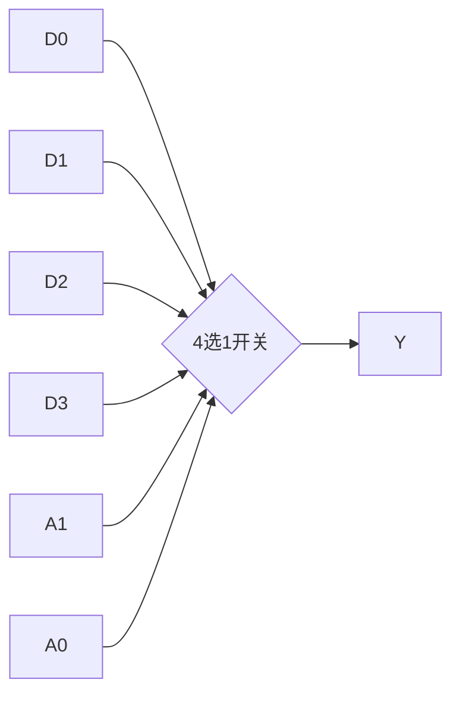
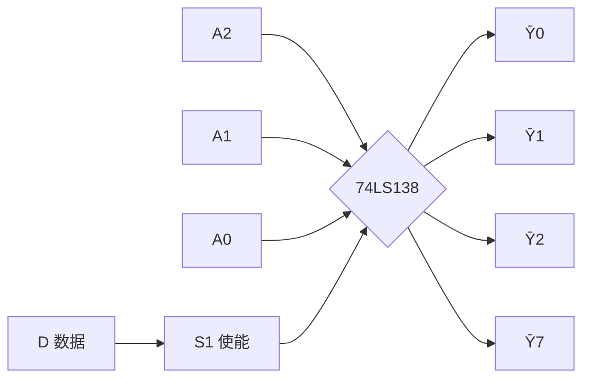
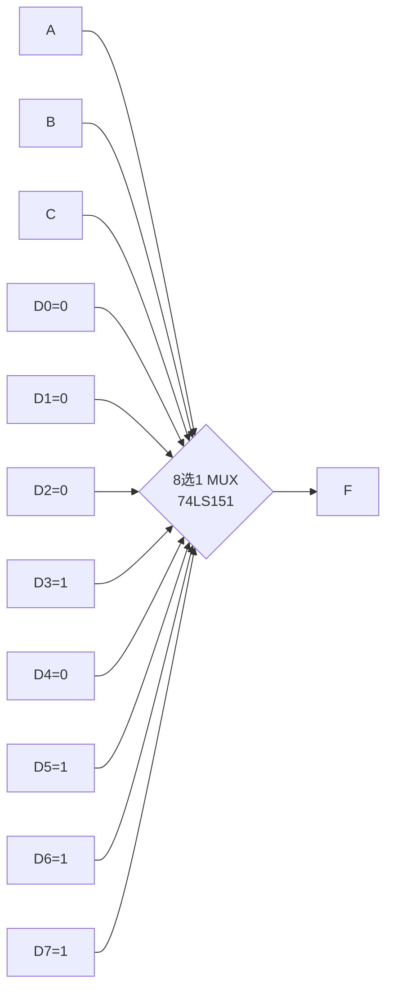
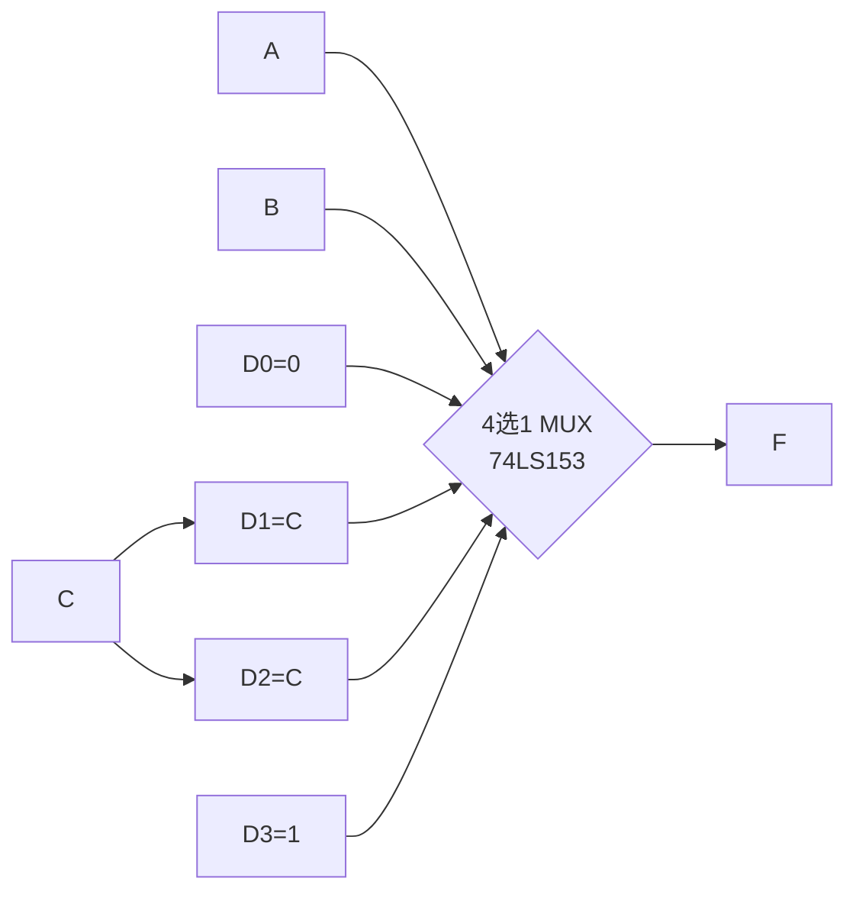

# 3.4 数据选择器、数据分配器

> [!abstract] 本节概述
> 数据选择器（MUX）与数据分配器（DEMUX）是一对互逆的多路开关：MUX 在多个输入中按地址选一个输出，DEMUX 把一个输入按地址送到多路输出之一。本节介绍 4 选 1（74LS153）、8 选 1（74LS151）MUX 的原理，并用 74LS138 译码器实现 DEMUX；重点是**用 MUX 实现任意组合逻辑函数**——这是与 [[3.3 编码器、译码器原理|3.3]] 译码器法并行的模块级设计方法。

## 一、数据选择器（MUX）

> [!definition] 数据选择器（Multiplexer, MUX）
> 数据选择器有 $2^n$ 个数据输入端 $D_0\sim D_{2^n-1}$、$n$ 个地址输入端 $A_{n-1}\sim A_0$、1 个输出端 $Y$。输出由地址决定：
> $$\boxed{Y = \sum_{i=0}^{2^n-1} m_i \cdot D_i}$$
> 其中 $m_i$ 是地址变量的最小项，$D_i$ 是对应数据端。当 $D_i$ 取 0 或 1 时，MUX 相当于选择对应的输入信号输出。

### 1.1 4 选 1 数据选择器（74LS153）

4 选 1 MUX 真值表：

| $A_1$ | $A_0$ | $Y$ |
| :-: | :-: | :-: |
| 0 | 0 | $D_0$ |
| 0 | 1 | $D_1$ |
| 1 | 0 | $D_2$ |
| 1 | 1 | $D_3$ |

输出表达式：
$$Y = \bar A_1 \bar A_0 D_0 + \bar A_1 A_0 D_1 + A_1 \bar A_0 D_2 + A_1 A_0 D_3$$

> [!info] 74LS153 的结构
> 74LS153 是**双 4 选 1 MUX**，内部含两个独立的 4 选 1 选择器，共用地址 $A_1A_0$，各自有独立使能端 $\overline{1G}, \overline{2G}$（低有效）与独立输出 $1Y, 2Y$。

### 1.2 8 选 1 数据选择器（74LS151）

8 选 1 MUX 有 8 个数据端 $D_0\sim D_7$、3 个地址端 $A_2A_1A_0$，输出：
$$Y = \sum_{i=0}^{7} m_i(A_2,A_1,A_0) \cdot D_i$$

74LS151 提供原码 $Y$ 与反码 $\overline{W}$ 双输出，使能端 $\overline{G}$ 低有效。

> [!note] MUX 的级联扩展
> - 用使能端做片选：4 选 1 加 1 个 2 选 1 可扩展为 8 选 1（树形扩展）；
> - 也可以用高位地址直接选片，多片 4 选 1 输出再经 1 个或门合成。

## 二、数据分配器（DEMUX）

> [!definition] 数据分配器（Demultiplexer, DEMUX）
> 数据分配器是 MUX 的逆操作：1 路输入数据按 $n$ 位地址送到 $2^n$ 路输出中的某一路。相当于"单刀多掷"开关。

> [!tip] 用译码器实现 DEMUX
> 通用 DEMUX 芯片较少，**最常用的实现方法是用 [[3.3 编码器、译码器原理|3.3]] 的 74LS138 译码器**：
> - 将数据 $D$ 接到译码器的使能端 $S_1$（或 $\overline{S_2}, \overline{S_3}$）；
> - 地址 $A_2A_1A_0$ 接译码器输入；
> - 当 $D=1$ 时，地址选中的输出端为 0（低有效），其余为 1；
> - 当 $D=0$ 时，所有输出全 1。
>
> 即地址选中的输出端"复制"了 $D$ 的反相（低有效）。这是 138 的"译码/分配"双用途特性。

## 三、用 MUX 实现任意组合逻辑函数

> [!theorem] MUX 实现组合逻辑函数的原理
> MUX 的输出 $Y=\sum m_i D_i$ 本身就是一个"按最小项 $m_i$ 是否取 $D_i$"的与或表达式。若把逻辑变量接到地址端、把数据端按函数真值表取 0/1，则 MUX 直接实现该函数。

### 3.1 $n$ 变量函数用 $2^n$ 选 1 MUX 实现

> [!example] 用 8 选 1 MUX 实现三变量多数表决
> $F = \sum m(3,5,6,7) = AB+BC+AC$。把 $A,B,C$ 接地址 $A_2A_1A_0$，按真值表填数据端：
>
> | $i$ | $ABC$ | $D_i$ |
> | :-: | :-: | :-: |
> | 0 | 000 | 0 |
> | 1 | 001 | 0 |
> | 2 | 010 | 0 |
> | 3 | 011 | 1 |
> | 4 | 100 | 0 |
> | 5 | 101 | 1 |
> | 6 | 110 | 1 |
> | 7 | 111 | 1 |
>
> 即 $D_3=D_5=D_6=D_7=1$，其余为 0。

### 3.2 $n$ 变量函数用 $2^{n-1}$ 选 1 MUX 实现（降维法）

> [!tip] 降维法（节省一半 MUX 容量）
> $n$ 变量函数可用 $2^{n-1}$ 选 1 MUX 实现：把 $n-1$ 个变量接地址端，第 $n$ 个变量（或其反）接到数据端。数据端取值由真值表分组决定：
> - 若对某地址，函数在剩余变量=0 和=1 时**均为 0**，则 $D=0$；
> - 若**均为 1**，则 $D=1$；
> - 若**0 时为 0、1 时为 1**，则 $D=$ 该变量；
> - 若**0 时为 1、1 时为 0**，则 $D=$ 该变量的反。

> [!example] 用 4 选 1 MUX 实现三变量多数表决
> $F=AB+BC+AC$。把 $A,B$ 接地址 $A_1A_0$，$C$ 接数据端。按 $C$ 取值分组：

| $A$ | $B$ | $C=0$ 时 $F$ | $C=1$ 时 $F$ | $D_i$ |
| :-: | :-: | :----------: | :----------: | :---: |
| 0 | 0 | 0 | 0 | 0 |
| 0 | 1 | 0 | 1 | $C$ |
| 1 | 0 | 0 | 1 | $C$ |
| 1 | 1 | 1 | 1 | 1 |

> 即 $D_0=0, D_1=C, D_2=C, D_3=1$。

> [!note] 降维法的优势
> 用 4 选 1 实现三变量函数比用 8 选 1 节省一半容量，代价是数据端需接入变量（而非纯 0/1）。一般地，$n$ 变量函数可用 $2^{n-k}$ 选 1 MUX 实现，代价是数据端需接入 $k$ 变量的函数。

## 四、MUX 法与译码器法对比

> [!summary] 两种模块级设计方法对比
> | 维度 | 译码器法（[[3.3 编码器、译码器原理\|3.3]]） | MUX 法（本节） |
> | ---- | ------------------------------------------- | -------------- |
> | 实现思路 | 输出最小项的反，用与非门汇总 | 直接按真值表填数据端 |
> | 单输出 | 1 片 138 + 1 个与非门 | 1 片 8 选 1 MUX |
> | 多输出 | 共享 138，每路 1 个与非门（**优势**） | 每路需独立 MUX |
> | 反函数 | 圈 0 用与门汇总 | 数据端按反函数填值 |
> | 易错点 | 与非门/与门易混 | 数据端填值易错 |
> | 适用场景 | 多输出函数、最小项集中 | 单输出函数、变量较少 |

## 五、易错点

> [!warning] 易错点
> 1. **MUX 地址端与变量对应错误**：地址 $A_2A_1A_0$ 必须与变量 $A,B,C$ 一一对应，对应错位会得到错误函数；
> 2. **数据端填值方向颠倒**：真值表行号 $i$ 对应 $D_i$，若把变量顺序写反（如 $CBA$ 而非 $ABC$）会填错；
> 3. **降维法分组错误**：必须按"剩余变量"的取值分组判断 $D_i$ 是 0、1、变量还是反变量；
> 4. **DEMUX 用错使能端**：用 138 做 DEMUX 时数据应接使能端而非地址端；
> 5. **忽略使能端**：MUX 的 $\overline{G}$、138 的 $S_1\overline{S_2}\overline{S_3}$ 必须正确配置；
> 6. **多输出 MUX 浪费**：多输出场景下 MUX 法比译码器法多用芯片，应优先选译码器法。

## 六、与其他小节的联系

- DEMUX 用 [[3.3 编码器、译码器原理|3.3]] 译码器实现，是 138 的双用途；
- MUX 法与 [[3.3 编码器、译码器原理|3.3]] 译码器法是 [[3.2 组合电路设计步骤|3.2]] 模块级设计的两大方法；
- MUX 用于 [[MOC - 第7章|第7章]] ROM 的位线选择、[[MOC - 第8章|第8章]] PLD 的互连资源；
- 降维法是后续 FPGA 查找表（LUT）的思想基础。

## 章节导航

- 上一级：[[MOC - 第3章]]
- 上一节：[[3.3 编码器、译码器原理]]
- 下一节：[[3.5 加法器、数值比较器]]
- 习题：[[MOC - 第3章习题]]
