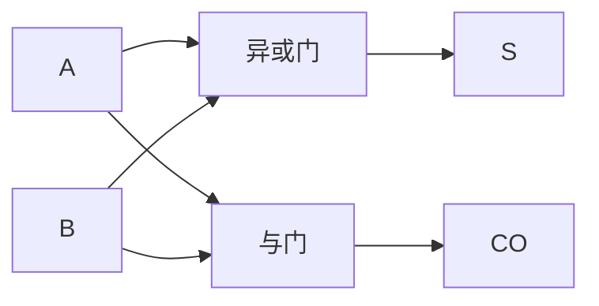
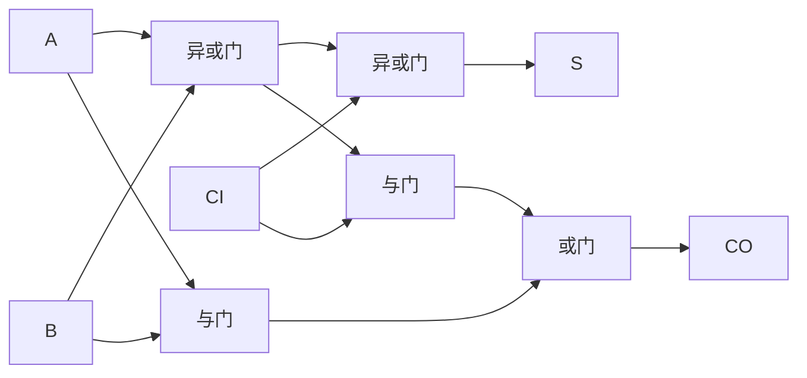
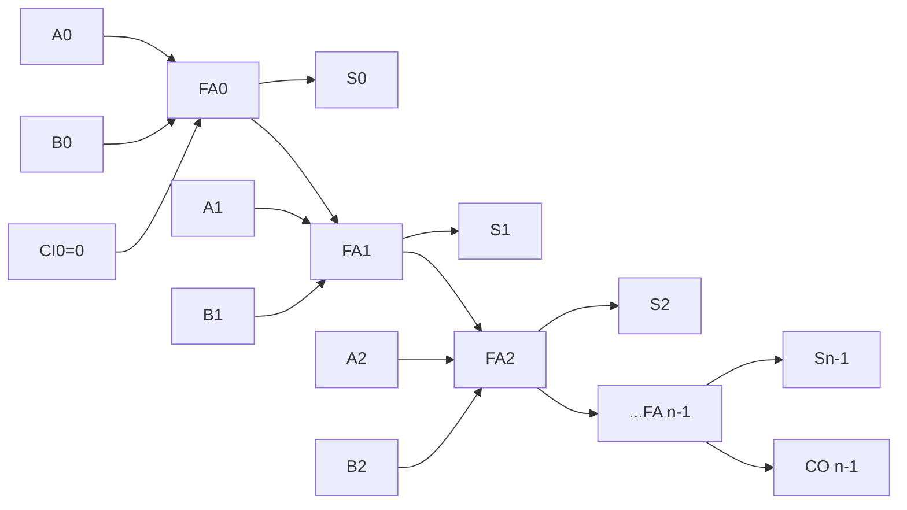
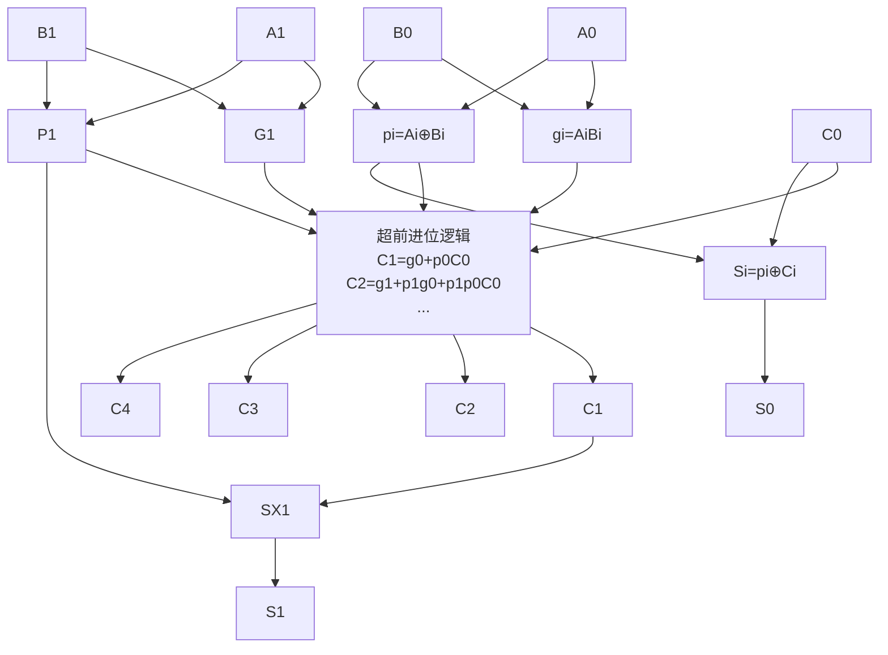

# 3.5 加法器、数值比较器

> [!abstract] 本节概述
> 加法器与数值比较器是数字系统中两类**专用功能模块**：加法器实现二进制加法运算（是算术逻辑单元 ALU 的核心），数值比较器实现两个二进制数的大小判断。本节从 [[3.2 组合电路设计步骤|3.2]] 设计的半加器、全加器出发，重点讨论多位加法器的两种进位结构（串行进位 vs 超前进位），并介绍 1 位与 4 位数值比较器（74LS85）的原理与级联扩展。

## 一、半加器

> [!definition] 半加器（Half Adder, HA）
> 实现**两个 1 位二进制数** $A, B$ 相加，不考虑低位进位。输出本位和 $S$ 与向高位的进位 $CO$。

| $A$ | $B$ | $S$（和） | $CO$（进位） |
| :-: | :-: | :-------: | :----------: |
| 0 | 0 | 0 | 0 |
| 0 | 1 | 1 | 0 |
| 1 | 0 | 1 | 0 |
| 1 | 1 | 0 | 1 |

逻辑表达式：
$$\boxed{S = A \oplus B,\quad CO = AB}$$

> [!note] 半加器的局限
> 半加器无法处理低位来的进位 $CI$，故不能直接级联构成多位加法器。需要全加器。

## 二、全加器

> [!definition] 全加器（Full Adder, FA）
> 实现**两个 1 位二进制数 $A, B$ 与低位进位 $CI$** 的求和。输出本位和 $S$ 与向高位的进位 $CO$。

| $A$ | $B$ | $CI$ | $S$ | $CO$ |
| :-: | :-: | :--: | :-: | :--: |
| 0 | 0 | 0 | 0 | 0 |
| 0 | 0 | 1 | 1 | 0 |
| 0 | 1 | 0 | 1 | 0 |
| 0 | 1 | 1 | 0 | 1 |
| 1 | 0 | 0 | 1 | 0 |
| 1 | 0 | 1 | 0 | 1 |
| 1 | 1 | 0 | 0 | 1 |
| 1 | 1 | 1 | 1 | 1 |

逻辑表达式（详见 [[3.2 组合电路设计步骤|3.2]] 例题 2）：
$$\boxed{S = A \oplus B \oplus CI}$$
$$\boxed{CO = AB + BCI + ACI = AB + (A \oplus B)CI}$$

> [!tip] 全加器的两种进位表达式
> - 形式一 $CO = AB + BCI + ACI$：三输入多数表决形式，**延迟低**（仅 2 级门）但需 3 个与门；
> - 形式二 $CO = AB + (A \oplus B)CI$：复用 $A\oplus B$（即 $S$ 的中间结果），**门数少**但延迟多 1 级。
> 实际芯片常综合权衡。74LS283 内部用超前进位结构。

## 三、多位加法器

### 3.1 串行进位加法器（Ripple-Carry Adder）

> [!definition] 串行进位加法器
> 把 $n$ 个全加器级联：第 $i$ 位的进位输出 $CO_i$ 接第 $i+1$ 位的进位输入 $CI_{i+1}$，最低位 $CI_0=0$。进位信号从低位向高位**逐级传递**，又称行波进位加法器。

> [!warning] 串行进位的延迟问题
> 串行进位加法器总延迟 $\approx n \cdot t_{FA}$（$t_{FA}$ 为单级全加器进位延迟）。4 位加法器约 4 级延迟，32 位则 32 级，**严重制约高速运算**。这促使了超前进位结构的诞生。

### 3.2 超前进位加法器（Carry-Lookahead Adder, CLA）

> [!theorem] 超前进位的核心思想
> 定义每位两个中间量：
> - **进位生成** $g_i = A_i B_i$：该位自身产生进位；
> - **进位传递** $p_i = A_i \oplus B_i$（也可用 $A_i + B_i$）：该位将低位进位传向高位。
>
> 则进位递推：
> $$\boxed{C_{i+1} = g_i + p_i C_i}$$
> 递推展开：
> $$C_1 = g_0 + p_0 C_0$$
> $$C_2 = g_1 + p_1 C_1 = g_1 + p_1 g_0 + p_1 p_0 C_0$$
> $$C_3 = g_2 + p_2 g_1 + p_2 p_1 g_0 + p_2 p_1 p_0 C_0$$
> $$\vdots$$
> 每个 $C_i$ 都直接由 $C_0$ 与 $g, p$ 计算，**仅需 2 级门延迟**（生成 $g,p$ 一级、求 $C_i$ 一级），与位数无关。

> [!example] 4 位超前进位加法器（74LS283）
> 74LS283 是 4 位超前进位加法器，内部按上述递推式直接生成 $C_1, C_2, C_3, C_4$，4 位和 $S_i = p_i \oplus C_i$。总延迟约 2–3 级门，远快于串行进位的 4 级。

> [!note] 超前进位的代价
> 超前进位以**增加硬件**为代价换取速度：每位的进位表达式项数随位数线性增长，输入端数指数增长。超过 4 位时通常采用**分级超前进位**（4 位一组组内超前、组间行波或再超前），兼顾速度与硬件复杂度。

### 3.3 加法器的典型应用

> [!tip] 用加法器实现减法
> 利用补码：$A - B = A + (\overline{B} + 1)$。把 $B$ 各位取反后接到加法器输入，最低位进位 $C_0=1$，输出即 $A-B$ 的补码。

> [!tip] BCD 加法修正
> 两个 8421 BCD 码相加后，若和 $>9$（1001）或有进位产生，需加 6（0110）修正，使结果仍为 BCD 码。详见 [[1.1 数制与编码：二进制、十六进制、BCD 码|1.1]] BCD 码。

## 四、数值比较器

> [!definition] 数值比较器（Comparator）
> 比较两个二进制数大小的组合电路，输出三种结果：大于（$>$）、等于（$=$）、小于（$<$）。

### 4.1 1 位数值比较器

比较两个 1 位数 $A, B$：

| $A$ | $B$ | $Y_{A>B}$ | $Y_{A=B}$ | $Y_{A<B}$ |
| :-: | :-: | :-------: | :-------: | :-------: |
| 0 | 0 | 0 | 1 | 0 |
| 0 | 1 | 0 | 0 | 1 |
| 1 | 0 | 1 | 0 | 0 |
| 1 | 1 | 0 | 1 | 0 |

逻辑表达式：
$$Y_{A>B} = A\bar B,\quad Y_{A=B} = \overline{A\oplus B} = A\odot B,\quad Y_{A<B} = \bar A B$$

### 4.2 4 位数值比较器（74LS85）

> [!theorem] 多位比较的从高位到低位原则
> 比较两个多位数 $A_{n-1}\ldots A_0$ 与 $B_{n-1}\ldots B_0$ 时，**从最高位开始比较**：
> - 若 $A_{n-1} > B_{n-1}$，则 $A > B$；
> - 若 $A_{n-1} < B_{n-1}$，则 $A < B$；
> - 若 $A_{n-1} = B_{n-1}$，则比较次高位，依此类推；
> - 若所有位都相等，则 $A = B$。

> [!info] 74LS85 的功能
> 74LS85 是 4 位数值比较器，输入 $A_3\sim A_0$、$B_3\sim B_0$，输出 $Y_{A>B}, Y_{A=B}, Y_{A<B}$。为支持级联扩展，提供 3 个级联输入 $I_{A>B}, I_{A=B}, I_{A<B}$，用于接收低位片的比较结果。

74LS85 输出逻辑（化简后）：
$$Y_{A=B} = (A_3=B_3)(A_2=B_2)(A_1=B_1)(A_0=B_0) \cdot I_{A=B}$$
$$Y_{A>B} = (\text{高位决定}) + (\text{全相等}) \cdot I_{A>B}$$
$$Y_{A<B} = (\text{高位决定}) + (\text{全相等}) \cdot I_{A<B}$$

> [!tip] 74LS85 级联扩展
> - **串联扩展**：低位片的输出 $Y_{A>B}, Y_{A=B}, Y_{A<B}$ 接到高位片的级联输入 $I_{A>B}, I_{A=B}, I_{A<B}$。最低位片的级联输入置 $I_{A=B}=1, I_{A>B}=0, I_{A<B}=0$（表示"相等"）。延迟随位数线性增长。
> - **并联扩展**：用一片 74LS85 比较"组号"，再用若干片比较组内数据，延迟为对数级，适合位数较多场合。

> [!example] 用两片 74LS85 构成 8 位数值比较器
> 低位片比较 $A_3\sim A_0$ 与 $B_3\sim B_0$，级联输入置 $I_{A=B}=1, I_{A>B}=I_{A<B}=0$；其输出接高位片的级联输入；高位片比较 $A_7\sim A_4$ 与 $B_7\sim B_4$，输出即为 8 位比较结果。

## 五、易错点

> [!warning] 易错点
> 1. **半加器与全加器混淆**：半加器无进位输入，全加器有 $CI$；
> 2. **$S$ 的表达式**：全加器和 $S = A\oplus B\oplus CI$ 是 3 个变量的异或，不是 $A\oplus(B+CI)$；
> 3. **$CO$ 表达式不唯一**：$CO = AB + BCI + ACI = AB + (A\oplus B)CI$，两种形式等价但电路不同；
> 4. **串行进位延迟估算**：$n$ 位串行加法器约 $n$ 级全加器延迟，不是 1 级；
> 5. **超前进位硬件爆炸**：完全超前的 8 位加法器进位表达式项数过多，工程上常用分级超前进位；
> 6. **减法补码漏加 1**：$A - B = A + \overline{B} + 1$，最低位进位 $C_0$ 必须置 1；
> 7. **BCD 加法漏修正**：和 $>9$ 或产生进位时必须加 6 修正，否则结果不是 BCD 码；
> 8. **比较器级联输入初值**：最低位片 $I_{A=B}$ 必须置 1，否则即使两数相等也输出 0；
> 9. **比较方向**：74LS85 是 $A$ 与 $B$ 比较，把 $A,B$ 接反会得到相反结果。

## 六、与其他小节的联系

- 半加器、全加器设计见 [[3.2 组合电路设计步骤|3.2]]；
- 加法器是 [[MOC - 第5章|第5章]] 计数器、ALU 的基础；
- 比较器用于控制电路的条件判断；
- BCD 修正与 [[1.1 数制与编码：二进制、十六进制、BCD 码|1.1]] BCD 码关联；
- 多位加法器/比较器可看作 [[3.1 组合电路分析方法|3.1]] 分析方法的层次化应用。

## 章节导航

- 上一级：[[MOC - 第3章]]
- 上一节：[[3.4 数据选择器、数据分配器]]
- 下一节：[[3.6 竞争冒险现象判断与消除]]
- 习题：[[MOC - 第3章习题]]
