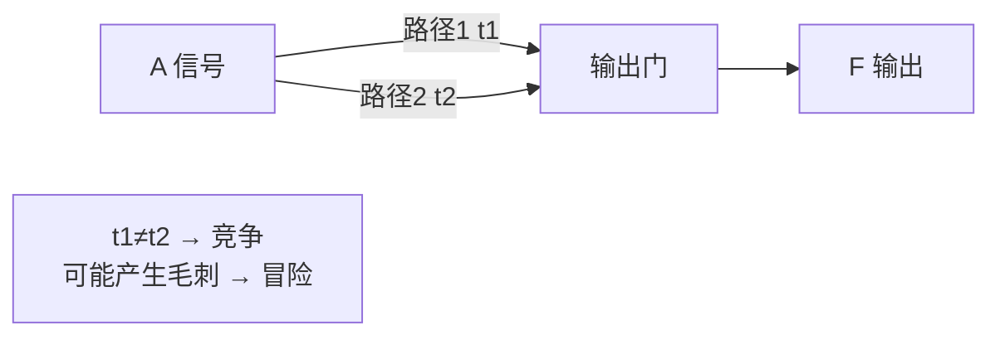
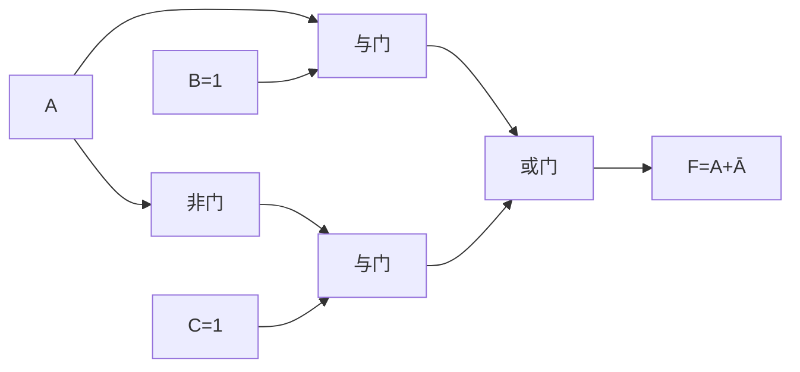
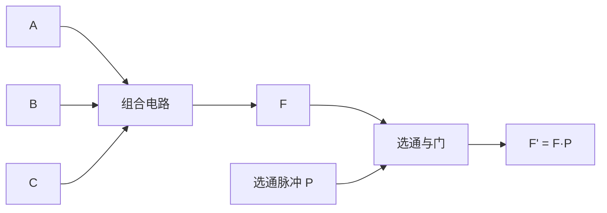

# 3.6 竞争冒险现象判断与消除

> [!abstract] 本节概述
> 前面各节讨论组合电路时默认门电路是**理想**的——零延迟、瞬时切换。实际门电路存在传输延迟，且不同路径的延迟不等。当输入信号经不同路径到达输出端时，因**到达时刻有先后**导致的"竞争"现象，可能使输出短暂偏离稳态值，产生不该出现的尖峰脉冲（毛刺），称为**冒险**。本节介绍竞争冒险的成因、代数法与卡诺图法的判断，以及引入冗余项、滤波电容、选通脉冲三种消除方法，并与 [[1.1 数制与编码：二进制、十六进制、BCD 码|1.1]] 格雷码建立联系。

## 一、竞争与冒险的概念

> [!definition] 竞争（Race）
> 输入信号经过**不同路径**到达同一门电路的输入端时，由于路径上门级数不同、传输延迟不等，信号到达时刻有先后，这种现象称为"竞争"。

> [!definition] 冒险（Hazard）
> 由于竞争导致电路输出出现**短暂的非期望尖峰脉冲**（毛刺），称为冒险（又称毛刺、glitch）。竞争是原因，冒险是结果——**有竞争不一定有冒险，有冒险一定有竞争**。

> [!info] 冒险的分类
> | 类型 | 特征 |
> | ---- | ---- |
> | **静态 1 冒险** | 稳态应为 1，但短暂跳到 0（负尖峰） |
> | **静态 0 冒险** | 稳态应为 0，但短暂跳到 1（正尖峰） |
> | **动态冒险** | 稳态由 0→1 或 1→0 切换过程中出现多次跳变 |
>
> 本节主要讨论静态冒险。

## 二、产生原因

> [!theorem] 冒险的根本原因
> 信号通过门电路需要时间（[[MOC - 第2章|第2章]] 传输延迟 $t_{pd}$）。当一个变量经两条不同延迟路径到达输出端时，会出现"原变量与反变量在输出端不同时变化"的现象。例如 $A$ 与 $\bar A$ 本应同时切换，但 $\bar A$ 由非门产生而滞后，二者在某个窗口内同时为 0 或同时为 1，使输出 $F=A+\bar A$ 短暂变 0、$F=A\bar A$ 短暂变 1。

> [!example] 典型冒险电路
> 考虑 $F = AB + \bar A C$：当 $B=C=1$ 时，$F = A + \bar A = 1$（稳态应为 1）。但 $A$ 由 1→0 时，$\bar A$ 由 0→1 由于非门延迟**滞后**，存在短暂窗口 $A=0, \bar A=0$，此时 $F = 0\cdot 1 + 0\cdot 1 = 0$，输出出现负尖峰（静态 1 冒险）。

## 三、判断方法

### 3.1 代数法

> [!tip] 代数法判断静态冒险
> 若函数表达式在某种输入组合下可化简为 $F = A + \bar A$ 的形式，则当 $A$ 切换时可能产生**静态 1 冒险**；
> 若化简为 $F = A \cdot \bar A$ 的形式，则可能产生**静态 0 冒险**。
>
> 具体步骤：
> 1. 令其他变量取某组固定值，使 $F$ 仅含 $A$ 与 $\bar A$；
> 2. 检查 $F$ 是否能写成 $A + \bar A$ 或 $A\bar A$；
> 3. 若能，则在该输入组合下 $A$ 切换时存在冒险。

> [!example] 代数法判断
> $F = AB + \bar A C$：
> - 令 $B=C=1$：$F = A + \bar A$，存在静态 1 冒险（$A$ 切换时）；
> - 令 $B=1, C=0$：$F = A$，无冒险；
> - 令 $B=0, C=1$：$F = \bar A$，无冒险；
> - 令 $B=C=0$：$F = 0$，无冒险。
>
> 故仅当 $B=C=1$ 且 $A$ 切换时存在冒险。

### 3.2 卡诺图法

> [!tip] 卡诺图法判断静态冒险
> 在化简后的卡诺图上，若两个**相切但不相交**的合并圈之间存在"桥接"最小项未被任何圈覆盖，则当变量从一个圈切换到另一个圈时存在冒险。
>
> 更直观的判据：**若卡诺图中两个相邻的最小项未被同一个合并圈覆盖**（即分属两个相切的圈），则该切换路径存在冒险。

> [!example] 卡诺图法判断
> $F = AB + \bar A C$ 的卡诺图：

| $A\backslash BC$ | 00 | 01 | 11 | 10 |
| :-: | :-: | :-: | :-: | :-: |
| 0 | 0 | 1 | 1 | 0 |
| 1 | 0 | 0 | 1 | 1 |

> - $m_5$（$A=1, BC=01$）属于圈 $AB$（覆盖 $m_6, m_7$）的相邻项 $m_7$；
> - $m_7$（$A=1, BC=11$）与 $m_3$（$A=0, BC=11$）相邻但分属两个圈；
> - 当 $A$ 切换、$BC=11$ 时，从 $m_7$ 跳到 $m_3$（或反之），两圈未通过 $m_3$ 与 $m_7$ 的共同覆盖连接，存在冒险。

## 四、消除方法

### 4.1 引入冗余项（增加乘积项）

> [!theorem] 冗余项消除冒险
> 在卡诺图上为"相切"的合并圈增加一个**桥接圈**（覆盖两圈相邻的最小项），即增加一个冗余乘积项。该冗余项在稳态下不改变函数值，但在切换瞬间保持输出稳定，消除冒险。

> [!example] 用冗余项消除 $F = AB + \bar A C$ 的冒险
> 冒险发生在 $B=C=1$、$A$ 切换时。增加冗余项 $BC$（覆盖 $m_3, m_7$）：
> $$\boxed{F = AB + \bar A C + BC}$$
> 当 $B=C=1$ 时，$F = A + \bar A + 1 = 1$ 恒成立，消除了静态 1 冒险。
>
> 这个 $BC$ 项正是 [[1.5 逻辑函数化简（代数法、卡诺图法）|1.5]] 冗余定理 $AB+\bar A C+BC=AB+\bar A C$ 中的"冗余项"——化简时被消去，但消除冒险时需保留。

> [!note] 冗余项的代价
> 增加冗余项使电路多一个与门和一个或门输入端，**牺牲硬件简化换取无冒险**。这是化简与可靠性的权衡。

### 4.2 加滤波电容

> [!tip] 滤波电容消除冒险
> 冒险产生的毛刺是**极窄的尖峰脉冲**（宽度仅几纳秒，约等于门延迟）。在输出端并联一个几十皮法的小电容到地，可吸收毛刺。电容与下一级输入电阻构成低通滤波器，过滤高频毛刺。

> [!warning] 滤波电容的局限
> 1. **降低工作速度**：电容充放电使信号边沿变缓，限制最高工作频率；
> 2. **不适用于高速电路**：高速系统中信号本身沿也窄，电容会畸变正常信号；
> 3. **仅适合低速、对毛刺不敏感场景**。现代数字电路较少使用。

### 4.3 引入选通脉冲

> [!tip] 选通脉冲消除冒险
> 在电路输出端加一个**选通门**（通常是与门），由选通脉冲 $P$ 控制。仅在信号稳定后让 $P$ 有效、读出结果；在信号切换期间 $P$ 无效，封锁输出。
>
> 例如：$F' = F \cdot P$，当 $P=0$ 时 $F'=0$（封锁），当 $P=1$ 时 $F'=F$（读取稳态值）。选通脉冲的时序安排在所有切换完成后才跳到 1。

> [!note] 选通脉冲的应用
> 选通脉冲本质是**同步化设计**思想——把异步的竞争问题转为时序约束。这是后续 [[MOC - 第5章|第5章]] 时序逻辑电路用时钟同步解决组合冒险的雏形。

## 五、与格雷码的联系

> [!info] 格雷码从源头避免冒险
> 冒险的根源是"信号多路同时变化"。若能保证输入信号**每次只有一个变量变化**，则可避免绝大多数竞争。[[1.1 数制与编码：二进制、十六进制、BCD 码|1.1]] 格雷码正是为此设计——相邻两个码字仅 1 位不同。

> [!example] 旋转编码器用格雷码消除读数冒险
> 若用自然二进制码，从 $0111$（7）到 $1000$（8）4 位同时翻转，任一位延迟不同都会产生中间错误码。改用格雷码后相邻位置仅 1 位翻转，从源头消除了多位同时变化引起的冒险。

> [!warning] 格雷码不能消除所有冒险
> 格雷码只消除"输入多位同时变化"引起的冒险，**单变量经不同路径到达输出端**引起的冒险（如 $F = A + \bar A$）仍需冗余项等方法消除。

## 六、易错点

> [!warning] 易错点
> 1. **竞争与冒险混淆**：竞争是原因、冒险是结果，有竞争不一定有冒险；
> 2. **静态 1 与静态 0 冒险判断颠倒**：$F=A+\bar A$ 是静态 1 冒险（稳态 1 短暂变 0），$F=A\bar A$ 是静态 0 冒险（稳态 0 短暂变 1）；
> 3. **代数法漏检输入组合**：必须对每组其他变量取值逐一检查，不能只看一组；
> 4. **冗余项加错**：必须加在"相切"两圈的桥接位置，且确保是真正的冗余项（不改变稳态真值表）；
> 5. **滤波电容滥用**：高速电路中会畸变信号，仅适合低速场合；
> 6. **选通脉冲时序错误**：脉冲有效时刻必须晚于所有信号稳定，否则仍会读到毛刺；
> 7. **认为化简越彻底越好**：消除冒险时需保留冗余项，与化简目标冲突，应按需权衡；
> 8. **动态冒险忽略**：动态冒险在多级电路中可能出现，需用更复杂方法分析。

## 七、与其他小节的联系

- 冒险的根源是 [[MOC - 第2章|第2章]] 门电路传输延迟；
- 代数法与卡诺图法依赖 [[1.5 逻辑函数化简（代数法、卡诺图法）|1.5]] 化简工具；
- 冗余项来自 [[1.5 逻辑函数化简（代数法、卡诺图法）|1.5]] 冗余定理；
- 格雷码见 [[1.1 数制与编码：二进制、十六进制、BCD 码|1.1]]，是源头预防冒险的编码手段；
- 选通脉冲是 [[MOC - 第5章|第5章]] 时序电路同步设计的雏形；
- [[3.1 组合电路分析方法|3.1]] 分析实际电路时需考虑冒险对功能的影响。

## 章节导航

- 上一级：[[MOC - 第3章]]
- 上一节：[[3.5 加法器、数值比较器]]
- 习题：[[MOC - 第3章习题]]
