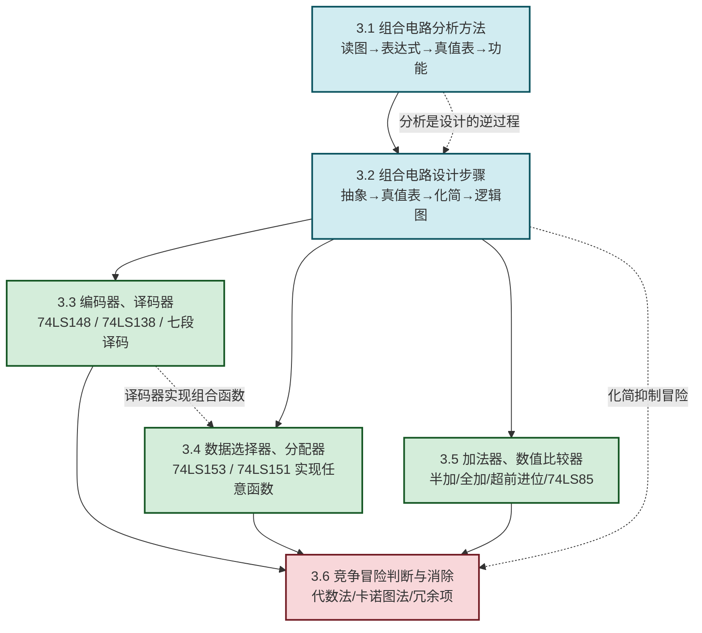

# MOC - 第3章 组合逻辑电路

> [!info] 本章定位
> 组合逻辑电路是数字电路的**核心应用章**。本章要回答的核心问题是：**给定一个由门电路构成的逻辑电路，如何判断它实现什么功能？反过来，给定一个逻辑功能需求，如何用最少的门电路实现它？如何用中规模集成芯片（译码器、数据选择器、加法器）灵活构建任意组合逻辑函数？** 本章是把 [[MOC - 第1章|第1章]] 逻辑代数与 [[MOC - 第2章|第2章]] 门电路落地为实际电路的桥梁，也是后续 [[MOC - 第5章|第5章 时序逻辑电路]] 的组合部分基础（时序电路 = 组合电路 + 触发器）。

## 学习路线图

## 知识点导航

| 小节 | 标题 | 核心内容 | 典型芯片 |
| ---- | ---- | -------- | -------- |
| [[3.1 组合电路分析方法\|3.1]] | 组合电路分析方法 | 逐级写表达式→化简→列真值表→功能说明 | 通用门电路 |
| [[3.2 组合电路设计步骤\|3.2]] | 组合电路设计步骤 | 逻辑抽象→真值表→表达式→化简→画逻辑图 | 半加器、全加器、表决电路 |
| [[3.3 编码器、译码器原理\|3.3]] | 编码器、译码器 | 普通编码器、优先编码器、二进制译码器、显示译码器；译码器实现组合函数 | 74LS148、74LS138、74LS47/48 |
| [[3.4 数据选择器、数据分配器\|3.4]] | 数据选择器、分配器 | MUX/DEMUX 原理、MUX 实现任意组合逻辑函数 | 74LS153、74LS151、74LS138 |
| [[3.5 加法器、数值比较器\|3.5]] | 加法器、数值比较器 | 半加器、全加器、串行/超前进位、4 位数值比较器 | 74LS283、74LS85 |
| [[3.6 竞争冒险现象判断与消除\|3.6]] | 竞争冒险 | 竞争与冒险概念、代数法/卡诺图法判断、冗余项/滤波/选通消除 | — |

## 核心考点

> [!summary] 本章核心考点（8 点）
> 1. **组合电路特点**：无记忆、输出仅由当前输入决定、无反馈环路，是分析与设计的前提；
> 2. **分析四步法**：逐级写表达式 → 化简 → 列真值表 → 说明功能，关键是正确处理多级门的优先级；
> 3. **设计五步法**：逻辑抽象（确定输入/输出）→ 列真值表 → 写表达式 → 化简 → 画逻辑图，难点在逻辑抽象；
> 4. **优先编码器 74LS148**：8 线-3 线优先编码，$\overline{EI}$ 使能、$\overline{GS}$ 工作标志、$\overline{EO}$ 级联扩展，输入输出低电平有效；
> 5. **译码器 74LS138**：3 线-8 线译码，$S_1$ 高有效、$\overline{S_2},\overline{S_3}$ 低有效；每个输出 $\overline{Y_i}=\overline{m_i}$，故可实现任意 $F=\sum m(i)$ 的组合函数；
> 6. **数据选择器实现函数**：$n$ 选 1 MUX 可实现 $n$ 变量以下任意函数；8 选 1 MUX（74LS151）可直接实现 3 变量函数，4 变量函数需将最高位接到数据端；
> 7. **超前进位加法器**：通过 $C_i=g_i+p_i C_{i-1}$ 递推提前生成所有进位，避免串行进位的逐级延迟，是高速加法器核心思想；
> 8. **竞争冒险判断与消除**：代数法判断 $F=A+\bar A$（静态 1 冒险）或 $F=A\cdot\bar A$（静态 0 冒险）；卡诺图法检查"相切但不相交"的合并圈；消除靠增加冗余项、加滤波电容或选通脉冲。

## 本章核心思想

> [!abstract] 组合逻辑的两大主线
> 1. **分析与设计的对偶**：分析是"从电路到功能"（已知逻辑图求功能），设计是"从功能到电路"（已知功能求逻辑图）。两者共用真值表、表达式、化简三大工具，只是方向相反。
>
> 2. **通用模块替代门级设计**：用译码器（输出为最小项）、数据选择器（带地址的多路开关）这类中规模芯片实现任意组合函数，比用单一门电路搭建更简洁、更可靠。这是从"门级设计"到"模块级设计"的关键跃迁，也是 [[MOC - 第7章|第7章]] ROM 实现组合逻辑、[[MOC - 第8章|第8章]] PLD 的思想雏形。

## 与其他章节的衔接

- **先修**：[[MOC - 第1章|第1章]] 提供化简工具（卡诺图）、[[MOC - 第2章|第2章]] 提供门电路实现；
- **后续**：[[MOC - 第4章|第4章 触发器]] 引入记忆元件后，组合 + 触发器 = [[MOC - 第5章|第5章 时序逻辑电路]]；
- **应用**：[[MOC - 第7章|第7章]] 用 ROM（本质是译码器 + 存储阵列）实现组合逻辑、[[MOC - 第8章|第8章]] 用 PLD 可编程实现组合逻辑；
- **跨节关联**：[[1.1 数制与编码：二进制、十六进制、BCD 码|1.1]] 格雷码与 [[3.6 竞争冒险现象判断与消除|3.6]] 竞争冒险在编码层面关联。

## 章节导航

> [!nav] 导航
> 上级：[[MOC - 数字逻辑电路|课程总览]]
> 上一章：[[MOC - 第2章|第2章 逻辑门电路]]
> 下一章：[[MOC - 第4章|第4章 触发器]]
> 配套习题：[[MOC - 第3章习题|第3章 习题]]
