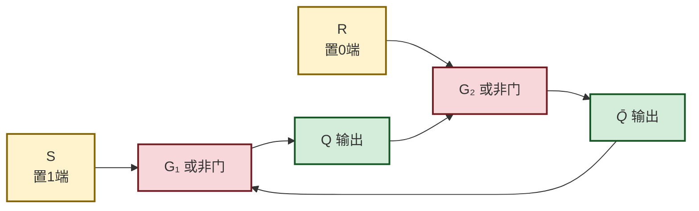
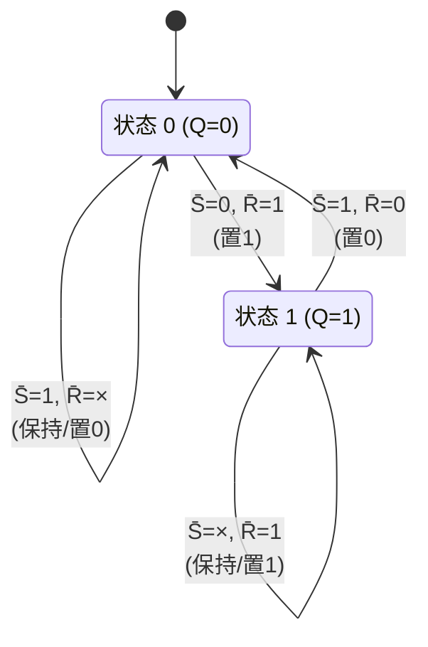

# 4.1 基本 RS 触发器

> [!abstract] 本节概述
> [[MOC - 第3章|第3章]] 的组合逻辑电路没有记忆能力，输出仅取决于当前输入。要构建时序电路，必须引入能**保存二值状态**的存储元件。基本 RS 触发器（Set-Reset Flip-Flop）是**结构最简单的触发器**，由两个门电路交叉耦合形成正反馈，只要输入不变，输出状态就能稳定保持。它是 [[4.2 同步 RS、D 触发器|同步 RS/D 触发器]]、[[4.3 JK 触发器、T 触发器|JK/T 触发器]] 等一切触发器的结构基础，也是 [[MOC - 第5章|第5章]] 时序逻辑电路存储单元的雏形。

## 一、电路结构

基本 RS 触发器有两种常见实现：**与非门结构**（输入低电平有效）和**或非门结构**（输入高电平有效）。两者的逻辑功能对称，差别仅在有效电平。

### 1.1 与非门构成（输入低电平有效）

> [!definition] 与非门基本 RS 触发器
> 两个与非门 $G_1$、$G_2$ 交叉耦合：$G_1$ 的输出 $Q$ 反馈到 $G_2$ 的一个输入端，$G_2$ 的输出 $\bar{Q}$ 反馈到 $G_1$ 的一个输入端。外部输入 $\bar{S}$（置位端，Set）和 $\bar{R}$（复位端，Reset）分别送入 $G_1$、$G_2$ 的另一输入端。

```mermaid
flowchart LR
    SD["<i>S̄</i><br/>置1端"] --> G1["G₁ 与非门"]
    nQ["<i>Q̄</i>"] --> G1
    G1 --> Q["Q 输出"]
    RD["<i>R̄</i><br/>置0端"] --> G2["G₂ 与非门"]
    Q --> G2
    G2 --> nQ["<i>Q̄</i> 输出"]

    classDef gate fill:#d1ecf1,stroke:#0c5460,stroke-width:2px
    classDef signal fill:#fff3cd,stroke:#856404,stroke-width:2px
    classDef out fill:#d4edda,stroke:#155724,stroke-width:2px
    class G1,G2 gate
    class SD,RD,signal
    class Q,nQ out
```

> [!note] 信号约定
> - $Q$ 与 $\bar{Q}$ 互为反相，正常工作时 $Q$ 和 $\bar{Q}$ 不能同时为 1；
> - 输入端带非号（$\bar{S}$、$\bar{R}$）表示**低电平有效**：$\bar{S}=0$ 触发置 1，$\bar{R}=0$ 触发置 0；
> - $Q^n$ 表示现态（现态），$Q^{n+1}$ 表示次态（输入作用后的新状态）。

### 1.2 或非门构成（输入高电平有效）

> [!definition] 或非门基本 RS 触发器
> 两个或非门交叉耦合，外部输入 $S$（置位端）和 $R$（复位端）为**高电平有效**：$S=1$ 置 1，$R=1$ 置 0。



## 二、工作原理（以与非门结构为例）

> [!tip] 分析口诀
> 与非门结构看"0不看1"：只要 $\bar{S}$ 或 $\bar{R}$ 有一个为 0，对应输出被强制置 1；两个输入都为 1 时保持原态；两个都为 0 时两个输出同时为 1，违反互补关系，属禁止状态。

四种工作情况：

| $\bar{S}$ | $\bar{R}$ | $Q^{n+1}$ | 功能说明 |
| :--------: | :--------: | :--------: | :------- |
| 0 | 0 | ×（禁止） | $Q=\bar{Q}=1$，违反互补，撤销时次态不确定 |
| 0 | 1 | 1 | **置 1**（Set）：$\bar{S}=0$ 使 $G_1$ 输出 $Q=1$ |
| 1 | 0 | 0 | **置 0**（Reset）：$\bar{R}=0$ 使 $G_2$ 输出 $\bar{Q}=1$，从而 $Q=0$ |
| 1 | 1 | $Q^n$ | **保持**（Hold）：两与非门都被 1 封锁，正反馈维持原态 |

> [!warning] 禁止状态
> 当 $\bar{S}=\bar{R}=0$ 时，$Q=\bar{Q}=1$，违反了"$Q$ 与 $\bar{Q}$ 互补"的约定。更严重的是：当 $\bar{S}$、$\bar{R}$ 同时从 0 撤回 1 时，两个门的输入全为 1，由于门延迟的微小差异，最终停在 0 还是 1 **无法预测**。因此 $\bar{S}=\bar{R}=0$ 必须禁止。

## 三、特性表与特性方程

### 3.1 完整特性表

> [!definition] 基本 RS 触发器特性表（与非门版）
>
> | $\bar{S}$ | $\bar{R}$ | $Q^n$ | $Q^{n+1}$ | 功能 |
> | :--------: | :--------: | :----: | :--------: | :--- |
> | 0 | 0 | 0 | × | 禁止 |
> | 0 | 0 | 1 | × | 禁止 |
> | 0 | 1 | 0 | 1 | 置 1 |
> | 0 | 1 | 1 | 1 | 置 1 |
> | 1 | 0 | 0 | 0 | 置 0 |
> | 1 | 0 | 1 | 0 | 置 0 |
> | 1 | 1 | 0 | 0 | 保持 |
> | 1 | 1 | 1 | 1 | 保持 |

### 3.2 特性方程

> [!theorem] 与非门基本 RS 触发器特性方程
> 由特性表化简（将 $\bar{S}=\bar{R}=0$ 作为约束项处理）：
> $$\boxed{Q^{n+1} = \bar{S} + \bar{R}\,Q^n}$$
> **约束条件**：$RS = 0$（即 $\bar{S}$、$\bar{R}$ 不能同时为 0，保证不进入禁止状态）。

> [!note] 或非门版本的特性方程
> 或非门结构输入 $S$、$R$ 高电平有效，特性方程为：
> $$Q^{n+1} = S + \bar{R}\,Q^n, \quad \text{约束 } SR=0$$
> 与与非门版本相比，仅是把 $\bar{S}$、$\bar{R}$ 换成 $S$、$R$，形式完全对称。

### 3.3 激励表

> [!definition] 激励表（由现态与次态反推输入）
>
> | $Q^n \to Q^{n+1}$ | $\bar{S}$ | $\bar{R}$ |
> | :----------------: | :--------: | :--------: |
> | 0 → 0 | 1 | 0 或 1 |
> | 0 → 1 | 0 | 1 |
> | 1 → 0 | 1 | 0 |
> | 1 → 1 | 0 或 1 | 1 |

## 四、状态转换图



> [!info] 状态转换图读法
> 圆圈表示触发器的两个稳定状态；箭头表示状态转移方向；箭头上的标注是实现该转移所需的输入条件。$\times$ 表示该输入可 0 可 1（任意项）。

## 五、典型应用

### 5.1 开关消抖电路

> [!example] 机械按键消抖
> 机械开关闭合时触点会弹跳，产生数十毫秒的抖动脉冲。若直接接到数字电路输入端，会被误判为多次按键。利用基本 RS 触发器的"保持"功能可消除抖动：
>
> - 单刀双掷开关的常闭触点接 $\bar{R}$（接低），常开触点接 $\bar{S}$（接低）；
> - 开关未动作时 $\bar{S}=1,\bar{R}=0$，$Q=0$；
> - 开关扳向 $\bar{S}$ 侧瞬间 $\bar{S}=0$，$Q$ 置 1，此后触点抖动使 $\bar{S}$ 在 0、1 间跳变，但因 $\bar{R}=1$，触发器**保持** 1 不变；
> - 从而 $Q$ 只产生一次干净的状态跳变。

### 5.2 寄存一位二进制数据

> [!example] 单比特存储
> 基本 RS 触发器有保持功能，可作为最简单的 1 位数据锁存器：先用 $\bar{S}$ 置 1 或 $\bar{R}$ 置 0 写入数据，再令 $\bar{S}=\bar{R}=1$，数据即可长期保存。多个基本 RS 触发器并列即可组成 [[MOC - 第5章|第5章]] 中的寄存器。

## 六、易错点

> [!warning] 常见错误
> 1. **有效电平混淆**：与非门结构输入低有效，或非门结构输入高有效，画图和列特性表时务必分清；
> 2. **禁止状态的危害**：不仅 $\bar{S}=\bar{R}=0$ 时输出非法，更危险的是撤销时次态**不可预测**，电路中必须从逻辑上保证不出现该组合；
> 3. **约束 $RS=0$ 的含义**：$R$、$S$ 指**有效信号**（与非门版本中 $R=\overline{\bar{R}}$、$S=\overline{\bar{S}}$），约束是"置 0 与置 1 不能同时有效"；
> 4. **无时钟控制**：基本 RS 触发器**直接响应输入**，输入端的任何变化都会立刻改变输出，因此不能直接用于同步时序系统，需引入 [[4.2 同步 RS、D 触发器|时钟控制]]。

## 七、与其他小节的联系

- 与非门/或非门原理见 [[2.2 TTL 与非门、或非门原理]]（如有）；
- 基本 RS 触发器加时钟控制得到 [[4.2 同步 RS、D 触发器|4.2 同步 RS、D 触发器]]；
- 为消除禁止状态演化为 [[4.3 JK 触发器、T 触发器|4.3 JK 触发器]]；
- 是 [[MOC - 第5章|第5章]] 寄存器、计数器的基本存储单元。

## 章节导航

- 上一级：[[MOC - 第4章]]
- 下一节：[[4.2 同步 RS、D 触发器]]
- 习题：[[MOC - 第4章习题]]
