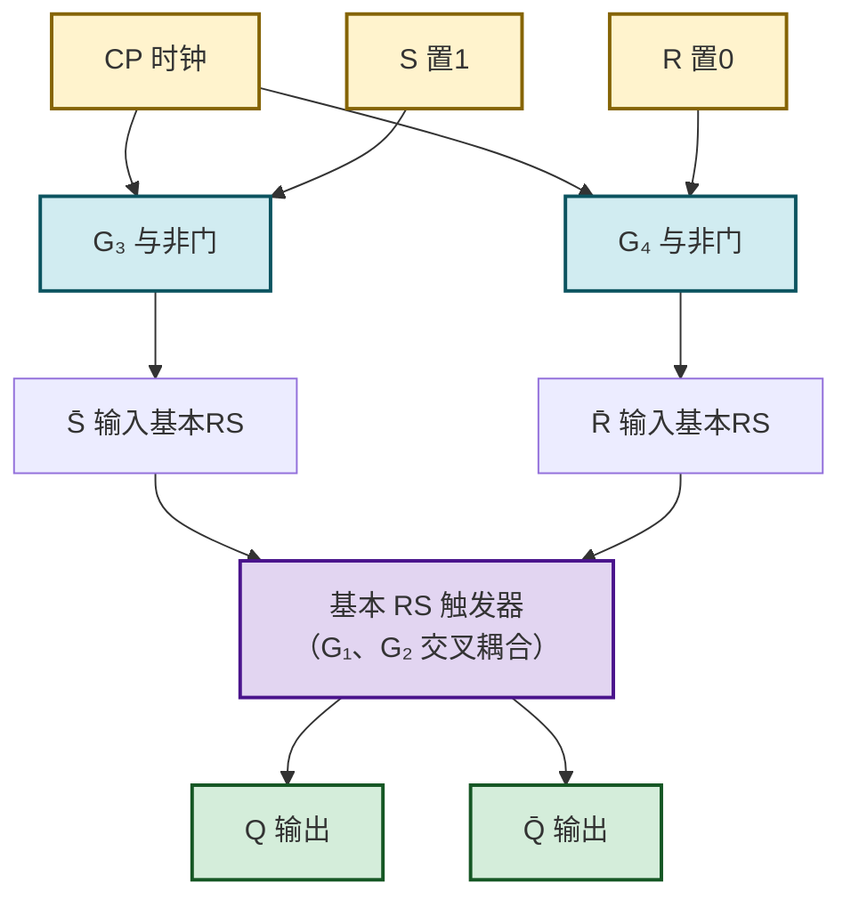
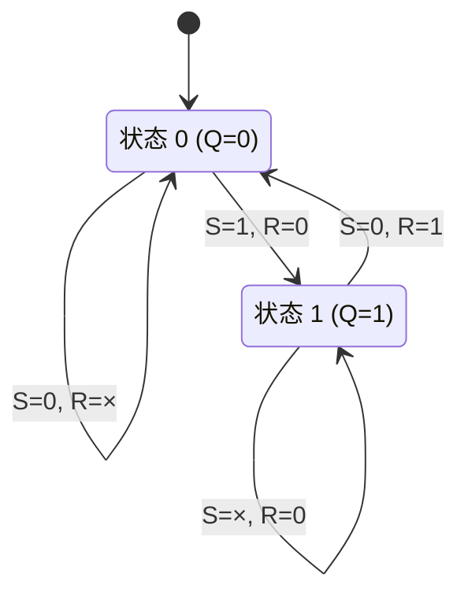
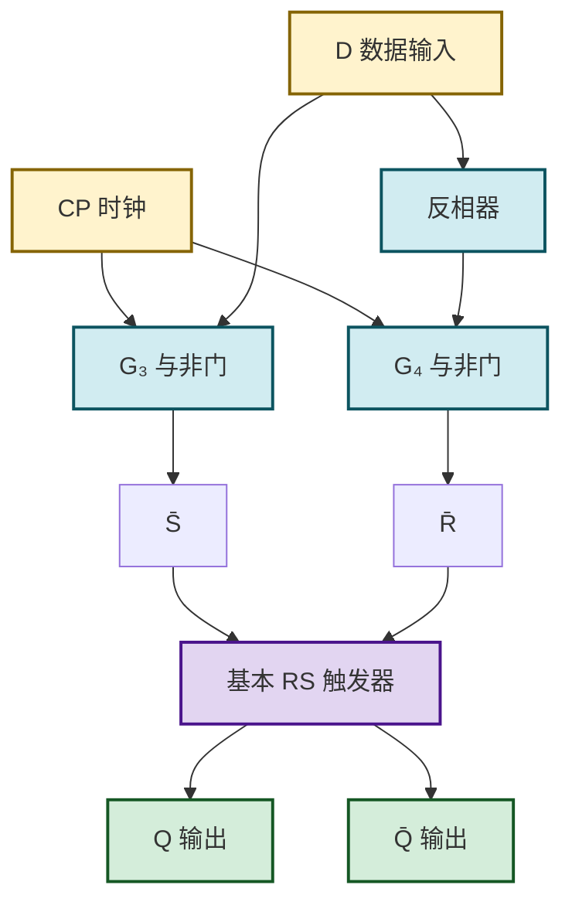

# 4.2 同步 RS、D 触发器

> [!abstract] 本节概述
> [[4.1 基本 RS 触发器|基本 RS 触发器]] 只要输入变化就立即响应，无法与系统中其他元件协同工作。实际数字系统由**时钟脉冲** $CP$（Clock Pulse）统一调度，要求触发器只在时钟有效期间才根据输入改变状态。本节在基本 RS 触发器前加一级输入控制门，得到**同步 RS 触发器**；再通过将输入端交叉反馈消除禁止状态，得到**同步 D 触发器（D 锁存器）**。两者都属**电平触发**，存在"空翻"问题，这一缺陷将推动 [[4.4 边沿触发器特性|4.4 边沿触发器]] 的引入。

## 一、同步 RS 触发器

### 1.1 电路结构

> [!definition] 同步 RS 触发器
> 在 [[4.1 基本 RS 触发器|基本 RS 触发器]] 的两个输入端之前各加一个**控制与非门** $G_3$、$G_4$，由时钟脉冲 $CP$ 统一选通：$CP=0$ 时控制门被封锁，触发器保持；$CP=1$ 时控制门打开，输入 $S$、$R$ 经反相后送入基本 RS 触发器。

> [!note] 工作要点
> - $CP=0$：$G_3$、$G_4$ 输出恒为 1，相当于基本 RS 触发器输入 $\bar{S}=\bar{R}=1$，状态**保持**；
> - $CP=1$：$G_3=\overline{S}$、$G_4=\overline{R}$，相当于把 $S$、$R$ 反相后送入基本 RS 触发器，触发器按 $S$、$R$ **直接更新**；
> - $S$、$R$ 为**高电平有效**（因控制门多做了一次反相）。

### 1.2 特性表

> [!definition] 同步 RS 触发器特性表（$CP=1$ 期间有效）
>
> | $CP$ | $S$ | $R$ | $Q^{n+1}$ | 功能 |
> | :--: | :-: | :-: | :-------: | :--- |
> | 0 | × | × | $Q^n$ | 保持（时钟封锁） |
> | 1 | 0 | 0 | $Q^n$ | 保持 |
> | 1 | 0 | 1 | 0 | 置 0 |
> | 1 | 1 | 0 | 1 | 置 1 |
> | 1 | 1 | 1 | × | 禁止 |

### 1.3 特性方程

> [!theorem] 同步 RS 触发器特性方程
> 当 $CP=1$ 时：
> $$\boxed{Q^{n+1} = S + \bar{R}\,Q^n}$$
> **约束条件**：$SR=0$（$S$、$R$ 不能同时为 1）。
> 当 $CP=0$ 时：$Q^{n+1}=Q^n$。

### 1.4 状态转换图

## 二、空翻现象

> [!warning] 空翻（Racing-around）
> 同步 RS 触发器在 $CP=1$ 的**整个期间**都对输入敏感。若 $CP=1$ 持续时间内 $S$、$R$ 发生多次变化，触发器输出也会随之多次翻转，这种在同一个时钟周期内状态发生多次改变的现象称为**空翻**。
>
> 空翻使触发器无法稳定记录"时钟到来时刻"的输入值，在 [[MOC - 第5章|第5章]] 移位寄存器、计数器中会导致功能错乱，必须用 [[4.4 边沿触发器特性|边沿触发]] 或主从结构克服。

> [!example] 空翻示例
> 某同步 RS 触发器 $CP=1$ 期间输入序列为 $SR=10\to 01\to 10$，则 $Q$ 会经历 $1\to 0\to 1$ 三次变化，而非只记录 $CP$ 上升沿时刻的值。

## 三、同步 D 触发器（D 锁存器）

### 3.1 电路结构

> [!definition] 同步 D 触发器（D 锁存器，D Latch）
> 将同步 RS 触发器的 $S$ 端接输入 $D$，$R$ 端接 $\bar{D}$（即 $S=D$、$R=\bar{D}$），使 $S$ 与 $R$ 永远互补，从结构上消除 $S=R=1$ 的禁止状态。这样只有一个数据输入端 $D$（Data）。

### 3.2 特性表

> [!definition] D 锁存器特性表
>
> | $CP$ | $D$ | $Q^{n+1}$ | 功能 |
> | :--: | :-: | :-------: | :--- |
> | 0 | × | $Q^n$ | 锁存（保持） |
> | 1 | 0 | 0 | 跟随 $D$（置 0） |
> | 1 | 1 | 1 | 跟随 $D$（置 1） |

### 3.3 特性方程

> [!theorem] D 锁存器特性方程
> 当 $CP=1$ 时：
> $$\boxed{Q^{n+1} = D}$$
> 当 $CP=0$ 时：$Q^{n+1}=Q^n$（锁存上一时刻的 $D$）。
> 由于 $S=D$、$R=\bar{D}$，$SR=D\bar{D}\equiv 0$，约束条件自动满足，**无禁止状态**。

### 3.4 工作特点

> [!tip] D 锁存器的"透明"特性
> - $CP=1$ 期间，输出 $Q$ **跟随**输入 $D$ 变化，称为**透明**（Transparent）状态；
> - $CP$ 下降为 0 时，将此刻的 $D$ 值**锁存**，此后 $D$ 的变化不再影响 $Q$；
> - 适合用作数据暂存、总线收发，但因 $CP=1$ 期间仍对输入敏感，**同样存在空翻问题**，不能直接用于移位寄存器。

## 四、电平触发时序图

> [!example] 同步 D 触发器时序分析
> 设初态 $Q=0$，$CP$ 与 $D$ 波形如下：
>
> | 时刻 | $CP$ | $D$ | $Q$ | 说明 |
> | :--: | :--: | :-: | :-: | :--- |
> | $t_0$ | 0 | 1 | 0 | $CP=0$ 锁存，保持 0 |
> | $t_1$ | 1 | 1 | 1 | $CP=1$ 透明，$Q$ 跟随 $D$ 为 1 |
> | $t_2$ | 1 | 0 | 0 | $CP=1$ 透明，$Q$ 跟随 $D$ 为 0 |
> | $t_3$ | 0 | 0 | 0 | $CP$ 下降沿锁存 0 |
> | $t_4$ | 0 | 1 | 0 | $CP=0$，$D$ 变化不影响 $Q$ |
> | $t_5$ | 1 | 1 | 1 | $CP=1$ 透明，$Q$ 跟随 $D$ 为 1 |
>
> 关键：$CP=1$ 期间 $Q$ 完全跟随 $D$；$CP=0$ 期间 $Q$ 锁存不变。

## 五、两种触发方式对比

> [!info] 电平触发 vs 边沿触发
>
> | 触发方式 | 响应时刻 | 抗干扰 | 典型器件 |
> | :------: | :------- | :----: | :------- |
> | 电平触发（高/低） | $CP$ 有效电平的**整段期间** | 差（空翻） | 同步 RS、D 锁存器 |
> | 边沿触发（上升/下降沿） | $CP$ 跳变**瞬间** | 好 | [[4.4 边沿触发器特性\|4.4 边沿 D/JK 触发器]] |

电平触发的空翻问题正是 [[4.4 边沿触发器特性|4.4]] 引入边沿触发的直接动机。

## 六、易错点

> [!warning] 常见错误
> 1. **混淆 $S$、$R$ 有效电平**：同步 RS 触发器的 $S$、$R$ 为高有效（与基本 RS 触发器与非门版的低有效相反），因为时钟控制门多做了一次反相；
> 2. **忽略 $CP=0$ 期间保持**：写特性方程时必须注明"仅 $CP=1$ 时成立"，$CP=0$ 时始终 $Q^{n+1}=Q^n$；
> 3. **D 锁存器不是边沿触发**：$CP=1$ 全程透明，并非只在上升沿采样，故仍有空翻；
> 4. **约束条件仍存在**：同步 RS 触发器仍有 $SR=0$ 约束，D 锁存器通过结构消除了约束，而非"碰巧不违反"。

## 七、与其他小节的联系

- 在 [[4.1 基本 RS 触发器|4.1]] 基础上加时钟控制，是向同步时序系统迈出的第一步；
- 空翻问题推动 [[4.4 边沿触发器特性|4.4]] 主从结构和边沿触发的引入；
- D 锁存器是 [[MOC - 第5章|第5章]] 数据寄存器、总线收发器的基本单元；
- 与非门、反相器原理见 [[2.2 TTL 与非门、或非门原理]]（如有）。

## 章节导航

- 上一级：[[MOC - 第4章]]
- 上一节：[[4.1 基本 RS 触发器]]
- 下一节：[[4.3 JK 触发器、T 触发器]]
- 习题：[[MOC - 第4章习题]]
