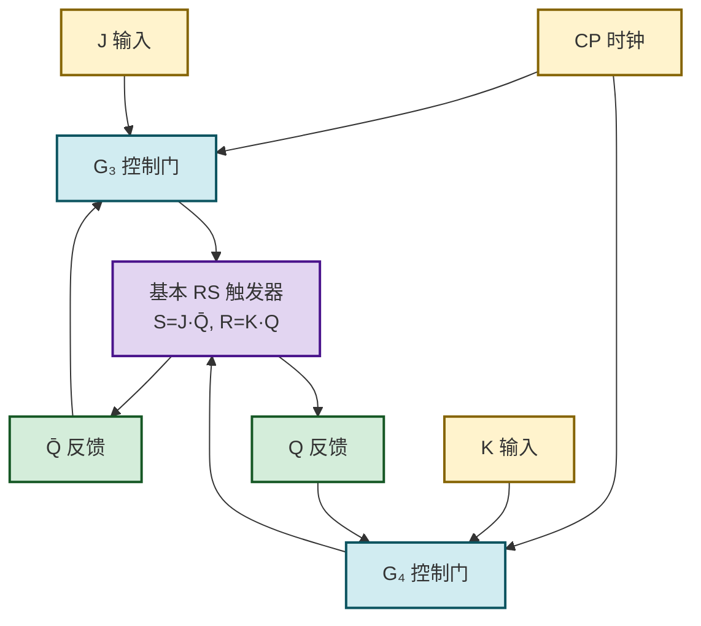
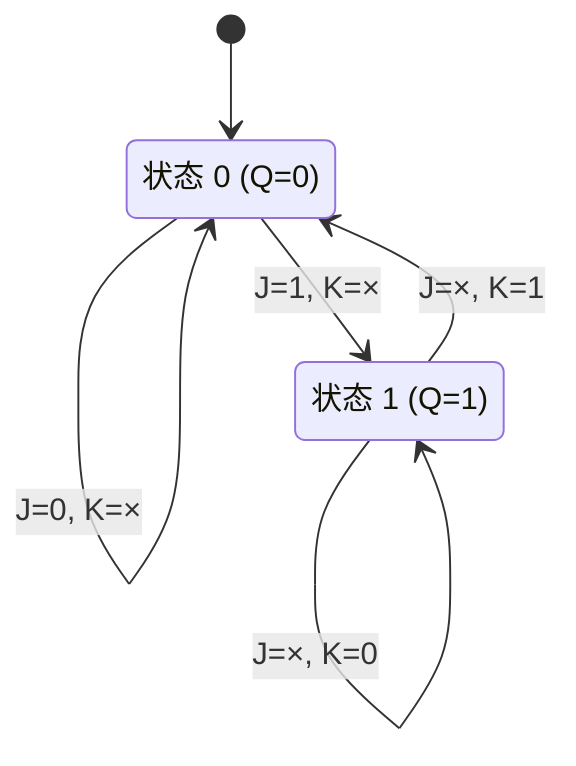
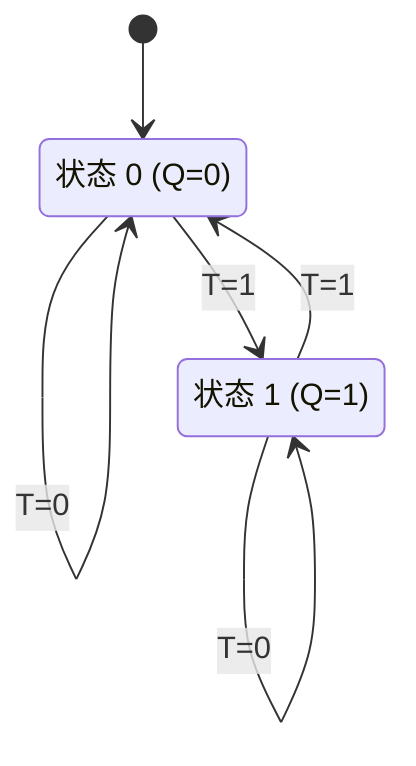
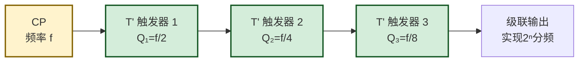

# 4.3 JK 触发器、T 触发器

> [!abstract] 本节概述
> [[4.1 基本 RS 触发器|基本 RS]] 和 [[4.2 同步 RS、D 触发器|同步 RS]] 触发器都存在禁止状态（$S=R=1$），使用时必须人为避免，既不方便也容易出错。**JK 触发器**通过将输出反馈到输入控制门，使 $J=K=1$ 时不再禁止，而是**翻转**，从而成为功能最全的触发器。将 JK 触发器的 $J$、$K$ 合并为一个输入 $T$，即得到**T 触发器**（翻转/保持）；令 $T\equiv 1$ 则得到 **T' 触发器**（每来一个时钟必翻转），是 [[MOC - 第5章|第5章]] 二进制计数器的核心单元。

## 一、JK 触发器

### 1.1 电路结构思路

> [!definition] JK 触发器
> 在同步 RS 触发器基础上，将输出 $\bar{Q}$ 反馈到 $J$ 侧控制门、$Q$ 反馈到 $K$ 侧控制门，使 $S=J\bar{Q^n}$、$R=KQ^n$。由于 $Q$ 与 $\bar{Q}$ 互补，$S$、$R$ 不可能同时为 1，从根本上消除了禁止状态。输入端命名为 $J$（类比 Set）和 $K$（类比 Reset）。

> [!note] 反馈消禁的原理
> 代入 $S=J\bar{Q^n}$、$R=KQ^n$，则 $SR=J\bar{Q^n}\cdot KQ^n = JK\cdot Q^n\bar{Q^n} = 0$ 恒成立，约束 $SR=0$ 自动满足。$J=K=1$ 时不再禁止，而是利用反馈实现**翻转**。

### 1.2 特性表

> [!definition] JK 触发器特性表
>
> | $J$ | $K$ | $Q^n$ | $Q^{n+1}$ | 功能 |
> | :-: | :-: | :---: | :-------: | :--- |
> | 0 | 0 | 0 | 0 | 保持 |
> | 0 | 0 | 1 | 1 | 保持 |
> | 0 | 1 | 0 | 0 | 置 0 |
> | 0 | 1 | 1 | 0 | 置 0 |
> | 1 | 0 | 0 | 1 | 置 1 |
> | 1 | 0 | 1 | 1 | 置 1 |
> | 1 | 1 | 0 | 1 | 翻转 |
> | 1 | 1 | 1 | 0 | 翻转 |

简表形式：

| $J$ | $K$ | $Q^{n+1}$ | 功能 |
| :-: | :-: | :-------: | :--- |
| 0 | 0 | $Q^n$ | 保持 |
| 0 | 1 | 0 | 置 0 |
| 1 | 0 | 1 | 置 1 |
| 1 | 1 | $\bar{Q^n}$ | 翻转 |

### 1.3 特性方程

> [!theorem] JK 触发器特性方程
> 由特性表用卡诺图化简得：
> $$\boxed{Q^{n+1} = J\,\overline{Q^n} + \bar{K}\,Q^n}$$
> **无约束条件**，$J$、$K$ 可任意取值。

> [!tip] 方程解读
> - $J\bar{Q^n}$：当现态为 0 时，由 $J$ 决定是否置 1；
> - $\bar{K}Q^n$：当现态为 1 时，由 $K$ 决定是否保持 1（$K=0$ 保持，$K=1$ 翻为 0）。

### 1.4 状态转换图

## 二、T 触发器

### 2.1 定义与特性表

> [!definition] T 触发器（Toggle Flip-Flop）
> 将 JK 触发器的 $J$、$K$ 合并为一个输入 $T$（即 $J=K=T$），得到 T 触发器。功能为：$T=0$ 时保持，$T=1$ 时翻转。

> [!definition] T 触发器特性表
>
> | $T$ | $Q^n$ | $Q^{n+1}$ | 功能 |
> | :-: | :---: | :-------: | :--- |
> | 0 | 0 | 0 | 保持 |
> | 0 | 1 | 1 | 保持 |
> | 1 | 0 | 1 | 翻转 |
> | 1 | 1 | 0 | 翻转 |

简表：

| $T$ | $Q^{n+1}$ | 功能 |
| :-: | :-------: | :--- |
| 0 | $Q^n$ | 保持 |
| 1 | $\bar{Q^n}$ | 翻转 |

### 2.2 特性方程

> [!theorem] T 触发器特性方程
> 将 $J=K=T$ 代入 JK 触发器特性方程：
> $$Q^{n+1} = T\,\overline{Q^n} + \bar{T}\,Q^n = T \oplus Q^n$$
> 即：
> $$\boxed{Q^{n+1} = T \oplus Q^n}$$
> 其中 $\oplus$ 为异或运算。

### 2.3 状态转换图

## 三、T' 触发器（必翻触发器）

### 3.1 定义

> [!definition] T' 触发器
> 令 T 触发器的 $T\equiv 1$（或将 JK 触发器 $J=K=1$ 固定），则每来一个时钟有效沿，状态必翻转一次，称为 **T' 触发器**。

### 3.2 特性方程与功能

> [!theorem] T' 触发器特性方程
> $$\boxed{Q^{n+1} = \overline{Q^n}}$$
> 每个时钟有效沿到来，$Q$ 翻转一次。

### 3.3 二分频功能

> [!example] T' 触发器的二分频
> T' 触发器每两个时钟周期完成一次"0→1→0"完整循环，输出频率是时钟频率的一半：
>
> | 时钟周期 | 0 | 1 | 2 | 3 | 4 | 5 | 6 | 7 |
> | :------: | :-: | :-: | :-: | :-: | :-: | :-: | :-: | :-: |
> | $CP$ | ↑ | ↑ | ↑ | ↑ | ↑ | ↑ | ↑ | ↑ |
> | $Q$ | 1 | 0 | 1 | 0 | 1 | 0 | 1 | 0 |
>
> $$f_Q = \dfrac{f_{CP}}{2}$$
>
> 将 $n$ 级 T' 触发器级联，可实现 $2^n$ 分频，这是 [[MOC - 第5章|第5章]] 二进制计数器的核心原理。

## 四、四种触发器功能对比

> [!info] RS / D / JK / T 触发器功能对比
>
> | 类型 | 输入端 | 特性方程 | 禁止状态 | 独有功能 |
> | :--: | :----: | :------- | :------: | :------- |
> | RS | $S,R$ | $Q^{n+1}=S+\bar{R}Q^n$ | 有（$SR=1$） | 置 0、置 1、保持 |
> | D | $D$ | $Q^{n+1}=D$ | 无 | 跟随 $D$ |
> | JK | $J,K$ | $Q^{n+1}=J\bar{Q^n}+\bar{K}Q^n$ | 无 | 置 0、置 1、保持、**翻转** |
> | T | $T$ | $Q^{n+1}=T\oplus Q^n$ | 无 | 保持、翻转 |
> | T' | 无 | $Q^{n+1}=\bar{Q^n}$ | 无 | 必翻（分频） |

> [!tip] 功能强弱
> JK 触发器功能最全（保持、置 0、置 1、翻转四项俱全），可通过 [[4.5 触发器相互转换|4.5 转换]] 实现其他所有类型；T 触发器是 JK 的特例（$J=K=T$）；T' 是 T 的特例（$T\equiv 1$）。

## 五、易错点

> [!warning] 常见错误
> 1. **JK 翻转条件记错**：翻转发生在 $J=K=1$，不是 $J=K=0$（后者为保持）；
> 2. **T 触发器方程符号**：是异或 $\oplus$，不是同或；$T=0$ 保持、$T=1$ 翻转；
> 3. **T' 分频比**：一级 T' 是 2 分频（$f/2$），两级级联是 4 分频（$f/4$），不是 4 分频再 4 分频；
> 4. **JK 反馈极性**：$\bar{Q}$ 反馈到 $J$ 侧、$Q$ 反馈到 $K$ 侧，若接反则无法正确翻转；
> 5. **同步 JK 仍有空翻**：本节讨论的是功能（逻辑），同步结构的 JK 在 $CP=1$ 期间 $J=K=1$ 仍会多次翻转，需 [[4.4 边沿触发器特性|边沿触发]] 才能稳定工作。

## 六、与其他小节的联系

- JK 由 [[4.2 同步 RS、D 触发器|4.2 同步 RS]] 演化而来，消除了禁止状态；
- T、T' 是 JK 的特例，T' 是 [[MOC - 第5章|第5章]] 二进制计数器的核心；
- 实际芯片中 JK 多采用 [[4.4 边沿触发器特性|4.4 边沿触发]] 结构（如 74LS112）；
- 各类触发器可互相 [[4.5 触发器相互转换|4.5 转换]]。

## 章节导航

- 上一级：[[MOC - 第4章]]
- 上一节：[[4.2 同步 RS、D 触发器]]
- 下一节：[[4.4 边沿触发器特性]]
- 习题：[[MOC - 第4章习题]]
