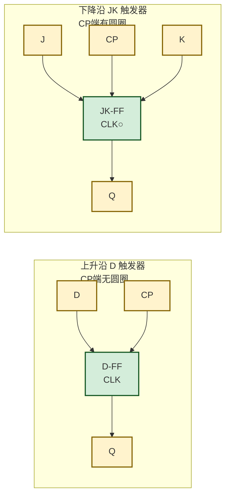
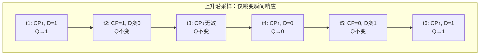
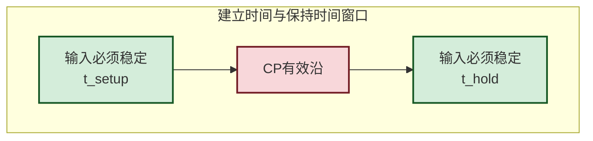

# 4.4 边沿触发器特性

> [!abstract] 本节概述
> [[4.2 同步 RS、D 触发器|4.2 电平触发]] 在 $CP=1$ 整段期间对输入敏感，会引发**空翻**；[[4.3 JK 触发器、T 触发器|4.3 JK]] 在同步结构下 $J=K=1$ 同样会多次翻转。为彻底克服空翻，引入**边沿触发**：触发器只在时钟脉冲的跳变沿（上升沿或下降沿）瞬间采样输入并更新状态，其余时间输入变化一律无效。本节阐述边沿触发的含义、触发极性、建立/保持时间约束及典型芯片 74LS74，是 [[MOC - 第5章|第5章]] 同步时序电路可靠工作的物理基础。

## 一、边沿触发 vs 电平触发

> [!definition] 边沿触发
> 边沿触发指触发器**仅在时钟脉冲 $CP$ 的某一跳变沿时刻**接收输入、更新输出。该跳变沿称为**有效沿**：
> - **上升沿（正边沿）**：$CP$ 从 0 跳变到 1 的瞬间有效，逻辑符号上 $CP$ 端无小圆圈；
> - **下降沿（负边沿）**：$CP$ 从 1 跳变到 0 的瞬间有效，逻辑符号上 $CP$ 端有小圆圈。

> [!info] 两种触发方式对比
>
> | 特性 | 电平触发 | 边沿触发 |
> | :--- | :------- | :------- |
> | 响应时刻 | $CP$ 有效电平的整段期间 | $CP$ 跳变沿的瞬间 |
> | 输入敏感期 | 长（整个 $CP=1$ 或 $CP=0$） | 极短（一个沿） |
> | 空翻问题 | 有 | 无 |
> | 抗干扰 | 差 | 好 |
> | 典型器件 | D 锁存器 | 74LS74、74LS112 |

## 二、上升沿与下降沿触发

### 2.1 逻辑符号

> [!note] 符号约定
> - 触发器框内的 **`>`** 标记表示边沿触发输入；
> - $CP$ 端**外加小圆圈**表示下降沿有效，**无圆圈**表示上升沿有效；
> - 这是区分边沿触发与电平触发的关键符号特征。

### 2.2 边沿触发时序图

> [!example] 上升沿 D 触发器时序分析
> 设初态 $Q=0$，仅在 $CP$ 上升沿采样 $D$：
>
> | 时刻 | 事件 | $D$ | $Q$（上升沿后） | 说明 |
> | :--: | :--- | :-: | :-------------: | :--- |
> | $t_1$ | $CP$ 上升沿 | 1 | 1 | 采样 $D=1$，$Q$ 置 1 |
> | $t_2$ | $CP=1$ 期间 | 0 | 1 | $D$ 变 0，但非边沿，$Q$ 不变 |
> | $t_3$ | $CP$ 下降沿 | 0 | 1 | 下降沿无效，$Q$ 不变 |
> | $t_4$ | $CP$ 上升沿 | 0 | 0 | 采样 $D=0$，$Q$ 置 0 |
> | $t_5$ | $CP=0$ 期间 | 1 | 0 | $D$ 变 1，但非边沿，$Q$ 不变 |
> | $t_6$ | $CP$ 上升沿 | 1 | 1 | 采样 $D=1$，$Q$ 置 1 |

> [!tip] 时序图绘制要点
> 画边沿触发波形时，$Q$ 只在 $CP$ 有效沿处可能跳变，且新值取决于**有效沿那一刻**的 $D$（或 $J,K$）。有效沿之间 $Q$ 为水平直线，与输入变化无关。

## 三、建立时间与保持时间

### 3.1 定义

> [!definition] 建立时间 $t_{\text{setup}}$
> 在时钟有效沿到来**之前**，输入信号必须保持稳定的最短时间。若建立时间不足，触发器内部主从锁存来不及完成数据传递，可能进入**亚稳态**。

> [!definition] 保持时间 $t_{\text{hold}}$
> 在时钟有效沿到来**之后**，输入信号必须继续稳定的最短时间。若保持时间不足，已采样数据可能被后续输入破坏。

### 3.2 时间参数关系

> [!theorem] 触发器关键时序参数
> - **建立时间** $t_{\text{setup}}$：有效沿前输入需稳定的时间；
> - **保持时间** $t_{\text{hold}}$：有效沿后输入需稳定的时间；
> - **传输延迟** $t_{\text{pd}}$：有效沿到 $Q$ 完成跳变的时间；
> - **最高时钟频率** $f_{\max}$：由 $t_{\text{setup}}+t_{\text{pd}}$ 及组合逻辑延迟共同决定：
> $$f_{\max} = \dfrac{1}{t_{\text{setup}} + t_{\text{pd}} + t_{\text{logic}}}$$
> 其中 $t_{\text{logic}}$ 为触发器之间组合逻辑的传输延迟。

> [!warning] 亚稳态（Metastability）
> 若建立时间或保持时间被违反，触发器输出可能停在 0 和 1 之间的不确定电平，并需较长时间才能随机收敛到 0 或 1，称为**亚稳态**。亚稳态会向后级传播错误数据，是时序电路失效的主要根源。在跨时钟域设计中需用同步器（两级触发器）降低亚稳态传播概率。

## 四、典型芯片：74LS74

### 4.1 芯片简介

> [!info] 74LS74 双上升沿 D 触发器
> 74LS74 是 TTL 系列经典的**双 D 触发器**芯片，每片包含两个独立的上升沿 D 触发器，是数字电路实验与工程中最常用的边沿触发器之一。

### 4.2 引脚与功能

> [!definition] 74LS74 功能
> 每个 D 触发器有 6 个端子：
>
> | 端子 | 名称 | 功能 |
> | :--: | :--- | :--- |
> | $D$ | 数据输入 | 上升沿采样 |
> | $CP$ | 时钟输入 | 上升沿有效 |
> | $\bar{S}_D$ | 异步置 1 | 低电平有效，优先级最高 |
> | $\bar{R}_D$ | 异步置 0 | 低电平有效，优先级最高 |
> | $Q$ | 输出 | — |
> | $\bar{Q}$ | 反相输出 | — |

> [!note] 异步置位/复位
> $\bar{S}_D$、$\bar{R}_D$ 为**异步端**（直接端），不受 $CP$ 控制，优先级高于 $D$。上电或需要强制初始化时用其设置初始状态；正常工作时令 $\bar{S}_D=\bar{R}_D=1$（无效），由 $CP$ 上升沿采样 $D$。

### 4.3 特性方程

> [!theorem] 74LS74 特性方程
> $$Q^{n+1} = D \quad (\text{在 } CP \text{ 上升沿时刻})$$
> 当 $\bar{S}_D=0$ 时 $Q=1$；当 $\bar{R}_D=0$ 时 $Q=0$；$\bar{S}_D=\bar{R}_D=0$ 禁止。

## 五、边沿触发电路结构简介

> [!info] 实现边沿触发的常见结构
> | 结构 | 原理 | 典型应用 |
> | :--- | :--- | :------- |
> | **维持阻塞结构** | 利用内部反馈线在边沿瞬间"维持"一路信号、"阻塞"另一路，使输入只在上升沿被采样 | 上升沿 D 触发器 |
> | **主从结构** | 主触发器在 $CP=1$ 跟随、从触发器在 $CP$ 下降沿更新，输出只在下降沿变化 | 早期 JK 触发器 |
> | **CMOS 传输门结构** | 利用传输门在边沿瞬间导通采样 | 现代 CMOS D 触发器 |

> [!warning] 主从 JK 的"一次变化"问题
> 主从 JK 触发器在 $CP=1$ 期间主触发器只根据 $J$、$K$ 变化一次（受反馈限制），若期间 $J$、$K$ 有干扰脉冲，主触发器可能被错误置位且无法恢复，导致下降沿输出错误。现代设计多用**边沿触发**（维持阻塞或 CMOS 传输门）避免此问题。

## 六、易错点

> [!warning] 常见错误
> 1. **有效沿判断错误**：看 $CP$ 端有无小圆圈——有圆圈是下降沿，无圆圈是上升沿；
> 2. **采样时刻混淆**：边沿触发只在有效沿采样，电平触发在有效电平全程跟随，画波形时务必分清；
> 3. **建立/保持时间方向**：$t_{\text{setup}}$ 在有效沿**之前**，$t_{\text{hold}}$ 在有效沿**之后**，方向不能颠倒；
> 4. **异步端优先级**：$\bar{S}_D$、$\bar{R}_D$ 不受 $CP$ 控制，只要其中一个为 0 就强制输出，正常工作时必须都置 1；
> 5. **最高频率遗漏组合逻辑延迟**：计算 $f_{\max}$ 时不仅要看触发器自身 $t_{\text{setup}}+t_{\text{pd}}$，还要加上级间组合逻辑延迟 $t_{\text{logic}}$。

## 七、与其他小节的联系

- 边沿触发解决了 [[4.2 同步 RS、D 触发器|4.2 电平触发]] 的空翻问题；
- 边沿 JK 触发器（如 74LS112）使 [[4.3 JK 触发器、T 触发器|4.3 JK]] 功能可靠实现；
- 建立/保持时间是 [[MOC - 第5章|第5章]] 同步时序电路时序分析的核心约束；
- 74LS74 是 [[MOC - 第5章|第5章]] 寄存器、移位寄存器的基本器件；
- 亚稳态与同步器设计延伸到计算机组成原理的跨时钟域数据传输。

## 章节导航

- 上一级：[[MOC - 第4章]]
- 上一节：[[4.3 JK 触发器、T 触发器]]
- 下一节：[[4.5 触发器相互转换]]
- 习题：[[MOC - 第4章习题]]
