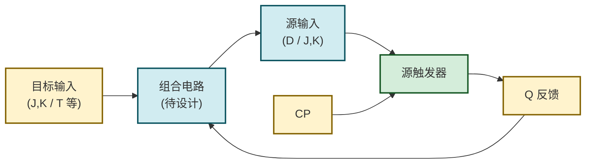
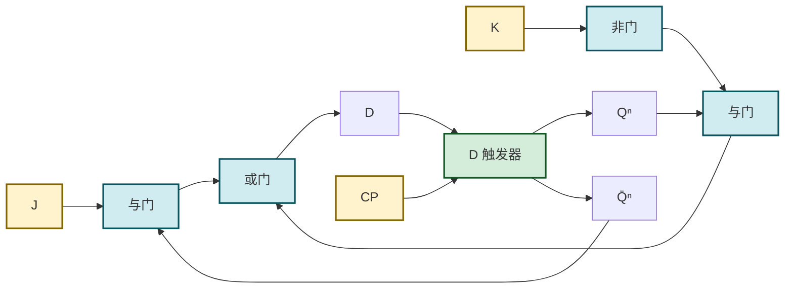
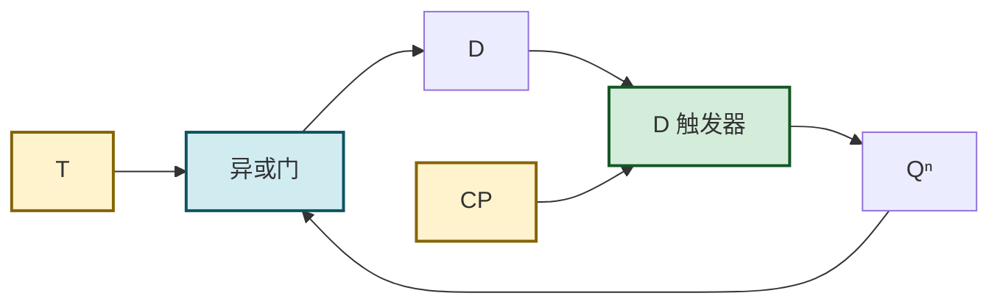
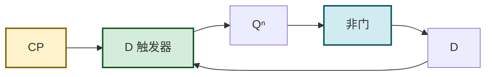
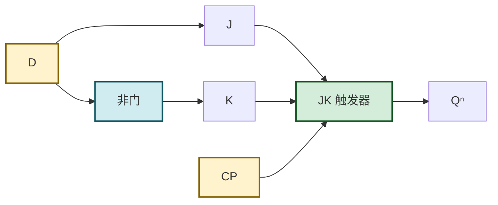
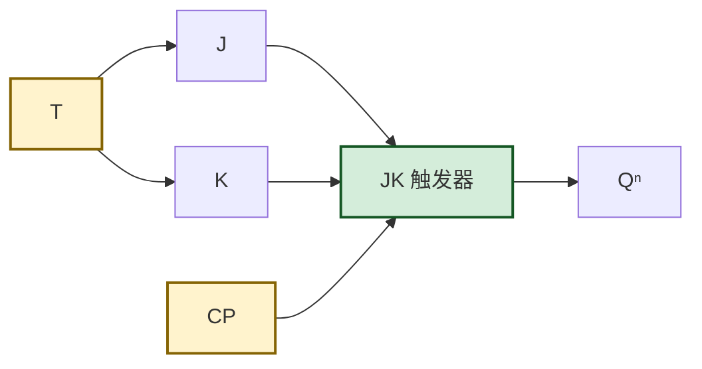
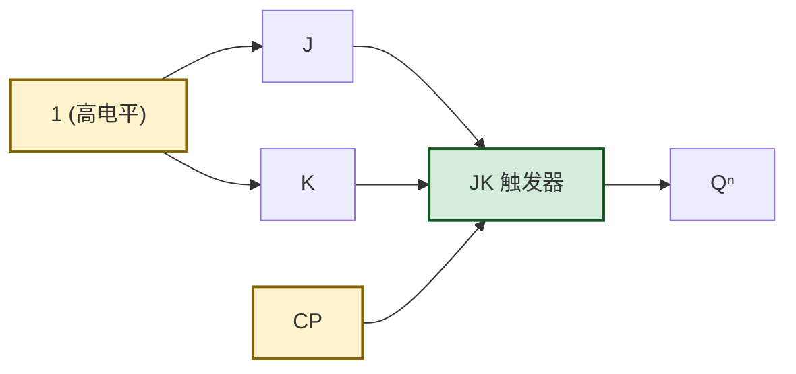

# 4.5 触发器相互转换

> [!abstract] 本节概述
> 实际工程中，市售触发器芯片以 **D 触发器**（如 [[4.4 边沿触发器特性|74LS74]]）和 **JK 触发器**（如 74LS112）为主，但电路设计常需要 T、T' 或其他类型。本节给出**通用转换方法**：通过比较目标触发器与已有触发器的特性方程，设计一个组合电路将已有触发器的输入端用目标输入和现态表达，从而"改造"出所需功能。这既减少了器件种类，也深化了对各类触发器特性的理解，是 [[MOC - 第5章|第5章]] 时序电路设计的预备技能。

## 一、转换原理与通用方法

> [!theorem] 转换的通用步骤
> 设已有触发器（源）特性方程为 $Q^{n+1}=F_{\text{源}}(\text{源输入},Q^n)$，目标触发器特性方程为 $Q^{n+1}=F_{\text{目标}}(\text{目标输入},Q^n)$。两者次态应相同：
> $$F_{\text{源}}(\text{源输入},Q^n) = F_{\text{目标}}(\text{目标输入},Q^n)$$
> 由此解出**源输入**关于**目标输入**与 $Q^n$ 的表达式，再用组合逻辑电路实现该表达式，接在源触发器输入端前。
>
> 具体步骤：
> 1. 写出源、目标触发器的特性方程；
> 2. 令二者相等，解出源输入的表达式；
> 3. 用 [[1.5 逻辑函数化简（代数法、卡诺图法）|化简方法]]化简；
> 4. 用 [[MOC - 第3章|第3章]] 组合逻辑电路实现并连接。

## 二、D 触发器转换为其他触发器

源触发器为 D 触发器，特性方程：$Q^{n+1}=D$。需求出 $D$ 关于目标输入的表达式。

### 2.1 D → JK

> [!example] D → JK 转换
> 目标 JK 特性方程：$Q^{n+1}=J\bar{Q^n}+\bar{K}Q^n$
> 令 $D = J\bar{Q^n}+\bar{K}Q^n$
>
> $$\boxed{D = J\,\overline{Q^n} + \bar{K}\,Q^n}$$
> 用一个非门、两个与门、一个或门实现。

### 2.2 D → T

> [!example] D → T 转换
> 目标 T 特性方程：$Q^{n+1}=T\oplus Q^n = T\bar{Q^n}+\bar{T}Q^n$
> 令 $D = T\oplus Q^n$
>
> $$\boxed{D = T \oplus Q^n}$$
> 用一个异或门实现，电路极简。

### 2.3 D → T'

> [!example] D → T' 转换
> 目标 T' 特性方程：$Q^{n+1}=\bar{Q^n}$
> 令 $D = \bar{Q^n}$
>
> $$\boxed{D = \overline{Q^n}}$$
> 只需将 $\bar{Q}$ 反馈到 $D$ 输入端（或经过一个非门接 $Q$），无外部输入。

## 三、JK 触发器转换为其他触发器

源触发器为 JK 触发器，特性方程：$Q^{n+1}=J\bar{Q^n}+\bar{K}Q^n$。需求出 $J$、$K$ 关于目标输入的表达式。

### 3.1 JK → D

> [!example] JK → D 转换
> 目标 D 特性方程：$Q^{n+1}=D$
> 将 $D$ 按 $Q^n$ 展开：$D = D\bar{Q^n}+DQ^n$
> 与 JK 方程 $J\bar{Q^n}+\bar{K}Q^n$ 比较系数：
> - $\bar{Q^n}$ 项系数：$J = D$
> - $Q^n$ 项系数：$\bar{K} = D$，即 $K = \bar{D}$
>
> $$\boxed{J = D,\quad K = \bar{D}}$$
> 只需一个非门：$D$ 直接接 $J$，$D$ 经非门接 $K$。

### 3.2 JK → T

> [!example] JK → T 转换
> 目标 T 特性方程：$Q^{n+1}=T\bar{Q^n}+\bar{T}Q^n$
> 与 JK 方程 $J\bar{Q^n}+\bar{K}Q^n$ 比较系数：
> - $J = T$
> - $\bar{K} = \bar{T}$，即 $K = T$
>
> $$\boxed{J = K = T}$$
> 只需将 $T$ 同时接到 $J$ 和 $K$。

### 3.3 JK → T'

> [!example] JK → T' 转换
> 目标 T' 特性方程：$Q^{n+1}=\bar{Q^n}$
> 展开为 $1\cdot\bar{Q^n}+\bar{1}\cdot Q^n$，比较得：
> - $J = 1$
> - $K = 1$
>
> $$\boxed{J = K = 1}$$
> 将 $J$、$K$ 均接高电平即可。

## 四、转换结果汇总

> [!info] 触发器转换汇总表
>
> | 转换方向 | 源 | 目标 | 源输入表达式 | 所需组合逻辑 |
> | :------: | :-: | :--: | :---------- | :---------- |
> | D→JK | D | JK | $D=J\bar{Q^n}+\bar{K}Q^n$ | 非门 + 2 与门 + 或门 |
> | D→T | D | T | $D=T\oplus Q^n$ | 异或门 |
> | D→T' | D | T' | $D=\bar{Q^n}$ | 非门（接 $\bar{Q}$ 反馈） |
> | JK→D | JK | D | $J=D,\ K=\bar{D}$ | 非门 |
> | JK→T | JK | T | $J=K=T$ | 直接连线 |
> | JK→T' | JK | T' | $J=K=1$ | 接高电平 |

> [!tip] 转换规律
> - **JK 触发器功能最强**，转 D、T、T' 都很简洁（最多一个非门）；
> - **D 触发器转 JK 较复杂**，需要较完整的组合逻辑；
> - T、T' 是最简功能，从任何源转换都较容易；
> - 设计 [[MOC - 第5章|第5章]] 计数器时，常将 JK 触发器配置为 T'（$J=K=1$）实现二分频。

## 五、易错点

> [!warning] 常见错误
> 1. **转换方向混淆**：D→JK 是用 D 实现 JK 功能，需求 $D$ 的表达式（D 在等号左边）；JK→D 是用 JK 实现 D 功能，需求 $J$、$K$ 的表达式；
> 2. **比较系数法只适用于JK**：JK 方程 $J\bar{Q^n}+\bar{K}Q^n$ 关于 $\bar{Q^n}$、$Q^n$ 是线性可分形式，可直接比较系数；D 方程 $Q^{n+1}=D$ 需先将目标方程按 $Q^n$ 展开；
> 3. **反馈必须用现态 $Q^n$**：转换电路中 $Q$ 反馈是组合电路的输入，与触发器输出当前值一致，不能误用次态；
> 4. **忘记约束条件**：从 RS 转 D/JK 时，目标无约束，但源 RS 仍有 $SR=0$ 约束，转换电路必须保证不违反；
> 5. **时钟端共享**：转换后源触发器的 $CP$ 仍由系统时钟驱动，组合电路不影响时钟路径。

## 六、与其他小节的联系

- 转换方法是 [[1.5 逻辑函数化简（代数法、卡诺图法）|1.5 逻辑化简]] 与 [[MOC - 第3章|第3章 组合逻辑设计]] 的综合应用；
- 转换出的 T' 触发器是 [[MOC - 第5章|第5章]] 二进制计数器的基本单元；
- 实际设计中，74LS74（D）与 74LS112（JK）通过本节方法可互相替代；
- 转换电路的延迟会影响 [[4.4 边沿触发器特性|建立时间]]，高速设计需纳入时序分析。

## 章节导航

- 上一级：[[MOC - 第4章]]
- 上一节：[[4.4 边沿触发器特性]]
- 习题：[[MOC - 第4章习题]]
