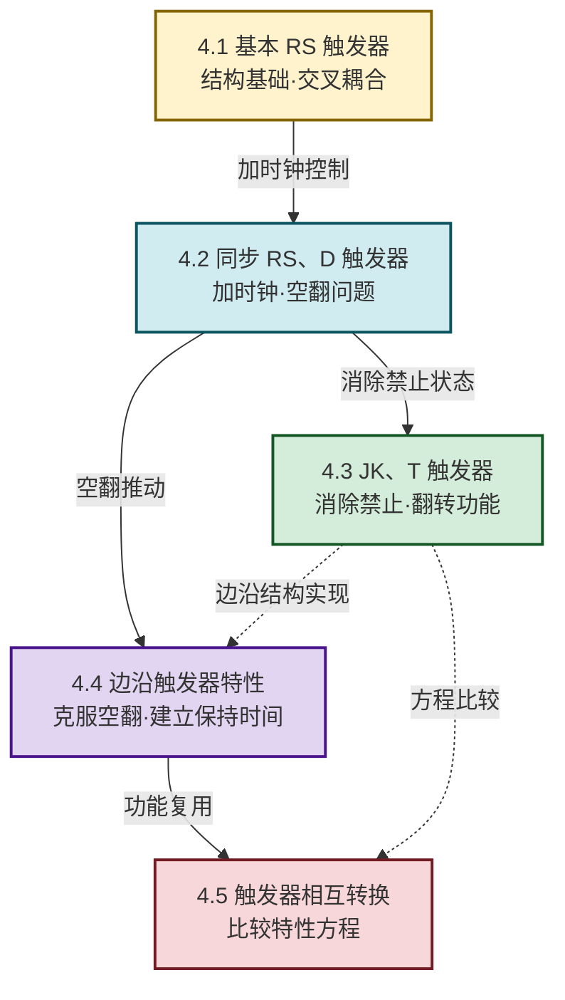

# MOC - 第4章 触发器

> [!info] 本章定位
> 触发器（Flip-Flop）是**具有记忆功能的基本逻辑单元**，能存储 1 位二值信息。它是 [[MOC - 第3章|第3章 组合逻辑电路]]（无记忆）与 [[MOC - 第5章|第5章 时序逻辑电路]]（有记忆）之间的**分水岭**：组合电路加上触发器即构成时序电路。本章要回答的核心问题是：**如何用门电路构造能稳定保存 0/1 状态的元件？如何用时钟统一控制状态更新时刻？如何在不同功能触发器之间灵活转换？** 掌握触发器的特性表、特性方程、状态转换图和时序图，是分析设计 [[MOC - 第5章|寄存器、计数器、移位寄存器]] 等时序电路的前提。

## 学习路线图

## 知识点导航

| 小节 | 标题 | 核心内容 | 特性方程 |
| ---- | ---- | -------- | -------- |
| [[4.1 基本 RS 触发器\|4.1]] | 基本 RS 触发器 | 与非门/或非门交叉耦合、置0置1保持禁止、状态转换图 | $Q^{n+1}=\bar{S}+\bar{R}Q^n$，约束 $RS=0$ |
| [[4.2 同步 RS、D 触发器\|4.2]] | 同步 RS、D 触发器 | 时钟CP选通、空翻现象、D锁存器透明特性 | RS: $Q^{n+1}=S+\bar{R}Q^n$；D: $Q^{n+1}=D$ |
| [[4.3 JK 触发器、T 触发器\|4.3]] | JK、T 触发器 | JK消除禁止、翻转功能、T'二分频 | JK: $Q^{n+1}=J\bar{Q^n}+\bar{K}Q^n$；T: $Q^{n+1}=T\oplus Q^n$ |
| [[4.4 边沿触发器特性\|4.4]] | 边沿触发器特性 | 上升沿/下降沿、建立/保持时间、74LS74 | $Q^{n+1}=D$（仅CP有效沿） |
| [[4.5 触发器相互转换\|4.5]] | 触发器相互转换 | 比较特性方程设计组合电路、D↔JK↔T↔T' | 见转换汇总表 |

## 核心考点

> [!summary] 本章核心考点（8 点）
> 1. **基本 RS 触发器功能表**：与非门结构低电平有效、或非门结构高电平有效，四种功能（置0、置1、保持、禁止），禁止状态的危害在于撤销时次态不确定；
> 2. **特性方程与约束**：RS 触发器 $Q^{n+1}=\bar{S}+\bar{R}Q^n$（与非门版），约束 $RS=0$；JK 无约束；D 最简 $Q^{n+1}=D$；T 为异或 $Q^{n+1}=T\oplus Q^n$；
> 3. **空翻现象**：电平触发在 $CP=1$ 全程对输入敏感导致一个周期内多次翻转，是引入边沿触发的直接动机；
> 4. **D 锁存器透明特性**：$CP=1$ 期间输出跟随 $D$，$CP=0$ 期间锁存，属电平触发仍有空翻；
> 5. **JK 翻转与 T/T'**：$J=K=1$ 翻转；T 触发器 $T=1$ 翻转、$T=0$ 保持；T' 触发器必翻，可实现二分频，级联实现 $2^n$ 分频；
> 6. **边沿触发时序分析**：只在 CP 有效沿采样输入，画波形时 $Q$ 仅在有效沿可能跳变，有效沿间保持水平；
> 7. **建立时间与保持时间**：$t_{\text{setup}}$ 在有效沿之前、$t_{\text{hold}}$ 在有效沿之后，违反会引发亚稳态，$f_{\max}$ 由 $t_{\text{setup}}+t_{\text{pd}}+t_{\text{logic}}$ 决定；
> 8. **触发器转换**：比较源与目标特性方程，求源输入表达式。JK→D（$J=D,K=\bar{D}$）、JK→T（$J=K=T$）、D→T（$D=T\oplus Q^n$）等。

## 四类触发器速查

> [!tip] 特性方程与功能对照
>
> | 类型 | 输入 | 特性方程 | 禁止 | 独有功能 | 典型芯片 |
> | :--: | :--: | :------- | :--: | :------- | :------- |
> | RS | $S,R$ | $Q^{n+1}=S+\bar{R}Q^n$ | 有 | 置0/置1/保持 | — |
> | D | $D$ | $Q^{n+1}=D$ | 无 | 跟随 $D$ | 74LS74 |
> | JK | $J,K$ | $Q^{n+1}=J\bar{Q^n}+\bar{K}Q^n$ | 无 | 含翻转（最全） | 74LS112 |
> | T | $T$ | $Q^{n+1}=T\oplus Q^n$ | 无 | 保持/翻转 | — |
> | T' | 无 | $Q^{n+1}=\bar{Q^n}$ | 无 | 必翻（分频） | — |

## 触发方式对比

> [!info] 三种触发方式
>
> | 触发方式 | 响应时刻 | 空翻 | 典型 |
> | :------: | :------- | :--: | :--- |
> | 基本触发（无CP） | 输入变化即响应 | — | 基本 RS |
> | 电平触发 | CP有效电平整段期间 | 有 | 同步RS、D锁存器 |
> | 边沿触发 | CP跳变沿瞬间 | 无 | 74LS74、74LS112 |

## 章节导航

> [!nav] 导航
> 上级：[[MOC - 数字逻辑电路|课程总览]]
> 上一章：[[MOC - 第3章|第3章 组合逻辑电路]]
> 下一章：[[MOC - 第5章|第5章 时序逻辑电路]]
> 配套习题：[[MOC - 第4章习题|第4章 习题]]
