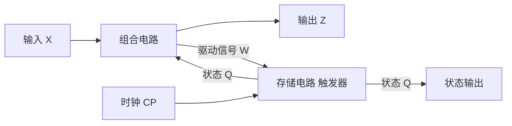
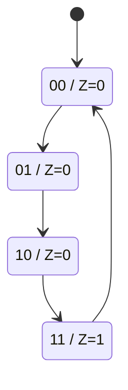
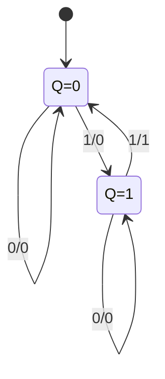

# 5.1 时序电路分析步骤

> [!abstract] 本节概述
> 时序逻辑电路与组合逻辑电路的根本区别在于**有记忆元件（触发器）**，电路输出不仅取决于当前输入，还与电路当前所处的状态有关。本节解决的核心问题是：**给定一个时序电路图，如何系统性地推导出它的逻辑功能？** 为此建立"驱动方程→时钟方程→状态方程→状态表→状态图→功能说明"的标准分析流程，是 [[5.2 寄存器、移位寄存器|5.2]]～[[5.5 序列信号发生器|5.5]] 各类时序电路分析的基础。

## 一、时序电路的结构

> [!definition] 时序逻辑电路
> 时序逻辑电路由**组合电路**和**存储电路（触发器）** 两部分构成，通过反馈回路将存储电路的输出（状态）送回组合电路输入端。其一般结构如下图所示。



> [!note] 时序电路的三组方程
> 任何时序电路都可用以下三组方程描述：
> 1. **输出方程**：$Z = F(X, Q^n)$——输出是输入与现态的函数（Mealy 型）；Moore 型 $Z = F(Q^n)$ 仅取决于现态；
> 2. **驱动方程**（激励方程）：$W = G(X, Q^n)$——触发器输入端的驱动信号表达式；
> 3. **状态方程**（次态方程）：$Q^{n+1} = H(W, Q^n)$——把驱动方程代入触发器特性方程得到，描述状态转换规律。
>
> 其中 $Q^n$ 表示时钟到来前的**现态**，$Q^{n+1}$ 表示时钟到来后的**次态**。

## 二、同步时序与异步时序

> [!definition] 同步时序电路
> 电路中所有触发器的时钟端**共用同一个时钟脉冲 CP**，所有触发器在 CP 的同一有效边沿同时更新状态。状态转换是同步发生的，分析与设计较简单。

> [!definition] 异步时序电路
> 电路中各触发器的时钟端**不全部接同一 CP**：部分触发器由外部 CP 驱动，另一些由前级触发器的输出（$Q$ 或 $\bar Q$）作为时钟驱动。只有当时钟有效边沿到达该触发器时，其状态才可能改变。

> [!tip] 同步与异步的对比
> | 比较项 | 同步时序电路 | 异步时序电路 |
> | ------ | ------------ | ------------ |
> | 时钟连接 | 所有触发器共用 CP | 各触发器时钟来源不同 |
> | 状态更新 | 同时更新 | 逐级更新、有先后 |
> | 工作速度 | 受最慢路径约束 | 部分级可更快 |
> | 设计难度 | 简单、规范 | 复杂、需考虑时钟方程 |
> | 电路结构 | 较规整 | 较省器件 |
> | 典型芯片 | 74LS161、74LS160 | 74LS90、74LS93 |
> | 主要问题 | 时钟偏移、建立/保持时间 | 竞争冒险、过渡状态 |

## 三、时序电路分析步骤

> [!tip] 同步时序电路分析步骤
> 1. **写驱动方程**：由电路图写出各触发器输入端的逻辑表达式（$J_i, K_i, D_i, T_i$ 等）；
> 2. **写输出方程**：写出电路对外输出 $Z$ 的表达式；
> 3. **写状态方程**：将驱动方程代入对应触发器的**特性方程**，得到 $Q_i^{n+1}$ 的表达式；
> 4. **列状态表**：对每一组现态与输入取值，计算次态与输出；
> 5. **画状态图**：以圆圈表示状态，箭头表示转换方向，标注"输入/输出"；
> 6. **画时序图**：按 CP 节拍画出各 $Q_i$ 与 $Z$ 的波形；
> 7. **说明功能**：根据状态图归纳电路逻辑功能。

> [!tip] 异步时序电路分析补充
> 在上述步骤基础上，**异步时序电路**还需在第 2 步前增加：
> - **写时钟方程**：写出各触发器时钟端的来源（如 $CP_1 = CP$、$CP_2 = Q_1$），并明确触发方式（上升沿/下降沿）；
> - 在列状态表时，**逐位检查该触发器是否有时钟有效边沿到达**，没有边沿则该触发器保持原状态。

> [!note] 常用触发器特性方程
> | 触发器 | 特性方程 |
> | ------ | -------- |
> | RS 触发器 | $Q^{n+1}=S+\bar R Q^n$，约束 $SR=0$ |
> | D 触发器 | $Q^{n+1}=D$ |
> | JK 触发器 | $Q^{n+1}=J\bar Q^n+\bar K Q^n$ |
> | T 触发器 | $Q^{n+1}=T\oplus Q^n$ |
> | T' 触发器 | $Q^{n+1}=\bar Q^n$（翻转） |

## 四、典型分析例题

### 例题 1：同步 JK 触发器时序电路分析

> [!example] 题目
> 已知同步时序电路由两个下降沿 JK 触发器构成：$J_0=K_0=1$，$J_1=K_1=Q_0^n$；输出 $Z=Q_1^n Q_0^n$；两触发器共用 CP 下降沿。分析其功能。

**解**：

**(1) 驱动方程**：
$$J_0=K_0=1,\quad J_1=K_1=Q_0^n$$

**(2) 输出方程**：
$$Z=Q_1^n Q_0^n$$

**(3) 状态方程**（代入 $Q^{n+1}=J\bar Q^n+\bar K Q^n$）：
$$Q_0^{n+1}=\bar Q_0^n$$
$$Q_1^{n+1}=Q_0^n\bar Q_1^n+\bar Q_0^n Q_1^n=Q_0^n\oplus Q_1^n$$

**(4) 状态表**：

| $Q_1^n Q_0^n$ | $Q_1^{n+1} Q_0^{n+1}$ | $Z$ |
| :-: | :-: | :-: |
| 00 | 01 | 0 |
| 01 | 10 | 0 |
| 10 | 11 | 0 |
| 11 | 00 | 1 |

**(5) 状态图**：



**(6) 功能说明**：电路有 4 个状态循环（00→01→10→11→00），每来一个 CP 状态加 1，$Q_1Q_0$ 输出 2 位二进制递增计数；当计满 11 时 $Z=1$ 作为进位输出。**这是一个模 4 同步加法计数器**。

### 例题 2：异步 JK 触发器时序电路分析

> [!example] 题目
> 异步时序电路由 3 个下降沿 JK 触发器构成：$J_0=K_0=1$、$CP_0=CP$；$J_1=K_1=1$、$CP_1=Q_0$；$J_2=K_2=1$、$CP_2=Q_1$。即每级都接成 T' 翻转触发器，前级 $Q$ 作为后级时钟。分析其功能。

**解**：

**(1) 时钟方程**：
$$CP_0=CP,\quad CP_1=Q_0,\quad CP_2=Q_1\quad(\text{均为下降沿有效})$$

**(2) 驱动方程**：$J_i=K_i=1$（$i=0,1,2$），每级为 T' 触发器。

**(3) 状态方程**：
$$Q_0^{n+1}=\bar Q_0^n\ (\text{CP 下降沿到达时}),\quad Q_1^{n+1}=\bar Q_1^n\ (Q_0\text{ 下降沿时}),\quad Q_2^{n+1}=\bar Q_2^n\ (Q_1\text{ 下降沿时})$$

**(4) 状态表**（仅当相应时钟有下降沿时才翻转）：

| CP 序号 | $Q_2 Q_1 Q_0$ | $CP_0$ | $CP_1$ | $CP_2$ |
| :-: | :-: | :-: | :-: | :-: |
| 0 | 000 | — | — | — |
| 1 | 001 | ↓ | — | — |
| 2 | 010 | ↓ | ↓ | — |
| 3 | 011 | ↓ | — | — |
| 4 | 100 | ↓ | ↓ | ↓ |
| 5 | 101 | ↓ | — | — |
| 6 | 110 | ↓ | ↓ | — |
| 7 | 111 | ↓ | — | — |
| 8 | 000 | ↓ | ↓ | ↓ |

**(5) 状态图**：

```mermaid
stateDiagram-v2
    [*] --> S0
    S0: 000
    S1: 001
    S2: 010
    S3: 011
    S4: 100
    S5: 101
    S6: 110
    S7: 111
    S0 --> S1 --> S2 --> S3 --> S4 --> S5 --> S6 --> S7 --> S0
```

**(6) 功能说明**：3 位二进制递减的反向——实际上是**模 8 异步加法计数器**（行波计数器）。低位翻转产生下降沿驱动高位翻转，逐级传播。

### 例题 3：Mealy 型时序电路分析

> [!example] 题目
> 同步时序电路含一个上升沿 D 触发器：$D=X\oplus Q^n$，输出 $Z=X\cdot Q^n$，CP 上升沿触发。$X$ 为外部输入。分析其功能。

**解**：

**(1) 驱动方程**：$D=X\oplus Q^n$

**(2) 输出方程**：$Z=X\cdot Q^n$（输出依赖输入，属 Mealy 型）

**(3) 状态方程**：$Q^{n+1}=D=X\oplus Q^n$

**(4) 状态表**：

| $X$ | $Q^n$ | $Q^{n+1}$ | $Z$ |
| :-: | :-: | :-: | :-: |
| 0 | 0 | 0 | 0 |
| 0 | 1 | 1 | 0 |
| 1 | 0 | 1 | 0 |
| 1 | 1 | 0 | 1 |

**(5) 状态图**（Mealy 型在箭头上标注 $X/Z$）：



**(6) 功能说明**：当 $X=1$ 时状态翻转，并在 $Q=1$ 且 $X=1$ 时输出 $Z=1$。这是**输入序列"11"检测器**——当连续输入两个 1 时输出 1，否则为 0。

## 五、状态图与状态表的规范画法

> [!tip] 状态图绘制规范
> 1. **状态用圆圈**表示，圈内写状态编码（如 $Q_1Q_0=01$）或符号（如 $S_0,S_1$）；
> 2. **箭头表示状态转换方向**，从现态指向次态；
> 3. **Moore 型**：输出写在圆圈内或圆圈旁（如 `S1 / Z=1`），箭头上只标输入；
> 4. **Mealy 型**：输出写在箭头上（格式 `输入/输出`，如 `1/0`）；
> 5. **自循环**用指向自身的弧形箭头；
> 6. **无效状态**若能自动回到有效循环，称为**具有自启动能力**。

> [!warning] 易错点
> 1. **现态与次态混淆**：$Q^n$ 是 CP 到来前的状态，$Q^{n+1}$ 是 CP 到来后的状态；
> 2. **异步电路时钟检查遗漏**：每个触发器每次状态转换都要确认其时钟是否出现有效边沿；
> 3. **触发边沿方向**：上升沿触发与下降沿触发的特性方程相同，但状态更新时机不同；
> 4. **Mealy 与 Moore 输出时机**：Mealy 输出随输入立即变化，Moore 输出仅在状态变化后改变；
> 5. **自启动检查**：设计电路必须检查无效状态能否回到有效循环，否则上电后可能"死锁"。

## 六、与其他小节的联系

- 触发器特性方程见 [[第4章 触发器]]（待补充），是写状态方程的基础；
- 状态方程的化简使用 [[1.5 逻辑函数化简（代数法、卡诺图法）|1.5]] 的卡诺图工具；
- 寄存器与计数器是时序电路的典型应用，分析步骤完全适用（见 [[5.2 寄存器、移位寄存器|5.2]]、[[5.3 同步计数器、异步计数器|5.3]]）；
- 任意进制计数器设计是分析的逆过程（见 [[5.4 任意进制计数器设计|5.4]]）；
- 序列信号发生器分析同样遵循本节流程（见 [[5.5 序列信号发生器|5.5]]）。

## 章节导航

- 上一级：[[MOC - 第5章|第5章 时序逻辑电路]]
- 下一节：[[5.2 寄存器、移位寄存器|5.2 寄存器、移位寄存器]]
- 习题：[[MOC - 第5章习题|第5章 习题]]
