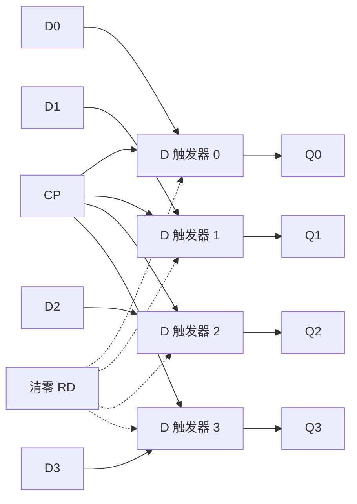
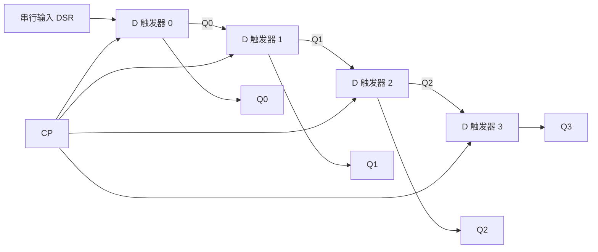
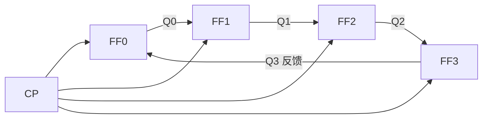

# 5.2 寄存器、移位寄存器

> [!abstract] 本节概述
> 寄存器与移位寄存器是时序电路中**最直接利用触发器存储功能**的一类器件。本节解决两个问题：(1) 如何用触发器并行存储一组二进制数（寄存器）；(2) 如何在时钟驱动下让数据逐位左移或右移，实现串/并转换与移位运算（移位寄存器）。重点掌握 **74LS194 四位双向移位寄存器**的功能表及其在串并转换、环形计数器中的应用。

## 一、寄存器

> [!definition] 寄存器
> 寄存器是用来**暂存一组二进制代码**的时序逻辑部件，由若干个触发器构成——$n$ 位寄存器由 $n$ 个触发器组成，每个触发器存放 1 位二进制数。寄存器对数据的存取是**并行**进行的。

> [!note] 寄存器的工作原理
> 1. **存储单元**：通常使用 D 触发器，因为 $Q^{n+1}=D$，在 CP 边沿到来时把 $D$ 端数据直接打入；
> 2. **并行写入**：待存数据 $D_0\sim D_{n-1}$ 同时接到各触发器 $D$ 端，CP 到来后一并存入；
> 3. **并行读出**：各触发器 $Q$ 端同时输出，读取整个 $n$ 位数据；
> 4. **清零**：通过异步清零端 $\bar R_D$ 可一次将所有触发器置 0。

> [!example] 4 位 D 触发器寄存器
> 4 个 D 触发器共用一个 CP，待存数据 $D_3D_2D_1D_0$ 接到各触发器 $D$ 端。CP 上升沿到来时：
> $$Q_3^{n+1}Q_2^{n+1}Q_1^{n+1}Q_0^{n+1}=D_3D_2D_1D_0$$
> 即把数据并行存入。输出 $Q_3Q_2Q_1Q_0$ 在下一 CP 到来前一直保持不变。

## 二、移位寄存器

> [!definition] 移位寄存器
> 移位寄存器是在寄存器基础上增加**移位功能**的时序电路：每来一个 CP，所存数据按一定方向移动一位。按移位方向分为：
> - **右移寄存器**：数据从高位向低位（$Q_3\to Q_2\to Q_1\to Q_0$）逐位移动；
> - **左移寄存器**：数据从低位向高位（$Q_0\to Q_1\to Q_2\to Q_3$）逐位移动；
> - **双向移位寄存器**：通过控制端选择左移或右移。

### 2.1 右移寄存器结构

> [!note] 4 位右移寄存器工作原理
> 4 个 D 触发器级联：前一级的 $Q$ 接到后一级的 $D$，第一级 $D$ 接串行输入 $D_{SR}$：
> $$D_0=D_{SR},\quad D_1=Q_0^n,\quad D_2=Q_1^n,\quad D_3=Q_2^n$$
> 代入 D 触发器特性方程 $Q^{n+1}=D$：
> $$Q_0^{n+1}=D_{SR},\quad Q_1^{n+1}=Q_0^n,\quad Q_2^{n+1}=Q_1^n,\quad Q_3^{n+1}=Q_2^n$$
> 每 CP 一次，数据整体右移一位。

> [!example] 右移寄存器串行输入 1011
> 设初态 $Q_3Q_2Q_1Q_0=0000$，串行输入顺序为 $1,0,1,1$（先送最高位 1）：

| CP 序号 | 串入 $D_{SR}$ | $Q_0$ | $Q_1$ | $Q_2$ | $Q_3$ |
| :-: | :-: | :-: | :-: | :-: | :-: |
| 0 | — | 0 | 0 | 0 | 0 |
| 1 | 1 | 1 | 0 | 0 | 0 |
| 2 | 0 | 0 | 1 | 0 | 0 |
| 3 | 1 | 1 | 0 | 1 | 0 |
| 4 | 1 | 1 | 1 | 0 | 1 |

4 个 CP 后，并行输出 $Q_3Q_2Q_1Q_0=1011$——**串入并出**完成。

### 2.2 左移与双向移位

> [!tip] 左移寄存器
> 左移寄存器的级联方向相反：第一级 $D$ 接串行左移输入 $D_{SL}$，后一级 $Q$ 接前一级 $D$：
> $$Q_3^{n+1}=D_{SL},\quad Q_2^{n+1}=Q_3^n,\quad Q_1^{n+1}=Q_2^n,\quad Q_0^{n+1}=Q_1^n$$

> [!definition] 双向移位寄存器
> 通过**方式控制端** $S_1, S_0$ 选择工作方式，既能左移又能右移，还能并行加载和保持。典型芯片为 **74LS194**。

## 三、74LS194 四位双向移位寄存器

> [!info] 74LS194 概述
> 74LS194 是中规模集成四位双向移位寄存器，具有并行输入、并行输出、串行左移、串行右移、保持和异步清零等功能。引脚：$D_3\sim D_0$（并行输入）、$Q_3\sim Q_0$（并行输出）、$D_{SR}$（右移串入）、$D_{SL}$（左移串入）、$S_1S_0$（方式控制）、$\bar{R}_D$（异步清零）、CP（上升沿触发）。

### 3.1 功能表

> [!note] 74LS194 功能表
> | $\bar R_D$ | $S_1$ | $S_0$ | 工作方式 | 说明 |
> | :--------: | :---: | :---: | :------- | ---- |
> | 0 | × | × | **异步清零** | $Q_3Q_2Q_1Q_0\leftarrow 0000$，与 CP 无关 |
> | 1 | 0 | 0 | **保持** | $Q^{n+1}=Q^n$，状态不变 |
> | 1 | 0 | 1 | **右移** | $Q_0^{n+1}=D_{SR}$，$Q_{i+1}^{n+1}=Q_i^n$（CP 上升沿） |
> | 1 | 1 | 0 | **左移** | $Q_3^{n+1}=D_{SL}$，$Q_{i-1}^{n+1}=Q_i^n$（CP 上升沿） |
> | 1 | 1 | 1 | **并行加载** | $Q_i^{n+1}=D_i$（CP 上升沿同步置数） |

> [!warning] 控制端优先级
> $\bar R_D$ 优先级最高，任意时刻为 0 即清零；其次 $S_1S_0$ 决定工作方式；CP 仅在移位和并行加载时起作用。

### 3.2 工作方式逻辑表达式

> [!tip] 由功能表写次态方程
> 当 $\bar R_D=1$ 时，由功能表可写：
> $$Q_i^{n+1}=\bar S_1\bar S_0 Q_i^n+\bar S_1 S_0 Q_{i-1}^n+S_1\bar S_0 Q_{i+1}^n+S_1 S_0 D_i$$
> 四项分别对应**保持、右移、左移、并行加载**四种工作方式（边界位需代入 $D_{SR}$ 或 $D_{SL}$）。

## 四、移位寄存器的应用

### 4.1 串并转换

> [!example] 串行→并行转换
> 用 74LS194 实现 7 位串入并出转换：将 $D_{SR}$ 接串行输入数据，先令 $S_1S_0=11$ 并行预置一个起始标志（如 $Q_3Q_2Q_1Q_0=0111$），然后切换到右移方式 $S_1S_0=01$。每来一个 CP 串行数据从 $D_{SR}$ 进入并整体右移，标志位 0 逐位右移。当 0 移到 $Q_3$ 时表示 7 位数据已全部到位，触发并行输出。

> [!example] 并行→串行转换
> 先令 $S_1S_0=11$ 将并行数据加载到 74LS194，然后切换到右移方式 $S_1S_0=01$。每个 CP 从 $Q_3$ 输出一位，依次输出 $Q_3, Q_2, Q_1, Q_0$，实现并入串出。

### 4.2 环形计数器

> [!definition] 环形计数器
> 将移位寄存器的**末级输出反馈到串行输入端**（右移时 $D_{SR}=Q_3$），构成闭环。若初始时只让一个触发器为 1（其余为 0），则每个 CP 使这个 1 在环路中循环移位，形成"1 在哪一位"的循环编码。

> [!note] 4 位环形计数器状态循环
> 设有效状态 $0001\to0010\to0100\to1000\to0001$，每个状态只有 1 位为 1，**可直接用作 4 路节拍脉冲发生器**，无需译码。缺点是状态利用率低（$n$ 个触发器只用 $n$ 个状态，剩余 $2^n-n$ 个为无效状态），且需自启动设计或预置有效初态。

### 4.3 扭环形计数器（约翰逊计数器）

> [!definition] 扭环形计数器
> 将移位寄存器**末级输出取反后反馈**到串行输入端（右移时 $D_{SR}=\bar Q_3$）。状态序列长度为 $2n$（$n$ 为触发器数），相邻状态仅 1 位不同，译码简单且无竞争冒险。

> [!example] 4 位扭环形计数器
> 状态序列：$0000\to1000\to1100\to1110\to1111\to0111\to0011\to0001\to0000$，共 8 个有效状态。相比环形计数器状态利用率提高一倍。

### 4.4 其他应用

> [!tip] 移位寄存器的其他应用
> - **延时电路**：串行数据经过 $n$ 级移位寄存器后延迟 $n$ 个 CP 周期输出；
> - **乘除 2 运算**：右移一位相当于除以 2（高位补 0），左移一位相当于乘以 2（低位补 0）；
> - **序列信号发生器**：见 [[5.5 序列信号发生器|5.5]]，移位寄存器加反馈组合电路可产生周期序列。

## 五、典型例题

> [!example] 例题：用 74LS194 设计 4 路节拍脉冲发生器
> **要求**：产生 4 路循环高电平有效的节拍脉冲 $P_0, P_1, P_2, P_3$，每路依次有效一个 CP 周期。

**解**：

利用环形计数器原理。工作步骤：

1. **上电预置**：令 $\bar R_D=1$、$S_1S_0=11$，在 $D_3D_2D_1D_0=0001$ 处并行加载，使 $Q_3Q_2Q_1Q_0=0001$（即 $P_0=1$，其余为 0）；
2. **右移循环**：切换到 $S_1S_0=01$（右移方式），将 $D_{SR}$ 接 $Q_3$（即末级反馈到首级）；
3. **节拍输出**：直接从 $Q_3, Q_2, Q_1, Q_0$ 输出 4 路节拍脉冲。

| CP 序号 | $Q_3$ | $Q_2$ | $Q_1$ | $Q_0$ | 有效节拍 |
| :-: | :-: | :-: | :-: | :-: | :-: |
| 0 | 0 | 0 | 0 | 1 | $P_0$ |
| 1 | 0 | 0 | 1 | 0 | $P_1$ |
| 2 | 0 | 1 | 0 | 0 | $P_2$ |
| 3 | 1 | 0 | 0 | 0 | $P_3$ |
| 4 | 0 | 0 | 0 | 1 | $P_0$（循环） |

> [!warning] 环形计数器的自启动问题
> 若上电后落入非有效状态（如 $0011$），单纯环形连接无法自动回到有效循环。工程上需增加反馈逻辑修正（如检测全 0 时置 0001），或每次启动前用 $\bar R_D$ 配合并行预置强置到有效状态。

## 六、易错点

> [!warning] 易错点
> 1. **寄存器与锁存器混淆**：寄存器用边沿触发器，CP 边沿瞬间打入；锁存器用电平触发，CP 有效期间透明传输；
> 2. **移位方向判断**：右移是数据从 $Q_0$ 向 $Q_3$ 方向移动（$Q_0$ 接收新数据，$Q_3$ 输出旧数据），不要弄反；
> 3. **74LS194 控制端编码**：$S_1S_0=00$ 保持、$01$ 右移、$10$ 左移、$11$ 并行加载，是常见考点；
> 4. **串行输入顺序**：先送高位还是低位取决于具体电路接法，需根据电路确认；
> 5. **环形计数器有效状态数**：$n$ 位环形计数器有效状态数为 $n$，扭环形为 $2n$；
> 6. **并行加载是同步操作**：74LS194 的 $S_1S_0=11$ 并行加载需要 CP 上升沿配合，与异步清零 $\bar R_D$ 不同。

## 七、与其他小节的联系

- 寄存器是 [[5.1 时序电路分析步骤|5.1]] 分析方法的直接应用；
- 移位寄存器是 [[5.5 序列信号发生器|5.5]] 移位型序列发生器的基础；
- 环形/扭环形计数器是 [[5.3 同步计数器、异步计数器|5.3]] 计数器的一种特殊形式；
- 计算机中通用寄存器、移位单元与本节概念一致，详见计算机组成原理。

## 章节导航

- 上一级：[[MOC - 第5章|第5章 时序逻辑电路]]
- 上一节：[[5.1 时序电路分析步骤|5.1 时序电路分析步骤]]
- 下一节：[[5.3 同步计数器、异步计数器|5.3 同步计数器、异步计数器]]
- 习题：[[MOC - 第5章习题|第5章 习题]]
